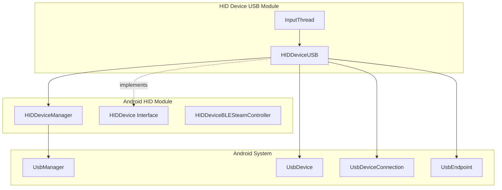
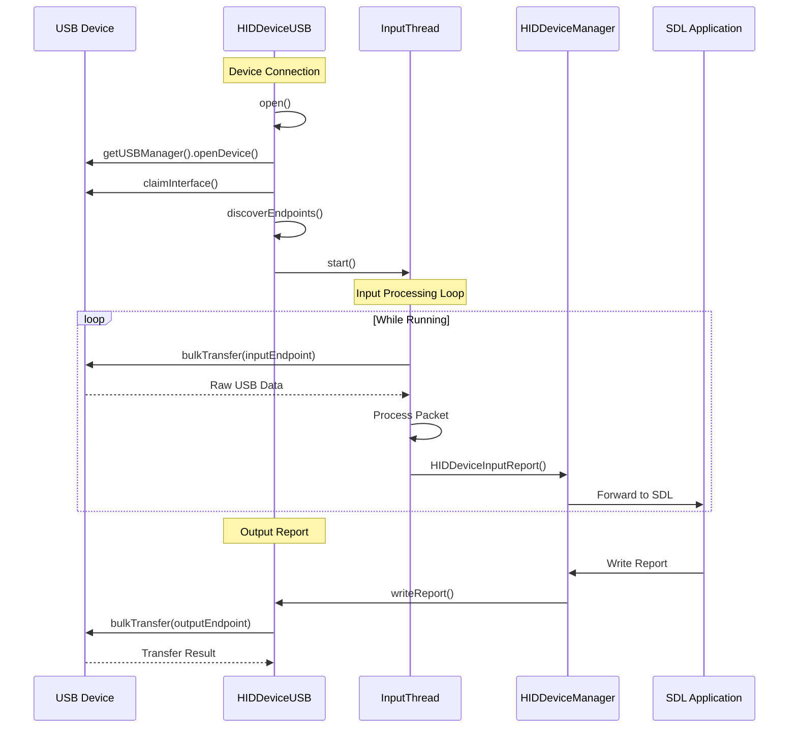
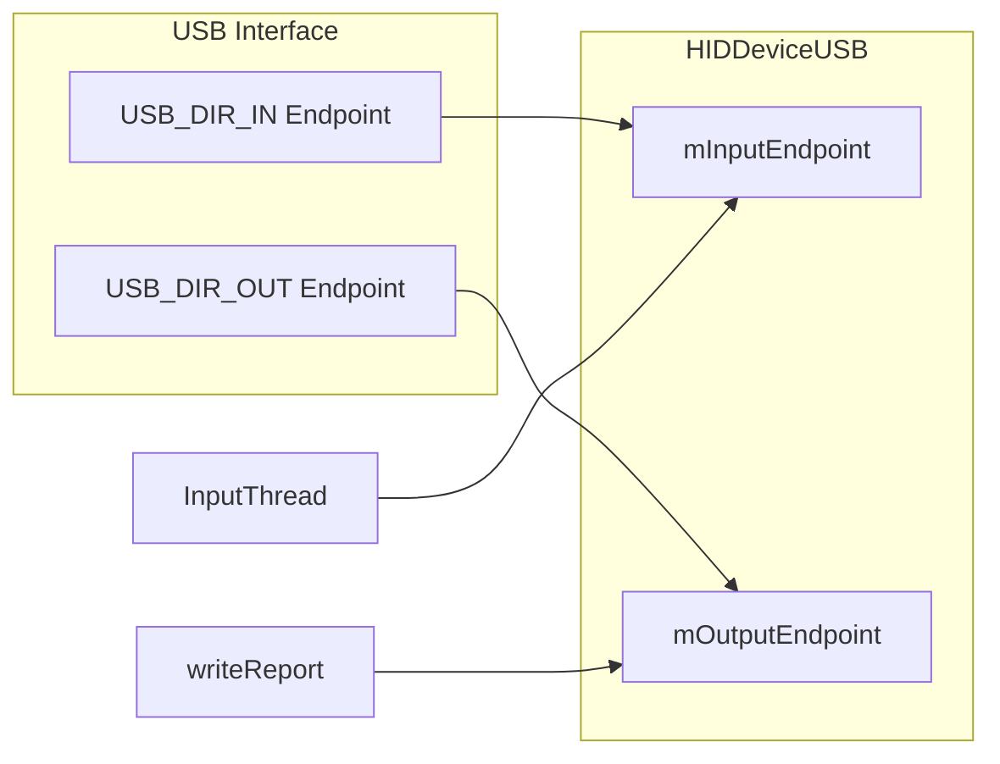
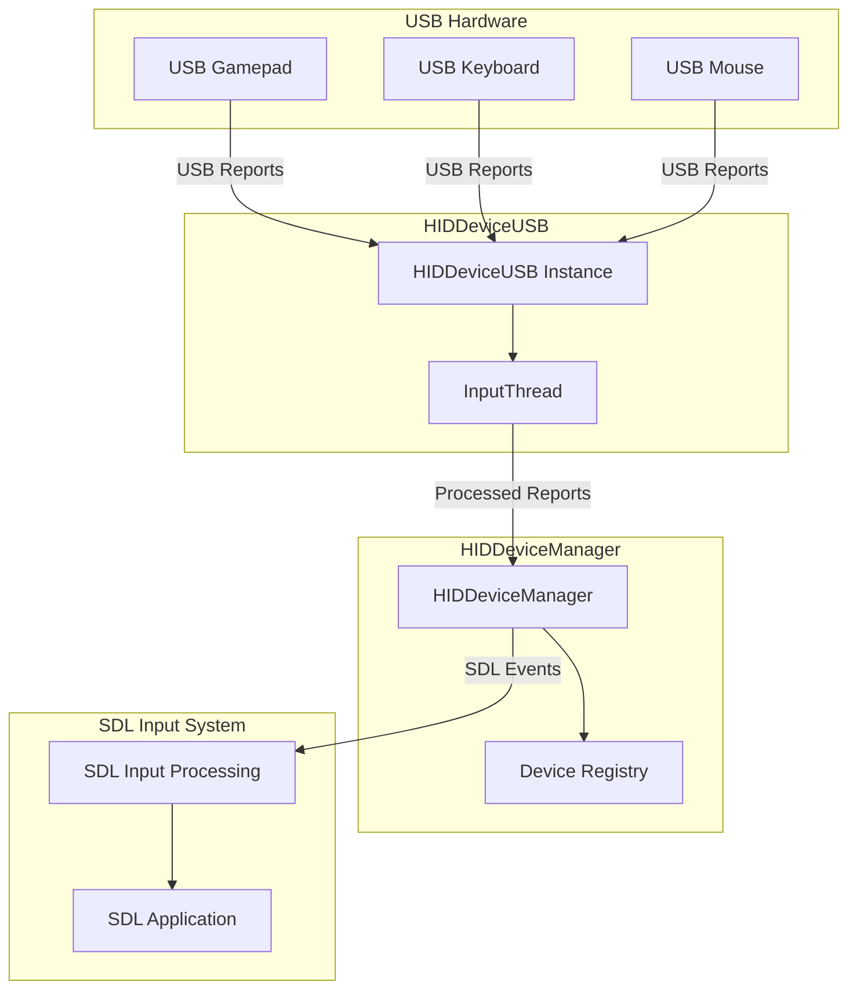

# HID Device USB Module Documentation

## Introduction

The HID Device USB module provides Android USB HID (Human Interface Device) support for SDL applications. It implements the communication layer between Android USB devices and SDL's input system, enabling game controllers, keyboards, mice, and other HID devices to work seamlessly with SDL applications on Android platforms.

This module is a critical component of the Android HID subsystem, handling low-level USB communication, device management, and input report processing for USB-based HID devices.

## Architecture Overview

The HID Device USB module consists of two primary components that work together to provide comprehensive USB HID device support:

### Core Components

1. **HIDDeviceUSB** - The main device implementation class that manages USB device connections, communication, and lifecycle
2. **InputThread** - A dedicated thread for asynchronous input report processing from USB devices

### Module Relationships



## Component Details

### HIDDeviceUSB Class

The `HIDDeviceUSB` class is the core implementation that manages USB HID device communication. It implements the `HIDDevice` interface and provides the following key functionality:

#### Device Management
- **Device Identification**: Creates unique identifiers based on device name, vendor ID, product ID, and interface index
- **Connection Management**: Handles USB device connection, interface claiming, and endpoint discovery
- **Lifecycle Management**: Manages device opening, closing, and shutdown operations

#### Communication Features
- **Bidirectional Communication**: Supports both input and output report transfers
- **Feature Reports**: Handles HID feature reports through control transfers
- **Bulk Transfers**: Manages high-speed data transfer for input/output reports
- **Report Processing**: Processes incoming HID reports and forwards them to the HID manager

#### Key Methods

```java
// Device lifecycle
public boolean open()                    // Opens USB device connection
public void close()                      // Closes device and releases resources
public void shutdown()                   // Complete shutdown of device

// Report operations
public int writeReport(byte[] report, boolean feature)    // Write HID report
public boolean readReport(byte[] report, boolean feature) // Read HID report

// Device information
public int getId()                       // Get device ID
public int getVendorId()                 // Get vendor ID
public int getProductId()                // Get product ID
public String getSerialNumber()          // Get device serial number
```

### InputThread Class

The `InputThread` is an inner class that provides asynchronous input processing:

#### Thread Management
- **Continuous Monitoring**: Runs continuously while the device is active
- **Packet Processing**: Reads USB packets from the input endpoint
- **Error Handling**: Gracefully handles USB communication errors and timeouts

#### Data Flow
- **Bulk Transfer Reading**: Uses `bulkTransfer()` to read incoming data
- **Data Buffering**: Manages packet buffers for efficient data processing
- **Report Forwarding**: Sends processed input reports to the HID manager

## Data Flow Architecture



## USB Communication Protocol

### Endpoint Management

The module automatically discovers and configures USB endpoints:



### Report Types

The module supports three types of HID reports:

1. **Input Reports** - Data from device to host (continuous via InputThread)
2. **Output Reports** - Data from host to device (via writeReport())
3. **Feature Reports** - Bidirectional configuration data (via controlTransfer)

### Control Transfer Protocol

For feature reports, the module uses USB control transfers with specific parameters:

- **Request Type**: `USB_TYPE_CLASS | USB_DIR_IN/OUT`
- **Request**: `0x01` (GET_REPORT) or `0x09` (SET_REPORT)
- **Value**: Report type and ID
- **Index**: Interface number
- **Timeout**: 1000ms

## Error Handling and Resilience

### Connection Errors
- **Permission Issues**: Handles security exceptions when accessing device serial numbers
- **Interface Claiming**: Retries interface claiming with force parameter
- **Endpoint Discovery**: Validates required endpoints are present

### Communication Errors
- **Transfer Failures**: Logs and handles bulk transfer failures
- **Timeout Handling**: Manages transfer timeouts gracefully
- **Thread Interruption**: Properly handles thread interruption during shutdown

### Resource Management
- **Connection Cleanup**: Ensures USB connections are properly closed
- **Interface Release**: Releases claimed interfaces on device close
- **Thread Lifecycle**: Manages InputThread lifecycle with proper joining

## Integration with SDL System

### HID Device Manager Integration

The module integrates with the [Android HID Module](android_hid_module.md) through the `HIDDeviceManager`:

- **Device Registration**: Registers devices with unique IDs
- **Report Forwarding**: Sends input reports to SDL's input system
- **Device Lifecycle**: Coordinates device opening/closing with manager

### SDL Input Pipeline



## Configuration and Usage

### Device Requirements
- Android 4.0+ (API level 14+)
- USB Host support
- HID class USB devices

### Supported Device Types
- Game controllers and joysticks
- Keyboards and keypads
- Mice and trackballs
- Custom HID devices with standard report descriptors

### Performance Characteristics
- **Input Latency**: Typically < 16ms for standard USB polling rates
- **Thread Safety**: All operations are thread-safe
- **Memory Usage**: Minimal overhead with efficient buffer management
- **CPU Usage**: Low CPU usage with blocking I/O in dedicated thread

## Dependencies

### Android System Dependencies
- `android.hardware.usb.UsbManager`
- `android.hardware.usb.UsbDevice`
- `android.hardware.usb.UsbDeviceConnection`
- `android.hardware.usb.UsbEndpoint`
- `android.hardware.usb.UsbConstants`

### SDL Module Dependencies
- [Android HID Module](android_hid_module.md) - For device management and SDL integration
- [Android SDL Core Module](android_sdl_core_module.md) - For application lifecycle integration

## Security Considerations

### USB Permissions
- Requires `android.hardware.usb.host` feature
- Runtime permission handling for device access
- Graceful degradation when permissions are denied

### Data Validation
- Input report validation before forwarding to SDL
- Buffer bounds checking for all USB transfers
- Safe handling of malformed USB descriptors

## Future Enhancements

### Potential Improvements
- Support for USB HID++ protocol
- Enhanced power management for battery-powered devices
- Hot-plug notification improvements
- Multi-interface device support enhancement

### Compatibility Notes
- Designed for Android 4.0+ but optimized for Android 5.0+
- Backward compatibility maintained for older Android versions
- Future-proofed for upcoming Android USB API changes