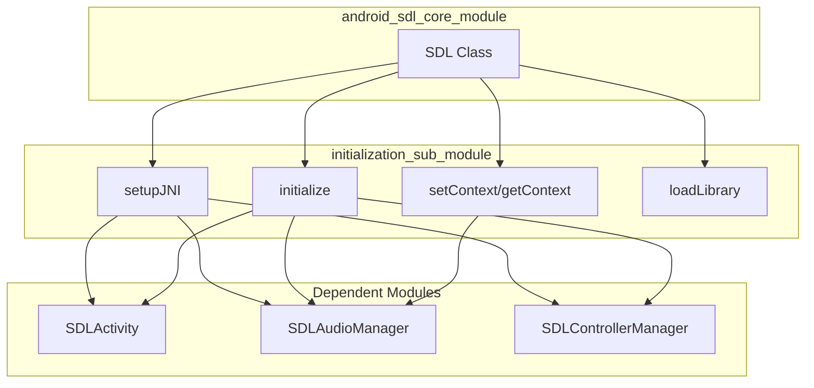
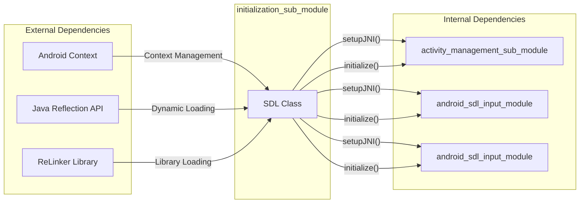
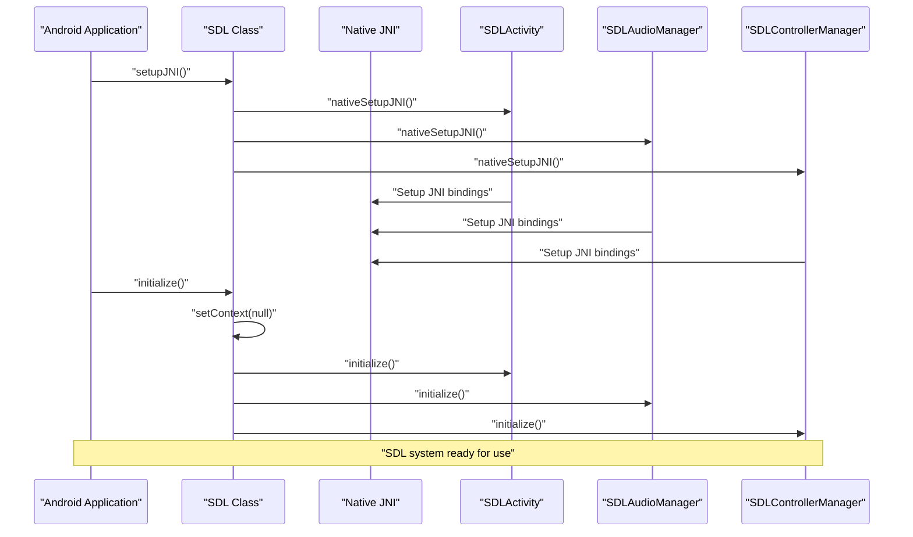
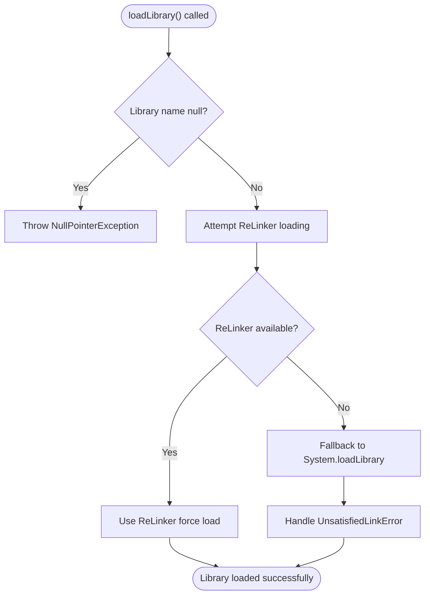

# Initialization Sub-Module Documentation

## Introduction

The initialization_sub_module is a critical component of the SDL (Simple DirectMedia Layer) Android framework, responsible for coordinating the startup and initialization of all SDL subsystems. This module serves as the central initialization orchestrator that ensures proper setup of JNI (Java Native Interface) bindings, context management, and library loading for the SDL framework on Android platforms.

## Module Overview

The initialization_sub_module contains the core `SDL` class, which acts as the primary entry point for SDL initialization on Android. This module is positioned as a child of the `android_sdl_core_module` and serves as the foundation upon which all other SDL functionality is built.

## Core Components

### SDL Class (`android-project.app.src.main.java.org.libsdl.app.SDL.SDL`)

The `SDL` class is the central initialization coordinator that provides static methods for:

- **JNI Setup**: Configuring native code to call Java classes
- **System Initialization**: Starting SDL subsystems (Activity, Audio, Controller)
- **Context Management**: Handling Android application context
- **Library Loading**: Managing native library loading with fallback mechanisms

## Architecture

### Module Structure

### Component Dependencies

## Data Flow

### Initialization Sequence

### Library Loading Process

## Key Functions

### setupJNI()
- **Purpose**: Configures JNI bindings for all SDL subsystems
- **Dependencies**: Calls native setup methods on SDLActivity, SDLAudioManager, and SDLControllerManager
- **Timing**: Should be called first before any other SDL operations

### initialize()
- **Purpose**: Initializes all SDL subsystems
- **Process**: 
  1. Sets context to null
  2. Calls initialize() on SDLActivity, SDLAudioManager, and SDLControllerManager
- **Timing**: Should be called each time the activity is started

### setContext(Context context)
- **Purpose**: Manages Android application context
- **Functionality**: Stores context and propagates it to SDLAudioManager
- **Usage**: Called during initialization and when context changes

### loadLibrary(String libraryName)
- **Purpose**: Loads native libraries with intelligent fallback mechanisms
- **Features**:
  - Attempts ReLinker integration for robust library loading
  - Falls back to standard System.loadLibrary()
  - Handles security exceptions and linking errors
- **Special Handling**: Uses reflection to detect and utilize ReLinker if available

## Integration with Other Modules

### Parent Module: [android_sdl_core_module](android_sdl_core_module.md)
The initialization_sub_module is a child of android_sdl_core_module and provides the foundational initialization services for the entire SDL framework.

### Sibling Modules:
- **[activity_management_sub_module](activity_management_sub_module.md)**: Manages SDL activity lifecycle
- **[threading_and_execution_sub_module](threading_and_execution_sub_module.md)**: Handles threading and task execution
- **[communication_and_command_sub_module](communication_and_command_sub_module.md)**: Manages communication and command handling

### Dependent Modules:
- **[android_sdl_input_module](android_sdl_input_module.md)**: Receives initialization calls for audio and controller subsystems
- **[android_hid_module](android_hid_module.md)**: May be initialized as part of the HID device management system

## Error Handling

The initialization_sub_module implements comprehensive error handling:

1. **Library Loading Errors**: Graceful fallback from ReLinker to system loader
2. **Security Exceptions**: Proper propagation of SecurityException during library loading
3. **Null Pointer Protection**: Validation of library names before loading
4. **Reflection Failures**: Safe handling of ReLinker detection failures

## Best Practices

### Initialization Order
1. Always call `setupJNI()` first to establish JNI bindings
2. Call `initialize()` to start SDL subsystems
3. Use `setContext()` to manage application context as needed
4. Use `loadLibrary()` for any additional native libraries

### Context Management
- Context can be set to null during initialization
- Proper context should be set when available for full functionality
- Context is automatically propagated to audio subsystem

### Library Loading
- ReLinker is automatically detected and used if available
- No manual configuration needed for ReLinker integration
- All library loading errors are properly handled with fallbacks

## Thread Safety

All methods in the SDL class are static and designed to be thread-safe for initialization purposes. However, initialization should typically be performed on the main thread to ensure proper Android lifecycle management.

## Performance Considerations

- JNI setup is performed once during application startup
- Library loading uses efficient reflection-based ReLinker detection
- Context management minimizes object references to prevent memory leaks
- Initialization sequence is optimized to minimize startup time

## Future Considerations

The initialization_sub_module is designed to be extensible for future SDL enhancements:
- Additional subsystems can be easily integrated into the initialization sequence
- Library loading mechanisms can be extended for new platforms
- Context management can be enhanced for complex application architectures