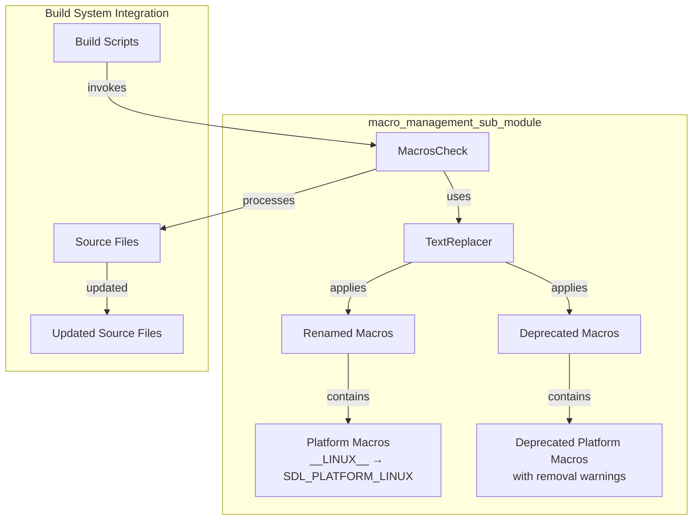
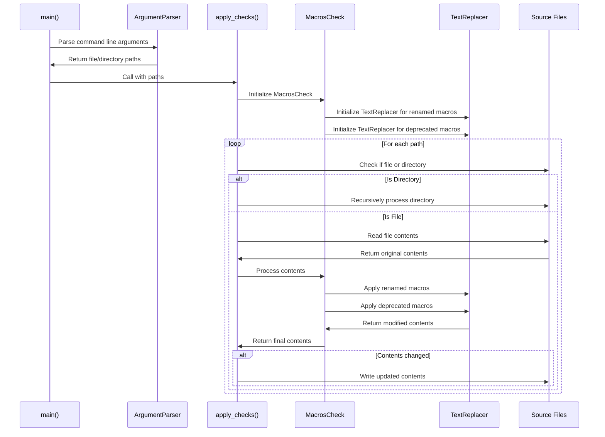
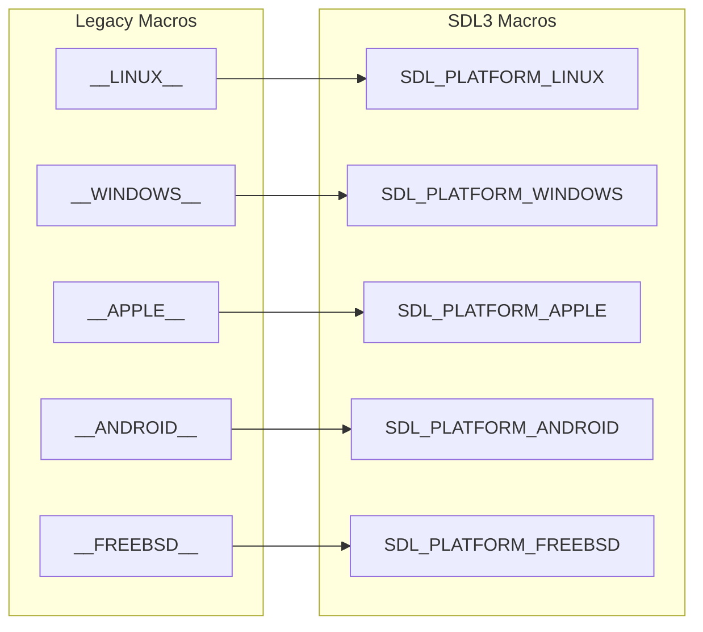
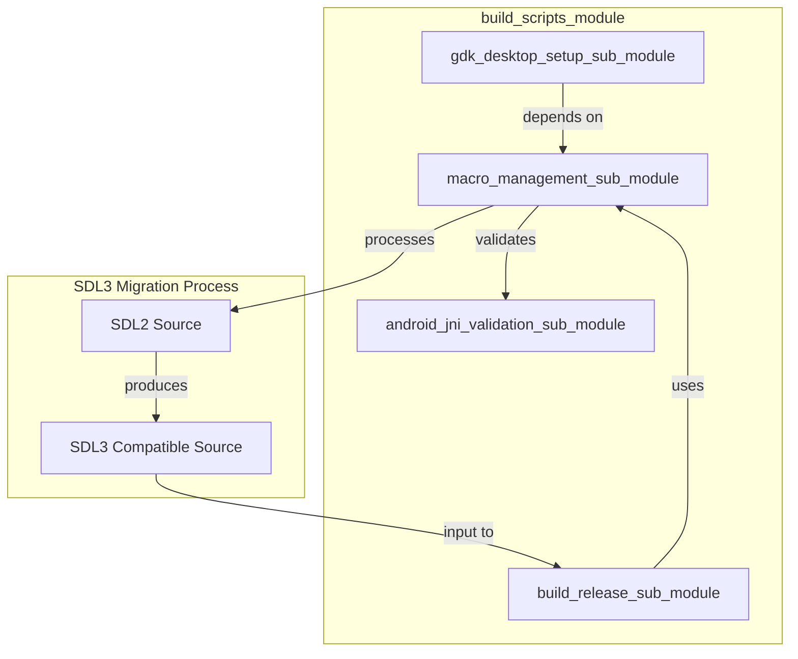
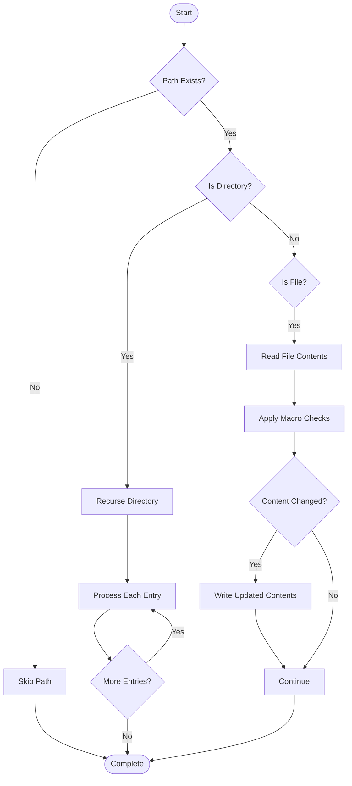

# Macro Management Sub-Module Documentation

## Introduction

The macro_management_sub_module is a critical component of the SDL3 build system responsible for managing and migrating platform-specific macros during the transition from SDL2 to SDL3. This module provides automated tools for renaming deprecated platform macros to their new SDL3 equivalents and flagging removed macros with appropriate deprecation warnings.

## Purpose and Core Functionality

The macro management system serves as a bridge between SDL2 and SDL3, ensuring backward compatibility while facilitating the migration to a more consistent naming convention. It processes source code files to automatically update platform detection macros, reducing manual effort and potential errors during the SDL3 migration process.

### Key Responsibilities

1. **Platform Macro Renaming**: Automatically renames legacy platform macros to new SDL3 format
2. **Deprecation Handling**: Identifies and marks deprecated macros with migration warnings
3. **Batch Processing**: Processes entire directory trees of source files
4. **Text Pattern Matching**: Uses regular expressions for accurate macro identification

## Architecture and Component Relationships

### Core Components



### Component Details

#### TextReplacer Class
The `TextReplacer` class is the core text processing engine that handles macro replacement operations:

- **Initialization**: Accepts macro definitions and replacement format strings
- **Pattern Matching**: Uses compiled regular expressions for efficient macro detection
- **Replacement Logic**: Applies formatted replacements while preserving surrounding context
- **Content Processing**: Processes entire file contents in a single pass

#### MacrosCheck Class
The `MacrosCheck` class orchestrates the macro validation and replacement process:

- **Dual Processing**: Handles both renamed and deprecated macros
- **Sequential Application**: Applies replacements in a specific order
- **Content Transformation**: Returns modified content with all macro updates applied

## Data Flow and Processing Pipeline



## Macro Categories and Transformations

### Renamed Platform Macros
The module handles systematic renaming of platform detection macros:



### Deprecated Macros
The module identifies and marks macros that have been completely removed from SDL3:

- **Platform-specific features**: `SDL_AUDIO_DRIVER_*`, `SDL_VIDEO_DRIVER_*`
- **Hardware capabilities**: `SDL_ARM_NEON_BLITTERS`, `SDL_ALTIVEC_BLITTERS`
- **Subsystem configurations**: `SDL_*_DISABLED` flags
- **Driver implementations**: Platform-specific driver selection macros

## Integration with Build System

The macro management module integrates with the broader SDL build system:



## Usage Patterns and Process Flow

### Command Line Interface
The module provides a simple command-line interface for batch processing:

```bash
# Process individual files
python rename_macros.py file1.c file2.h

# Process entire directories
python rename_macros.py src/ include/ test/

# Process mixed files and directories
python rename_macros.py src/main.c include/SDL/ test/
```

### Processing Algorithm



## Error Handling and Edge Cases

### File Processing Errors
- **Unicode Decode Errors**: Skips binary files automatically
- **Permission Errors**: Reports access issues without stopping batch processing
- **File System Errors**: Continues processing remaining files after individual failures

### Text Processing Considerations
- **Context Preservation**: Maintains surrounding whitespace and punctuation
- **Word Boundary Detection**: Uses regex word boundaries to avoid partial matches
- **Replacement Order**: Processes renamed macros before deprecated ones
- **Format Flexibility**: Supports both dictionary and list-based macro definitions

## Relationship to Other Modules

The macro_management_sub_module works in conjunction with other build system components:

- **[build_release_sub_module](build_release_sub_module.md)**: Uses macro management during release packaging
- **[android_jni_validation_sub_module](android_jni_validation_sub_module.md)**: Validates JNI bindings after macro processing
- **[gdk_desktop_setup_sub_module](gdk_desktop_setup_sub_module.md)**: Applies platform-specific macro transformations

## Migration Impact and Benefits

### Benefits of Automated Macro Management
1. **Consistency**: Ensures uniform macro naming across the codebase
2. **Accuracy**: Reduces human error in manual macro replacement
3. **Efficiency**: Processes large codebases quickly and reliably
4. **Documentation**: Provides clear deprecation warnings for removed features
5. **Maintainability**: Centralizes macro transformation logic

### Migration Considerations
- **Build System Integration**: Must be run before compilation
- **Version Control**: Generates modified files that need to be committed
- **Testing**: Requires validation that macro replacements are functionally correct
- **Platform Coverage**: Supports all major platforms and architectures

## Future Extensibility

The module's design supports future enhancements:

- **Additional Macro Categories**: Can be extended with new macro types
- **Custom Replacement Rules**: Supports flexible replacement formatting
- **Plugin Architecture**: Could support external macro definition files
- **Integration APIs**: Could be integrated into IDEs or build tools

This macro management system represents a crucial component in SDL's evolution, providing a systematic approach to managing the complexity of cross-platform macro definitions while maintaining backward compatibility and facilitating smooth migration to SDL3.