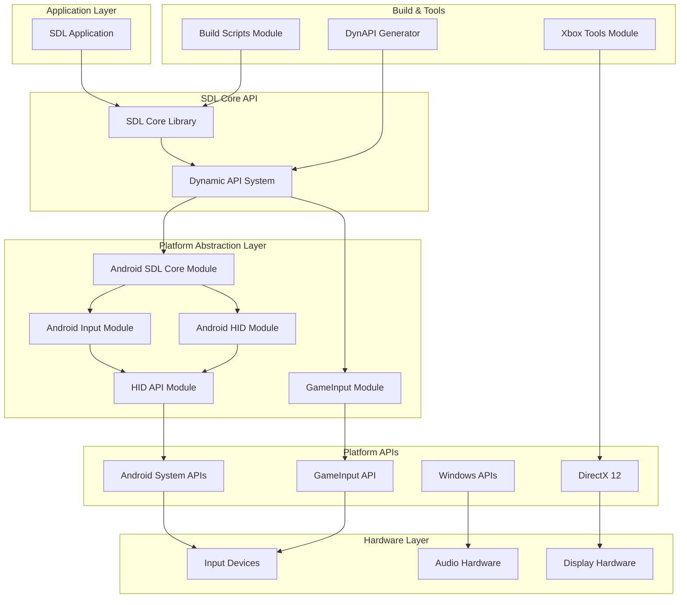
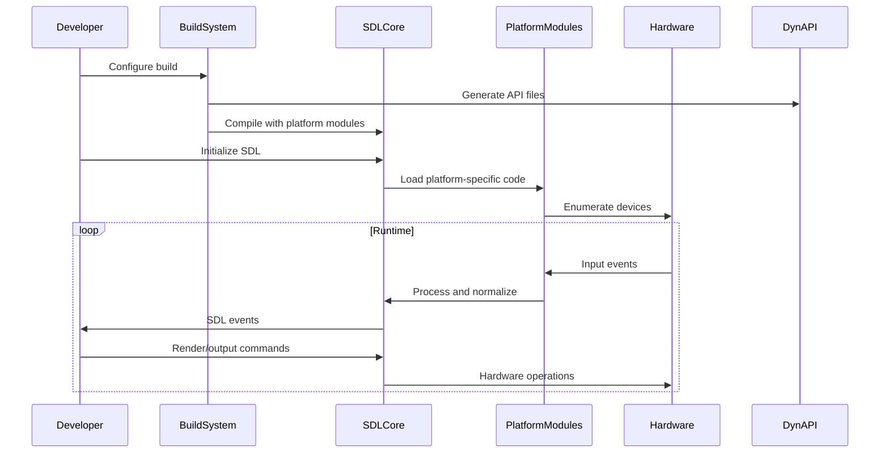

# libsdl-org--SDL Repository Overview

## Purpose

The **libsdl-org--SDL** repository is the official home of SDL (Simple DirectMedia Layer) 3, a cross-platform development library designed to provide low-level access to audio, keyboard, mouse, joystick, and graphics hardware via OpenGL, Direct3D, Vulkan, and Metal. SDL serves as a foundational abstraction layer that enables developers to write multimedia applications and games that run consistently across Windows, macOS, Linux, iOS, Android, and gaming consoles.

## End-to-End Architecture

## Core Modules

### 1. Android SDL Core Module
**Path**: `android-project/app/src/main/java/org/libsdl/app`

The central orchestrator for SDL applications on Android platforms. This module manages the complete application lifecycle, JNI bridge setup, library loading with version validation, and integration with Android system services.

**Key Components**:
- **SDLActivity**: Main activity controller handling Android lifecycle
- **SDLMain**: Dedicated thread for SDL application execution
- **SDLCommandHandler**: Message processing between native and UI threads
- **SDLClipboardHandler**: Clipboard operations with event notification

[View detailed documentation](android_sdl_core_module.md)

### 2. Android Input Module
**Path**: `android-project/app/src/main/java/org/libsdl/app`

Comprehensive input handling system that provides unified management of game controllers, audio devices, touch input, keyboards, and sensors on Android platforms.

**Key Components**:
- **SDLAudioManager**: Audio device hot-plug detection and management
- **SDLControllerManager**: Multi-API game controller support (API 16-31)
- **SDLSurface**: Touch, mouse, stylus, and sensor input processing
- **SDLInputConnection**: Soft keyboard integration and text input

[View detailed documentation](android_sdl_input_module.md)

### 3. Android HID Module
**Path**: `android-project/app/src/main/java/org/libsdl/app`

Specialized module for Human Interface Device management on Android, supporting both USB and Bluetooth Low Energy devices including game controllers, keyboards, and Steam Controllers.

**Key Components**:
- **HIDDeviceManager**: Central coordinator for device discovery and lifecycle
- **HIDDeviceUSB**: USB HID device implementation with Xbox controller support
- **HIDDeviceBLESteamController**: Bluetooth Steam Controller with GATT protocol

[View detailed documentation](android_hid_module.md)

### 4. HID API Module
**Path**: `src/hidapi`

Cross-platform interface for HID device communication that bridges standard HIDAPI calls to Android-specific USB and BLE operations, providing thread-safe device management and data buffering.

**Key Components**:
- **CHIDDevice**: Central device abstraction with reference counting
- **Buffer Management**: Efficient memory pooling and thread-safe queuing
- **JNI Interface**: Comprehensive native-to-Java communication layer

[View detailed documentation](hid_api_module.md)

### 5. GameInput Module
**Path**: `src/joystick/gdk`, `src/video/windows`

Microsoft GameInput API integration for Windows and GDK platforms, providing advanced gaming input device support with features like rumble feedback and system buttons.

**Key Components**:
- **SDL_gameinputjoystick**: Gamepad and joystick handling with sensor support
- **SDL_windowsgameinput**: Mouse and keyboard input with delta tracking

[View detailed documentation](gameinput_module.md)

### 6. Build Scripts Module
**Path**: `build-scripts`

Comprehensive build automation and release management system supporting multiple platforms (Windows, macOS, Android, Linux) with dependency management and quality assurance.

**Key Components**:
- **Releaser**: Central build coordinator with version management
- **VisualStudio**: Visual Studio integration with cross-architecture support
- **Archiver**: Multi-format package creation (ZIP, TAR.GZ, DMG, AAR)

[View detailed documentation](build_scripts_module.md)

### 7. DynAPI Module
**Path**: `src/dynapi`

Dynamic API management system that automatically generates and maintains SDL's runtime API resolution infrastructure by parsing header files and updating jump tables.

**Key Components**:
- **SdlProcedure**: API function metadata representation
- **Header Parser**: Automatic API discovery from SDL headers
- **Code Generator**: Updates dynamic API files

[View detailed documentation](dynapi_module.md)

### 8. Xbox Tools Module
**Path**: `src/video/directx`

Specialized utility for generating Xbox-compatible C macro definitions from DirectX 12 headers, enabling proper abstraction layers for Xbox platform development.

**Key Components**:
- **gen_xbox_cmacros**: Automated macro generation with filtering and transformation

[View detailed documentation](xbox_tools_module.md)

## Integration Flow

This architecture ensures SDL provides a consistent, cross-platform API while leveraging platform-specific optimizations and maintaining compatibility across diverse hardware and operating system configurations.