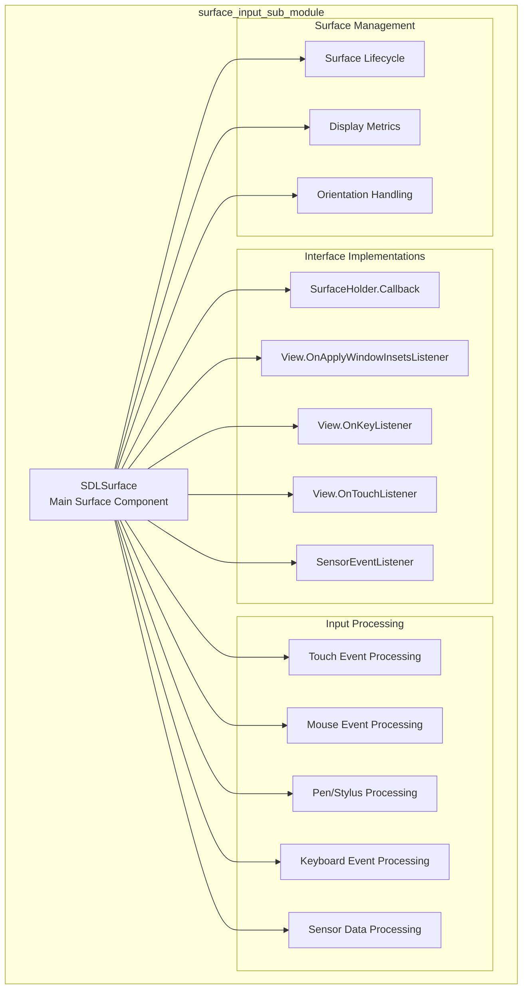
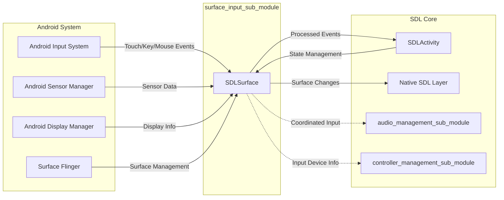
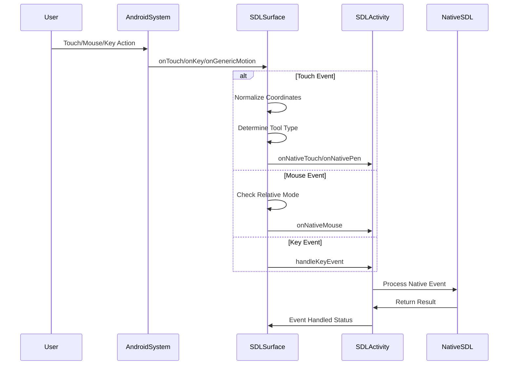
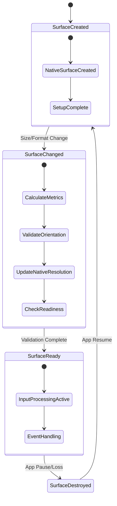

# Surface Input Sub-Module Documentation

## Introduction

The surface_input_sub_module is a critical component of the SDL (Simple DirectMedia Layer) Android input system, responsible for managing the primary drawing surface and handling various input events including touch, mouse, keyboard, sensor, and pen input. This module serves as the bridge between Android's native input system and SDL's cross-platform input handling framework.

## Module Overview

The surface_input_sub_module contains the `SDLSurface` class, which extends Android's `SurfaceView` to provide a comprehensive input handling surface for SDL applications. This module is essential for:

- **Surface Management**: Creating and managing the drawing surface for SDL applications
- **Multi-Modal Input Processing**: Handling touch, mouse, keyboard, pen, and sensor input
- **Event Normalization**: Converting Android input events to SDL-compatible format
- **Display Management**: Handling screen resolution, orientation, and display metrics
- **Sensor Integration**: Managing accelerometer and motion sensor data

## Core Architecture

### Component Structure



### System Integration



## Core Components

### SDLSurface Class

The `SDLSurface` class is the central component that extends `SurfaceView` and implements multiple listener interfaces to handle various input types and surface lifecycle events.

#### Key Responsibilities:

1. **Surface Lifecycle Management**
   - Handles surface creation, destruction, and changes
   - Manages surface readiness state
   - Coordinates with native SDL layer for surface events

2. **Multi-Touch Input Processing**
   - Normalizes touch coordinates for SDL
   - Handles multi-pointer touch events
   - Processes pressure sensitivity data
   - Distinguishes between different tool types (finger, stylus, mouse)

3. **Mouse and Pointer Events**
   - Supports both absolute and relative mouse modes
   - Handles mouse button states and scroll events
   - Manages captured pointer events (API 26+)

4. **Pen/Stylus Support**
   - Processes stylus and eraser input
   - Handles pressure sensitivity
   - Manages pen button states

5. **Keyboard Input**
   - Delegates keyboard events to SDLActivity
   - Maintains key event compatibility

6. **Sensor Integration**
   - Manages accelerometer data
   - Handles device rotation detection
   - Processes sensor-based motion input

7. **Display Management**
   - Calculates display metrics and density
   - Handles orientation changes
   - Manages window insets for modern Android versions

## Data Flow Architecture

### Input Event Processing Flow



### Surface Lifecycle Flow



## Input Processing Details

### Touch Input Normalization

The module implements sophisticated touch coordinate normalization to ensure consistent input handling across different screen sizes and resolutions:

```
normalizedX = (touchX / (surfaceWidth - 1))
normalizedY = (touchY / (surfaceHeight - 1))
```

This normalization ensures that touch coordinates are consistently mapped to the range [0, 1] regardless of actual screen dimensions.

### Multi-Tool Type Support

The system distinguishes between different input tool types:

- **TOOL_TYPE_FINGER**: Standard touch input with pressure sensitivity
- **TOOL_TYPE_MOUSE**: Mouse input with button state tracking
- **TOOL_TYPE_STYLUS**: Pen input with pressure and button support
- **TOOL_TYPE_ERASER**: Eraser functionality for stylus devices

### Sensor Data Processing

Accelerometer data is processed with device rotation compensation:

```
// Rotation 0°: x = event.values[0], y = event.values[1]
// Rotation 90°: x = -event.values[1], y = event.values[0]
// Rotation 180°: x = -event.values[0], y = -event.values[1]
// Rotation 270°: x = event.values[1], y = -event.values[0]
```

## Dependencies and Interactions

### Internal Dependencies

- **[activity_management_sub_module](activity_management_sub_module.md)**: Coordinates with SDLActivity for state management and event delegation
- **[communication_and_command_sub_module](communication_and_command_sub_module.md)**: Utilizes command handlers for input event processing
- **[initialization_sub_module](initialization_sub_module.md)**: Depends on SDL initialization state for surface creation

### External Dependencies

- **Android Framework**: Extends SurfaceView and implements various listener interfaces
- **Android Sensor Manager**: Provides accelerometer and motion sensor data
- **Android Display Manager**: Supplies display metrics and orientation information
- **Android Input System**: Receives raw input events from the system

## Configuration and Setup

### Surface Initialization

The surface is configured with the following properties:

- **Focusable**: Enabled for keyboard input reception
- **Focusable in Touch Mode**: Enabled for touch input handling
- **Sensor Registration**: Accelerometer sensor registered with SENSOR_DELAY_GAME
- **Input Listeners**: Touch, key, and generic motion listeners attached

### Display Metrics Calculation

For Android API 17+, the system retrieves real display metrics:

```java
DisplayMetrics realMetrics = new DisplayMetrics();
mDisplay.getRealMetrics(realMetrics);
density = (float)realMetrics.densityDpi / 160.0f;
```

## Error Handling and Edge Cases

### Division by Zero Protection

The module includes protection against division by zero in coordinate normalization:

```java
if (mWidth <= 1) {
    return 0.5f;
} else {
    return (x / (mWidth - 1));
}
```

### Orientation Validation

Special handling for orientation mismatches between device and application:

- Portrait apps on landscape devices
- Landscape apps on portrait devices
- Square resolution devices (e.g., BlackBerry Passport)
- Multi-window mode considerations (API 24+)

### Surface Readiness Management

The module carefully tracks surface readiness to prevent operations on invalid surfaces:

- `mIsSurfaceReady` flag management
- Surface validation before native operations
- Graceful handling of surface destruction

## Performance Considerations

### Event Processing Optimization

- **Event Batching**: Multiple pointer events processed in single callback
- **Early Returns**: Quick exits for invalid or duplicate events
- **Minimal Allocations**: Reuse of existing objects where possible

### Sensor Management

- **Selective Registration**: Sensors only registered when needed
- **Appropriate Sampling**: SENSOR_DELAY_GAME for responsive but not excessive updates
- **Lifecycle Awareness**: Sensors disabled during pause to conserve battery

## Integration with SDL Ecosystem

The surface_input_sub_module serves as the primary input gateway for the SDL Android implementation. It bridges the gap between Android's input system and SDL's cross-platform input handling, ensuring that SDL applications receive consistent input events regardless of the underlying platform.

This module works in conjunction with other SDL Android modules to provide a complete multimedia experience, coordinating input handling with audio management, controller support, and overall application lifecycle management.