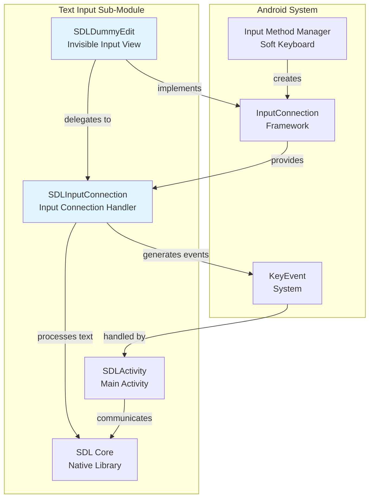
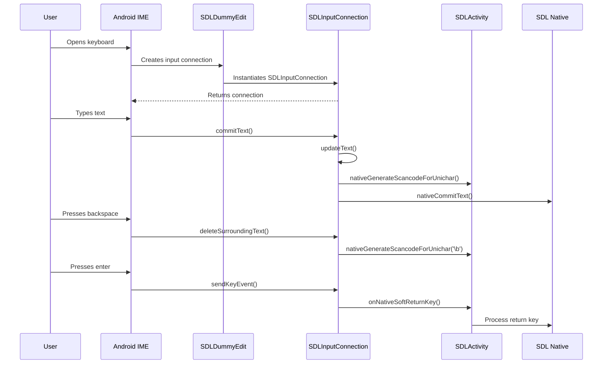
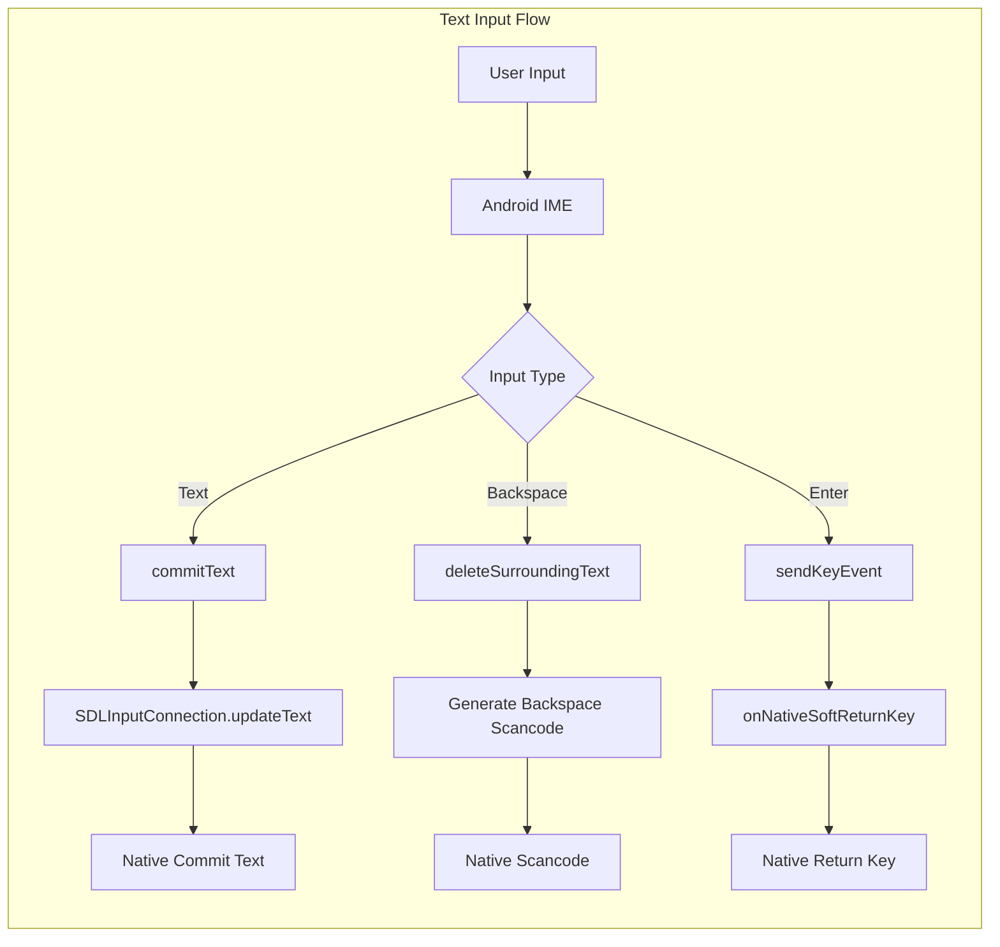
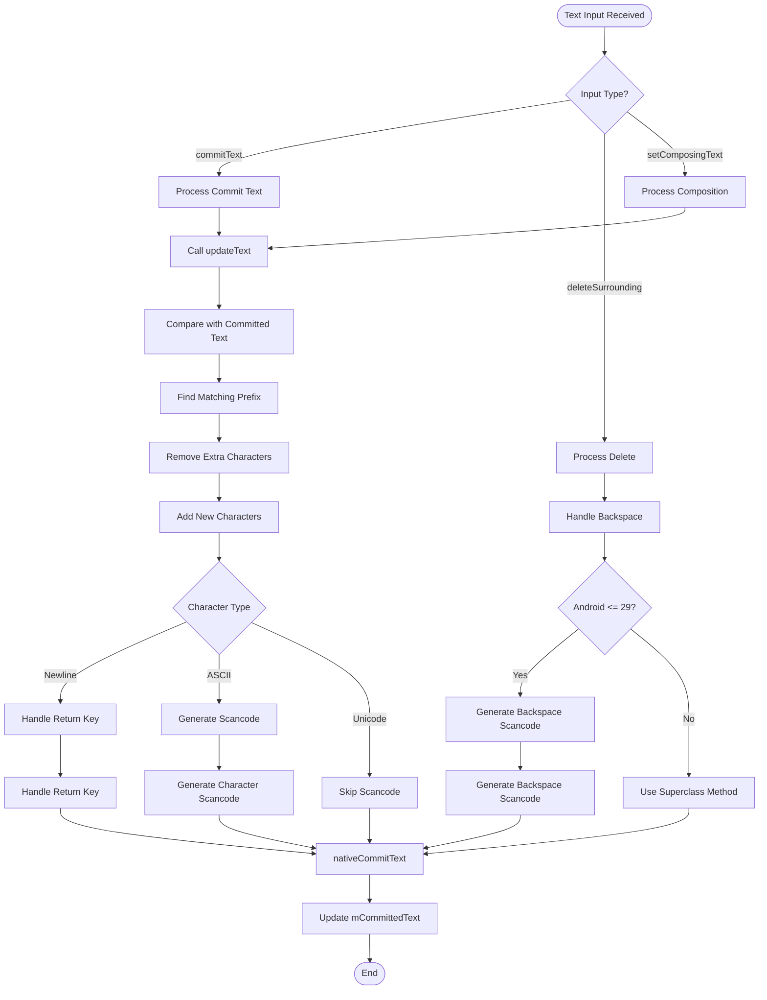

# Text Input Sub-Module Documentation

## Introduction

The text_input_sub_module is a critical component of the SDL Android input system that handles text input functionality for SDL applications. This module provides a bridge between Android's soft keyboard system and SDL's native text input handling, enabling users to input text through on-screen keyboards while maintaining compatibility with SDL's event system.

The module consists of two primary components: `SDLDummyEdit` and `SDLInputConnection`, which work together to create an invisible text input interface that captures keyboard input and translates it into SDL-compatible events.

## Architecture Overview

## Core Components

### SDLDummyEdit

`SDLDummyEdit` is an invisible Android View that serves as a proxy for text input operations. It acts as the primary interface between the Android input method system and SDL's text handling mechanism.

**Key Responsibilities:**
- Provides an invisible text editor interface to the Android system
- Handles keyboard visibility and focus management
- Delegates key events to SDLActivity for processing
- Manages the input connection lifecycle

**Key Features:**
- Implements `View.OnKeyListener` for hardware key events
- Overrides `onCheckIsTextEditor()` to declare itself as a text editor
- Handles back key events to dismiss the keyboard
- Creates and manages the `SDLInputConnection` instance

### SDLInputConnection

`SDLInputConnection` extends Android's `BaseInputConnection` to provide custom text input handling that bridges Android's text input system with SDL's native event system.

**Key Responsibilities:**
- Processes text input from soft keyboards
- Converts text changes into SDL-compatible key events
- Handles special keys like backspace and enter
- Manages text composition and commitment

**Key Features:**
- Overrides text commitment methods to capture input
- Implements backspace handling for Android versions <= 29
- Generates scancodes for compatible characters
- Handles newline characters as return key events

## Data Flow

## Component Interactions

## Process Flow

### Text Input Processing

## Integration with SDL System

The text_input_sub_module integrates with the broader SDL Android system through several key interfaces:

### SDLActivity Integration
- **Key Event Handling**: Delegates to `SDLActivity.handleKeyEvent()` for processing
- **Keyboard Focus**: Uses `SDLActivity.onNativeKeyboardFocusLost()` for focus management
- **Return Key Processing**: Calls `SDLActivity.onNativeSoftReturnKey()` for enter key handling

### Native SDL Integration
- **Text Commitment**: Uses `nativeCommitText()` to send text to native SDL
- **Scancode Generation**: Uses `nativeGenerateScancodeForUnichar()` to create key events
- **Event Dispatching**: Checks `SDLActivity.dispatchingKeyEvent()` to avoid conflicts

## Dependencies

The text_input_sub_module depends on several other components within the SDL Android system:

### Direct Dependencies
- **[SDLActivity](activity_management_sub_module.md)**: Main activity class that handles key events and keyboard focus
- **[SDL Core](initialization_sub_module.md)**: Provides context and native interface access

### Indirect Dependencies
- **[Communication and Command Sub-Module](communication_and_command_sub_module.md)**: For command handling and clipboard operations
- **[Threading and Execution Sub-Module](threading_and_execution_sub_module.md)**: For task execution coordination

## Key Design Patterns

### 1. Adapter Pattern
The module acts as an adapter between Android's input method framework and SDL's native input system, translating between two different input paradigms.

### 2. Proxy Pattern
`SDLDummyEdit` serves as a proxy view that intercepts input method interactions without providing visible UI elements.

### 3. Observer Pattern
The input connection observes text changes and notifies the native SDL system through callback methods.

## Error Handling and Edge Cases

### Backspace Handling
- Special handling for Android versions <= 29 to capture backspace events
- Uses `deleteSurroundingText()` as a workaround for missing key events

### Character Limitations
- Only generates scancodes for ASCII characters (0-127)
- Unicode characters are committed directly without scancode generation

### Keyboard Visibility
- Implements back key handling to detect keyboard dismissal
- Provides fallback mechanism for keyboard visibility detection

## Performance Considerations

### Text Processing
- Efficient text comparison using code point iteration
- Minimal string operations to reduce garbage collection pressure

### Event Generation
- Selective scancode generation based on character compatibility
- Batch processing of text changes to reduce native calls

## Future Considerations

### Unicode Support
The current implementation has limited Unicode support for scancode generation. Future enhancements could include:
- Extended character mapping for common Unicode characters
- Grapheme cluster handling for complex text input

### Keyboard Detection
The keyboard visibility detection mechanism has known limitations. Potential improvements:
- Layout-based keyboard detection
- System API integration for reliable keyboard state

### Multi-language Support
Enhanced support for:
- Input method editors (IME) for complex scripts
- Right-to-left text input
- Composing text handling improvements

## Conclusion

The text_input_sub_module provides a robust bridge between Android's text input system and SDL's native input handling. Through careful design and implementation, it enables seamless text input in SDL applications while maintaining compatibility with Android's input method framework. The module's architecture ensures reliable text input processing while handling the complexities of different Android versions and input method behaviors.