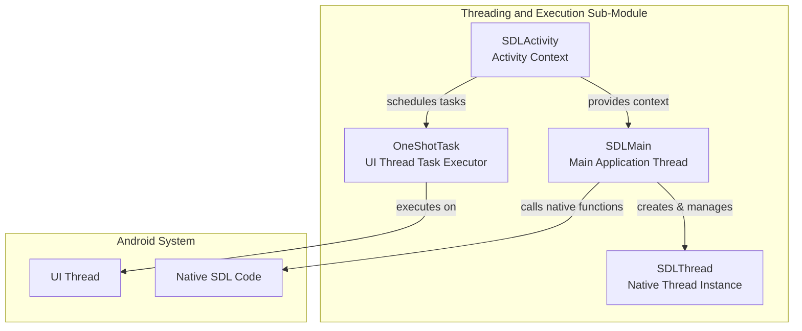
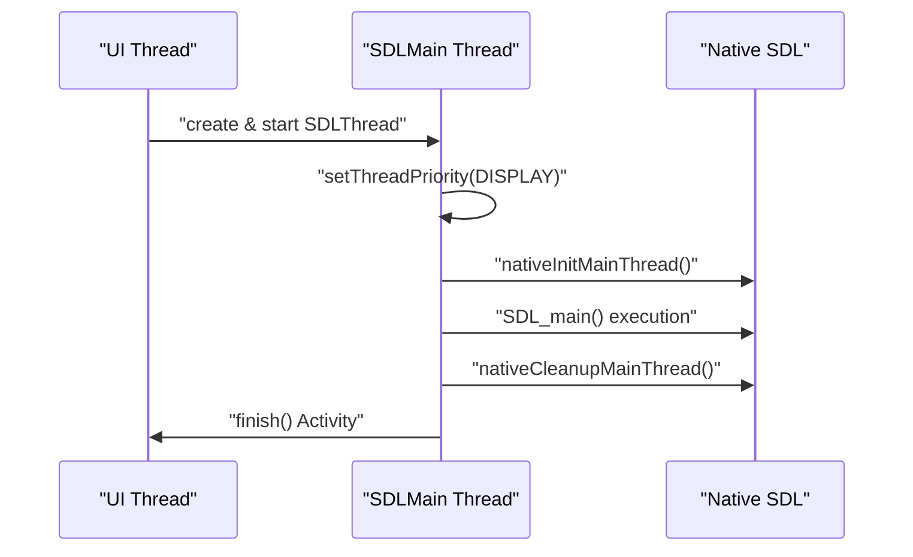
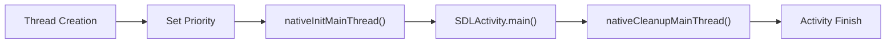
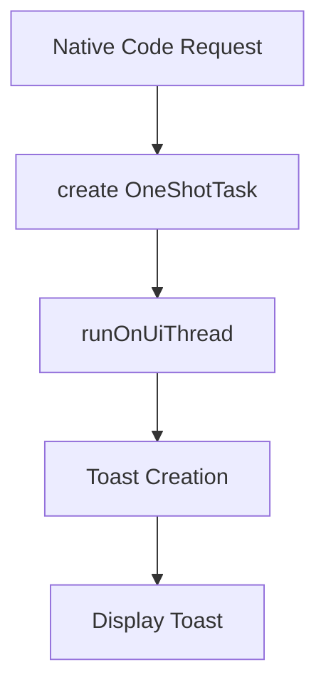
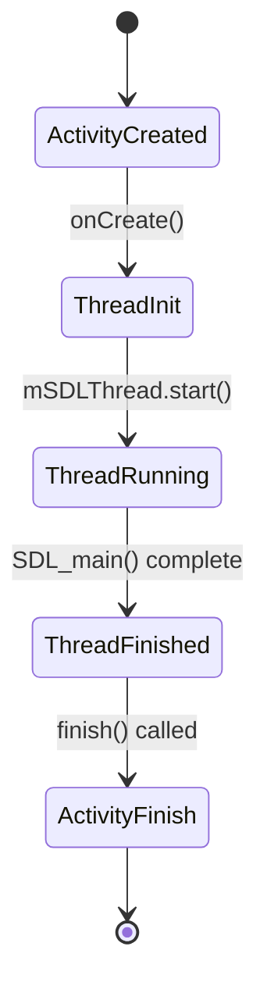

# Threading and Execution Sub-Module Documentation

## Introduction

The threading_and_execution_sub_module is a critical component of the SDL Android core system that manages the execution lifecycle and threading model for SDL applications. This module provides the foundation for running SDL applications on Android by handling the main application thread, task execution, and coordination between the Android UI thread and the native SDL thread.

## Core Purpose

This module serves as the bridge between Android's activity lifecycle and SDL's native execution model, ensuring proper thread management, task scheduling, and application state transitions. It handles the complexities of running native C/C++ code within Android's managed environment while maintaining responsiveness and proper lifecycle management.

## Architecture Overview

### Component Structure



### Threading Model



## Core Components

### SDLMain Class

The `SDLMain` class implements the `Runnable` interface and serves as the primary execution context for SDL applications on Android.

#### Key Responsibilities:
- **Thread Management**: Creates and manages the dedicated SDL thread
- **Priority Optimization**: Sets thread priority to `THREAD_PRIORITY_DISPLAY` for optimal performance
- **Native Integration**: Handles initialization and cleanup of native SDL components
- **Lifecycle Coordination**: Manages the transition between SDL application states

#### Execution Flow:



#### Thread Priority Management:
```java
// Priority optimization for display performance
try {
    android.os.Process.setThreadPriority(android.os.Process.THREAD_PRIORITY_DISPLAY);
} catch (Exception e) {
    Log.v("SDL", "modify thread properties failed " + e.toString());
}
```

### OneShotTask Class

The `OneShotTask` class implements the `Runnable` interface and provides a mechanism for executing UI-related operations on the Android main thread.

#### Key Responsibilities:
- **UI Thread Execution**: Ensures UI operations run on the main Android thread
- **Toast Management**: Handles the display of toast notifications with customizable positioning
- **Thread Safety**: Provides safe cross-thread communication for UI updates

#### Usage Pattern:


## Integration with SDL Activity

### Thread Creation and Management

The SDLActivity class manages the SDL thread lifecycle through the following mechanism:



### State Synchronization

The module ensures proper synchronization between Android activity states and SDL thread states:

- **Resume Handling**: When the activity resumes, the SDL thread is started or resumed
- **Pause Handling**: When the activity pauses, the SDL thread is appropriately paused
- **Focus Management**: Handles window focus changes and their impact on SDL execution
- **Cleanup**: Ensures proper cleanup when the activity is destroyed

## Dependencies and Interactions

### Related Modules

This module interacts with several other SDL Android modules:

- **[android_sdl_core_module](android_sdl_core_module.md)**: Provides the main SDL context and initialization
- **[activity_management_sub_module](activity_management_sub_module.md)**: Manages the Android activity lifecycle
- **[communication_and_command_sub_module](communication_and_command_sub_module.md)**: Handles command processing and UI updates

### Native Interface Dependencies

The threading module relies on several native JNI functions:

```java
// Native functions called by SDLMain
public static native void nativeInitMainThread();
public static native void nativeCleanupMainThread();
public static native int nativeRunMain(String library, String function, Object arguments);
```

## Error Handling and Robustness

### Thread Safety Measures

1. **Exception Handling**: Comprehensive exception handling in thread priority setting
2. **State Validation**: Checks for activity finishing state before thread operations
3. **Resource Cleanup**: Ensures proper cleanup of native resources

### Error Recovery

```java
// Robust thread priority setting with fallback
try {
    android.os.Process.setThreadPriority(android.os.Process.THREAD_PRIORITY_DISPLAY);
} catch (Exception e) {
    Log.v("SDL", "modify thread properties failed " + e.toString());
    // Continue execution with default priority
}
```

## Performance Considerations

### Thread Priority Optimization

The module sets the SDL thread to `THREAD_PRIORITY_DISPLAY` priority, which is optimal for applications that require smooth display updates and user interaction responsiveness.

### Resource Management

- **Thread Lifecycle**: Proper thread creation and destruction to prevent resource leaks
- **Memory Management**: Coordinates with native code for proper memory cleanup
- **State Transitions**: Efficient handling of activity state changes

## Usage Examples

### SDLMain Execution

```java
// Thread creation and execution
mSDLThread = new Thread(new SDLMain(), "SDLThread");
mSDLThread.start();
```

### OneShotTask for UI Updates

```java
// Creating and executing a UI task
mSingleton.runOnUiThread(new OneShotTask(message, duration, gravity, xOffset, yOffset));
```

## Best Practices

1. **Thread Management**: Always use the provided SDLMain class for SDL thread creation
2. **UI Operations**: Use OneShotTask for any UI-related operations from native code
3. **Lifecycle Awareness**: Ensure proper handling of activity lifecycle events
4. **Error Handling**: Implement proper exception handling for thread operations
5. **Resource Cleanup**: Always ensure proper cleanup of threads and native resources

## Conclusion

The threading_and_execution_sub_module provides a robust foundation for running SDL applications on Android by managing the complex interactions between Android's activity lifecycle and SDL's native execution model. Through careful thread management, state synchronization, and error handling, this module ensures reliable and performant execution of SDL applications on the Android platform.