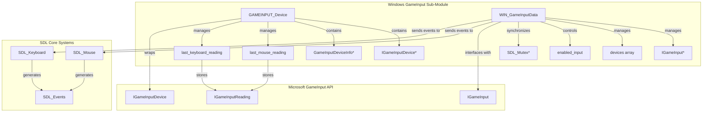
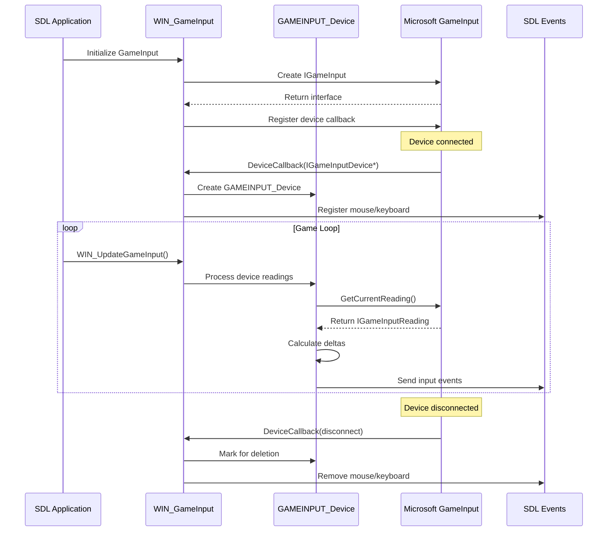
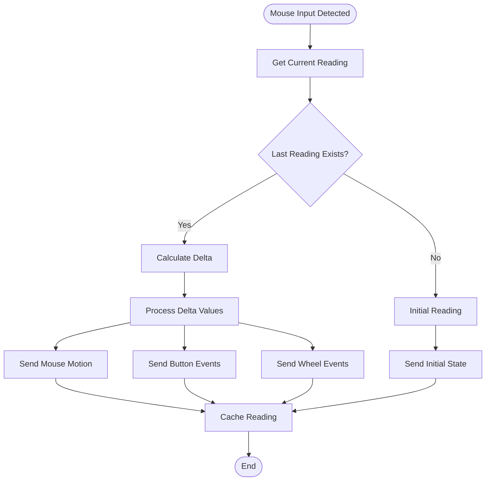
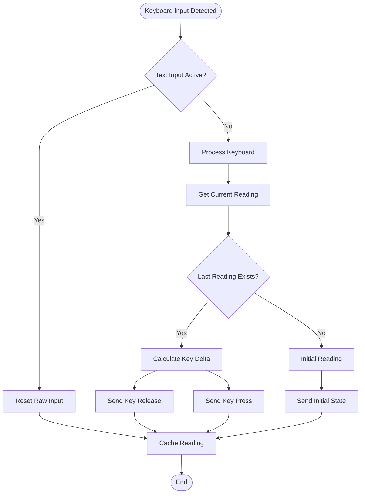
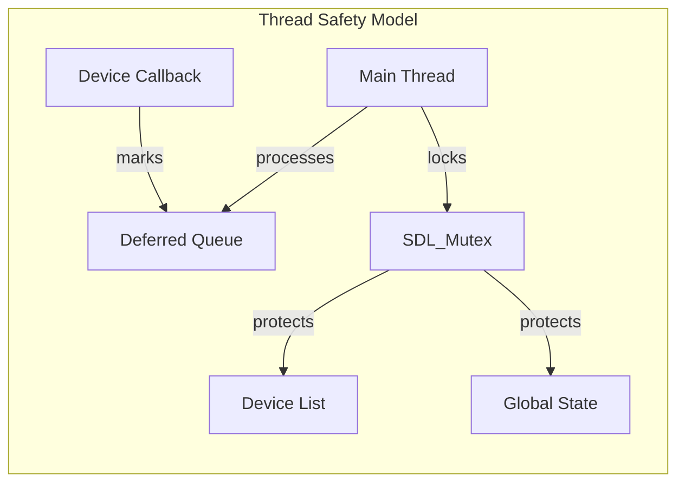

# Windows GameInput Sub-Module Documentation

## Introduction

The Windows GameInput sub-module provides SDL with access to Microsoft's GameInput API for handling mouse and keyboard input on Windows platforms. This module serves as a bridge between the GameInput API and SDL's input system, enabling low-latency, high-performance input processing for gaming applications.

The module is part of the larger [gameinput_module](gameinput_module.md) and specifically handles Windows-specific GameInput functionality, while delegating GDK (Game Development Kit) specific functionality to the [gameinput_joystick_sub_module](gameinput_joystick_sub_module.md).

## Architecture Overview

## Core Components

### GAMEINPUT_Device Structure

The `GAMEINPUT_Device` structure represents a single GameInput device and serves as the primary wrapper around Microsoft's `IGameInputDevice` interface.

**Key Responsibilities:**
- Device lifecycle management (reference counting, cleanup)
- Input reading storage and management
- SDL device registration and identification

**Key Fields:**
- `pDevice`: Pointer to the underlying `IGameInputDevice` interface
- `info`: Device information structure containing capabilities
- `instance_id`: SDL-generated unique identifier
- `last_mouse_reading`/`last_keyboard_reading`: Cached input readings for delta calculations
- `registered`: Flag indicating SDL registration status
- `delete_requested`: Flag for deferred deletion

### WIN_GameInputData Structure

The `WIN_GameInputData` structure manages the overall GameInput subsystem state and coordinates multiple devices.

**Key Responsibilities:**
- GameInput API interface management
- Device collection and enumeration
- Input type filtering and enablement
- Thread synchronization
- Timestamp coordination between SDL and GameInput

**Key Fields:**
- `pGameInput`: Primary GameInput interface pointer
- `devices`: Dynamic array of `GAMEINPUT_Device` pointers
- `enabled_input`: Bitmask controlling which input types are processed
- `lock`: Mutex for thread-safe operations
- `timestamp_offset`: Conversion factor between GameInput and SDL timestamps

## Data Flow Architecture

## Input Processing Flow

### Mouse Input Processing

### Keyboard Input Processing

## Key Functions and Operations

### Device Management

#### `GAMEINPUT_InternalAddOrFind()`
- **Purpose**: Adds new devices or finds existing ones in the device list
- **Thread Safety**: Requires external locking
- **Key Operations**:
  - Device info retrieval via `GetDeviceInfo()`
  - Memory allocation for device structures
  - Device list management
  - Reference counting for COM objects

#### `GAMEINPUT_InternalRemoveByIndex()`
- **Purpose**: Removes devices from the system
- **Cleanup Operations**:
  - SDL device deregistration
  - COM object release
  - Memory deallocation
  - Device list compaction

### Input Processing Functions

#### `GAMEINPUT_HandleMouseDelta()`
- **Purpose**: Processes mouse input changes between readings
- **Delta Calculations**:
  - Position delta (X, Y coordinates)
  - Button state changes
  - Wheel movement delta
- **Event Generation**: Sends appropriate SDL mouse events

#### `GAMEINPUT_HandleKeyboardDelta()`
- **Purpose**: Processes keyboard input changes
- **Algorithm**: Two-pointer merge to detect key press/release events
- **Scancode Mapping**: Converts Windows scancodes to SDL scancodes

### Initialization and Lifecycle

#### `WIN_InitGameInput()`
- **Purpose**: Initializes the GameInput subsystem
- **Key Steps**:
  - GameInput interface creation
  - Device callback registration
  - Timestamp synchronization
  - Thread safety setup

#### `WIN_UpdateGameInputEnabled()`
- **Purpose**: Controls which input types are processed
- **Configuration**: Based on SDL's raw input settings
- **Dynamic Updates**: Can enable/disable input processing at runtime

## Thread Safety and Synchronization

The module implements comprehensive thread safety through several mechanisms:

1. **Global Lock**: All device list operations are protected by `data->lock`
2. **COM Threading**: GameInput API calls are made from the main thread
3. **Callback Safety**: Device callbacks are processed asynchronously but device modifications are deferred to the main thread

## Integration with SDL Systems

### Event System Integration
The module integrates with SDL's event system through dedicated functions:
- `SDL_SendMouseMotion()`: For mouse movement events
- `SDL_SendMouseButton()`: For mouse button events  
- `SDL_SendMouseWheel()`: For mouse wheel events
- `SDL_SendKeyboardKey()`: For keyboard events

### Device Registration
Devices are registered with SDL's input subsystem:
- `SDL_AddMouse()`: Registers mouse devices
- `SDL_AddKeyboard()`: Registers keyboard devices
- `SDL_RemoveMouse()`: Removes mouse devices
- `SDL_RemoveKeyboard()`: Removes keyboard devices

## Error Handling

The module implements robust error handling:
- **HRESULT Checking**: All GameInput API calls check return values
- **Memory Allocation**: Graceful handling of allocation failures
- **COM Reference Counting**: Proper AddRef/Release patterns
- **SDL Error Reporting**: Integration with SDL's error system

## Performance Considerations

1. **Delta Processing**: Only processes input changes, not absolute states
2. **Reading Caching**: Maintains last reading to minimize API calls
3. **Batch Processing**: Processes all devices in a single update call
4. **Memory Pooling**: Reuses device structures and reading objects

## Dependencies

### Internal Dependencies
- [gameinput_module](gameinput_module.md): Parent module providing GameInput API access
- SDL core systems for event generation and device management
- Windows-specific SDL components for platform integration

### External Dependencies
- Microsoft GameInput API (GameInput.h)
- Windows COM infrastructure
- SDL threading primitives

## Configuration and Usage

The module automatically initializes when GameInput support is available on Windows platforms. Configuration is handled through SDL's standard raw input settings:

- Raw mouse input: Controlled by SDL hints and application settings
- Raw keyboard input: Controlled by SDL hints and application settings
- Text input mode: Automatically disables raw keyboard processing

## Future Considerations

The module is designed to be extensible for future GameInput features:
- Gamepad/controller support (currently handled by separate modules)
- Additional input device types as they become available
- Enhanced timestamp precision as API evolves
- Multi-threaded input processing for better performance