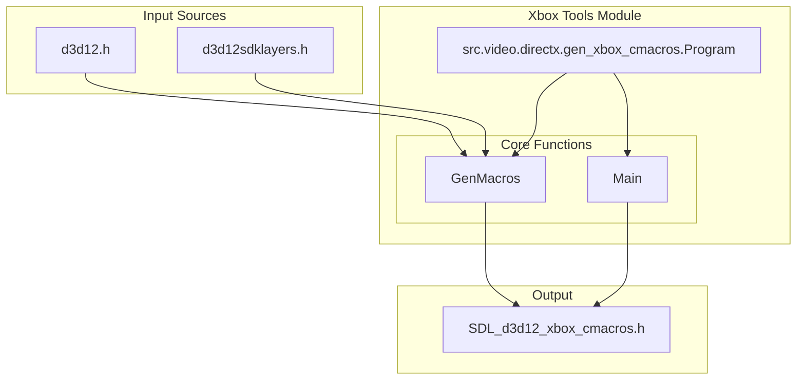
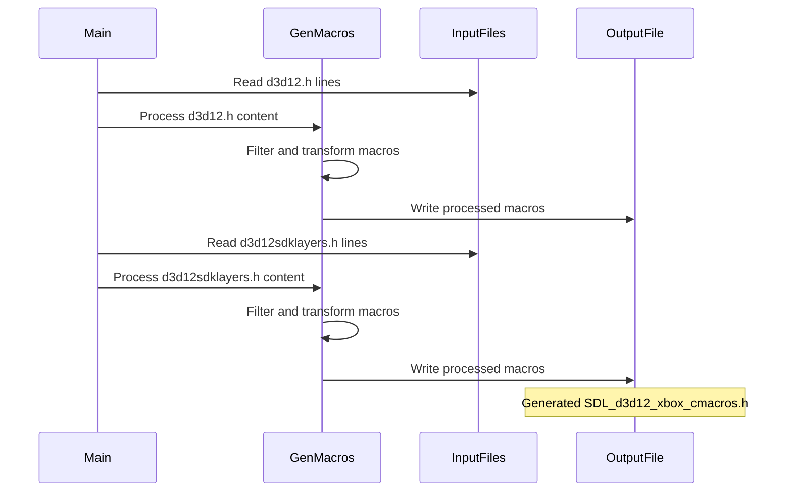
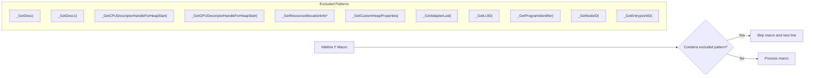
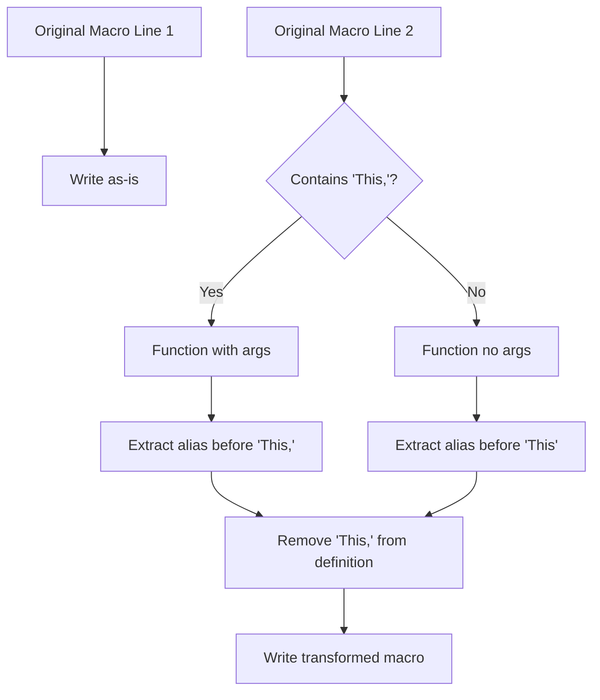
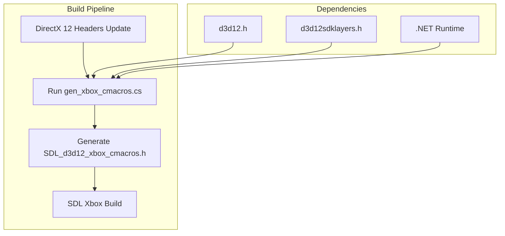

# Xbox Tools Module Documentation

## Introduction

The Xbox Tools Module is a specialized utility component within the SDL (Simple DirectMedia Layer) library that automates the generation of C macro definitions for Xbox DirectX 12 development. This module serves as a build-time code generation tool that processes DirectX 12 header files to create Xbox-specific macro definitions, streamlining the development process for Xbox platform targets.

## Module Overview

The Xbox Tools Module consists of a single core component that implements a C# console application designed to parse DirectX 12 header files and generate corresponding macro definitions optimized for Xbox development. This tool is essential for maintaining compatibility and proper abstraction layers when working with DirectX 12 APIs on Xbox platforms.

## Core Architecture

### Component Structure

### Data Flow Architecture

## Core Components

### Program Class

The `Program` class is the main entry point containing two primary methods that handle the macro generation process:

#### GenMacros Method
- **Purpose**: Processes input header files to extract and transform macro definitions
- **Input**: Array of strings representing header file lines
- **Output**: StreamWriter for writing processed macros
- **Key Functionality**:
  - Identifies macro definitions starting with "#define I"
  - Filters out problematic ABI calls that should use `D3D_CALL_RET` instead
  - Transforms method signatures by removing `This` parameters
  - Generates clean macro aliases for Xbox compatibility

#### Main Method
- **Purpose**: Orchestrates the macro generation process
- **Process**:
  1. Creates output file stream for `SDL_d3d12_xbox_cmacros.h`
  2. Writes autogeneration warning header
  3. Processes both `d3d12.h` and `d3d12sdklayers.h` files
  4. Generates combined macro definitions file

## Macro Processing Logic

### Filtering Criteria

The module applies intelligent filtering to exclude problematic DirectX 12 API calls:

### Transformation Process

## Integration with Build System

### Build Process Integration

### Usage Context

The generated `SDL_d3d12_xbox_cmacros.h` file is used by:
- [android_sdl_core_module](android_sdl_core_module.md) - For Xbox-specific SDL core functionality
- [gameinput_module](gameinput_module.md) - For Xbox GameInput integration
- DirectX 12 rendering backends in SDL

## Technical Specifications

### Input Requirements
- **File Format**: Standard C/C++ header files
- **Expected Files**: `d3d12.h`, `d3d12sdklayers.h`
- **Encoding**: ASCII/UTF-8 text files

### Output Specifications
- **File Name**: `SDL_d3d12_xbox_cmacros.h`
- **Format**: C header file with macro definitions
- **Content**: Filtered and transformed DirectX 12 macros
- **Warning**: Includes autogeneration notice

### Runtime Requirements
- **Platform**: Windows with .NET Framework/ Core
- **Permissions**: File system read/write access
- **Dependencies**: DirectX 12 SDK headers

## Maintenance and Updates

### Update Workflow

### Best Practices
1. **Regular Updates**: Run the tool whenever DirectX 12 headers are updated
2. **Version Control**: Track changes in generated files for regression detection
3. **Build Integration**: Automate execution in CI/CD pipelines
4. **Validation**: Test generated macros with Xbox development kits

## Error Handling

### Potential Issues
- **Missing Input Files**: Tool requires both `d3d12.h` and `d3d12sdklayers.h`
- **File Access Permissions**: Requires read access to input files and write access to output directory
- **Format Changes**: DirectX 12 header format modifications may require tool updates

### Mitigation Strategies
- **File Existence Checks**: Verify input files before processing
- **Permission Validation**: Ensure proper file system access
- **Format Versioning**: Track DirectX 12 SDK versions for compatibility

## Relationship to Other Modules

The Xbox Tools Module serves as a foundational component that enables Xbox-specific functionality across the SDL ecosystem:

- **Code Generation**: Provides essential macros for [android_sdl_core_module](android_sdl_core_module.md)
- **Platform Abstraction**: Supports Xbox-specific implementations in [gameinput_module](gameinput_module.md)
- **Build Automation**: Integrates with [build_scripts_module](build_scripts_module.md) for automated builds

## Conclusion

The Xbox Tools Module represents a critical build-time component in the SDL library's Xbox platform support. By automating the generation of Xbox-compatible macro definitions from DirectX 12 headers, it ensures consistent and maintainable Xbox development capabilities while reducing manual maintenance overhead and potential human error in macro definition management.