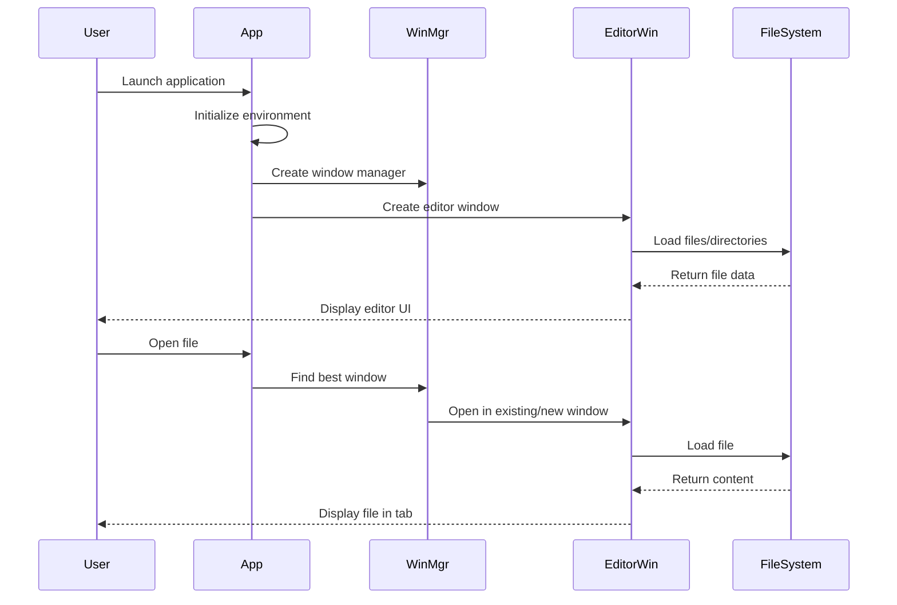

# Application Core Module

## Overview

The Application Core module serves as the foundational layer of the MarkText application, providing essential infrastructure for application lifecycle management, window orchestration, and cross-process communication. This module acts as the central nervous system that coordinates between the main process, renderer processes, and various application services.

## Architecture

```mermaid
graph TB
    subgraph "Application Core"
        App[App<br/>Application Controller]
        AppEnv[AppEnvironment<br/>Environment Manager]
        AppPaths[AppPaths<br/>Path Manager]
        WinMgr[WindowManager<br/>Window Orchestrator]
        BaseWin[BaseWindow<br/>Window Base Class]
        EditorWin[EditorWindow<br/>Editor Implementation]
    end
    
    subgraph "Main Process Services"
        CmdMgr[CommandManager]
        Pref[Preference]
        DataCtr[DataCenter]
        Menu[AppMenu]
    end
    
    subgraph "Electron"
        Electron[Electron Main Process]
        BrowserWin[BrowserWindow]
    end
    
    App --> AppEnv
    App --> WinMgr
    App --> CmdMgr
    App --> Menu
    
    AppEnv --> AppPaths
    
    WinMgr --> BaseWin
    BaseWin --> EditorWin
    WinMgr --> BrowserWin
    
    EditorWin --> Pref
    EditorWin --> DataCtr
    
    Electron -.-> App
```

## Core Components

### 1. Application Controller (`src.main.app.index.App`)

The central application controller that manages the entire application lifecycle, from initialization to shutdown. It handles:

- **Application Lifecycle**: Startup, ready state, and shutdown procedures
- **Window Management**: Creation and coordination of editor and settings windows
- **File Operations**: Opening files, directories, and handling file associations
- **IPC Communication**: Main-renderer process communication bridge
- **Theme Management**: Dynamic theme switching and native theme integration
- **Platform Integration**: OS-specific features like dock menus and jump lists

**Key Responsibilities:**
- Initialize application environment and preferences
- Handle command-line arguments and file associations
- Manage window creation and file opening strategies
- Coordinate screenshot functionality
- Handle application-wide keyboard shortcuts and spellchecking

### 2. Environment Management (`src.main.app.env.AppEnvironment`)

Manages the application environment configuration, including development mode settings, debug flags, and platform-specific configurations.

**Key Features:**
- Development vs production mode detection
- Debug and verbose logging configuration
- Safe mode operation support
- Spellchecker enable/disable control
- Unique environment identification for IPC messaging

### 3. Path Management (`src.main.app.paths.AppPaths`)

Provides centralized path management for all application directories and file locations, ensuring consistent path resolution across the application.

**Responsibilities:**
- User data directory management
- Log file path configuration
- Cross-platform path compatibility
- Directory structure initialization

### 4. Window Management (`src.main.app.windowManager.WindowManager`)

Orchestrates all application windows, managing their lifecycle, focus states, and inter-window communication. Acts as the central registry and coordinator for all window instances.

**Core Functions:**
- Window registration and lifecycle tracking
- Active window management and focus handling
- Window activity tracking for intelligent file opening
- File watcher coordination per window
- Force close operations and cleanup
- Cross-window event broadcasting

For detailed documentation, see [Window Management](Window%20Management.md).

### 5. Window Base Class (`src.main.windows.base.BaseWindow`)

Abstract base class that provides common functionality for all application windows, ensuring consistent behavior and interface across different window types.

**Base Features:**
- Window lifecycle state management
- URL building with environment parameters
- Theme-based background color configuration
- Common window operations (focus, reload, destroy)
- Event emission for window state changes

For detailed documentation, see [Window Management](Window%20Management.md).

### 6. Editor Window (`src.main.windows.editor.EditorWindow`)

Specialized window implementation for the markdown editor, extending the base window with editor-specific functionality.

**Editor-Specific Features:**
- Markdown file loading and tab management
- Directory tree integration
- File watcher integration for real-time updates
- Spellchecker integration
- Editor context menu handling
- Window state persistence
- Multi-tab document management
- Untitled document creation

For detailed documentation, see [Editor Window](Editor%20Window.md).

## Data Flow



## Integration Points

### With Main Process Services
- **CommandManager**: Handles application-wide command execution
- **Preference**: Manages user preferences and settings
- **DataCenter**: Provides persistent data storage
- **AppMenu**: Manages application menus and recent documents

### With Muya Editor
- Provides the container window for the Muya editor instance
- Handles file loading/unloading coordination
- Manages editor state persistence
- Coordinates real-time file watching

### With Renderer Process
- Establishes IPC communication channels
- Handles renderer-to-main requests
- Broadcasts application-wide events
- Manages window-specific data exchange

## Configuration

The Application Core module is configured through:

1. **Command Line Arguments**: Debug flags, user data paths, safe mode
2. **Preferences**: Theme settings, window behavior, file handling
3. **Environment Variables**: Development mode, debug verbosity
4. **Platform Defaults**: OS-specific configurations and integrations

## Error Handling

The module implements comprehensive error handling:

- **Window Creation Failures**: Graceful fallback and user notification
- **File Loading Errors**: Detailed error reporting and recovery
- **IPC Communication Errors**: Timeout handling and retry mechanisms
- **Renderer Process Crashes**: Automatic recovery and user prompts
- **File System Errors**: Watcher failures and permission issues

## Performance Considerations

- **Window Pooling**: Efficient window reuse and lifecycle management
- **File Watching**: Selective watching with stability thresholds
- **IPC Optimization**: Batched messages and event debouncing
- **Memory Management**: Proper cleanup of window resources and event listeners

## Security Features

- **Web Content Security**: Prevention of navigation and webview loading
- **File System Access**: Controlled file access through normalized paths
- **IPC Security**: Validated message passing between processes
- **External Link Handling**: Safe external link opening through system browser

---

## Related Documentation

- [Main Process Services](Main%20Process%20Services.md) - Command management, preferences, and data persistence
- [Muya Editor Core](Muya%20Editor%20Core.md) - Markdown editor engine and content management
- [Renderer-Side Features](Renderer-Side%20Features.md) - Renderer process functionality and UI features