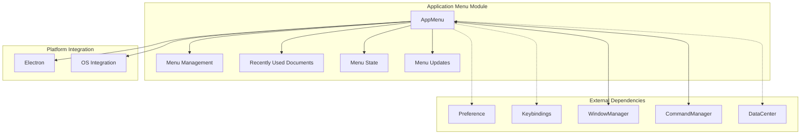
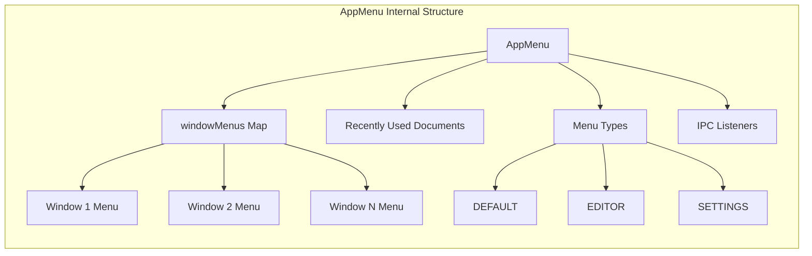
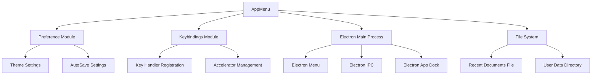
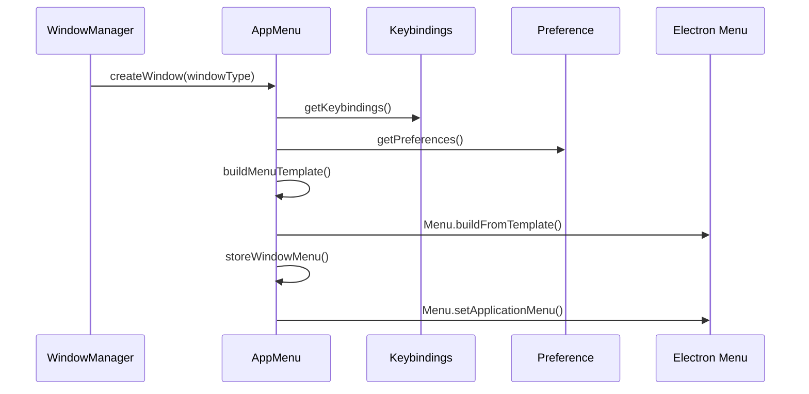
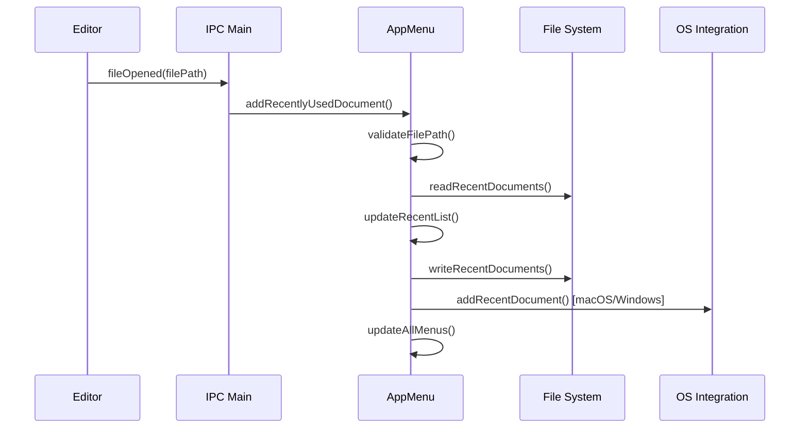
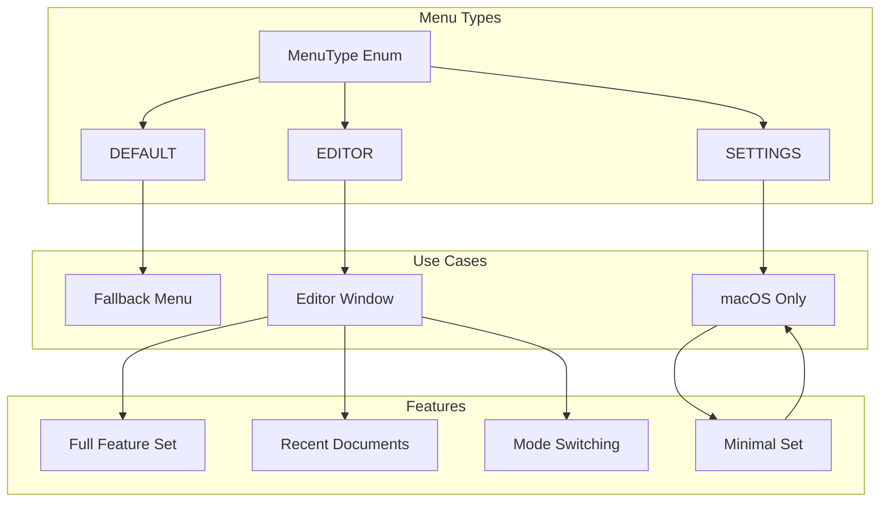
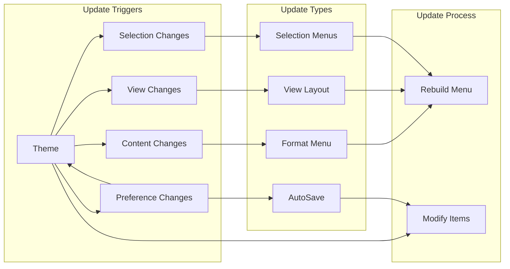
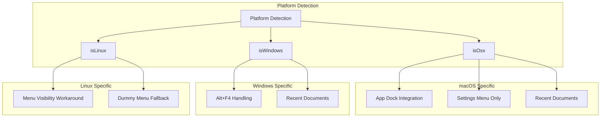
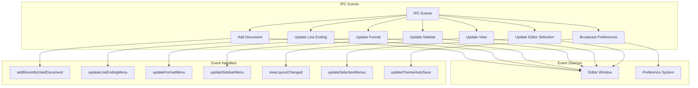
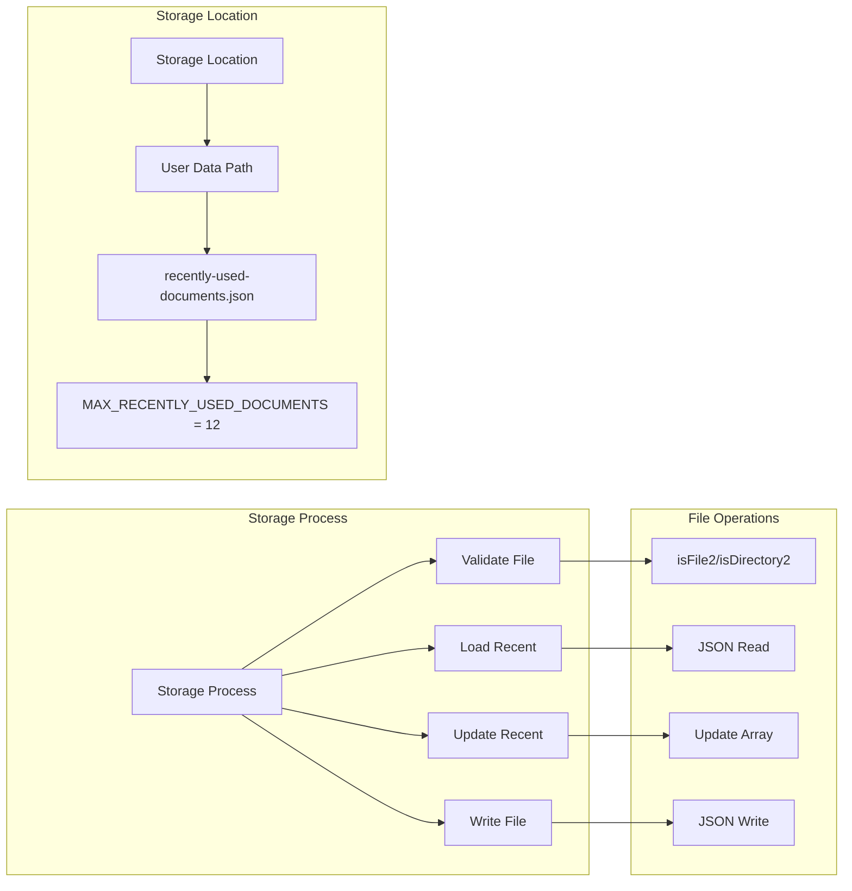

# Application Menu Module

## Introduction

The Application Menu module is a core component of the main process services layer, responsible for managing the application's menu system across all windows. It provides dynamic menu creation, window-specific menu management, and real-time menu updates based on application state changes. The module handles recently used documents, menu state synchronization, and cross-platform menu behavior differences.

## Architecture Overview

The Application Menu module serves as the central hub for menu management in the Electron application, integrating with multiple system components to provide a cohesive user interface experience.

## Core Components

### AppMenu Class

The `AppMenu` class is the primary component that orchestrates all menu-related functionality. It manages window-specific menus, handles recently used documents, and coordinates menu updates across the application.

**Key Responsibilities:**
- Window-specific menu creation and management
- Recently used documents tracking and storage
- Dynamic menu updates based on application state
- Cross-platform menu behavior handling
- Menu state synchronization across windows

**Constructor Parameters:**
- `preferences`: Preference instance for accessing user settings
- `keybindings`: Keybindings instance for keyboard shortcut management
- `userDataPath`: Path to user data directory for storing recent documents

## Component Relationships

### Internal Architecture

### External Dependencies

## Data Flow

### Menu Creation Flow

### Recently Used Documents Flow

## Menu Types and Templates

### Menu Type Classification

The module supports three distinct menu types, each serving specific application contexts:

### Dynamic Menu Updates

The module implements real-time menu updates based on application state changes:

## Cross-Platform Considerations

### Platform-Specific Behavior

## IPC Communication

### IPC Event Handling

The module listens for various IPC events to maintain menu state synchronization:

## Integration with Other Modules

### Window Management Integration

The Application Menu module works closely with the [Window Management](Window%20Management.md) module to provide window-specific menu instances:

- **Window Creation**: Creates appropriate menu when new windows are opened
- **Window Focus**: Switches application menu when window focus changes
- **Window Closure**: Removes menu references when windows are closed

### Command Management Integration

Menu items are linked to the [Command Management](Command%20Management.md) system:

- **Command Binding**: Menu items trigger registered commands
- **State Synchronization**: Menu state reflects command availability
- **Keyboard Shortcuts**: Menu accelerators managed by keybindings system

### Preference System Integration

The module integrates with the [User Preferences](User%20Preferences.md) system for:

- **Theme Management**: Updates theme menu items based on current theme
- **AutoSave Settings**: Reflects autosave state in menu
- **User Customization**: Adapts menu structure based on preferences

## File System Operations

### Recently Used Documents Storage

## Error Handling

### Error Scenarios

The module implements robust error handling for various scenarios:

- **File System Errors**: Handles corrupted recent documents files
- **Missing Windows**: Gracefully handles requests for non-existent window menus
- **Menu Rebuild Failures**: Maintains menu consistency during updates
- **Platform Differences**: Adapts behavior based on platform capabilities

## Performance Considerations

### Optimization Strategies

- **Menu Caching**: Maintains window-specific menu instances to avoid recreation
- **Selective Updates**: Only updates affected menu items when possible
- **Lazy Loading**: Defers menu creation until window initialization
- **Batch Operations**: Groups menu updates to minimize UI flicker

## Security Considerations

### File Path Validation

- **Path Validation**: Validates file paths before adding to recent documents
- **File System Checks**: Verifies file existence before menu updates
- **User Data Protection**: Stores recent documents in user data directory

## Testing Considerations

### Test Scenarios

- **Menu Creation**: Verify correct menu type for different window types
- **Recent Documents**: Test addition, removal, and clearing of recent items
- **State Updates**: Validate menu state changes based on application events
- **Platform Behavior**: Ensure correct behavior across different platforms
- **IPC Communication**: Test all IPC event handlers and responses

## Future Enhancements

### Potential Improvements

- **Menu Customization**: Allow users to customize menu structure
- **Plugin Integration**: Support for menu items added by plugins
- **Accessibility**: Enhanced accessibility features for menu navigation
- **Performance**: Further optimization of menu rebuild operations
- **Internationalization**: Support for localized menu labels and shortcuts