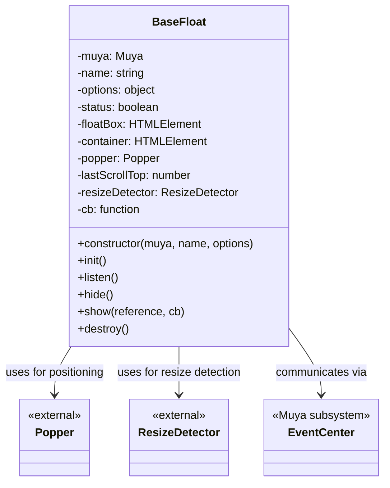
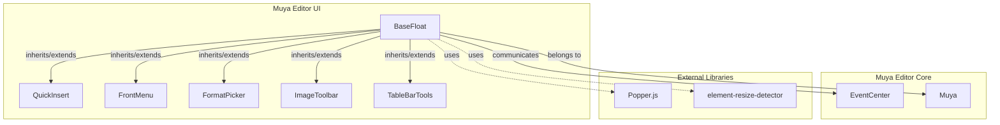
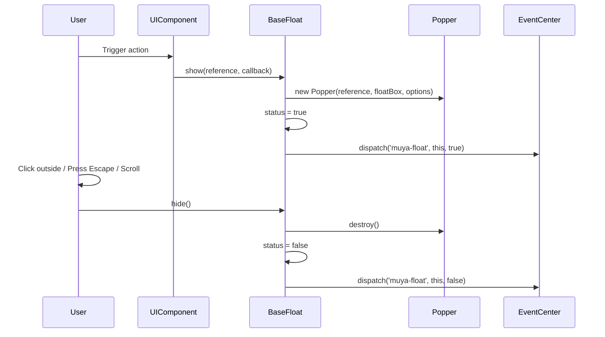

# BaseFloat Module Documentation

## Introduction

The BaseFloat module is a foundational UI component within the Muya Editor UI subsystem that provides floating/popup interface capabilities. It serves as the base class for various floating UI elements in the editor, such as toolbars, menus, and pickers. The module implements a robust positioning system using Popper.js to ensure floating elements are properly positioned relative to their reference elements while handling edge cases like viewport boundaries and scroll events.

## Module Overview

**Module Path**: `src.muya.lib.ui.baseFloat.index`  
**Primary Component**: `BaseFloat`  
**Module Type**: UI Foundation Component  
**Dependencies**: Popper.js, element-resize-detector  

The BaseFloat module is part of the Muya Editor UI layer and provides the core floating functionality that other UI components inherit from or utilize. It handles the complex positioning logic, event management, and lifecycle of floating UI elements.

## Architecture

### Component Structure



### System Integration



## Core Functionality

### 1. Floating Element Management

The BaseFloat module creates and manages floating DOM elements that can be positioned relative to other elements in the editor. Key features include:

- **Dynamic DOM Creation**: Creates wrapper and container elements programmatically
- **Arrow Support**: Optional arrow elements for visual connection to reference elements
- **CSS Class Management**: Applies consistent styling classes for theming and positioning

### 2. Positioning System

BaseFloat integrates with Popper.js to provide sophisticated positioning capabilities:

- **Smart Placement**: Automatically adjusts position based on viewport constraints
- **Offset Control**: Configurable offset from reference element
- **Boundary Detection**: Prevents floating elements from going outside viewport
- **Real-time Updates**: Continuously updates position during scroll and resize events

### 3. Event Handling

Comprehensive event management system:

- **Click Outside Detection**: Automatically hides when user clicks outside the floating element
- **Escape Key Handling**: Hides floating element on Escape key press
- **Scroll Detection**: Hides when significant scroll occurs (>50px)
- **Event Propagation**: Prevents unwanted event bubbling within floating elements

### 4. Resize Detection

Monitors content size changes and adjusts accordingly:

- **Container Resize Monitoring**: Uses element-resize-detector for cross-browser compatibility
- **Automatic Dimension Updates**: Adjusts wrapper dimensions when content changes
- **Popper Synchronization**: Triggers Popper updates on resize events

## Data Flow

### Show/Hide Lifecycle



### Event Flow

The event flow in BaseFloat follows this pattern:

1. **User Actions** trigger hide behavior:
   - Clicking outside the floating element
   - Pressing the Escape key
   - Scrolling more than 50 pixels

2. **BaseFloat.hide()** is called, which:
   - Destroys the Popper instance
   - Dispatches event through EventCenter

3. **Float Box interactions**:
   - Clicks inside the float box are contained (stop propagation)

```
User Action → Event Handler → BaseFloat.hide() → Cleanup & Dispatch
```

## Configuration Options

### Default Options

```javascript
{
  placement: 'bottom-start',    // Popper.js placement strategy
  modifiers: {
    offset: {
      offset: '0, 12'           // Horizontal, vertical offset
    }
  },
  showArrow: true               // Whether to show arrow element
}
```

### Customizable Options

- **placement**: Any valid Popper.js placement (`top`, `bottom`, `left`, `right`, `auto`, etc.)
- **modifiers**: Popper.js modifiers for fine-tuned positioning
- **showArrow**: Boolean to enable/disable arrow visualization
- **offset**: String format `'horizontal, vertical'` for precise positioning

## Usage Patterns

### 1. As Base Class

Other floating UI components extend BaseFloat to inherit its functionality:

```javascript
// Example pattern used by QuickInsert, FrontMenu, etc.
class QuickInsert extends BaseFloat {
  constructor(muya, options) {
    super(muya, 'quick-insert', options)
    // Component-specific initialization
  }
  
  // Override or extend BaseFloat methods
  show(reference, items) {
    // Custom logic
    super.show(reference, callback)
  }
}
```

### 2. Event Integration

Components listen to BaseFloat events for coordination:

```javascript
// Event pattern used throughout Muya
eventCenter.listen('muya-float', (floatComponent, isShow) => {
  if (isShow) {
    // Handle float show - maybe hide other floats
  } else {
    // Handle float hide - cleanup state
  }
})
```

## Integration with Muya System

### EventCenter Communication

BaseFloat communicates with the broader Muya system through the EventCenter:

- **Dispatch Pattern**: `eventCenter.dispatch('muya-float', this, boolean)`
- **State Notification**: Notifies system when floating elements show/hide
- **Coordination**: Enables other components to respond to float state changes

### Muya Instance Integration

Each BaseFloat instance is associated with a Muya editor instance:

- **Event Access**: Uses `this.muya.eventCenter` for event management
- **Container Reference**: Uses `this.muya.container` for scroll/keydown events
- **Lifecycle Management**: Tied to Muya instance lifecycle

## Error Handling and Edge Cases

### 1. Popper.js Failures

- **Null Checks**: Verifies Popper instance exists before operations
- **Destroy Safety**: Checks for `destroy` method before calling
- **Fallback Behavior**: Graceful degradation if positioning fails

### 2. DOM Cleanup

- **Element Removal**: Ensures DOM elements are properly removed on destroy
- **Event Cleanup**: Detaches all event listeners to prevent memory leaks
- **Resize Detector**: Properly uninstalls resize detection on cleanup

### 3. State Management

- **Status Tracking**: Maintains `this.status` to prevent duplicate operations
- **Early Returns**: Returns early if operations requested in wrong state
- **Callback Management**: Resets callbacks to `noop` to prevent stale references

## Performance Considerations

### 1. Resize Detection

- **Efficient Strategy**: Uses 'scroll' strategy for resize detection
- **Debounced Updates**: Updates are tied to actual resize events
- **Popper Optimization**: Only updates Popper when necessary

### 2. Event Efficiency

- **Selective Handling**: Only hides on significant scroll (>50px threshold)
- **Event Delegation**: Uses document-level click handling for efficiency
- **Propagation Control**: Prevents unnecessary event bubbling

### 3. Memory Management

- **Proper Cleanup**: Destroys Popper instances and removes DOM elements
- **Event Detachment**: Removes all event listeners on destroy
- **Reference Clearing**: Clears object references to aid garbage collection

## Dependencies

### External Dependencies

- **[Popper.js](https://popper.js.org/)**: Positioning engine for floating elements
- **[element-resize-detector](https://github.com/wnr/element-resize-detector)**: Cross-browser resize detection

### Internal Dependencies

- **Muya EventCenter**: For event management and system communication
- **Utility Functions**: Uses `noop` from utils and `EVENT_KEYS` from config

## Related Modules

- **[QuickInsert](QuickInsert.md)**: Extends BaseFloat for quick insert functionality
- **[FrontMenu](FrontMenu.md)**: Extends BaseFloat for front matter menu
- **[FormatPicker](FormatPicker.md)**: Extends BaseFloat for format selection
- **[ImageToolbar](ImageToolbar.md)**: Extends BaseFloat for image editing tools
- **[TableBarTools](TableBarTools.md)**: Extends BaseFloat for table manipulation
- **[EventCenter](EventCenter.md)**: Event management system that BaseFloat integrates with

## Future Considerations

### Potential Enhancements

1. **Animation Support**: Could add CSS transition support for show/hide animations
2. **Accessibility**: Could implement ARIA attributes for screen reader support
3. **Touch Support**: Could add touch-specific event handling for mobile devices
4. **Performance Monitoring**: Could add metrics for positioning calculation performance

### Migration Notes

The code includes commented-out ResizeObserver implementation, suggesting future migration:

```javascript
// Future migration to native ResizeObserver
// const ro = new ResizeObserver(entries => { ... })
// ro.observe(container)
```

This indicates planned modernization to use native browser APIs when browser support allows.