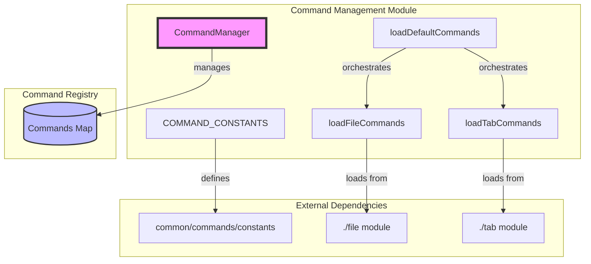
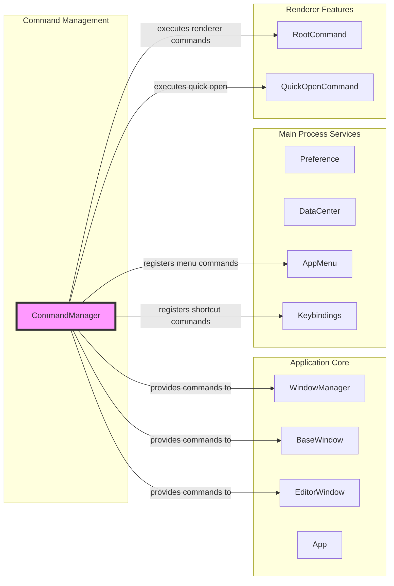
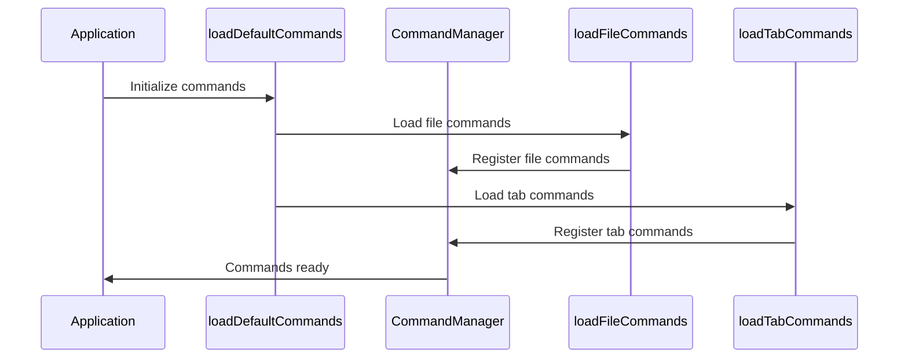
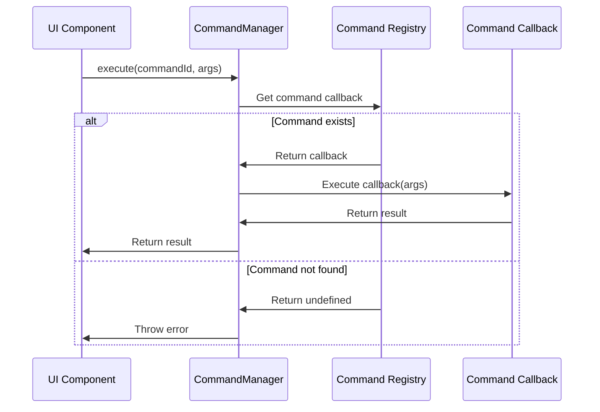

# Command Management Module

## Introduction

The Command Management module serves as the central command registry and execution system for the application. It provides a unified interface for registering, managing, and executing commands throughout the application, acting as the primary mechanism for handling user actions, menu items, keyboard shortcuts, and programmatic operations.

## Overview

The Command Management module implements a command pattern architecture that decouples command invocation from command execution. This design enables flexible command registration, easy command discovery, and consistent command execution across different UI elements and user interactions.

## Architecture

### Core Architecture



### Module Dependencies



## Core Components

### CommandManager Class

The `CommandManager` class is the central component that manages all application commands. It provides a singleton instance that maintains a registry of command identifiers and their associated callback functions.

#### Key Properties

- `_commands`: A `Map` object that stores command IDs as keys and callback functions as values

#### Core Methods

| Method | Parameters | Description |
|--------|------------|-------------|
| `add` | `id: string, callback: function` | Registers a new command with the specified ID and callback |
| `remove` | `id: string` | Removes a command from the registry |
| `has` | `id: string` | Checks if a command with the given ID exists |
| `execute` | `id: string, ...args` | Executes the command with the specified ID and arguments |
| `__verifyDefaultCommands` | None | Validates that all default commands are registered (debugging) |

### Command Constants

The module exports `COMMAND_CONSTANTS` which provides a centralized definition of all available command identifiers. This ensures type safety and prevents command ID conflicts across the application.

### Command Loading Functions

- `loadFileCommands`: Loads file-related commands (open, save, close, etc.)
- `loadTabCommands`: Loads tab-related commands (new tab, close tab, switch tab, etc.)
- `loadDefaultCommands`: Orchestrates the loading of all default command categories

## Data Flow

### Command Registration Flow



### Command Execution Flow



## Integration Points

### Window Management Integration

The Command Management module integrates with the [Window Management](Window%20Management.md) module to provide window-specific commands such as:
- Window minimize/maximize/close
- Window focus management
- Multi-window command routing

### Menu System Integration

Commands are registered with the [Application Menu](Application%20Menu.md) system to enable menu item functionality. Each menu item is associated with a command ID that gets executed when the menu item is clicked.

### Keyboard Shortcuts Integration

The [Keyboard Shortcuts](Keyboard%20Shortcuts.md) module maps keyboard combinations to command IDs. When a keyboard shortcut is triggered, the corresponding command is executed through the CommandManager.

### Editor Integration

Commands specific to the [Editor Window](Editor%20Window.md) are registered to handle:
- Text editing operations
- Formatting commands
- Navigation commands
- Selection commands

## Usage Patterns

### Basic Command Registration

```javascript
// Register a simple command
commandManager.add('app:about', () => {
  // Show about dialog
})

// Register a command with parameters
commandManager.add('file:open', (filePath) => {
  // Open file at filePath
})
```

### Command Execution

```javascript
// Execute a command
try {
  const result = commandManager.execute('file:save', filePath, content)
} catch (error) {
  console.error('Command execution failed:', error.message)
}
```

### Command Validation

```javascript
// Check if command exists before execution
if (commandManager.has('edit:undo')) {
  commandManager.execute('edit:undo')
}
```

## Error Handling

The Command Management module implements several error handling mechanisms:

1. **Duplicate Command Detection**: Throws an error when attempting to register a command with an existing ID
2. **Missing Command Detection**: Throws an error when attempting to execute a non-existent command
3. **Debug Validation**: Provides `__verifyDefaultCommands` method for development debugging

## Best Practices

### Command Naming Conventions

- Use namespaced command IDs (e.g., `file:open`, `edit:undo`, `view:zoom-in`)
- Keep command IDs consistent with menu item labels and keyboard shortcut descriptions
- Use lowercase with hyphens for multi-word commands

### Command Implementation

- Keep command callbacks focused and single-purpose
- Handle errors gracefully within command callbacks
- Return meaningful values from commands when appropriate
- Avoid side effects that could affect other commands

### Performance Considerations

- Commands are stored in a Map for O(1) lookup performance
- Command execution is synchronous - avoid long-running operations
- Consider debouncing or throttling for frequently executed commands

## Testing

The Command Management module can be tested by:

1. **Unit Testing**: Test individual command registration and execution
2. **Integration Testing**: Test command integration with UI components
3. **End-to-End Testing**: Test complete user workflows involving multiple commands

## Future Enhancements

Potential improvements to the Command Management module include:

1. **Async Command Support**: Support for asynchronous command execution
2. **Command Chaining**: Ability to chain multiple commands together
3. **Command History**: Track and provide undo/redo functionality for commands
4. **Command Metadata**: Add descriptions, categories, and other metadata to commands
5. **Dynamic Command Loading**: Load commands on-demand based on application state

## Related Documentation

- [Application Core](Application%20Core.md) - Core application components that use commands
- [Window Management](Window%20Management.md) - Window-specific command integration
- [Editor Window](Editor%20Window.md) - Editor-specific commands and functionality
- [Application Menu](Application%20Menu.md) - Menu system that triggers commands
- [Keyboard Shortcuts](Keyboard%20Shortcuts.md) - Keyboard shortcut to command mapping
- [User Preferences](User%20Preferences.md) - Preference-related commands
- [Data Management](Data%20Management.md) - Data manipulation commands