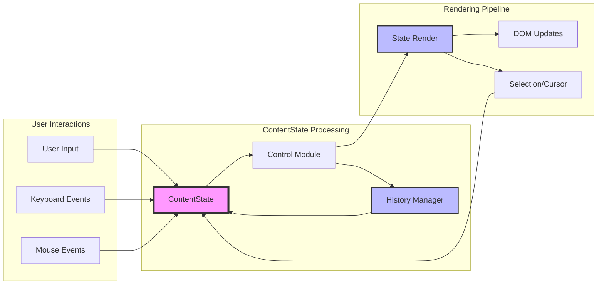
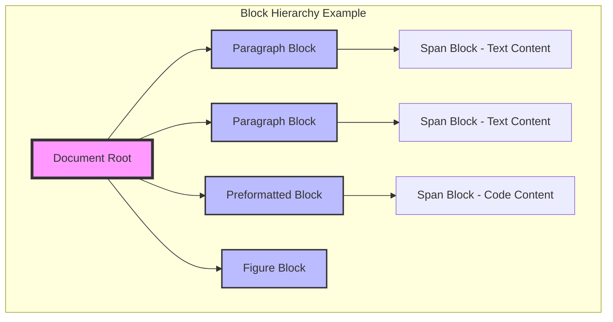
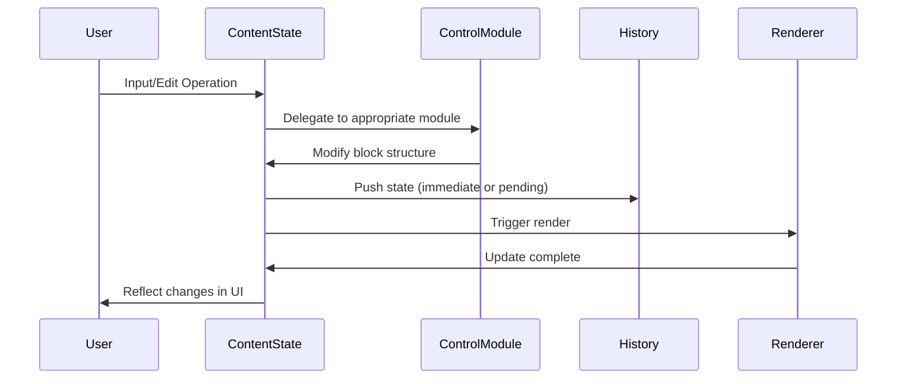
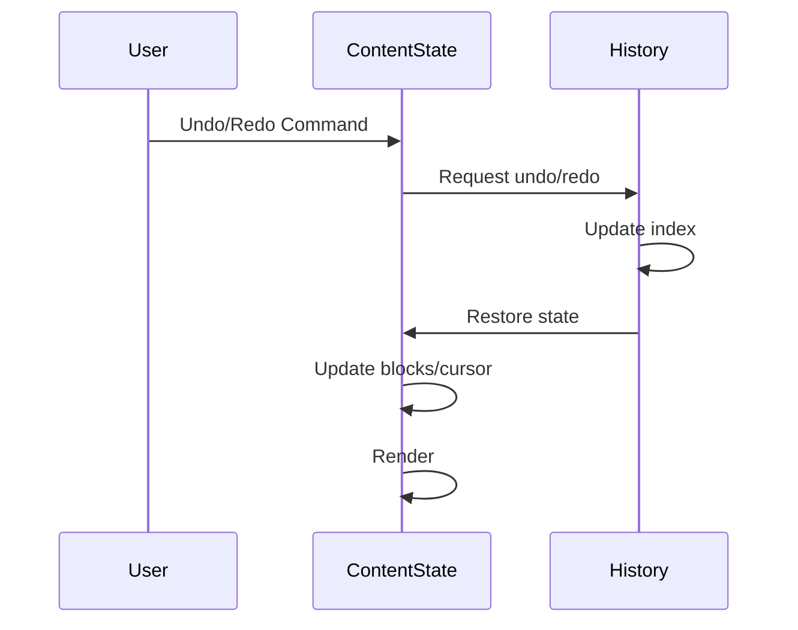

# ContentState Module Documentation

## Introduction

The ContentState module is the core state management system for the Muya editor, responsible for managing the document's content structure, cursor position, history tracking, and rendering coordination. It serves as the central hub that orchestrates all content-related operations within the editor, from basic text manipulation to complex table operations and formatting controls.

## Architecture Overview

The ContentState module follows a modular architecture pattern where functionality is organized into specialized control modules that are dynamically mixed into the main ContentState class. This design allows for clean separation of concerns while maintaining a unified interface for content manipulation.

```mermaid
graph TB
    subgraph "ContentState Core"
        CS[ContentState Class]
        H[History Manager]
        SR[State Renderer]
    end
    
    subgraph "Control Modules"
        Core[Core API]
        MarkText[MarkText API]
        Tab[Tab Control]
        Enter[Enter Control]
        Update[Update Control]
        Backspace[Backspace Control]
        Delete[Delete Control]
        Code[Code Block Control]
        Arrow[Arrow Control]
        Paste[Paste Control]
        CopyCut[Copy/Cut Control]
        Table[Table Block Control]
        TableDrag[Table Drag Bar Control]
        TableSelect[Table Select Cells Control]
        Paragraph[Paragraph Control]
        Format[Format Control]
        Search[Search Control]
        Container[Container Control]
        HTML[HTML Block Control]
        Click[Click Control]
        Input[Input Control]
        TOC[TOC Control]
        Emoji[Emoji Control]
        Image[Image Control]
        Link[Link Control]
        DragDrop[Drag Drop Control]
        Footnote[Footnote Control]
        Import[Import Markdown]
    end
    
    CS --> H
    CS --> SR
    CS -.-> Core
    CS -.-> MarkText
    CS -.-> Tab
    CS -.-> Enter
    CS -.-> Update
    CS -.-> Backspace
    CS -.-> Delete
    CS -.-> Code
    CS -.-> Arrow
    CS -.-> Paste
    CS -.-> CopyCut
    CS -.-> Table
    CS -.-> TableDrag
    CS -.-> TableSelect
    CS -.-> Paragraph
    CS -.-> Format
    CS -.-> Search
    CS -.-> Container
    CS -.-> HTML
    CS -.-> Click
    CS -.-> Input
    CS -.-> TOC
    CS -.-> Emoji
    CS -.-> Image
    CS -.-> Link
    CS -.-> DragDrop
    CS -.-> Footnote
    CS -.-> Import
    
    style CS fill:#f9f,stroke:#333,stroke-width:4px
    style H fill:#bbf,stroke:#333,stroke-width:2px
    style SR fill:#bbf,stroke:#333,stroke-width:2px
```

## Core Components

### ContentState Class

The main ContentState class serves as the central state manager for the Muya editor. It maintains the document structure as a tree of blocks, manages cursor position, handles rendering coordination, and provides the interface for all content operations.

**Key Responsibilities:**
- Block tree management and manipulation
- Cursor position tracking and management
- History tracking for undo/redo functionality
- Rendering coordination and optimization
- Search and replace operations
- Table cell and image selection management

**Core Properties:**
- `blocks`: Array of root-level blocks representing the document structure
- `cursor`: Current cursor position with start and end points
- `history`: History manager for undo/redo operations
- `stateRender`: Rendering engine for converting blocks to DOM
- `searchMatches`: Search results and active match tracking
- `selectedBlock`: Currently selected block for front icon interactions

### History Manager

The History class implements a sophisticated undo/redo system with pending state management. It captures the complete document state including blocks, cursor position, and render range to ensure accurate restoration of previous states.

**Key Features:**
- Stack-based history with configurable depth limit
- Pending state management for delayed commits
- Complete state capture including cursor and render information
- Automatic cleanup of old history entries

## Data Flow Architecture

## Block Structure and Hierarchy

The ContentState module uses a hierarchical block-based structure to represent document content. Each block contains metadata about its type, relationships, and content.

**Block Types:**
- **Container Blocks**: `p`, `pre`, `figure`, `table`, etc.
- **Content Blocks**: `span` blocks with various function types
- **Special Blocks**: `input`, `div` for specific UI elements

**Block Relationships:**
- **Parent-Child**: Hierarchical containment
- **Sibling**: Previous and next relationships
- **Anchor**: Special relationships for positioning

## Rendering System

The ContentState module implements an optimized rendering system that supports full, partial, and single block rendering modes to minimize DOM updates and improve performance.

**Rendering Modes:**
- **Full Render**: Complete document re-render
- **Partial Render**: Render specific range of blocks
- **Single Render**: Update individual block

**Render Optimization:**
- Token caching to avoid redundant parsing
- Range-based rendering to limit DOM updates
- Label collection for cross-reference resolution
- Search match highlighting integration

## Dependencies and Integration

The ContentState module integrates with several other system components:

### Internal Dependencies
- **[Selection Module](Selection.md)**: Cursor position management and coordinate calculation
- **[StateRender Module](StateRender.md)**: Block-to-DOM conversion and rendering
- **[EventCenter Module](EventCenter.md)**: Event handling and coordination

### External Dependencies
- **[Muya Core](Muya.md)**: Main editor instance and configuration
- **[Configuration](Config.md)**: Default settings and constants
- **[Utils](Utils.md)**: Utility functions for deep copy and ID generation

## Process Flows

### Content Modification Flow

### History Management Flow

## Key Features

### Advanced Block Management
- Hierarchical block structure with parent-child relationships
- Dynamic block creation and manipulation
- Block copying with ID regeneration
- Complex block removal with exemption handling

### Cursor and Selection Management
- Multi-cursor support with start/end positions
- Cursor coordinate calculation for UI positioning
- Selection range tracking across blocks
- History-aware cursor management

### Search and Replace
- Global search with match highlighting
- Active match tracking and navigation
- Integration with rendering system for visual feedback
- Search result caching and indexing

### Table Operations
- Cell selection and manipulation
- Drag-and-drop support for table bars
- Multi-cell selection with visual indicators
- Table-specific rendering optimizations

### History and Undo System
- Configurable undo depth with automatic cleanup
- Pending state management for typing operations
- Complete state capture including cursor position
- Smart history pushing based on cursor movement

## API Integration

The ContentState module exposes a comprehensive API through its mixed-in control modules:

**Core Operations**: Block creation, manipulation, and traversal
**Text Operations**: Input handling, formatting, and text manipulation  
**Navigation**: Arrow key handling and cursor movement
**Editing**: Cut, copy, paste, and delete operations
**Advanced Features**: Table operations, code block management, search functionality

## Performance Considerations

The ContentState module implements several performance optimizations:

- **Selective Rendering**: Partial and single block rendering to minimize DOM updates
- **Token Caching**: Cached parsing results to avoid redundant processing
- **History Optimization**: Pending state management to reduce history entries
- **Range-based Operations**: Limited scope operations for better performance

## Error Handling and Edge Cases

The module includes robust error handling for various edge cases:

- Block removal with exemption protection for special content
- History management with bounds checking
- Cursor position validation and correction
- Render range validation for removed blocks
- Table cell selection cleanup on state changes

This comprehensive approach ensures stable operation even in complex editing scenarios and maintains data integrity across all operations.