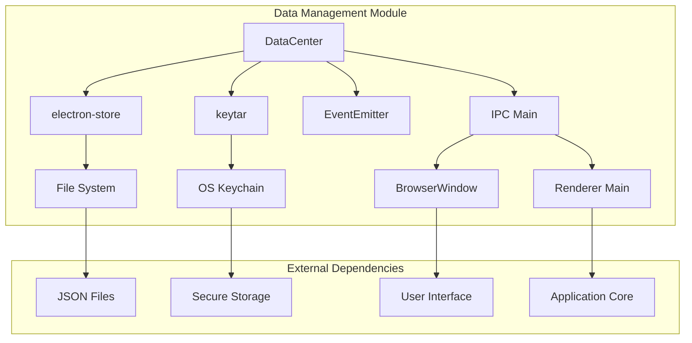
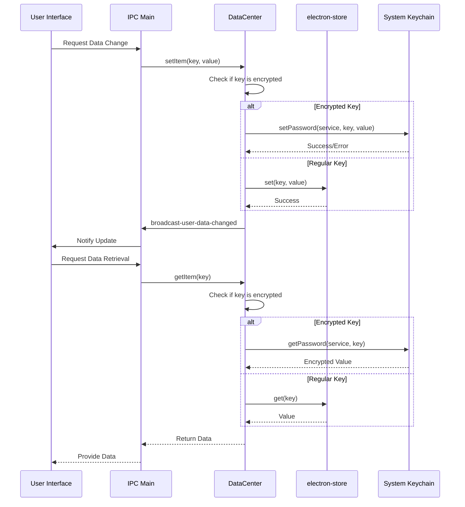

# Data Management Module

## Introduction

The Data Management module serves as the central data persistence and configuration management system for the MarkText application. It provides secure storage for user preferences, image management settings, and sensitive authentication data. The module acts as a bridge between the application's core functionality and persistent storage, ensuring data integrity while maintaining security for sensitive information.

## Architecture Overview

The Data Management module is built around the `DataCenter` class, which extends Node.js EventEmitter to provide reactive data management capabilities. The architecture follows a centralized pattern where all data operations flow through a single point of control.



## Core Components

### DataCenter Class

The `DataCenter` class is the primary component responsible for:

- **Data Persistence**: Manages application settings and user preferences using electron-store
- **Secure Storage**: Handles sensitive data (like GitHub tokens) using the system keychain via keytar
- **Event Coordination**: Broadcasts data changes to interested components via IPC
- **Image Management**: Coordinates image folder paths and web/cloud image tracking

#### Key Properties

- `dataCenterPath`: Path to the data center storage location
- `userDataPath`: Path to user-specific application data
- `store`: electron-store instance for structured data persistence
- `encryptKeys`: Array of keys that require secure storage (e.g., 'githubToken')
- `serviceName`: Identifier for keychain service ('marktext')

#### Data Schema

The module manages several categories of data:

1. **Image Management**
   - `imageFolderPath`: Local directory for image storage
   - `screenshotFolderPath`: Directory for screenshot captures
   - `webImages`: Array of web-hosted images with timestamps
   - `cloudImages`: Array of cloud-hosted images with timestamps
   - `currentUploader`: Active image uploader service

2. **Image Hosting Configuration**
   - `imageBed.github`: GitHub repository settings for image hosting
     - `owner`: Repository owner
     - `repo`: Repository name
     - `branch`: Target branch

3. **Secure Data**
   - `githubToken`: Encrypted GitHub authentication token

## Data Flow Architecture



## Component Interactions

### IPC Communication

The DataCenter establishes several IPC channels for communication with renderer processes:

- `mt::ask-for-user-data`: Requests all user data (preferences + secure data)
- `mt::set-user-data`: Updates multiple settings at once
- `mt::ask-for-modify-image-folder-path`: Opens directory dialog for image folder selection
- `mt::ask-for-image-path`: Opens file dialog for image selection
- `set-image-folder-path`: Direct path update for image folder

### Event Broadcasting

The module broadcasts events to notify other components of data changes:

- `broadcast-user-data-changed`: General data update notification
- `broadcast-web-image-added`: New web image added
- `broadcast-web-image-removed`: Web image removed

## Security Implementation

### Secure Data Handling

Sensitive data like authentication tokens are handled through the system keychain:

1. **Storage**: Encrypted values are stored in the OS-specific keychain
2. **Retrieval**: Values are decrypted on-demand when requested
3. **Error Handling**: Keychain errors are logged but don't crash the application

### Data Validation

The module uses electron-store's schema validation to ensure data integrity:

- Structured data storage with predefined schemas
- Type checking for all stored values
- Default value fallbacks for missing data

## File System Integration

### Directory Management

The module ensures required directories exist:

- **Image Folder**: Created if not exists when `screenshotFolderPath` is set
- **User Data**: Leverages electron's userData path for platform compatibility
- **Data Center**: Centralized location for application data files

### Image File Handling

Integration with the file system for image operations:

- **File Selection**: Native dialog for image file selection
- **Directory Selection**: Native dialog for folder selection
- **Extension Filtering**: Restricts file selection to valid image formats

## Dependencies

### Internal Dependencies

- [Application Core](Application%20Core.md): Provides paths and environment context
- [File System Watcher](File%20System%20Watcher.md): Monitors file system changes
- [Command Management](Command%20Management.md): Executes data-related commands

### External Dependencies

- **electron-store**: Structured data persistence
- **keytar**: Secure credential storage
- **electron-log**: Logging functionality
- **electron**: IPC communication and dialog APIs
- **common/filesystem**: File system utilities

## Configuration Management

### Default Configuration

The module initializes with sensible defaults:

```javascript
{
  imageFolderPath: `${userData}/images`,
  screenshotFolderPath: `${userData}/screenshot`,
  webImages: [],
  cloudImages: [],
  currentUploader: 'none',
  imageBed: {
    github: {
      owner: '',
      repo: '',
      branch: ''
    }
  }
}
```

### Runtime Configuration

Settings can be modified at runtime through:

1. **Individual Updates**: `setItem(key, value)` for single setting changes
2. **Bulk Updates**: `setItems(settings)` for multiple changes
3. **User Interaction**: Through UI dialogs and preference panels

## Error Handling

### Keychain Errors

- **Fallback**: Returns non-encrypted data if keychain access fails
- **Logging**: Errors are logged for debugging purposes
- **Graceful Degradation**: Application continues functioning without secure storage

### File System Errors

- **Directory Creation**: Uses `ensureDirSync` for safe directory creation
- **Path Validation**: Validates paths before storage
- **Permission Handling**: Relies on electron's userData for appropriate permissions

## Performance Considerations

### Data Access Patterns

- **Lazy Loading**: Data is loaded on-demand rather than preloaded
- **Caching**: electron-store provides in-memory caching for frequently accessed data
- **Batch Operations**: `setItems` allows multiple updates in a single operation

### Event Efficiency

- **Selective Broadcasting**: Only broadcasts events for relevant changes
- **IPC Optimization**: Uses efficient IPC channels for renderer communication
- **Event Debouncing**: Implicit debouncing through electron-store's update mechanisms

## Integration Points

### User Preferences Module

The DataCenter works closely with the [User Preferences](User%20Preferences.md) module to provide a unified configuration interface. While User Preferences handles UI presentation and user interaction, DataCenter manages the underlying data persistence.

### File System Watcher

Coordinates with the [File System Watcher](File%20System%20Watcher.md) to monitor changes to image directories and update the application's internal state accordingly.

### Command Management

Integrates with [Command Management](Command%20Management.md) to provide data-related commands that can be executed through the application's command system.

## Future Considerations

### Scalability

The current architecture supports future enhancements such as:

- **Plugin Data Storage**: Extensible schema for plugin-specific data
- **Multi-user Support**: User-specific data isolation
- **Cloud Sync**: Synchronization of settings across devices

### Security Enhancements

Potential improvements to the security model:

- **Encryption at Rest**: Additional encryption for stored data files
- **Biometric Authentication**: Integration with system biometric APIs
- **Secure Backup**: Encrypted backup and restore functionality