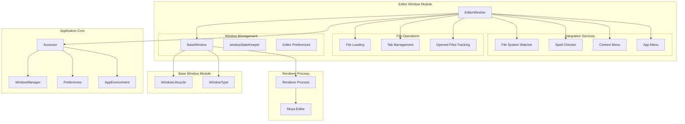
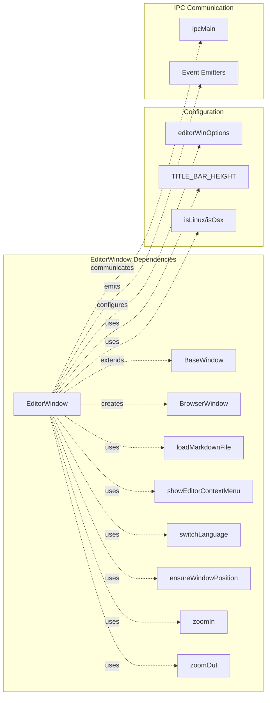
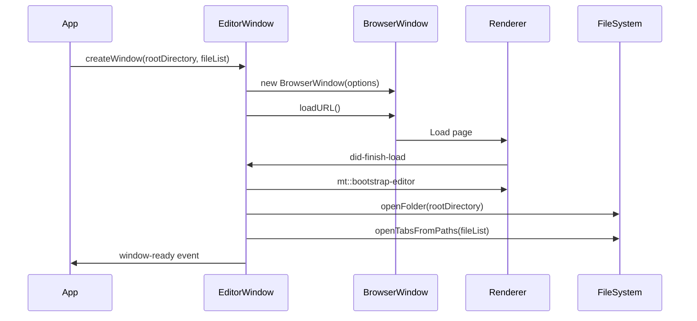
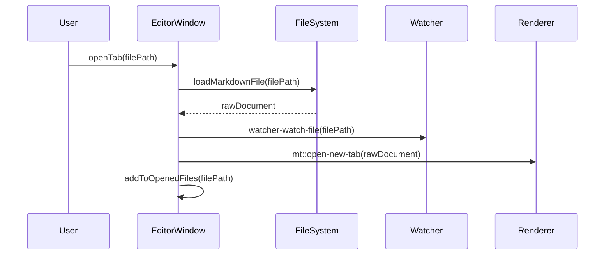
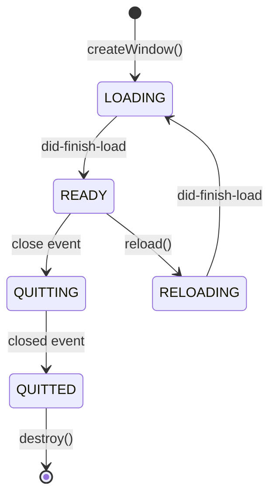

# Editor Window Module Documentation

## Introduction

The Editor Window module is a core component of the MarkText application, responsible for managing individual editor windows where users create, edit, and manage markdown documents. It serves as the primary interface between the application's main process and the renderer process, handling window lifecycle, file operations, and user interactions within the editor environment.

## Overview

The EditorWindow class extends BaseWindow to provide specialized functionality for markdown editing. It manages the creation, configuration, and lifecycle of editor windows, including file loading, tab management, directory watching, and integration with the Muya editor engine. The module coordinates between various application services including the file system watcher, menu system, preferences, and spell checker to provide a seamless editing experience.

## Architecture

### Core Architecture Diagram

### Component Relationships

## Core Components

### EditorWindow Class

The `EditorWindow` class is the primary component of this module, extending `BaseWindow` to provide editor-specific functionality. It manages the complete lifecycle of an editor window from creation to destruction.

#### Key Properties

- **Window State Management**: Tracks the current lifecycle state of the window (LOADING, READY, QUITTED)
- **File Tracking**: Maintains lists of opened files and the current root directory
- **Pending Operations**: Queues files and directories to open when the window becomes ready
- **BrowserWindow Instance**: The underlying Electron BrowserWindow instance

#### Core Methods

##### Window Creation and Management

- `createWindow()`: Creates a new editor window with specified configuration
- `reload()`: Reloads the window and resets its state
- `destroy()`: Cleans up and destroys the window

##### File and Tab Operations

- `openTab()`: Opens a single markdown file in a new tab
- `openTabsFromPaths()`: Opens multiple files from file paths
- `openTabs()`: Opens multiple tabs with custom options
- `openUntitledTab()`: Creates a new untitled tab
- `openFolder()`: Opens a directory in the sidebar

##### File System Integration

- `addToOpenedFiles()`: Adds a file to the tracking list and starts watching
- `changeOpenedFilePath()`: Updates file path in tracking and watcher
- `removeFromOpenedFiles()`: Removes file from tracking and stops watching
- `getCandidateScores()`: Calculates window suitability scores for opening files

## Data Flow

### Window Creation Flow

### File Opening Flow

### Window State Management

## Integration Points

### Window Manager Integration

The EditorWindow integrates with the [WindowManager](Window%20Management.md) through the accessor pattern, allowing centralized window management and coordination across the application.

### File System Watcher Integration

File system watching is handled through IPC communication with the [File System Watcher](Main%20Process%20Services.md) service:

- `watcher-watch-directory`: Starts watching a directory
- `watcher-unwatch-directory`: Stops watching a directory
- `watcher-watch-file`: Starts watching a file
- `watcher-unwatch-file`: Stops watching a file
- `watcher-unwatch-all-by-id`: Stops all watchers for a window

### Menu System Integration

The EditorWindow works with the [App Menu](Main%20Process%20Services.md) system to:

- Create editor-specific menu configurations
- Update menu states based on window focus
- Handle recently used documents
- Manage line ending preferences

### Muya Editor Integration

Communication with the [Muya Editor](Muya%20Editor%20Core.md) in the renderer process occurs through IPC messages:

- `mt::bootstrap-editor`: Initializes the editor with configuration
- `mt::open-new-tab`: Opens a new tab with document content
- `mt::new-untitled-tab`: Creates an untitled tab
- `mt::open-directory`: Opens a directory in the sidebar
- `mt::window-active-status`: Notifies about window focus changes

## Configuration and Preferences

### Window Options

The EditorWindow uses several configuration options from the preferences system:

- **titleBarStyle**: Native or custom title bar
- **theme**: Editor theme affecting background color
- **sideBarVisibility**: Sidebar visibility state
- **tabBarVisibility**: Tab bar visibility state
- **sourceCodeModeEnabled**: Source code mode preference
- **spellcheckerEnabled**: Spell checker enable/disable
- **spellcheckerLanguage**: Spell checker language setting

### File Handling Preferences

- **lineEnding**: Preferred end-of-line format
- **autoGuessEncoding**: Automatic encoding detection
- **trimTrailingNewline**: Trailing newline handling

## Error Handling

### Window Load Failures

The EditorWindow implements comprehensive error handling for window loading:

- **did-fail-load**: Logs and handles window load failures
- **render-process-gone**: Handles renderer process crashes with user options
- **File loading errors**: Catches and displays file loading errors to users

### Crash Recovery

When the renderer process crashes unexpectedly, the EditorWindow provides user options:

1. **Close**: Destroy the window
2. **Reload**: Reload the window
3. **Keep Open**: Leave the window open

## Performance Considerations

### Window State Management

- Uses `electron-window-state` to persist window dimensions and position
- Implements lazy loading for files and directories
- Queues operations until window is ready to prevent race conditions

### File Watching Optimization

- Only watches files that are actually opened
- Stops watching files when they are closed
- Groups directory watching to minimize system resources

### Memory Management

- Cleans up references when windows are destroyed
- Removes all file watchers on window reload
- Properly handles Electron remote module cleanup

## Security Considerations

### Remote Module

- Enables `@electron/remote` for renderer process communication
- Uses `remoteEnable` to securely enable remote access

### Web Preferences

- Configures spell checking based on user preferences
- Sets appropriate background colors for themes
- Manages web security settings based on environment

## Lifecycle Management

### Window Lifecycle States

1. **LOADING**: Window is being created and loading content
2. **READY**: Window has finished loading and is ready for user interaction
3. **QUITTED**: Window has been closed and destroyed

### Event Emission

The EditorWindow emits several events during its lifecycle:

- `window-ready`: Window is ready for interaction
- `window-focus`: Window has gained focus
- `window-blur`: Window has lost focus
- `window-close`: Window is about to close
- `window-closed`: Window has been closed

## File Management Strategy

### Candidate Scoring System

The EditorWindow implements a scoring system to determine the best window for opening files:

- **Score -1**: File is already open in this window
- **Score +1**: File is in a directory containing other opened files
- **Score +5**: File is in the window's root directory

This system helps the [WindowManager](Window%20Management.md) choose the most appropriate window for new files.

### File Path Management

The EditorWindow maintains accurate file path tracking to:

- Prevent duplicate file openings
- Enable proper file watching
- Support file rename operations
- Facilitate window selection for new files

## Integration with Other Modules

### Application Core

- **[App](Application%20Core.md)**: Provides application-wide services and configuration
- **[WindowManager](Window%20Management.md)**: Manages multiple editor windows
- **[AppEnvironment](Application%20Core.md)**: Provides environment-specific settings
- **[AppPaths](Application%20Core.md)**: Manages application paths

### Main Process Services

- **[CommandManager](Main%20Process%20Services.md)**: Handles application commands
- **[Preferences](Main%20Process%20Services.md)**: Manages user preferences
- **[DataCenter](Main%20Process%20Services.md)**: Provides data management services
- **[FileSystem Watcher](Main%20Process%20Services.md)**: Monitors file system changes
- **[AppMenu](Main%20Process%20Services.md)**: Manages application menus
- **[Keybindings](Main%20Process%20Services.md)**: Handles keyboard shortcuts

### Muya Editor Integration

- **[Muya](Muya%20Editor%20Core.md)**: Core editor engine
- **[ContentState](Muya%20Editor%20Core.md)**: Manages editor content state
- **[History](Muya%20Editor%20Core.md)**: Handles undo/redo functionality
- **[Selection](Muya%20Editor%20Core.md)**: Manages text selection
- **[StateRender](Muya%20Editor%20Core.md)**: Renders editor state
- **[EventCenter](Muya%20Editor%20Core.md)**: Handles editor events
- **[Keyboard](Muya%20Editor%20Core.md)**: Manages keyboard input

### Renderer-Side Features

- **[RootCommand](Renderer-Side%20Features.md)**: Provides command infrastructure
- **[QuickOpenCommand](Renderer-Side%20Features.md)**: Implements quick file opening
- **[RipgrepDirectorySearcher](Renderer-Side%20Features.md)**: Provides file search capabilities
- **[SpellChecker](Renderer-Side%20Features.md)**: Handles spell checking functionality