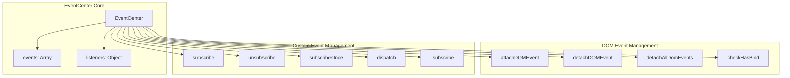
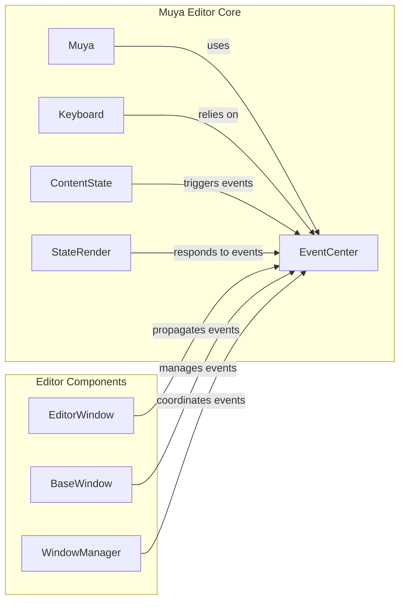
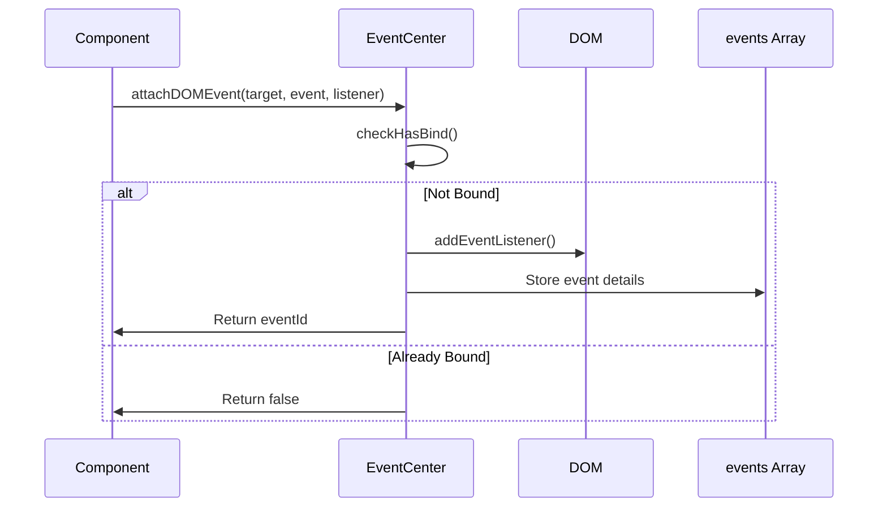
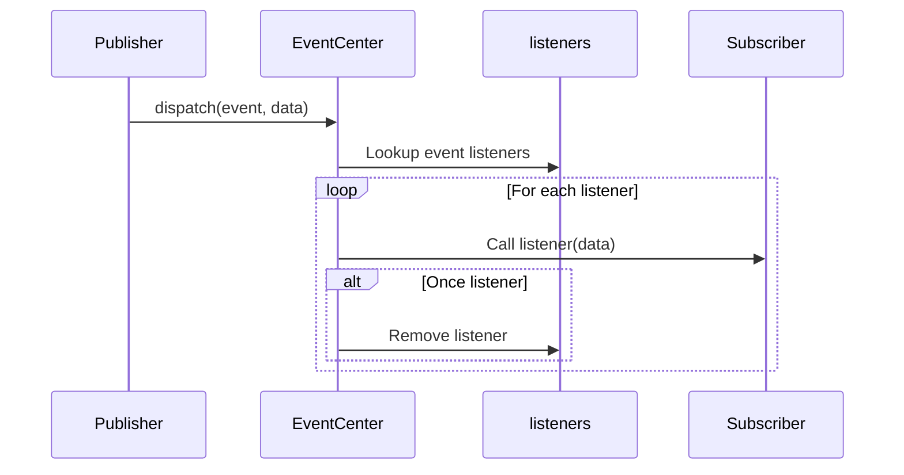

# EventCenter Module Documentation

## Introduction

The EventCenter module is a core event management system within the Muya Editor Core. It provides a centralized event handling mechanism that manages both DOM events and custom application events, serving as the primary communication hub for the editor's event-driven architecture.

## Overview

EventCenter acts as a sophisticated event broker that:
- Manages DOM event listeners with unique identifiers for precise control
- Handles custom application events with subscription-based patterns
- Provides event lifecycle management including one-time listeners
- Prevents duplicate event bindings through intelligent detection
- Offers comprehensive cleanup mechanisms for memory management

## Architecture

### Core Architecture



### System Integration



## Component Details

### EventCenter Class

The `EventCenter` class is the main component that provides comprehensive event management capabilities:

#### Properties
- `events`: Array storing DOM event bindings with unique identifiers
- `listeners`: Object mapping custom event names to arrays of listener handlers

#### Key Methods

**DOM Event Management:**
- `attachDOMEvent(target, event, listener, capture)`: Binds DOM events with unique IDs
- `detachDOMEvent(eventId)`: Removes specific DOM event listeners
- `detachAllDomEvents()`: Cleans up all DOM event bindings
- `checkHasBind(target, event, listener, capture)`: Prevents duplicate bindings

**Custom Event Management:**
- `subscribe(event, listener)`: Registers custom event listeners
- `unsubscribe(event, listener)`: Removes custom event listeners
- `subscribeOnce(event, listener)`: Registers one-time event listeners
- `dispatch(event, ...data)`: Triggers custom events with data payload

## Data Flow

### Event Registration Flow


### Custom Event Dispatch Flow


## Dependencies

### Internal Dependencies
- `getUniqueId` from `../utils`: Generates unique identifiers for DOM events

### Related Modules
- [Keyboard](Keyboard.md): Relies on EventCenter for keyboard event management
- [ContentState](ContentState.md): Triggers events through EventCenter for state changes
- [StateRender](StateRender.md): Responds to rendering events dispatched by EventCenter
- [Muya](Muya.md): Uses EventCenter as the primary event management system

## Usage Patterns

### DOM Event Management
```javascript
// Attach event with unique ID
const eventId = eventCenter.attachDOMEvent(
  element, 
  'click', 
  handler, 
  false
)

// Detach specific event
eventCenter.detachDOMEvent(eventId)

// Clean up all events
eventCenter.detachAllDomEvents()
```

### Custom Event System
```javascript
// Subscribe to custom events
eventCenter.subscribe('content:changed', handler)

// One-time subscription
eventCenter.subscribeOnce('editor:ready', handler)

// Dispatch events
eventCenter.dispatch('content:changed', newContent)

// Unsubscribe when no longer needed
eventCenter.unsubscribe('content:changed', handler)
```

## Memory Management

The EventCenter implements several strategies for effective memory management:

1. **Unique Event IDs**: Each DOM event gets a unique identifier for precise cleanup
2. **Bulk Cleanup**: `detachAllDomEvents()` removes all DOM event bindings
3. **Automatic Cleanup**: One-time listeners are automatically removed after execution
4. **Duplicate Prevention**: `checkHasBind()` prevents redundant event bindings

## Error Handling

The EventCenter includes defensive programming practices:
- Validates event IDs before detachment
- Checks for existing bindings to prevent duplicates
- Gracefully handles missing listeners during dispatch
- Returns meaningful status indicators

## Performance Considerations

- Event lookups use direct object property access for O(1) complexity
- DOM event storage allows for efficient bulk operations
- Duplicate detection prevents unnecessary event binding overhead
- One-time listeners reduce long-term memory usage

## Integration Points

EventCenter serves as a central hub that connects various editor components:

- **Keyboard Input**: Processes keyboard events before they reach content
- **Content Changes**: Manages content state change notifications
- **UI Interactions**: Handles toolbar and menu interactions
- **Window Management**: Coordinates events across multiple editor windows
- **File Operations**: Manages file system event propagation

This centralized approach ensures consistent event handling throughout the editor while maintaining loose coupling between components.