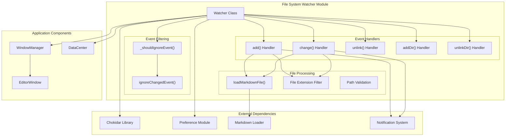
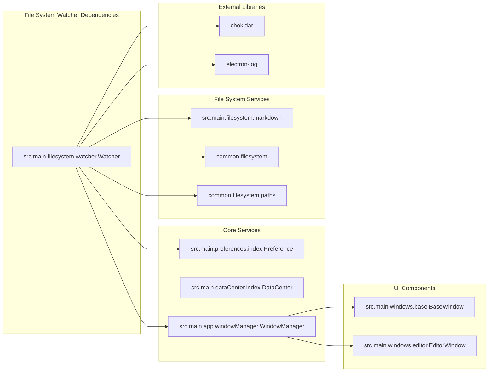
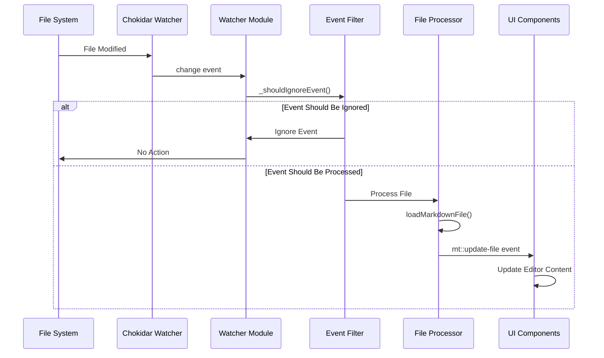
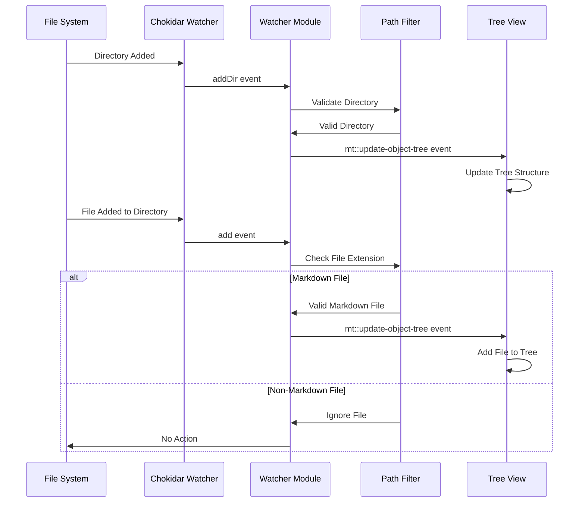
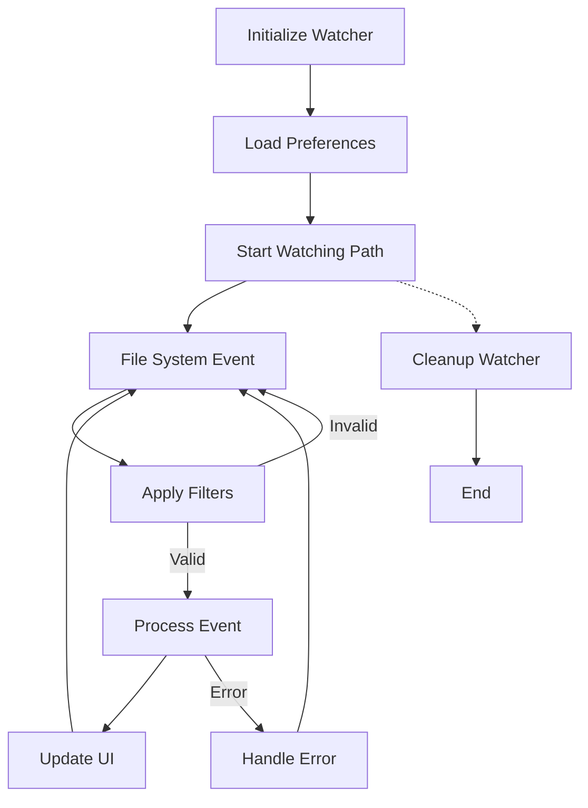
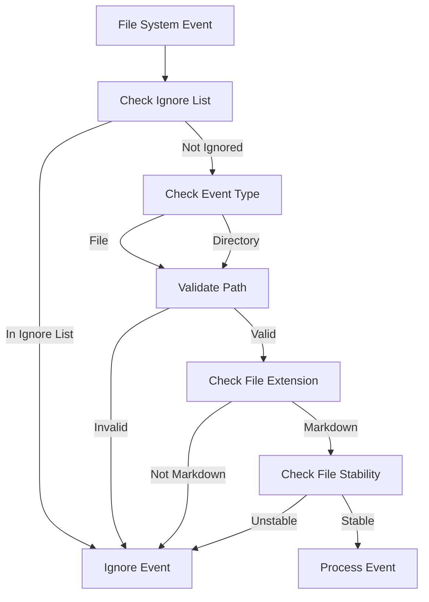

# File System Watcher Module

## Introduction

The File System Watcher module is a critical component of the MarkText application that monitors file system changes in real-time. It provides intelligent file and directory watching capabilities, automatically detecting modifications, additions, and deletions of markdown files and directories. The module ensures the application stays synchronized with external file changes while preventing conflicts from internal editor operations.

## Overview

The File System Watcher serves as the bridge between the file system and the application's user interface, enabling:
- Real-time file change detection and synchronization
- Automatic tree view updates for directory structures
- Smart filtering of irrelevant files and directories
- Conflict prevention between internal and external file modifications
- Cross-platform file system monitoring with platform-specific optimizations

## Architecture

### Core Architecture



### Component Dependencies



## Data Flow

### File Change Detection Flow



### Directory Monitoring Flow



## Component Details

### Watcher Class

The `Watcher` class is the main component that manages file system monitoring. It provides:

- **Constructor**: Initializes the watcher with preference settings
- **watch()**: Starts monitoring a file or directory
- **unwatch()**: Stops monitoring specific paths
- **unwatchByWindowId()**: Removes all watchers for a specific window
- **close()**: Terminates all active watchers
- **ignoreChangedEvent()**: Temporarily ignores change events for specific files

### Event Processing

The module processes five types of file system events:

1. **add**: New file created
2. **change**: Existing file modified
3. **unlink**: File deleted
4. **addDir**: New directory created
5. **unlinkDir**: Directory deleted

### File Filtering

The watcher implements intelligent filtering to focus on relevant files:

- **Extension Filtering**: Only monitors files with markdown extensions
- **Path Filtering**: Ignores hidden files, node_modules, and .asar files
- **Platform-Specific**: Different behavior for macOS, Linux, and Windows
- **Stability Checking**: Uses stability thresholds to prevent premature event processing

## Configuration

### Watcher Settings

```javascript
const WATCHER_STABILITY_THRESHOLD = 1000    // 1 second stability threshold
const WATCHER_STABILITY_POLL_INTERVAL = 150  // 150ms poll interval
```

### Platform-Specific Behavior

- **macOS**: Uses polling mode by default for better reliability
- **Linux**: Implements atomic rename handling for file replacement
- **Windows**: Standard chokidar behavior with depth limitations

## Error Handling

### ENOSPC Error Management

When the system runs out of file descriptors (inotify limit), the watcher:
1. Logs a warning message
2. Notifies the user via UI notification
3. Continues operation with reduced monitoring capacity

### I/O Error Handling

File loading errors are handled gracefully:
- Errors are logged for debugging
- Users receive notifications for opened files
- Tree view updates continue unaffected
- Failed files are skipped without breaking the watcher

## Integration Points

### Window Management Integration

The watcher integrates with the [Window Manager](Window%20Management.md) to:
- Track active windows and their associated file paths
- Send targeted updates to specific windows
- Clean up watchers when windows are closed

### Preference System Integration

Configuration is managed through the [User Preferences](User%20Preferences.md) system:
- `watcherUsePolling`: Controls polling behavior
- `autoGuessEncoding`: File encoding detection
- `trimTrailingNewline`: Newline handling preferences
- `endOfLine`: Line ending preferences

### Data Center Integration

File content changes are synchronized with the [Data Management](Data%20Management.md) system:
- Markdown content is loaded through the data center
- File metadata is validated and processed
- Changes are propagated to the appropriate data stores

## Process Flows

### File Watching Lifecycle



### Event Filtering Process



## Performance Considerations

### Resource Management

- **File Descriptor Limits**: Monitors system limits and handles ENOSPC errors
- **Memory Usage**: Efficiently manages watcher instances and event data
- **CPU Usage**: Uses stability thresholds to reduce unnecessary processing
- **Network Drives**: Special handling for cloud synchronization delays

### Optimization Strategies

1. **Selective Watching**: Only watches markdown files and relevant directories
2. **Event Debouncing**: Uses stability thresholds to batch rapid changes
3. **Platform Optimization**: Different strategies for different operating systems
4. **Lazy Loading**: Loads file content only when necessary

## Security Considerations

### Path Validation

- Validates all file paths before processing
- Prevents directory traversal attacks
- Sanitizes file names and paths
- Restricts access to sensitive system directories

### Permission Handling

- Gracefully handles permission errors
- Ignores files without read access
- Notifies users about permission issues
- Continues operation with accessible files

## Future Improvements

### Planned Enhancements

Based on the TODO comments in the code:
- **GH#1034**: Remove markdown data loading from watcher (move to lazy loading)
- **GH#1035**: Complete watcher refactoring for better separation of concerns
- **GH#1043**: Improve file stability detection algorithms

### Potential Optimizations

- Implement watcher pooling for better resource utilization
- Add support for symbolic link handling
- Improve performance for large directory structures
- Add configuration options for advanced users

## Related Documentation

- [Window Management](Window%20Management.md) - For window-watcher integration
- [User Preferences](User%20Preferences.md) - For configuration options
- [Data Management](Data%20Management.md) - For file content handling
- [Editor Window](Editor%20Window.md) - For editor synchronization
- [Application Core](Application%20Core.md) - For overall application architecture