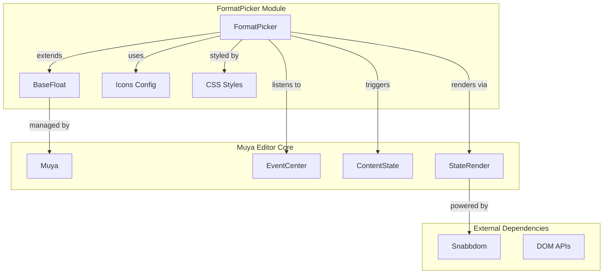
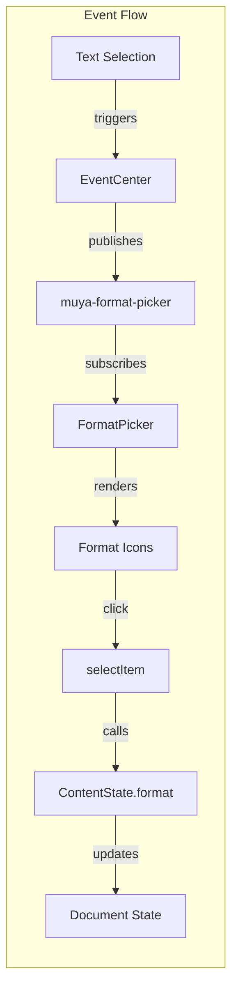

# FormatPicker Module Documentation

## Introduction

The FormatPicker module is a UI component within the Muya Editor that provides an interactive floating toolbar for text formatting operations. It allows users to apply various formatting styles (bold, italic, links, images, etc.) to selected text through a visual interface. The module extends the BaseFloat component and integrates with the Muya editor's content state management system.

## Architecture Overview

The FormatPicker follows a component-based architecture where it inherits from BaseFloat and integrates with the Muya editor's event system and content state management.



## Component Structure

### Core Component: FormatPicker

The FormatPicker class extends BaseFloat and provides the following key functionality:

- **Floating UI Management**: Inherits positioning and visibility controls from BaseFloat
- **Icon-based Formatting**: Renders a toolbar with formatting icons (bold, italic, link, image, etc.)
- **State Synchronization**: Updates active state based on current text selection formatting
- **Event-driven Updates**: Responds to format picker events from the EventCenter
- **Real-time Rendering**: Uses Snabbdom for efficient virtual DOM updates

### Key Properties

- `formats`: Current formatting state of the selected text
- `icons`: Configuration object defining available formatting options
- `oldVnode`: Previous virtual DOM tree for efficient updates
- `formatContainer`: DOM container for the format picker UI

## Data Flow

```mermaid
sequenceDiagram
    participant User
    participant EC as EventCenter
    participant FP as FormatPicker
    participant CS as ContentState
    participant UI as UI Renderer
    
    User->>EC: Select text / Request format picker
    EC->>FP: muya-format-picker event
    FP->>FP: Update formats state
    FP->>UI: Render format icons
    UI->>User: Display format picker
    
    User->>FP: Click format icon
    FP->>CS: Apply format(type)
    CS->>CS: Update content state
    CS->>FP: Return updated formats
    FP->>UI: Re-render with active states
    
    alt Link/Image format
        FP->>FP: Hide picker
    else Other formats
        FP->>FP: Keep picker visible
    end
```



## Component Interactions

### Integration with Muya Editor

The FormatPicker integrates with several Muya editor components:

1. **EventCenter**: Subscribes to 'muya-format-picker' events to show/hide the picker
2. **ContentState**: Applies formatting changes and retrieves current format states
3. **BaseFloat**: Inherits floating UI behavior and positioning logic
4. **StateRender**: Uses Snabbdom for efficient virtual DOM rendering

### Event Handling



## UI Rendering Process

The FormatPicker uses a sophisticated rendering approach:

1. **Icon Mapping**: Each format option is mapped to a visual icon
2. **Active State Detection**: Compares current formats with available options
3. **Virtual DOM Updates**: Uses Snabbdom for efficient DOM patching
4. **Tooltip Integration**: Provides keyboard shortcut information via tooltips

### Rendering Logic

```javascript
// Icon rendering based on format configuration
const children = icons.map(i => {
  // Determine if format is active
  const isActive = formats.some(f => f.type === i.type)
  
  // Create icon element with appropriate styling
  return h('li.item', {
    class: { active: isActive },
    on: { click: (e) => this.selectItem(e, i) }
  }, [iconWrapper])
})
```

## Format Application

The FormatPicker supports various format types with different behaviors:

- **Inline Formats** (bold, italic, code): Toggle state and keep picker visible
- **Link Format**: Opens link dialog and hides picker
- **Image Format**: Opens image dialog and hides picker
- **Block Formats**: Apply to entire paragraphs or blocks

## Dependencies

### Internal Dependencies
- [BaseFloat](BaseFloat.md): Inherits floating UI behavior and positioning
- [EventCenter](EventCenter.md): Subscribes to format picker events
- [ContentState](ContentState.md): Applies formatting and retrieves format states
- [StateRender](StateRender.md): Provides Snabbdom rendering capabilities

### External Dependencies
- **Snabbdom**: Virtual DOM library for efficient UI updates
- **CSS Modules**: Styling for the format picker appearance

## Configuration

The FormatPicker accepts configuration options that control its behavior:

```javascript
const defaultOptions = {
  placement: 'top',           // Popper.js placement
  modifiers: {
    offset: {
      offset: '0, 5'          // Offset from reference element
    }
  },
  showArrow: false            // Hide arrow indicator
}
```

## Usage Patterns

### Showing the FormatPicker

The FormatPicker is typically triggered by text selection or specific keyboard shortcuts:

1. User selects text in the editor
2. Application publishes 'muya-format-picker' event with reference and formats
3. FormatPicker positions itself relative to the selection and displays available formats

### Format Application Flow

1. User clicks a format icon
2. FormatPicker calls ContentState.format() with the selected format type
3. ContentState updates the document and returns new format information
4. FormatPicker re-renders with updated active states
5. For link/image formats, picker hides after application

## Performance Considerations

- **Virtual DOM**: Uses Snabbdom for minimal DOM updates
- **Event Debouncing**: Delays rendering with setTimeout to batch updates
- **State Caching**: Maintains oldVnode to avoid unnecessary re-renders
- **Conditional Visibility**: Only renders when reference element is available

## Extension Points

The FormatPicker can be extended through:

- **Icon Configuration**: Modify the icons config to add/remove format options
- **Custom Format Types**: Extend the format application logic in selectItem
- **Styling**: Override CSS classes for custom appearance
- **Positioning**: Adjust Popper.js options for different placement behaviors

## Related Documentation

- [BaseFloat](BaseFloat.md) - Base floating UI component
- [EventCenter](EventCenter.md) - Event management system
- [ContentState](ContentState.md) - Document state management
- [StateRender](StateRender.md) - Virtual DOM rendering system