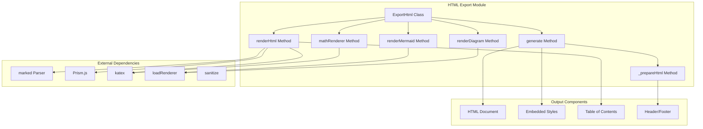
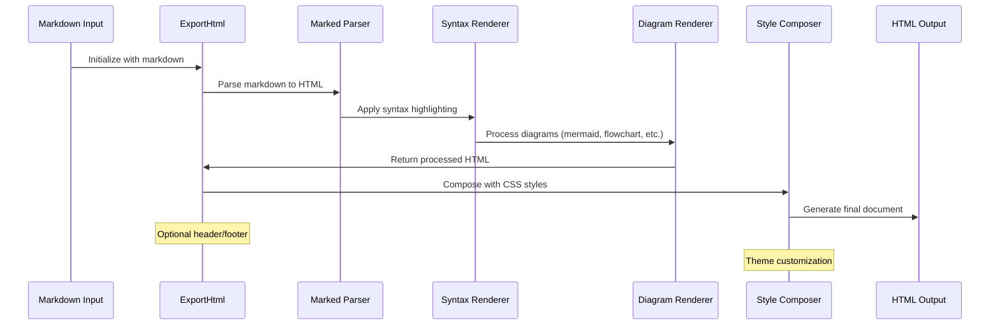
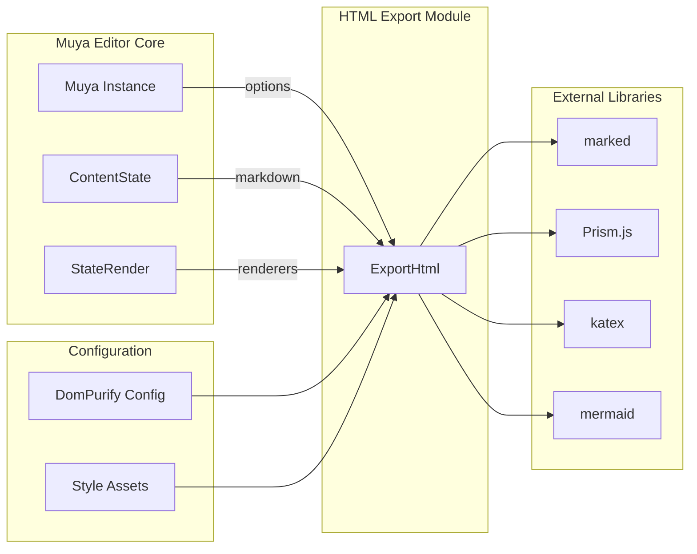
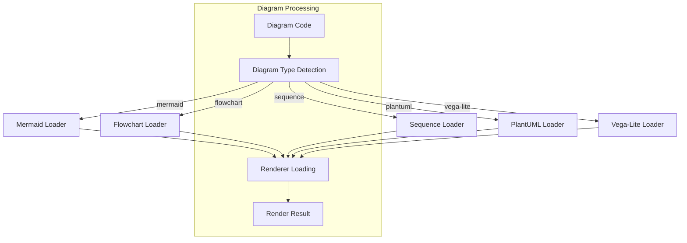

# HTML Export Module Documentation

## Introduction

The HTML Export module is a critical component of the Muya Editor system that transforms Markdown content into styled, self-contained HTML documents. This module provides comprehensive export capabilities including syntax highlighting, mathematical expressions, diagrams, and customizable styling options. It serves as the bridge between the editor's internal representation and publishable HTML output.

## Architecture Overview

The HTML Export module is built around the `ExportHtml` class, which orchestrates the conversion process from Markdown to HTML. The architecture follows a modular design pattern with specialized rendering methods for different content types.

## Core Components

### ExportHtml Class

The `ExportHtml` class is the main orchestrator that manages the entire export process. It provides methods for rendering different types of content and generating the final HTML document.

**Key Properties:**
- `markdown`: Source markdown content
- `muya`: Reference to the Muya editor instance
- `exportContainer`: Temporary DOM container for rendering
- `mathRendererCalled`: Flag tracking math rendering usage

**Key Methods:**
- `renderHtml()`: Main rendering method that converts markdown to HTML
- `generate()`: Generates complete HTML document with styling
- `renderMermaid()`: Handles mermaid diagram rendering
- `renderDiagram()`: Processes various diagram types
- `mathRenderer()`: Renders mathematical expressions

## Data Flow

The HTML export process follows a structured pipeline that transforms raw markdown into a complete HTML document:

## Component Interactions

The HTML Export module interacts with several key components within the Muya Editor ecosystem:

## Rendering Process

### 1. Markdown Processing
The export process begins with parsing the markdown content using the `marked` library, which supports various extensions:

- **Syntax Highlighting**: Code blocks are processed through Prism.js for language-specific highlighting
- **Mathematical Expressions**: LaTeX math is rendered using KaTeX
- **Emoji Support**: Emoji shortcodes are converted to Unicode characters
- **Table of Contents**: Optional TOC generation based on document headings

### 2. Diagram Rendering
The module supports multiple diagram types through dynamic renderer loading:

### 3. Content Sanitization
All generated HTML is sanitized using DOMPurify with specific configuration to ensure security while preserving necessary elements for rendering.

### 4. Style Composition
The final HTML document includes comprehensive styling:

- **GitHub Markdown CSS**: Base markdown styling
- **Prism.js Themes**: Syntax highlighting styles
- **KaTeX CSS**: Mathematical expression styling
- **Custom Export Styles**: Module-specific styling
- **User-defined CSS**: Optional custom styling

## Configuration Options

The export process supports various configuration options:

### Document Options
- `title`: Document title for the HTML header
- `toc`: Table of contents HTML (optional)
- `header`: Header configuration with left, center, right sections
- `footer`: Footer configuration with left, center, right sections
- `extraCss`: Additional CSS styles
- `printOptimization`: Optimize styling for print output
- `headerFooterStyled`: Apply styling to header/footer sections

### Rendering Options
- `superSubScript`: Enable superscript/subscript support
- `footnote`: Enable footnote rendering
- `isGitlabCompatibilityEnabled`: GitLab-specific markdown extensions
- `mermaidTheme`: Theme for mermaid diagrams
- `sequenceTheme`: Theme for sequence diagrams

## Security Considerations

The module implements several security measures:

1. **Content Sanitization**: All HTML output is sanitized using DOMPurify
2. **Configuration-based Protection**: Export-specific DOMPurify configuration
3. **Strict Security Settings**: Mermaid diagrams use strict security levels
4. **Input Validation**: Diagram code is validated before processing

## Error Handling

The module includes comprehensive error handling:

- **Invalid Mathematics**: Graceful fallback for malformed LaTeX
- **Diagram Parsing Errors**: Clear error messages for invalid diagrams
- **Missing Languages**: Warning messages for unsupported syntax highlighting
- **Renderer Failures**: Fallback rendering for failed diagram types

## Integration Points

### Muya Editor Integration
The module integrates seamlessly with the Muya editor through:
- Options inheritance from Muya instance
- Theme synchronization
- Content state access
- Event system integration

### File System Integration
Export functionality connects with the broader file system through:
- [File System Watcher](File System Watcher.md) for monitoring changes
- [Data Management](Data Management.md) for content persistence
- [Command Management](Command Management.md) for export commands

## Performance Optimization

The module includes several performance optimizations:

1. **Lazy Loading**: Diagram renderers are loaded on-demand
2. **Temporary DOM**: Uses temporary containers for rendering
3. **Resource Cleanup**: Proper cleanup of temporary elements
4. **Conditional Loading**: Only includes necessary CSS based on content

## Extension Points

The module provides several extension points:

- **Custom Renderers**: Support for additional diagram types
- **Style Customization**: Extensible CSS system
- **Header/Footer Templates**: Customizable document structure
- **Post-processing Hooks**: Extension points for custom processing

## Dependencies

### Internal Dependencies
- [Muya Editor Core](Muya Editor Core.md): Core editor functionality
- [ContentState](ContentState.md): Content state management
- [StateRender](StateRender.md): Rendering infrastructure

### External Dependencies
- `marked`: Markdown parsing
- `prismjs`: Syntax highlighting
- `katex`: Mathematical expression rendering
- `dompurify`: HTML sanitization

## Usage Examples

The module is typically used through the Muya editor's export functionality, but can also be used independently for custom export scenarios. The export process handles complex documents with mixed content types while maintaining consistent styling and layout.

## Future Enhancements

Potential areas for enhancement include:
- Additional diagram type support
- Theme system improvements
- Performance optimizations for large documents
- Enhanced customization options
- Better mobile export support