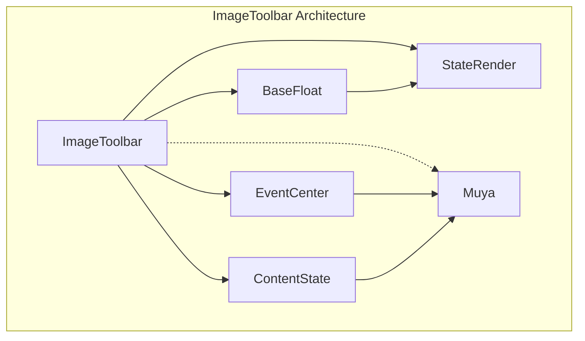
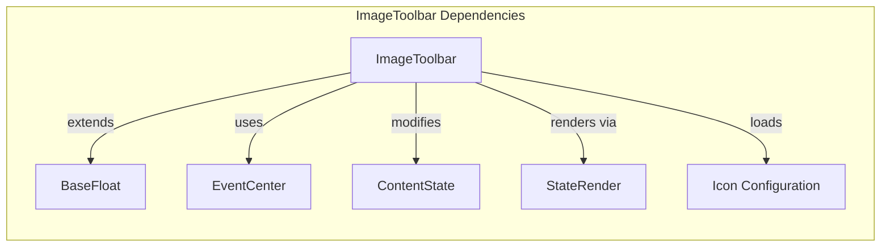
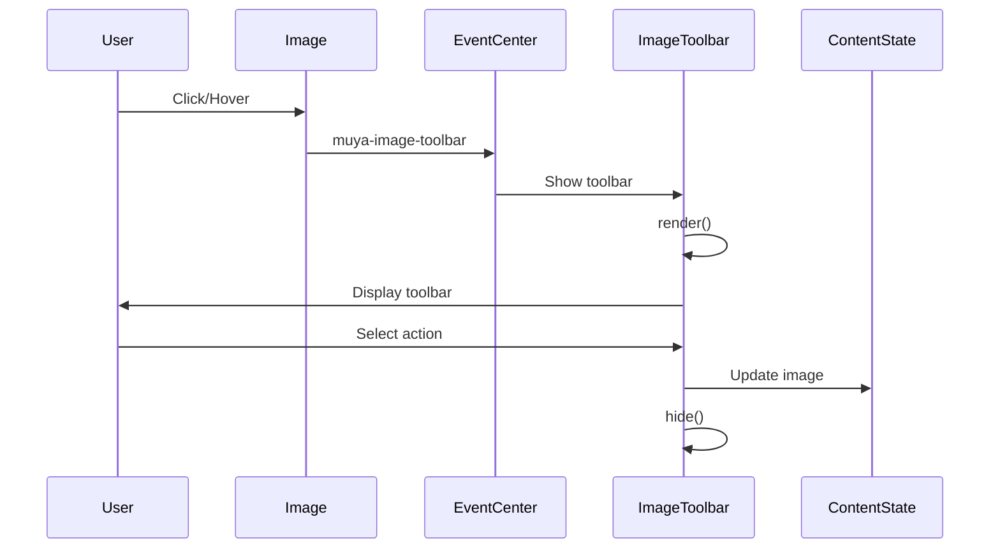
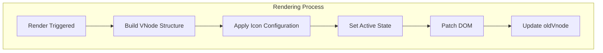
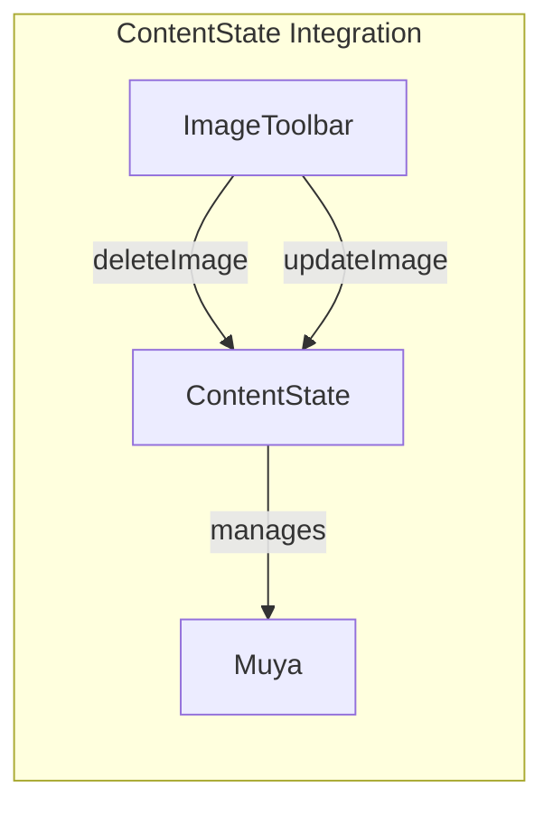

# ImageToolbar Module Documentation

## Introduction

The ImageToolbar module is a floating UI component within the Muya Editor UI system that provides contextual image manipulation tools. It appears when users interact with images in the markdown editor, offering quick access to common image operations like alignment, editing, and deletion. The toolbar is designed to be non-intrusive, appearing only when needed and disappearing after actions are completed.

## Architecture Overview

The ImageToolbar module is built on top of the BaseFloat system and integrates tightly with the Muya editor's event system and content state management.



## Core Components

### ImageToolbar Class

The `ImageToolbar` class extends `BaseFloat` and serves as the main component for image manipulation UI. It manages the toolbar's visibility, rendering, and user interactions.

**Key Properties:**
- `imageInfo`: Stores information about the current image being edited
- `reference`: DOM reference to the image element
- `icons`: Configuration for toolbar buttons
- `oldVnode`: Previous virtual DOM state for efficient updates

**Key Methods:**
- `listen()`: Sets up event listeners for toolbar activation
- `render()`: Renders the toolbar UI using virtual DOM
- `selectItem()`: Handles user interactions with toolbar buttons

## Component Relationships



## Data Flow

The ImageToolbar follows a reactive pattern where events trigger UI updates and state changes:



## Event System Integration

The ImageToolbar integrates with the Muya event system through the EventCenter:

### Incoming Events
- `muya-image-toolbar`: Triggered to show/hide the toolbar with image information

### Outgoing Events
- `muya-transformer`: Dispatched to hide image transformation controls
- `muya-image-selector`: Dispatched to open image editing dialog

## Toolbar Actions

The ImageToolbar provides five primary actions through icon buttons:

### 1. Delete Image
- **Type**: `delete`
- **Function**: Removes the image from the document
- **Implementation**: Calls `contentState.deleteImage(imageInfo)`

### 2. Edit Image
- **Type**: `edit`
- **Function**: Opens image editing interface
- **Implementation**: Dispatches `muya-image-selector` event

### 3. Alignment Options
- **Types**: `inline`, `left`, `center`, `right`
- **Function**: Changes image alignment within the document
- **Implementation**: Updates `data-align` attribute via `contentState.updateImage()`

## UI Rendering

The toolbar uses a virtual DOM approach with Snabbdom for efficient updates:



### Icon Rendering
Icons can be either:
- SVG assets loaded as background images
- CSS-based icons using icon classes

### Active State
The toolbar highlights the currently selected alignment option by adding an `active` class to the corresponding item.

## Positioning and Styling

The ImageToolbar uses the BaseFloat positioning system with these default options:

```javascript
const defaultOptions = {
  placement: 'top',           // Position above the image
  modifiers: {
    offset: {
      offset: '0, 10'         // 10px vertical offset
    }
  },
  showArrow: false            // No arrow indicator
}
```

### CSS Classes
- `ag-image-toolbar-container`: Main container class
- `ag-image-toolbar`: Toolbar identifier
- `item`: Individual button styling
- `active`: Selected alignment state
- `tooltip`: Hover tooltip styling

## Integration with ContentState

The ImageToolbar communicates with the ContentState system to perform document modifications:



## Error Handling and Edge Cases

The ImageToolbar includes several safeguards:

1. **Null Reference Handling**: Checks for valid image references before showing
2. **Event Propagation**: Prevents default browser behavior and stops event propagation
3. **Timeout Usage**: Uses `setTimeout` to ensure DOM updates complete before showing
4. **State Cleanup**: Properly hides toolbars and clears references after actions

## Performance Considerations

- **Virtual DOM**: Uses Snabbdom for efficient DOM updates
- **Lazy Rendering**: Only renders when visible
- **Event Cleanup**: Properly unsubscribes from events
- **Reference Management**: Clears DOM references to prevent memory leaks

## Dependencies

### Direct Dependencies
- [BaseFloat](BaseFloat.md): Provides floating UI functionality
- [EventCenter](EventCenter.md): Handles event communication
- [ContentState](ContentState.md): Manages document state
- [StateRender](StateRender.md): Provides virtual DOM capabilities

### Indirect Dependencies
- [Muya](Muya.md): Core editor instance
- [Selection](Selection.md): Manages text selection (via ContentState)

## Usage Example

```javascript
// The ImageToolbar is automatically instantiated by Muya
// and responds to image interactions:

// Event triggered when user interacts with image
muya.eventCenter.dispatch('muya-image-toolbar', {
  reference: imageElement,
  imageInfo: {
    token: imageToken,
    // other image metadata
  }
})
```

## Future Enhancements

Potential improvements for the ImageToolbar module:

1. **Keyboard Navigation**: Add keyboard support for toolbar navigation
2. **Custom Actions**: Allow plugins to register custom toolbar actions
3. **Responsive Design**: Adapt toolbar layout for different screen sizes
4. **Animation**: Add smooth transitions for showing/hiding
5. **Accessibility**: Improve ARIA support and screen reader compatibility