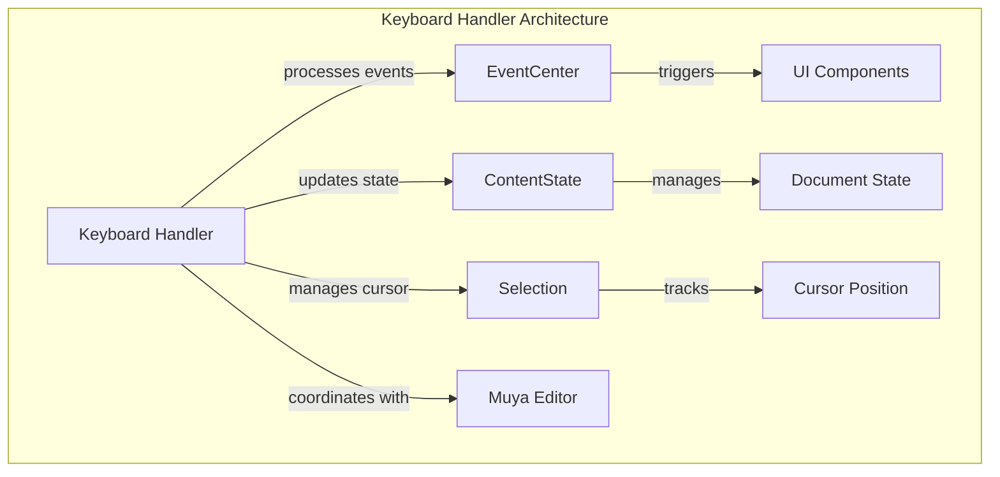
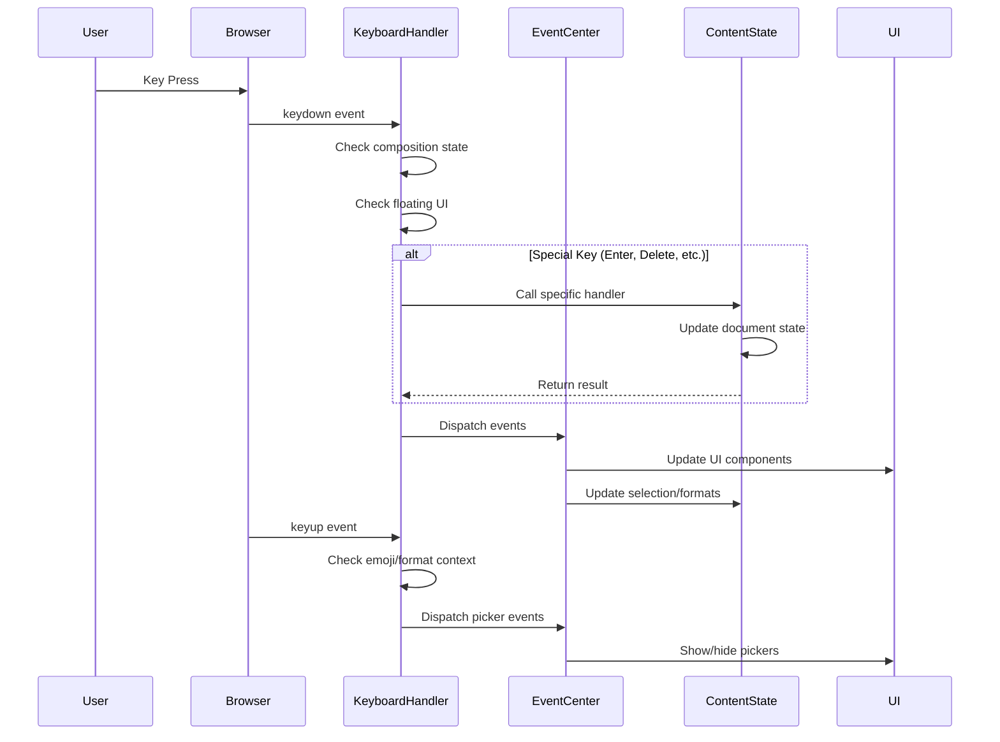

# Keyboard Handler Module Documentation

## Introduction

The Keyboard Handler module is a critical component of the Muya Editor Core that manages all keyboard interactions within the editor. It serves as the central processing unit for keyboard events, handling everything from basic text input to complex editor operations like navigation, deletion, and special character insertion. The module acts as an intermediary between user keyboard input and the editor's content state management system.

## Architecture Overview

The Keyboard Handler is designed as an event-driven system that intercepts and processes keyboard events before they reach the editor's content. It maintains state information about ongoing compositions (for international input methods), tracks floating UI elements, and coordinates with various editor subsystems to ensure proper event handling.

## Core Components

### Keyboard Class (`src.muya.lib.eventHandler.keyboard.Keyboard`)

The main Keyboard class orchestrates all keyboard event handling within the Muya editor. It maintains several key properties:

- **muya**: Reference to the main Muya editor instance
- **isComposed**: Boolean flag tracking composition input state (for IME support)
- **shownFloat**: Set tracking currently visible floating UI elements

#### Key Methods:

**Constructor & Initialization**
- Initializes event bindings for keydown, keyup, and input events
- Sets up composition event handling for international input methods
- Establishes event listeners for floating UI management

**Event Processing Methods**
- `keydownBinding()`: Handles keydown events with special processing for navigation, deletion, and editor-specific operations
- `keyupBinding()`: Manages keyup events, triggers format picker and emoji picker UI elements
- `inputBinding()`: Processes text input events and language detection for code blocks

**State Management**
- `dispatchEditorState()`: Coordinates selection change notifications and editor state updates
- `recordIsComposed()`: Manages composition state for international input methods
- `hideAllFloatTools()`: Utility method to hide all floating UI elements

## Event Flow and Processing

## Key Event Handling Logic

### Keydown Event Processing

The keydown handler implements a sophisticated event processing pipeline:

1. **Meta/Ctrl Key Detection**: Adds visual indicators when modifier keys are pressed
2. **Floating UI Priority**: Prevents default browser behavior when floating UI elements are visible
3. **Special Key Handling**: Routes specific keys to appropriate ContentState handlers:
   - Enter: Document entry and paragraph creation
   - Backspace/Delete: Content removal with context awareness
   - Arrow Keys: Navigation with selection management
   - Tab: Indentation and list item management

### Input Event Processing

The input handler manages text insertion with intelligent context detection:

1. **Composition Awareness**: Skips processing during IME composition
2. **Language Detection**: Automatically detects programming languages in code blocks
3. **Code Picker Integration**: Triggers language selection UI when appropriate

### Keyup Event Processing

The keyup handler focuses on context-aware UI presentation:

1. **Emoji Detection**: Identifies emoji input contexts and triggers emoji picker
2. **Format Detection**: Analyzes text selection for formatting options
3. **Cursor Tracking**: Updates cursor position and triggers partial rendering when necessary

## Integration with Other Modules

### EventCenter Integration
The Keyboard Handler heavily relies on the EventCenter for event distribution and UI coordination:

- **Float State Management**: Subscribes to 'muya-float' events to track UI element visibility
- **Picker Coordination**: Dispatches events for code, emoji, and format pickers
- **State Change Notifications**: Triggers editor state change events for external components

### ContentState Integration
Direct integration with ContentState for document manipulation:

- **Handler Delegation**: Routes specific operations to ContentState methods
- **State Updates**: Triggers content updates and change notifications
- **Selection Management**: Coordinates cursor and selection state updates

### Selection Module Integration
Utilizes the Selection module for cursor and range management:

- **Cursor Range Detection**: Retrieves current cursor position and selection ranges
- **DOM Navigation**: Finds paragraph elements and text nodes for context analysis
- **Selection Change Detection**: Compares current and previous selection states

## Special Features

### International Input Method Support
The module provides comprehensive support for international input methods through composition event handling:

- **Composition State Tracking**: Monitors compositionstart and compositionend events
- **Deferred Processing**: Delays input processing until composition completes
- **IME Compatibility**: Ensures proper handling of complex character input sequences

### Floating UI Coordination
Sophisticated management of floating UI elements to prevent event conflicts:

- **Visibility Tracking**: Maintains a registry of visible floating elements
- **Event Preemption**: Prevents default browser behavior when UI elements are active
- **Context Cleanup**: Manages UI state when elements are hidden or dismissed

### Smart Context Detection
Intelligent analysis of editing context to provide appropriate UI assistance:

- **Language Detection**: Automatically identifies programming languages in code blocks
- **Emoji Context**: Detects emoji input contexts and provides picker assistance
- **Format Context**: Analyzes text selection for available formatting options

## Error Handling and Edge Cases

The module implements several safeguards to handle edge cases:

- **Null Selection Handling**: Gracefully handles cases where cursor position cannot be determined
- **Composition State Recovery**: Properly manages composition state across complex input sequences
- **Event Propagation Control**: Carefully manages event propagation to prevent unwanted side effects

## Performance Considerations

The Keyboard Handler implements several performance optimizations:

- **Debounced Updates**: Uses timeout-based debouncing for selection change events
- **Conditional Rendering**: Only triggers re-rendering when necessary based on cursor changes
- **Event Delegation**: Efficiently manages event listeners through the EventCenter

## Dependencies

The Keyboard Handler module depends on several other system components:

- [EventCenter](EventCenter.md): For event distribution and coordination
- [ContentState](ContentState.md): For document state management and manipulation
- [Selection](Selection.md): For cursor and selection range management
- [Muya Editor](Muya%20Editor%20Core.md): For overall editor coordination

## Usage Patterns

The Keyboard Handler is automatically instantiated by the Muya editor and requires no direct interaction. However, understanding its behavior is crucial for:

- **Custom Key Binding**: Extending keyboard functionality through the CommandManager
- **UI Development**: Creating floating elements that properly interact with keyboard events
- **Content Processing**: Understanding how keyboard input affects document state

## Future Considerations

The module's architecture supports potential enhancements:

- **Custom Key Mapping**: Infrastructure exists for extending key handling behavior
- **Plugin Integration**: Event-based architecture allows for plugin-based keyboard extensions
- **Accessibility**: Foundation exists for implementing advanced accessibility features

This comprehensive keyboard handling system ensures smooth, responsive text editing while providing intelligent context-aware assistance to users across diverse input scenarios and international keyboard configurations.