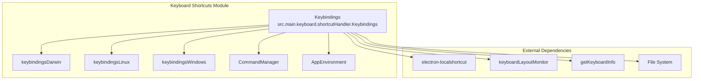
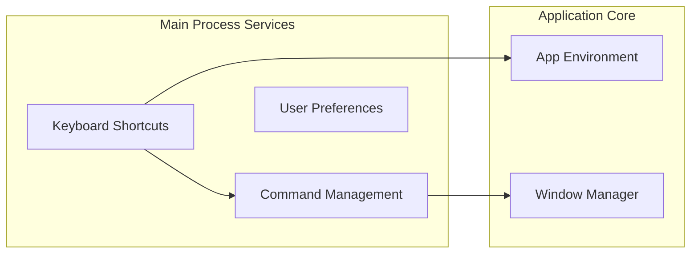
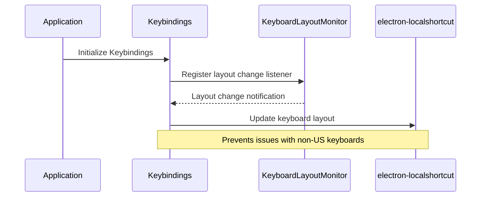
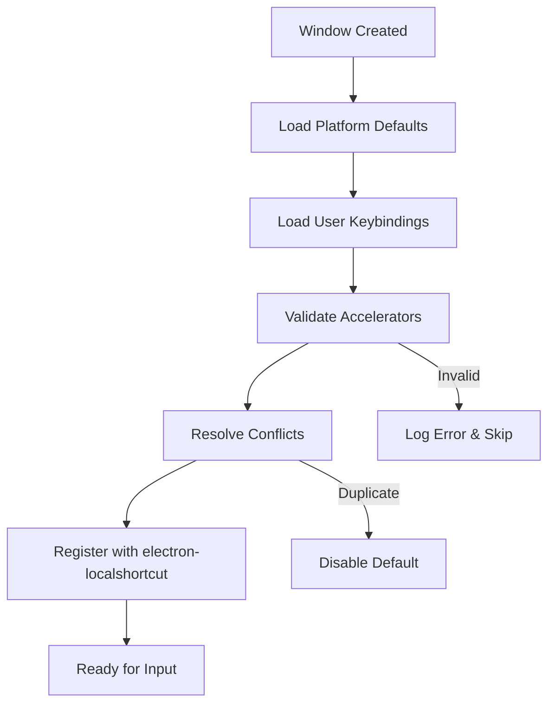
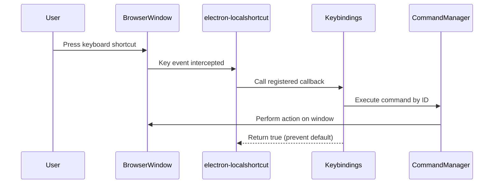
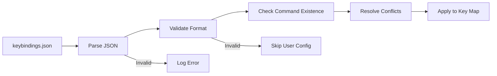

# Keyboard Shortcuts Module

## Introduction

The Keyboard Shortcuts module is a core component of the application's main process services, responsible for managing keyboard shortcuts and keybindings throughout the application. It provides a flexible system for handling user-defined shortcuts, platform-specific keybindings, and dynamic keyboard layout adaptation.

## Overview

The module serves as the central hub for keyboard input management, offering:
- Platform-specific default keybindings (Windows, macOS, Linux)
- User-customizable keybinding configuration
- Dynamic keyboard layout detection and adaptation
- Integration with the command system for executing actions
- Conflict resolution for duplicate shortcuts

## Architecture

### Core Components



### Module Dependencies



## Key Features

### 1. Platform-Specific Keybindings

The module automatically selects appropriate default keybindings based on the operating system:

- **macOS**: Uses `keybindingsDarwin` configuration
- **Linux**: Uses `keybindingsLinux` configuration  
- **Windows**: Uses `keybindingsWindows` configuration

### 2. User Customization

Users can customize keybindings through a `keybindings.json` file stored in the application's user data directory. The system supports:

- Overriding default shortcuts
- Disabling shortcuts (setting to empty string)
- Custom accelerator definitions

### 3. Keyboard Layout Adaptation

The module dynamically adapts to different keyboard layouts:



### 4. Conflict Resolution

The system implements sophisticated conflict resolution:

1. **Duplicate Detection**: Identifies duplicate accelerators in user configuration
2. **Default Override**: User shortcuts take precedence over defaults
3. **Automatic Unbinding**: Conflicting default shortcuts are automatically disabled

## Data Flow

### Keybinding Registration Process



### Shortcut Execution Flow



## Configuration Management

### User Configuration File

The user keybindings are stored in `keybindings.json`:

```json
{
  "file.save": "CmdOrCtrl+S",
  "file.save-as": "CmdOrCtrl+Shift+S",
  "file.new": "CmdOrCtrl+N"
}
```

### Configuration Loading Process



## Integration Points

### Command Manager Integration

The module integrates closely with the [Command Management](Command Management.md) system:

- **Command Execution**: Shortcuts trigger commands through `CommandManager.execute(id, win)`
- **Validation**: Ensures all keybound commands exist in development mode
- **Dynamic Registration**: Registers shortcuts for each editor window

### Window Manager Integration

Works with the [Window Management](Window Management.md) system to:

- Register shortcuts per window instance
- Handle window-specific key events
- Support multiple editor windows simultaneously

## Error Handling

The module implements comprehensive error handling:

1. **Invalid Accelerators**: Logs warnings for malformed accelerator strings
2. **Missing Commands**: In development mode, alerts about non-existent commands
3. **File System Errors**: Gracefully handles missing or corrupted configuration files
4. **Duplicate Shortcuts**: Prevents registration and logs conflicts

## Security Considerations

- **Safe Mode**: Disables user keybindings in safe mode
- **Validation**: Validates all accelerator strings before registration
- **File Access**: Uses proper file system operations with error handling

## Performance Optimizations

- **Lazy Loading**: User keybindings loaded only when needed
- **Map-based Storage**: Uses Maps for O(1) key lookup performance
- **Event-driven Updates**: Only updates keyboard layout when actually changed

## Development Features

### Debug Mode

When `MARKTEXT_DEBUG` and `MARKTEXT_DEBUG_KEYBOARD` are enabled:

- Logs keyboard layout changes
- Provides detailed debugging information
- Helps troubleshoot keyboard-related issues

### Development Validation

In development mode, the system:

- Validates all default keybindings against available commands
- Logs missing commands for accelerator assignments
- Helps ensure all shortcuts have valid targets

## API Reference

### Key Methods

- `getAccelerator(id)`: Retrieve accelerator for a command ID
- `registerAccelerator(win, accelerator, callback)`: Register a shortcut
- `registerEditorKeyHandlers(win)`: Register all shortcuts for a window
- `setUserKeybindings(userKeybindings)`: Update user keybindings
- `openConfigInFileManager()`: Open user configuration file

### Configuration Files

- **Platform Defaults**: `keybindingsDarwin.js`, `keybindingsLinux.js`, `keybindingsWindows.js`
- **User Configuration**: `keybindings.json` in user data directory

## Related Modules

- [Command Management](Command Management.md) - Executes commands triggered by shortcuts
- [User Preferences](User Preferences.md) - Manages user settings and preferences
- [Window Management](Window Management.md) - Handles window lifecycle and events
- [Application Core](Application Core.md) - Provides application environment and paths