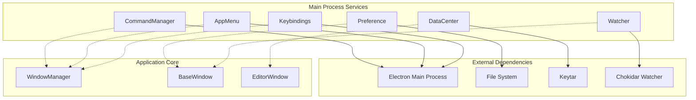
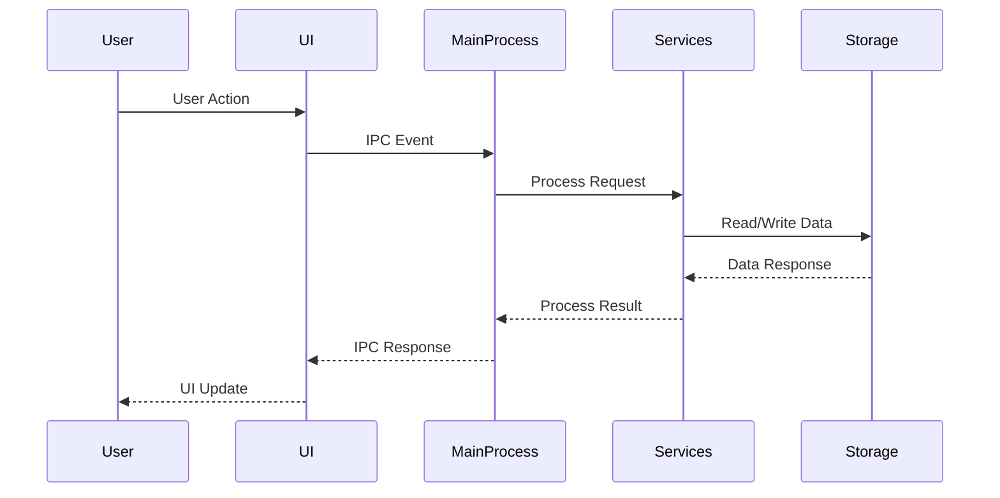

# Main Process Services Module

## Overview

The Main Process Services module is a critical component of the MarkText application that provides essential system-level services and functionality. This module acts as the backbone for managing application-wide operations, user preferences, data persistence, file system monitoring, user interface menus, and keyboard interactions.

## Purpose

The Main Process Services module serves as the central hub for:
- **Command Management**: Handling and executing application commands
- **User Preferences**: Managing user settings and configuration
- **Data Management**: Storing and retrieving application data including secure credentials
- **File System Monitoring**: Watching for file changes and updates
- **Application Menu**: Managing the main application menu and context menus
- **Keyboard Shortcuts**: Handling keyboard bindings and shortcuts

## Architecture

## Core Components

### 1. CommandManager
The CommandManager is responsible for registering, managing, and executing application commands. It provides a centralized way to handle user actions and system commands throughout the application.

**Key Responsibilities:**
- Register and manage application commands
- Execute commands with arguments
- Prevent duplicate command registration
- Verify default command availability

**Detailed Documentation:** [Command Management](Command Management.md)

### 2. Preference
The Preference system manages all user settings and configuration options. It provides persistent storage for user preferences with schema validation and automatic updates.

**Key Responsibilities:**
- Load and validate user preferences
- Handle preference changes and updates
- Manage default settings and theme detection
- Provide preference synchronization across windows

**Detailed Documentation:** [User Preferences](User Preferences.md)

### 3. DataCenter
The DataCenter handles application data storage, including secure credential management. It provides encrypted storage for sensitive information and manages image-related data.

**Key Responsibilities:**
- Store and retrieve application data
- Manage encrypted credentials using Keytar
- Handle image folder and cloud storage settings
- Provide secure data access APIs

**Detailed Documentation:** [Data Management](Data Management.md)

### 4. Watcher
The Watcher monitors file system changes and notifies the application about modifications. It uses Chokidar for cross-platform file watching with intelligent filtering.

**Key Responsibilities:**
- Monitor file and directory changes
- Filter irrelevant files and directories
- Handle file system events (add, change, delete)
- Manage ignore patterns for temporary files

**Detailed Documentation:** [File System Watcher](File System Watcher.md)

### 5. AppMenu
The AppMenu manages the application menu system, including recently used documents and dynamic menu updates. It handles menu creation, updates, and window-specific menu management.

**Key Responsibilities:**
- Create and manage application menus
- Handle recently used documents
- Update menu items dynamically
- Manage window-specific menu contexts

**Detailed Documentation:** [Application Menu](Application Menu.md)

### 6. Keybindings
The Keybindings system manages keyboard shortcuts and accelerators. It provides customizable keyboard mappings with platform-specific defaults and user-defined overrides.

**Key Responsibilities:**
- Manage keyboard shortcuts and accelerators
- Handle platform-specific key mappings
- Support user-defined keybindings
- Prevent conflicts and validate accelerators

**Detailed Documentation:** [Keyboard Shortcuts](Keyboard Shortcuts.md)

## Data Flow

## Integration with Other Modules

### Application Core Integration
The Main Process Services module integrates closely with the Application Core module:
- **WindowManager**: Services provide functionality to window management
- **BaseWindow**: Preferences and data services support window operations
- **EditorWindow**: File watching and command execution support editor functionality

### Cross-Module Communication
Services communicate with other modules through:
- **IPC Events**: Electron's inter-process communication
- **Event Emitters**: Node.js event system for internal communication
- **Shared State**: Common data structures and configuration

## Security Considerations

### Data Protection
- Sensitive data (like GitHub tokens) is encrypted using Keytar
- File system access is controlled and validated
- User preferences are validated against schemas

### Access Control
- Commands are validated before execution
- File watching respects system permissions
- Menu items can be enabled/disabled based on context

## Performance Optimization

### Caching Strategies
- Preferences are cached in memory after loading
- File watcher events are debounced to prevent excessive updates
- Menu items are reused when possible

### Resource Management
- Watchers are properly cleaned up when windows close
- Event listeners are managed to prevent memory leaks
- File system operations are optimized for large directories

## Error Handling

### Graceful Degradation
- Services continue operating even if individual components fail
- Fallback mechanisms for critical operations
- User notifications for non-critical errors

### Logging and Monitoring
- Comprehensive error logging using electron-log
- Debug information for development mode
- Performance monitoring for file operations

## Future Enhancements

### Planned Improvements
- Async/await pattern adoption for better performance
- Enhanced security for credential storage
- Improved file watching for large projects
- Better integration with cloud storage services

### Scalability Considerations
- Support for multiple workspace management
- Enhanced caching mechanisms
- Distributed configuration management
- Plugin system for extensible services

## Related Documentation

- [Application Core](Application Core.md) - Core application components and window management
- [Muya Editor Core](Muya Editor Core.md) - Editor functionality and content management
- [Renderer-Side Features](Renderer-Side Features.md) - Client-side functionality and commands