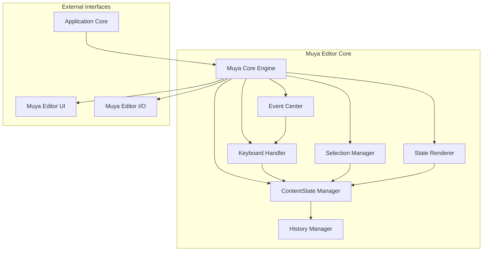
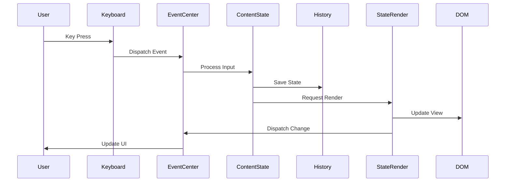

# Muya Editor Core

## Overview

The Muya Editor Core is the heart of the MarkText editor, providing a sophisticated markdown editing experience with real-time rendering, content management, and interactive features. It serves as the primary content editing engine that handles markdown parsing, rendering, user interactions, and state management.

## Purpose

Muya Editor Core is designed to deliver a seamless WYSIWYG (What You See Is What You Get) markdown editing experience by:
- Converting markdown text into rich HTML content in real-time
- Managing complex content state including blocks, selections, and history
- Handling user interactions through keyboard, mouse, and touch events
- Providing extensible plugin architecture for custom functionality
- Supporting advanced features like tables, code blocks, and mathematical expressions

## Architecture

The Muya Editor Core follows a modular architecture with clear separation of concerns:

## Core Components

### 1. Muya Core Engine (`src.muya.lib.index.Muya`)
The main entry point that orchestrates all editor functionality. It initializes sub-components, manages the editor container, and provides the public API for editor operations.

**Key Responsibilities:**
- Editor initialization and configuration
- Plugin system management
- Public API exposure
- Event coordination
- Content lifecycle management

### 2. ContentState Manager (`src.muya.lib.contentState.index.ContentState`)
The central state management system that maintains the editor's content structure, handles block operations, and coordinates all content-related changes.

**Key Responsibilities:**
- Block-based content representation
- Content manipulation and transformation
- Selection and cursor management
- Import/export operations
- State synchronization

### 3. State Renderer (`src.muya.lib.parser.render.index.StateRender`)
Responsible for converting the internal content state into visual HTML representation, managing real-time updates, and handling rendering optimizations.

**Key Responsibilities:**
- Real-time HTML generation
- Virtual DOM management
- Rendering performance optimization
- Syntax highlighting
- Mathematical expression rendering

### 4. Event Center (`src.muya.lib.eventHandler.event.EventCenter`)
A centralized event management system that handles both DOM events and custom application events, ensuring consistent event handling across the editor.

**Key Responsibilities:**
- DOM event binding and unbinding
- Custom event dispatching
- Event listener management
- Event conflict resolution

### 5. Keyboard Handler (`src.muya.lib.eventHandler.keyboard.Keyboard`)
Specialized input handling system that processes keyboard events, manages input composition, and coordinates with UI components for interactive features.

**Key Responsibilities:**
- Keyboard event processing
- Input method composition handling
- Shortcut key management
- UI component coordination

### 6. Selection Manager (`src.muya.lib.selection.index.Selection`)
Advanced text selection and cursor management system that provides precise control over text selection, cursor positioning, and range manipulation.

**Key Responsibilities:**
- Cursor positioning and management
- Text selection handling
- Range manipulation
- Selection state persistence

### 7. History Manager (`src.muya.lib.contentState.history.History`)
Implements undo/redo functionality with intelligent state tracking and efficient memory management for content changes.

**Key Responsibilities:**
- State change tracking
- Undo/redo operations
- Memory-efficient state storage
- History navigation

## Data Flow

## Key Features

### Real-time Markdown Rendering
- Instant conversion of markdown syntax to formatted HTML
- Live preview of formatting changes
- Syntax highlighting for code blocks
- Mathematical expression rendering (LaTeX)

### Advanced Content Management
- Block-based content architecture
- Hierarchical content organization
- Smart content parsing and validation
- Efficient content diffing and updates

### Interactive Editing Features
- Table editing with drag-and-drop support
- Image insertion and management
- Link creation and editing
- Emoji picker integration
- Format picker for text styling

### Extensible Plugin System
- Plugin registration and lifecycle management
- Custom UI component integration
- Event system for plugin communication
- Configurable editor options

### Robust State Management
- Comprehensive undo/redo system
- Cursor and selection persistence
- Content validation and error recovery
- State synchronization across components

## Integration Points

### Application Core Integration
The Muya Editor Core integrates with the Application Core module for:
- Window management and lifecycle
- Application state synchronization
- Menu and command integration
- Environment configuration

### UI Component Integration
Muya Editor UI components extend the core functionality with:
- Floating toolbars and menus
- Quick insert panels
- Format selection tools
- Image and table management interfaces

### I/O Operations Integration
Muya Editor I/O handles:
- HTML export functionality
- Markdown export with formatting preservation
- Content serialization and deserialization

## Performance Considerations

### Rendering Optimization
- Virtual DOM implementation for efficient updates
- Selective rendering of modified content blocks
- Token caching for syntax highlighting
- Lazy loading of complex content (diagrams, math)

### Memory Management
- Efficient state storage with structural sharing
- Cleanup of unused event listeners
- Image and resource caching strategies
- History stack size limitations

### Event Handling Efficiency
- Event delegation for reduced memory usage
- Debounced input processing
- Optimized selection change detection
- Batch DOM updates

## Error Handling and Recovery

### Crash Detection
- DOM mutation monitoring for corruption detection
- Automatic recovery mechanisms
- Error reporting and logging
- Graceful degradation for unsupported features

### Content Validation
- Input sanitization and validation
- Markdown syntax error handling
- Content structure integrity checks
- Recovery from invalid states

## Configuration Options

The Muya Editor Core supports extensive configuration including:
- Editor appearance (themes, fonts, sizes)
- Behavior settings (focus mode, spellcheck)
- Markdown compatibility options
- Rendering preferences
- Plugin-specific configurations

## API Reference

For detailed API documentation, refer to the individual component documentation:
- [ContentState Documentation](ContentState.md) - Comprehensive content management and state handling
- [StateRender Documentation](StateRender.md) - Real-time rendering and virtual DOM management
- [EventCenter Documentation](EventCenter.md) - Centralized event handling and dispatch system
- [Keyboard Handler Documentation](Keyboard Handler.md) - Input processing and keyboard interaction management
- [Selection Manager Documentation](Selection Manager.md) - Text selection and cursor positioning system

## Sub-module Documentation

The Muya Editor Core consists of several specialized sub-modules, each documented in detail:

### Content Management
- **[ContentState](ContentState.md)**: The core content management system that handles block-based content representation, state manipulation, and content operations. This module includes the History sub-component for undo/redo functionality.

### Rendering System
- **[StateRender](StateRender.md)**: Manages the conversion of internal content state to visual HTML representation, including real-time updates, virtual DOM management, and specialized content rendering (math, diagrams, code).

### Event Handling
- **[EventCenter](EventCenter.md)**: Provides centralized event management for both DOM events and custom application events, ensuring consistent event handling and listener management across the editor.

### Input Processing
- **[Keyboard Handler](Keyboard Handler.md)**: Specialized input handling system that processes keyboard events, manages input composition for international keyboards, and coordinates with UI components for interactive features.

### Selection Management
- **[Selection Manager](Selection Manager.md)**: Advanced text selection and cursor management system that provides precise control over text selection, cursor positioning, range manipulation, and selection state persistence.

## Dependencies

The Muya Editor Core module depends on:
- Application Core for window and application management
- Utility libraries for parsing and rendering
- External renderers for specialized content (math, diagrams)
- DOM manipulation libraries for efficient updates