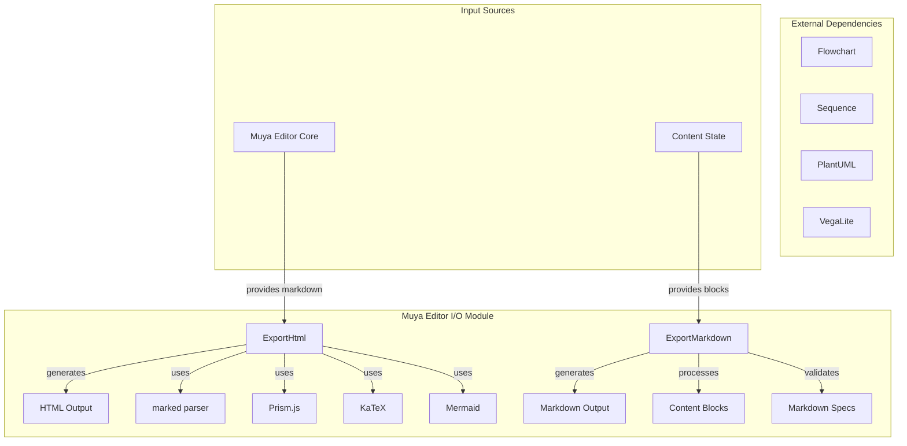
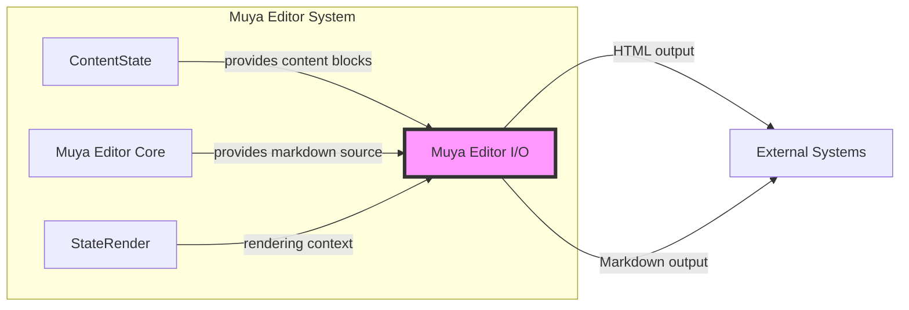

# Muya Editor I/O Module

## Overview

The Muya Editor I/O module is responsible for handling all input/output operations within the Muya Editor Core system. It provides comprehensive export functionality, allowing users to convert their markdown content into various formats including HTML and standard markdown. This module serves as the bridge between the editor's internal content representation and external file formats.

## Architecture

The I/O module is designed with a clean separation of concerns, providing specialized exporters for different output formats:

## Core Components

### ExportHtml
The HTML export component provides comprehensive HTML generation capabilities. For detailed information, see [HTML Export](HTML Export.md).

**Key capabilities:**
- **Syntax highlighting** via Prism.js
- **Mathematical expressions** via KaTeX
- **Diagrams and charts** (Mermaid, Flowchart, Sequence, PlantUML, Vega-Lite)
- **GitHub-flavored markdown** styling
- **Print optimization** for better printing experience
- **Header and footer** support for document formatting
- **Security** through HTML sanitization

### ExportMarkdown
The Markdown export component ensures standards-compliant markdown output. For detailed information, see [Markdown Export](Markdown Export.md).

**Key features:**
- **CommonMark specification** compliance
- **GitHub Flavored Markdown** support
- **Pandoc markdown** compatibility
- **Flexible list indentation** (configurable spacing)
- **GitLab compatibility** mode
- **Block-level content** processing

## Key Features

### HTML Export Capabilities
- **Rich content rendering**: Supports all markdown extensions including tables, footnotes, and task lists
- **Code syntax highlighting**: Automatic language detection and syntax coloring
- **Mathematical notation**: Full KaTeX support for inline and display math
- **Interactive diagrams**: Mermaid, flowchart, sequence, PlantUML, and Vega-Lite diagram rendering
- **Theme support**: GitHub markdown CSS with customizable styling
- **Print optimization**: Special handling for print media queries
- **Security**: HTML sanitization using DOMPurify configuration

### Markdown Export Capabilities
- **Standards compliance**: Adheres to CommonMark, GFM, and Pandoc specifications
- **List formatting**: Configurable indentation with support for different styles
- **Table normalization**: Proper table formatting with alignment support
- **Block content handling**: Comprehensive support for all block types
- **Front matter support**: YAML, TOML, and JSON front matter handling
- **Footnote processing**: Proper footnote formatting and referencing

## Integration with Muya Editor

The I/O module integrates seamlessly with the broader Muya Editor ecosystem:

## Usage Patterns

### HTML Export Process
1. **Content preparation**: Markdown content is processed through the marked parser
2. **Element rendering**: Mathematical expressions, code blocks, and diagrams are rendered
3. **Styling application**: CSS styles for GitHub markdown, syntax highlighting, and KaTeX are applied
4. **Document assembly**: Complete HTML document with headers, footers, and metadata is generated
5. **Security sanitization**: Final HTML is sanitized to prevent XSS attacks

### Markdown Export Process
1. **Block analysis**: Content blocks are analyzed and categorized
2. **Formatting application**: Appropriate markdown syntax is applied based on block type
3. **List processing**: Complex nested lists are properly indented and formatted
4. **Table normalization**: Tables are formatted with proper alignment and spacing
5. **Standards validation**: Output is validated against relevant markdown specifications

## Dependencies

The I/O module relies on several external libraries to provide its rich functionality:

- **marked**: Markdown parser for converting markdown to HTML
- **Prism.js**: Syntax highlighting for code blocks
- **KaTeX**: Mathematical expression rendering
- **DOMPurify**: HTML sanitization for security
- **Mermaid**: Diagram and flowchart rendering
- **Various diagram libraries**: Flowchart.js, sequence-diagram, plantuml, vega-lite

## Configuration Options

### HTML Export Options
- `title`: Document title for the HTML output
- `extraCss`: Additional CSS styles to apply
- `header`: Header content with left, center, and right sections
- `footer`: Footer content with left, center, and right sections
- `printOptimization`: Enable print-specific optimizations
- `toc`: Table of contents content

### Markdown Export Options
- `listIndentation`: List indentation style ('dfm', 'number', or custom)
- `isGitlabCompatibilityEnabled`: Enable GitLab-specific markdown features
- `blocks`: Content blocks to export

## Security Considerations

The I/O module implements several security measures:
- **HTML sanitization**: All HTML output is sanitized using DOMPurify
- **Configuration-based security**: Export configurations control allowed content
- **Safe diagram rendering**: Diagram libraries are loaded in a controlled manner
- **Input validation**: Markdown content is validated before processing

## Performance Optimizations

- **Lazy loading**: Diagram renderers are loaded only when needed
- **Caching**: Rendered content can be cached for repeated exports
- **Async processing**: Heavy operations like diagram rendering are performed asynchronously
- **Memory management**: Temporary DOM elements are properly cleaned up

## Related Documentation

- [Muya Editor Core](Muya Editor Core.md) - Core editing functionality
- [Muya Editor UI](Muya Editor UI.md) - User interface components
- [Application Core](Application Core.md) - Application-level components
- [Main Process Services](Main Process Services.md) - Background services