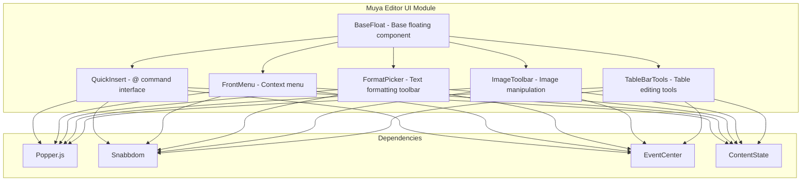
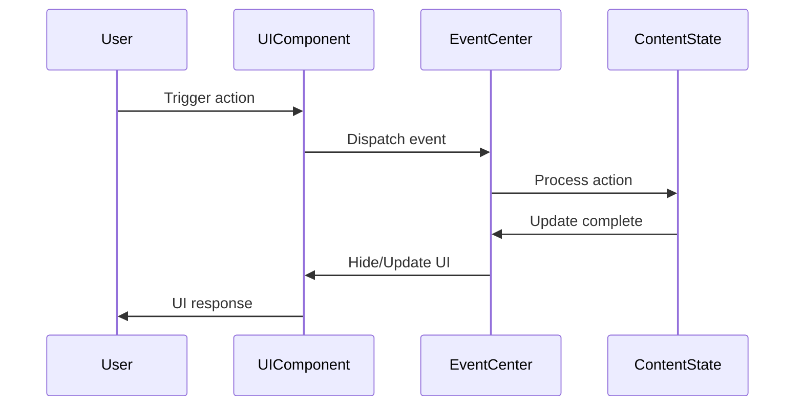

# Muya Editor UI Module

## Overview

The Muya Editor UI module provides the user interface components for the Muya markdown editor. It handles all floating UI elements, toolbars, menus, and interactive components that enhance the editing experience. This module is built on top of the Muya Editor Core and provides the visual interface layer for user interactions.

## Architecture

The Muya Editor UI module follows a component-based architecture where each UI element is implemented as a specialized class that extends from base components. The module uses a floating panel system managed by Popper.js for positioning and Snabbdom for efficient virtual DOM rendering.



## Core Components

### [BaseFloat](BaseFloat.md)
The foundational floating component that provides common functionality for all floating UI elements. It handles positioning, event management, lifecycle, and visibility control using Popper.js for positioning and resize detection.

**Key Features:**
- Popper.js integration for smart positioning
- Automatic resize detection and adjustment
- Event delegation and cleanup
- Scroll-based auto-hide functionality
- Escape key handling for dismissal

### [QuickInsert](QuickInsert.md)
Provides the "@" command interface for quick content insertion. Users can type "@" to access a searchable menu of content blocks and formatting options.

**Key Features:**
- Fuzzy search using fuzzaldrin
- Categorized content types (basic blocks, advanced blocks, etc.)
- Keyboard navigation and selection
- Real-time filtering and rendering

### [FrontMenu](FrontMenu.md)
Contextual menu that appears when interacting with content blocks. Provides block-level operations like duplicate, delete, and transform options.

**Key Features:**
- Context-aware menu items
- Sub-menu support for transform operations
- Block type detection and validation
- Keyboard shortcuts display

### [FormatPicker](FormatPicker.md)
Inline formatting toolbar for text selection. Appears when text is selected and provides quick access to formatting options.

**Key Features:**
- Selection-based activation
- Active format highlighting
- Inline formatting application
- Persistent toolbar for link/image editing

### [ImageToolbar](ImageToolbar.md)
Specialized toolbar for image manipulation and editing. Provides image alignment, editing, and deletion options.

**Key Features:**
- Image alignment controls (inline, left, center, right)
- Image editing integration
- Deletion with confirmation
- Active alignment state indication

### [TableTools](TableTools.md)
Contextual tools for table editing operations. Appears when interacting with table elements and provides row/column manipulation options.

**Key Features:**
- Row and column insertion/deletion
- Table structure modification
- Context-sensitive tool display
- Direct table state manipulation

## Event System Integration

All UI components integrate with the Muya event system through the EventCenter, enabling coordinated interactions between UI elements and the editor core.



## Styling and Theming

Each UI component includes its own CSS file for component-specific styling. The module uses CSS classes with the `ag-` prefix for consistent naming and to avoid conflicts.

**Common CSS Patterns:**
- `.ag-float-container`: Container for floating elements
- `.ag-float-wrapper`: Wrapper with positioning
- `.ag-popper-arrow`: Arrow indicator for popper elements
- `.ag-[component-name]`: Component-specific classes

## Usage Patterns

### Creating a Floating UI Component

1. Extend `BaseFloat` or `BaseScrollFloat`
2. Implement component-specific rendering logic
3. Subscribe to relevant events
4. Handle user interactions and update ContentState
5. Manage component lifecycle (show/hide/destroy)

### Event Subscription Pattern

```javascript
// Subscribe to events in constructor or init method
eventCenter.subscribe('muya-[component-name]', (data) => {
  if (data.reference) {
    this.show(data.reference)
    this.render()
  } else {
    this.hide()
  }
})
```

### Content State Integration

UI components interact with ContentState to perform actual editing operations:

```javascript
// Example: Format text
const { contentState } = this.muya
contentState.format(item.type)

// Example: Update paragraph type
contentState.updateParagraph(item.label)

// Example: Delete content
contentState.deleteParagraph()
```

## Related Documentation

- [Muya Editor Core](Muya Editor Core.md) - Core editing engine and state management
- [Application Core](Application Core.md) - Application-level services and window management
- [Main Process Services](Main Process Services.md) - Command management and preferences

## Module Dependencies

The Muya Editor UI module depends on:

1. **Muya Editor Core**: For content state management and event coordination
2. **Popper.js**: For intelligent positioning of floating elements
3. **Snabbdom**: For efficient virtual DOM rendering and updates
4. **Element Resize Detector**: For automatic resize handling

This module is designed to be modular and extensible, allowing for easy addition of new UI components while maintaining consistent behavior and styling across the editor interface.