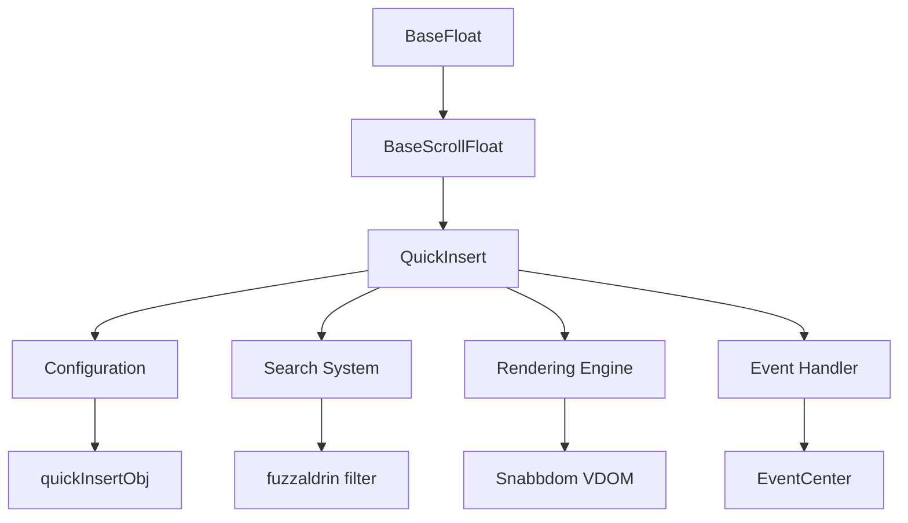
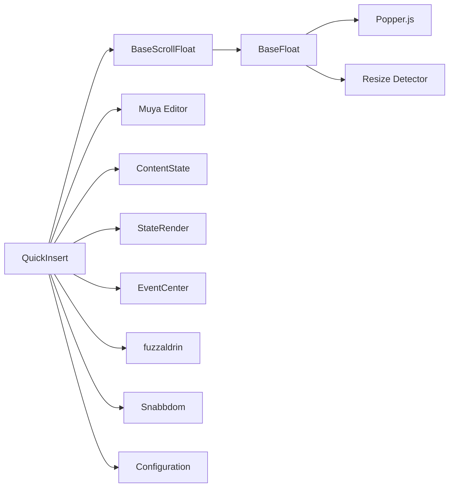
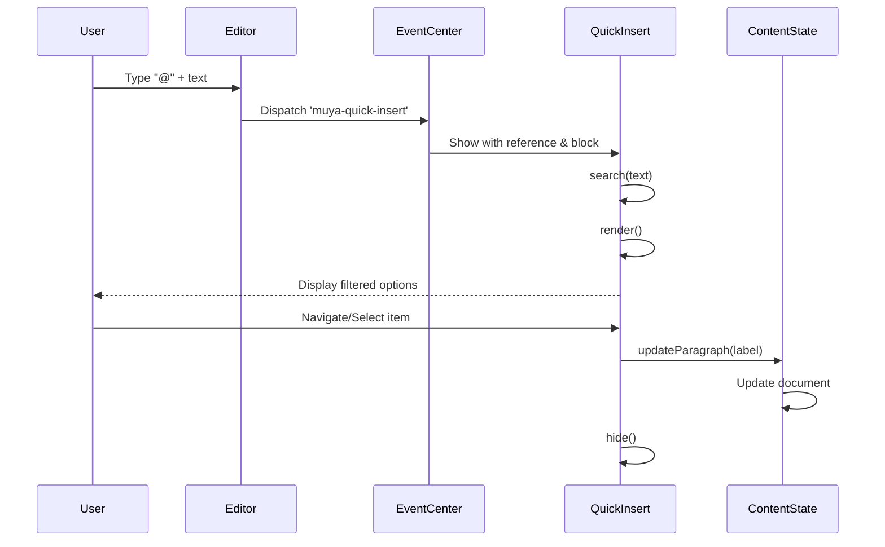
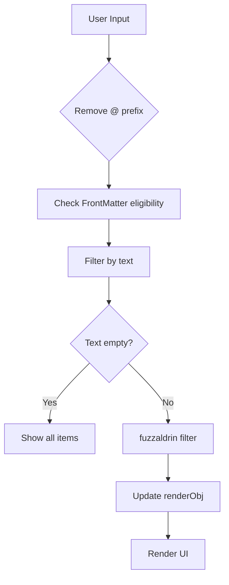
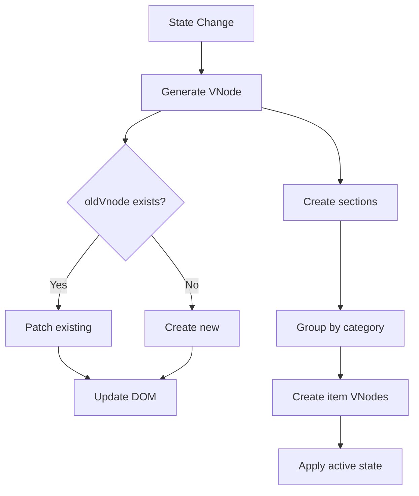

# QuickInsert Module Documentation

## Introduction

The QuickInsert module is a sophisticated UI component within the Muya Editor that provides an intuitive popup interface for quickly inserting various content blocks into markdown documents. It serves as a command palette specifically designed for content creation, allowing users to insert paragraphs, headers, lists, tables, diagrams, and other markdown elements through a searchable, keyboard-navigable interface.

## Core Purpose

The QuickInsert module transforms the traditional markdown editing experience by providing:
- **Visual Content Discovery**: Users can browse available content types through an icon-rich interface
- **Fuzzy Search Integration**: Leverages the `fuzzaldrin` library for intelligent content filtering
- **Keyboard-First Navigation**: Full keyboard navigation support with arrow keys and shortcuts
- **Context-Aware Insertion**: Dynamically adjusts available options based on document context
- **Seamless Integration**: Works harmoniously with the Muya editor's content state management

## Architecture Overview

### Component Hierarchy



### Module Dependencies



## Core Components

### QuickInsert Class

The `QuickInsert` class extends `BaseScrollFloat` and serves as the main controller for the quick insert functionality.

**Key Properties:**
- `reference`: DOM reference element for positioning
- `renderObj`: Current render configuration object
- `renderArray`: Flattened array of available items
- `activeItem`: Currently highlighted item
- `block`: Current content block being edited

**Core Methods:**
- `render()`: Renders the UI using virtual DOM
- `search(text)`: Filters items based on user input
- `selectItem(item)`: Handles item selection and content insertion
- `listen()`: Sets up event listeners

### Configuration System

The module uses a comprehensive configuration object (`quickInsertObj`) that organizes content types into logical categories:

```javascript
{
  'basic block': [paragraph, horizontalLine, frontMatter],
  'header': [heading1-6],
  'advanced block': [table, math, html, code, quote],
  'list block': [orderedList, bulletList, todoList],
  'diagram': [vega, flowchart, sequence, plantuml, mermaid]
}
```

Each item contains:
- `title`: Display name
- `subTitle`: Markdown syntax preview
- `label`: Internal identifier
- `shortCut`: Keyboard shortcut
- `icon`: Visual icon

## Data Flow Architecture

### User Interaction Flow



### Search and Filter Process



## Rendering System

### Virtual DOM Architecture

The QuickInsert module utilizes Snabbdom for efficient virtual DOM rendering:



### UI Structure

The rendered interface follows this hierarchy:
```
.ag-quick-insert (container)
├── section (category)
│   ├── title (category name)
│   └── item (multiple)
│       ├── icon-container
│       │   └── icon
│       ├── description
│       │   ├── big-title
│       │   └── sub-title
│       └── short-cut
└── no-result (when empty)
```

## Event Handling System

### Keyboard Navigation

The module implements comprehensive keyboard navigation:

- **ArrowUp/ArrowDown**: Navigate through items
- **Tab**: Move to next item
- **Enter**: Select current item
- **Escape**: Close popup (inherited)

### Event Subscription

```javascript
eventCenter.subscribe('muya-quick-insert', (reference, block, status) => {
  // Handle show/hide logic
})
```

## Content Integration

### Block Type Support

The QuickInsert module supports insertion of various markdown block types:

| Category | Block Types | Special Handling |
|----------|-------------|------------------|
| Basic | Paragraph, Horizontal Line, Front Matter | Front Matter context check |
| Headers | Heading 1-6 | Direct paragraph update |
| Advanced | Table, Math, HTML, Code, Quote | Block-specific rendering |
| Lists | Ordered, Bullet, Todo | List state management |
| Diagrams | Vega, Flowchart, Sequence, PlantUML, Mermaid | External library integration |

### Context-Aware Features

- **Front Matter Detection**: Checks if front matter can be inserted at current position
- **Paragraph Handling**: Special case for paragraph insertion (no block transformation)
- **Cursor Management**: Updates cursor position after insertion
- **Text Cleanup**: Removes trigger character (@) from block text

## Integration with Muya Editor

### ContentState Integration

The QuickInsert module works closely with the [ContentState](ContentState.md) system:

```javascript
// Content state updates
contentState.updateParagraph(item.label, true)
contentState.partialRender() // For paragraphs
contentState.canInserFrontMatter(this.block) // Context check
```

### EventCenter Communication

Communication happens through the [EventCenter](EventCenter.md) using the 'muya-quick-insert' event channel.

### Selection Management

Coordinates with the [Selection](Selection.md) system for cursor positioning and text manipulation.

## Performance Optimizations

### Efficient Rendering

- **Virtual DOM**: Uses Snabbdom for minimal DOM updates
- **Lazy Loading**: Only renders when visible
- **Debounced Search**: Implicit debouncing through event handling

### Memory Management

- **Reference Cleanup**: Clears references on hide
- **Event Cleanup**: Proper event listener management
- **DOM Cleanup**: Removes elements when hidden

## Error Handling

### Graceful Degradation

- **No Results**: Shows "No result" message when search yields no matches
- **Invalid Items**: Skips invalid items during rendering
- **Missing Icons**: Handles missing icon assets gracefully

### State Validation

- **Block Validation**: Checks block existence before operations
- **Context Validation**: Validates front matter insertion context
- **Item Validation**: Ensures selected items are valid

## Extension Points

### Custom Item Types

The modular configuration system allows for easy extension:

```javascript
// Example: Adding custom block type
quickInsertObj['custom blocks'] = [{
  title: 'Custom Block',
  subTitle: 'Custom syntax',
  label: 'custom',
  shortCut: 'Cmd+K',
  icon: customIcon
}]
```

### Plugin Integration

The static `pluginName` property enables plugin system integration:
```javascript
static pluginName = 'quickInsert'
```

## Styling and Theming

### CSS Architecture

The module includes dedicated styling (`index.css`) that provides:
- **Responsive Layout**: Adapts to different screen sizes
- **Visual Hierarchy**: Clear distinction between categories and items
- **Active States**: Visual feedback for selected items
- **Icon Integration**: Proper icon sizing and positioning

### Theme Compatibility

The styling system integrates with the overall Muya theme system, ensuring consistent appearance across different editor themes.

## Testing Considerations

### Unit Testing Areas

- **Search Functionality**: Test fuzzy search with various inputs
- **Item Selection**: Verify correct content insertion
- **Keyboard Navigation**: Test all keyboard interactions
- **Context Awareness**: Test front matter validation
- **Event Handling**: Verify proper event subscription/cleanup

### Integration Testing

- **ContentState Integration**: Test actual content updates
- **EventCenter Communication**: Verify event handling
- **UI Rendering**: Test virtual DOM updates
- **Positioning**: Test popup positioning relative to reference

## Future Enhancements

### Potential Improvements

1. **Recent Items**: Track and show recently used items
2. **Custom Shortcuts**: Allow user-defined shortcuts
3. **Preview Mode**: Show live preview of selected items
4. **Fuzzy Matching**: Improve search algorithm for better matches
5. **Accessibility**: Enhanced screen reader support
6. **Performance**: Virtual scrolling for large item lists

### API Extensions

- **Custom Renderers**: Allow custom item rendering
- **Dynamic Categories**: Support runtime category modification
- **Async Loading**: Support async item loading
- **Multi-language**: Support for internationalization

## Related Documentation

- [BaseFloat](BaseFloat.md) - Base floating UI component
- [BaseScrollFloat](BaseScrollFloat.md) - Scrollable floating component base
- [ContentState](ContentState.md) - Content state management
- [EventCenter](EventCenter.md) - Event handling system
- [StateRender](StateRender.md) - Rendering system
- [Muya Editor](Muya.md) - Main editor documentation