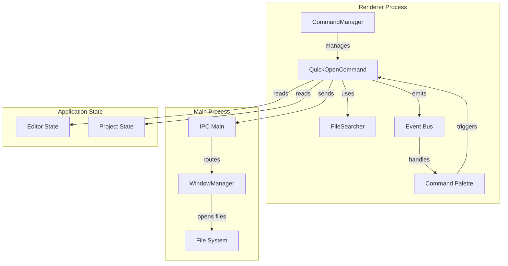
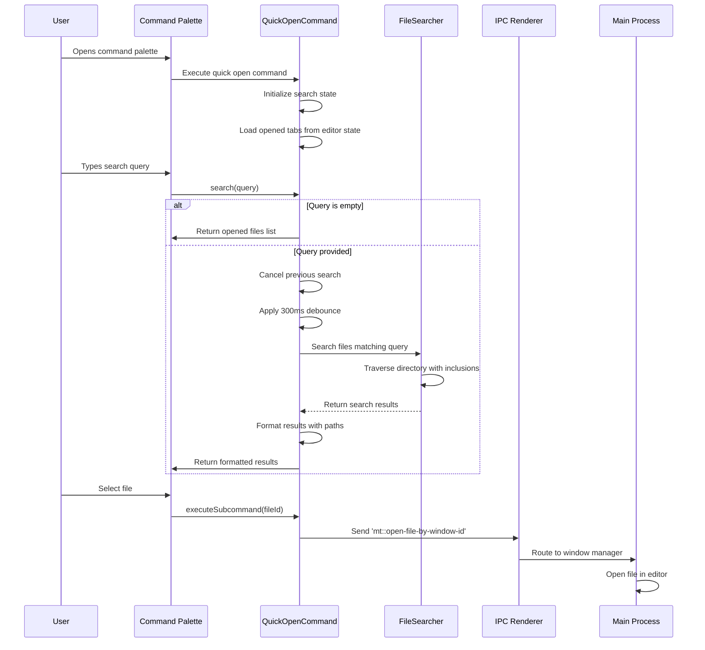
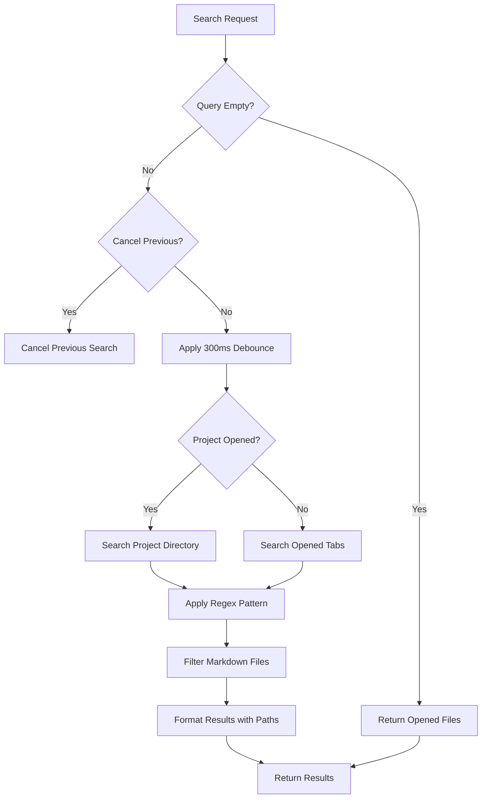
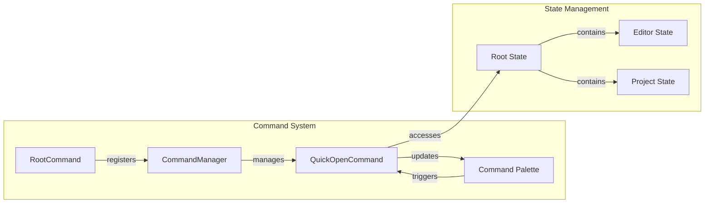

# QuickOpenCommand Module Documentation

## Introduction

The QuickOpenCommand module provides a fast file search and navigation feature within the MarkText application. It enables users to quickly locate and open files through a command palette interface, supporting both currently opened files and files within the project directory structure. The module integrates with the application's command system and provides intelligent search capabilities with markdown file filtering.

## Architecture Overview

The QuickOpenCommand module is part of the renderer-side command system and serves as a specialized command for file discovery and opening operations. It operates within the renderer process and communicates with the main process for file operations.



## Core Components

### QuickOpenCommand Class

The `QuickOpenCommand` class is the primary component that implements the quick open functionality. It extends the command pattern and integrates with the application's command management system.

**Key Properties:**
- `id`: 'file.quick-open' - Unique identifier for the command
- `description`: 'File: Quick Open' - Human-readable description
- `placeholder`: 'Search file to open' - UI placeholder text
- `shortcut`: null - No default keyboard shortcut

**State Management:**
- `_editorState`: Reference to the editor state for accessing open tabs
- `_folderState`: Reference to the project state for accessing project tree
- `_directorySearcher`: FileSearcher instance for directory traversal
- `_cancelFn`: Function reference for canceling ongoing searches

## Data Flow

### Search Operation Flow



### File Search Strategy

The module employs a multi-tiered search strategy:

1. **Empty Query**: Returns list of currently opened files
2. **Project Directory Search**: Searches within the opened project directory
3. **Opened Files Search**: Searches through tabs not in current project
4. **Pattern Matching**: Uses regex with special character escaping



## Component Interactions

### Integration with Command System

The QuickOpenCommand integrates with the broader command management system through the RootCommand infrastructure:



### File System Integration

The module interacts with the file system through the FileSearcher utility and path management functions:

- **FileSearcher**: Handles directory traversal and file discovery
- **Path Utilities**: Validates file paths and markdown extensions
- **IPC Communication**: Sends file open requests to main process

## Key Features

### 1. Intelligent Search Filtering

- **Markdown Focus**: Automatically filters for markdown files using `MARKDOWN_INCLUSIONS`
- **Extension Handling**: Smart handling of file extensions in search queries
- **Pattern Escaping**: Proper regex escaping for special characters

### 2. Performance Optimization

- **Search Cancellation**: Ability to cancel ongoing searches
- **Debounce Mechanism**: 300ms delay to prevent excessive searches
- **Result Limiting**: Caps results at 30 files to maintain responsiveness

### 3. Path Management

- **Relative Path Display**: Shows relative paths for files within project
- **Absolute Path Fallback**: Displays full paths for external files
- **Path Truncation**: Handles long paths intelligently

## Dependencies

### Internal Dependencies

- **[CommandManager](CommandManager.md)**: Command registration and execution framework
- **[FileSearcher](FileSearcher.md)**: File system search functionality
- **[AppPaths](AppPaths.md)**: Path utility functions and markdown file detection

### External Dependencies

- **Electron IPC**: Communication with main process for file operations
- **Event Bus**: Internal event system for UI updates

## Error Handling

The module implements several error handling strategies:

1. **Search Cancellation**: Graceful handling of search cancellation
2. **Timeout Management**: Proper cleanup of delayed operations
3. **IPC Error Propagation**: Errors during file opening are handled by the main process
4. **State Validation**: Checks for valid project and editor state before operations

## Usage Patterns

### Command Execution

```javascript
// Command is triggered through the command palette
bus.$emit('show-command-palette', quickOpenCommand)

// User searches for files
const results = await quickOpenCommand.search('readme')

// User selects a file
await quickOpenCommand.executeSubcommand(filePath)
```

### Search Result Format

Results are formatted with the following structure:
```javascript
{
  id: '/absolute/path/to/file.md',
  title: 'Optional long title for display',
  description: 'relative/path/to/file.md'
}
```

## Performance Considerations

1. **Search Debouncing**: 300ms delay prevents excessive file system operations
2. **Result Limiting**: Maximum 30 results to maintain UI responsiveness
3. **Cancellation Support**: Ongoing searches can be cancelled to prevent resource waste
4. **Regex Optimization**: Special character handling for efficient pattern matching

## Future Enhancements

Potential improvements for the QuickOpenCommand module:

1. **Fuzzy Search**: Implement fuzzy matching for more flexible search
2. **Search History**: Cache and prioritize frequently opened files
3. **File Preview**: Show file content previews in search results
4. **Advanced Filtering**: Support for file type and date range filtering
5. **Search Scoring**: Implement relevance scoring for better result ordering