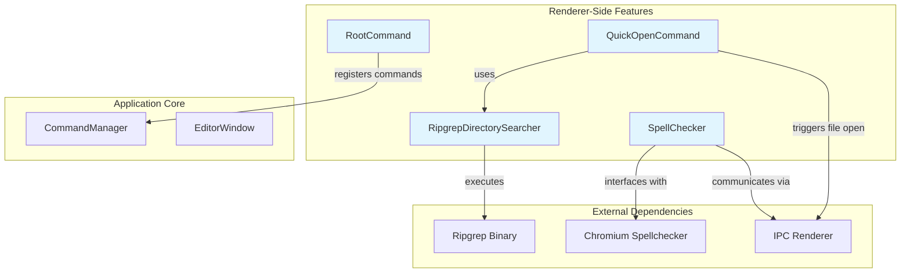
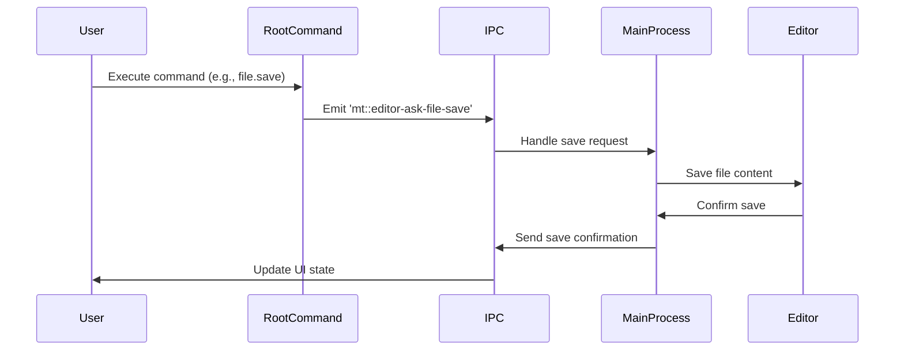

# Renderer-Side Features Module

## Overview

The Renderer-Side Features module provides user-facing functionality and commands that execute within the renderer process of the MarkText application. This module serves as the primary interface between user interactions and the application's core functionality, handling command execution, file search operations, and spell checking capabilities.

## Architecture

## Core Components

### 1. Command System
The [RootCommand](RootCommand.md) class serves as the foundation for all user commands in the application. It provides a comprehensive set of commands organized into logical categories:

- **File Operations**: New tabs, open/save files, import/export
- **Edit Operations**: Undo/redo, find/replace, paragraph manipulation
- **Format Operations**: Text formatting, links, images
- **View Operations**: Toggle UI elements, change themes
- **Window Management**: Minimize, fullscreen, zoom controls

### 2. Quick File Access
The [QuickOpenCommand](QuickOpenCommand.md) enables fast file navigation and opening through a searchable interface. It integrates with the file system to provide:

- Real-time file search across open projects
- Recently opened file management
- Fuzzy search capabilities
- Integration with the RipgrepDirectorySearcher for efficient file discovery

### 3. Advanced Search
A high-performance text search implementation based on ripgrep, the [RipgrepDirectorySearcher](RipgrepDirectorySearcher.md) provides:

- Fast text search across multiple directories
- Regular expression support
- Configurable search parameters (case sensitivity, whole words, etc.)
- Unicode and multiline search support
- Streaming results for responsive UI

### 4. Spell Checking
Integrated spell checking functionality that leverages Chromium's built-in spell checker, the [SpellChecker](SpellChecker.md) provides:

- Real-time spell checking in the editor
- Multi-language support (platform-dependent)
- Automatic language detection on macOS
- Configurable enable/disable functionality
- Dictionary management

## Data Flow

## Integration Points

### With Application Core
- **CommandManager**: Registers and manages all renderer-side commands
- **EditorWindow**: Provides the context for command execution
- **IPC Communication**: Bridges renderer and main process operations

### With Main Process Services
- **File System**: File operations, save/load functionality
- **Preferences**: Theme changes, user settings
- **Menu System**: Command availability and state

### With Muya Editor
- **Event Bus**: Communicates editor events (format, paragraph changes)
- **State Management**: Updates editor state based on commands
- **UI Updates**: Reflects command execution in the editor interface

## Key Features

### Command Categories
1. **File Management**: Complete file lifecycle operations
2. **Text Editing**: Comprehensive editing capabilities
3. **Document Formatting**: Rich text formatting options
4. **View Customization**: Flexible UI configuration
5. **Window Control**: Application window management

### Search Capabilities
- **Quick Open**: Instant file access across projects
- **Text Search**: Advanced pattern matching with ripgrep
- **Real-time Results**: Streaming search for responsive UX

### Language Support
- **Spell Checking**: Multi-language spell checking
- **Auto-detection**: Platform-specific language handling
- **Dictionary Management**: Dynamic language switching

## Error Handling

The module implements robust error handling:
- Command execution validation
- Search operation cancellation
- Spell checker fallback mechanisms
- IPC communication error recovery

## Performance Considerations

- **Lazy Loading**: Commands loaded on-demand
- **Search Optimization**: Ripgrep for fast file search
- **Result Limiting**: Prevents UI blocking with large result sets
- **Cancellation Support**: Allows interruption of long-running operations

## Security Notes

- Command execution validated before IPC communication
- File path sanitization in search operations
- Safe external link opening with shell integration
- Controlled access to native platform features

---

*This documentation covers the renderer-side functionality of MarkText. For main process services, see [Main Process Services](Main%20Process%20Services.md), and for editor core functionality, see [Muya Editor Core](Muya%20Editor%20Core.md).*