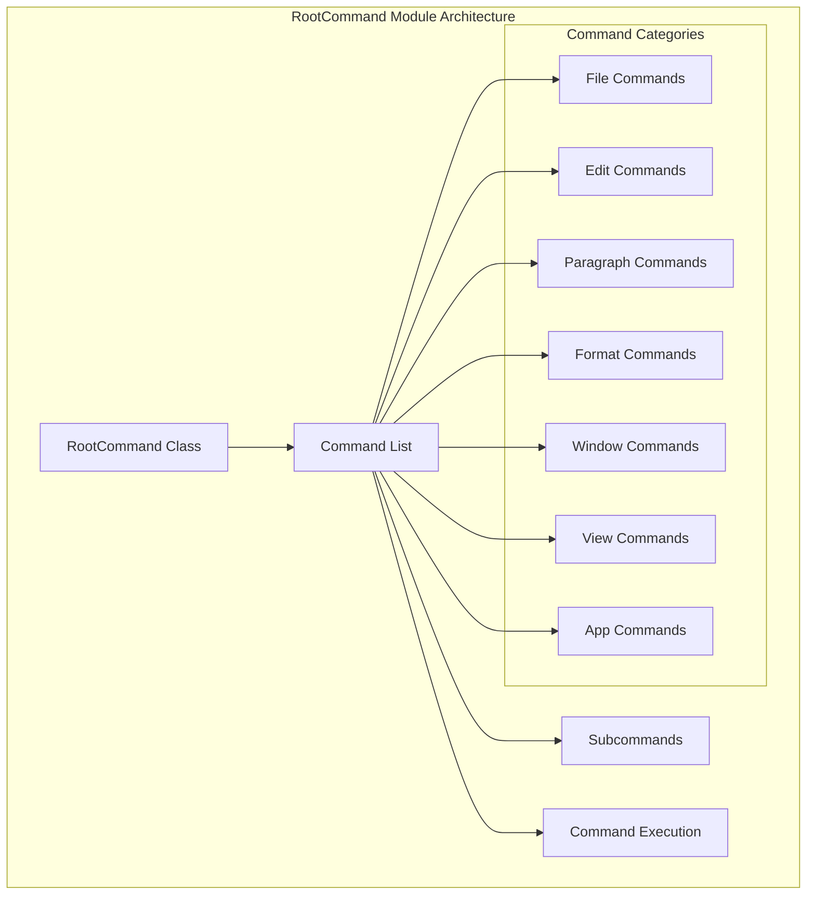
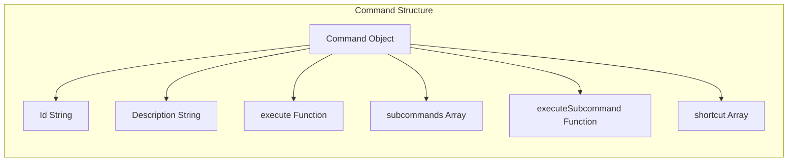
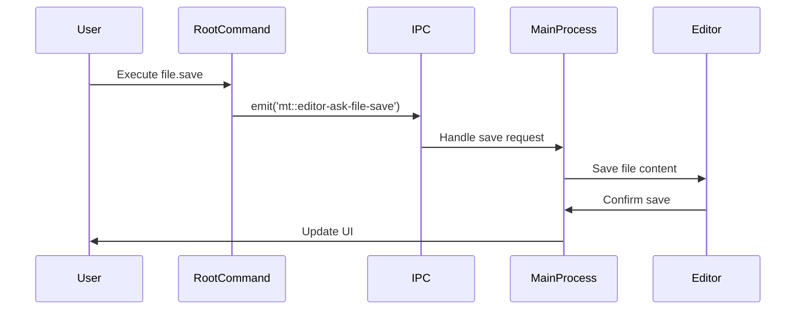
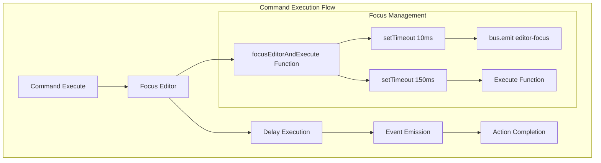

# RootCommand Module Documentation

## Introduction

The RootCommand module serves as the central command registry and execution hub for the MarkText application. It defines and manages all static commands available in the application, providing a unified interface for handling user actions ranging from file operations to text formatting and window management. This module acts as the primary bridge between user interactions and application functionality, implementing the command pattern to ensure consistent and maintainable command execution across the renderer process.

## Architecture Overview

The RootCommand module is architected as a command pattern implementation with a hierarchical structure that supports both simple commands and complex command groups with subcommands. The module exports a comprehensive list of commands that are loaded into the application's command center, providing functionality across multiple domains including file operations, editing, paragraph formatting, text formatting, window management, and application preferences.

## Core Components

### RootCommand Class

The `RootCommand` class serves as the base command structure, providing a consistent interface for all commands in the system. It defines the essential properties and methods that all commands must implement.

**Properties:**
- `id`: Command identifier (set to '#' for root)
- `description`: Command description (set to '#' for root)
- `subcommands`: Array of child commands
- `subcommandSelectedIndex`: Currently selected subcommand index

**Methods:**
- `run()`: Async method for command initialization
- `unload()`: Async method for command cleanup
- `execute()`: Async method that throws an error (root command cannot be executed directly)

### Command Structure

Each command in the system follows a standardized structure that supports various execution patterns:

**Command Properties:**
- `id`: Unique identifier for the command (e.g., 'file.new-tab')
- `description`: Human-readable description of the command
- `execute`: Async function that performs the command action
- `subcommands`: Optional array of child commands for hierarchical commands
- `executeSubcommand`: Optional function for handling subcommand execution
- `shortcut`: Optional keyboard shortcut array

## Command Categories

### File Commands

File commands handle all file-related operations including creating, opening, saving, and exporting files. These commands interact with the main process through IPC channels to perform file system operations.

**Key Commands:**
- `file.new-tab`: Creates a new untitled tab
- `file.new-window`: Opens a new editor window
- `file.open-file`: Opens file dialog for file selection
- `file.open-folder`: Opens folder dialog for directory selection
- `file.save`: Saves the current file
- `file.save-as`: Saves the current file with a new name
- `file.print`: Opens print dialog
- `file.close-tab`: Closes the current tab
- `file.close-window`: Closes the current window

### Edit Commands

Edit commands provide text editing functionality including undo/redo operations, text manipulation, and search functionality. These commands primarily interact with the editor component through the event bus.

**Key Commands:**
- `edit.undo`: Reverses the last edit operation
- `edit.redo`: Reapplies the last undone operation
- `edit.duplicate`: Duplicates selected text
- `edit.create-paragraph`: Creates a new paragraph
- `edit.delete-paragraph`: Deletes the current paragraph
- `edit.find`: Opens find dialog
- `edit.replace`: Opens find and replace dialog
- `edit.find-in-folder`: Searches for text in the current folder

### Paragraph Commands

Paragraph commands handle markdown paragraph-level formatting, allowing users to quickly apply structural formatting to their content.

**Key Commands:**
- `paragraph.heading-1` through `paragraph.heading-6`: Heading levels
- `paragraph.upgrade-heading`: Increases heading level
- `paragraph.degrade-heading`: Decreases heading level
- `paragraph.table`: Inserts a table
- `paragraph.code-fence`: Creates a code block
- `paragraph.quote-block`: Creates a blockquote
- `paragraph.math-formula`: Inserts a math formula block
- `paragraph.html-block`: Inserts an HTML block
- `paragraph.order-list`: Creates an ordered list
- `paragraph.bullet-list`: Creates a bullet list
- `paragraph.task-list`: Creates a task list
- `paragraph.horizontal-line`: Inserts a horizontal rule
- `paragraph.front-matter`: Inserts YAML front matter

### Format Commands

Format commands handle inline text formatting for markdown elements, applying styling to selected text or text at the cursor position.

**Key Commands:**
- `format.strong`: Bold text
- `format.emphasis`: Italic text
- `format.underline`: Underlined text
- `format.highlight`: Highlighted text
- `format.superscript`: Superscript text
- `format.subscript`: Subscript text
- `format.inline-code`: Inline code
- `format.inline-math`: Inline math
- `format.strike`: Strikethrough text
- `format.hyperlink`: Create hyperlink
- `format.image`: Insert image
- `format.clear-format`: Remove formatting

### Window Commands

Window commands manage application window behavior and appearance settings.

**Key Commands:**
- `window.minimize`: Minimizes the current window
- `window.toggle-always-on-top`: Toggles always on top mode
- `window.toggle-full-screen`: Toggles full screen mode
- `file.zoom`: Zoom level control with subcommands
- `window.change-theme`: Theme selection with subcommands

### View Commands

View commands control the editor's display modes and interface elements.

**Key Commands:**
- `view.source-code-mode`: Toggles source code mode
- `view.typewriter-mode`: Toggles typewriter mode
- `view.focus-mode`: Toggles focus mode
- `view.toggle-sidebar`: Shows/hides sidebar
- `view.toggle-tabbar`: Shows/hides tab bar
- `view.text-direction`: Text direction control

## Command Execution Flow

The command execution follows a consistent pattern that ensures proper focus management and event handling:

## Integration with System Components

### Event Bus Integration

The RootCommand module heavily relies on the event bus for communication with other renderer-side components. Commands emit events that are handled by various parts of the application.

**Key Event Patterns:**
- `bus.$emit('editor-focus')`: Ensures editor has focus before executing commands
- `bus.$emit('paragraph', type)`: Applies paragraph formatting
- `bus.$emit('format', type)`: Applies inline formatting
- `bus.$emit('view:toggle-view-entry', mode)`: Toggles view modes
- `bus.$emit('showExportDialog', format)`: Shows export dialogs

### IPC Communication

Commands communicate with the main process through IPC channels for operations that require main process involvement:

**Common IPC Patterns:**
- `ipcRenderer.emit('mt::editor-ask-file-save')`: File save operations
- `ipcRenderer.send('mt::cmd-new-editor-window')`: Window management
- `ipcRenderer.send('mt::set-user-preference')`: Preference updates
- `ipcRenderer.send('mt::app-try-quit')`: Application lifecycle

### External System Integration

Some commands integrate with external systems:

- **Shell Integration**: Commands like `docs.user-guide` use `shell.openExternal()` to open URLs in the default browser
- **File System**: Export commands interact with the file system through IPC
- **Print System**: Print commands interface with the system print dialog

## Command Description System

The module integrates with a command description system that provides localized descriptions for commands. The `getCommandDescriptionById()` function retrieves appropriate descriptions for commands that don't have explicit descriptions defined.

## Platform-Specific Features

The module includes platform-specific commands and behaviors:

- **macOS Specific**: Screenshot functionality (`edit.screenshot`) is only available on macOS
- **Update Checking**: Update commands are conditionally included based on the `isUpdatable()` function
- **Keyboard Shortcuts**: Platform-specific shortcuts (Cmd vs Ctrl) are handled through the `isOsx` utility

## Error Handling and Edge Cases

The module implements several patterns for handling edge cases:

- **Focus Management**: Commands that require editor focus use the `focusEditorAndExecute` helper
- **Timing Delays**: Appropriate delays are used to ensure UI updates complete before command execution
- **Command Validation**: The root command's execute method throws an error to prevent direct execution
- **Fallback Descriptions**: Commands without explicit descriptions receive them through the description system

## Dependencies

The RootCommand module depends on several system components:

- **[AppEnvironment](../AppEnvironment.md)**: For environment detection and platform-specific behavior
- **[CommandManager](../CommandManager.md)**: For command registration and management
- **[EventBus](../EventBus.md)**: For inter-component communication
- **[IPC System](../IPC.md)**: For main process communication

## Usage Patterns

### Command Registration

Commands are automatically registered with the command center when the module is loaded. The command center manages command lookup and execution.

### Command Execution

Commands can be executed through various mechanisms:
- Keyboard shortcuts
- Menu items
- Command palette
- Programmatic calls

### Subcommand Handling

Commands with subcommands provide a hierarchical interface where users can select from multiple options (e.g., zoom levels, themes, export formats).

## Extensibility

The module is designed for extensibility:
- New commands can be added to the commands array
- Subcommands can be nested to create complex hierarchies
- Command descriptions can be customized through the description system
- Platform-specific commands can be conditionally included

This architecture ensures that the RootCommand module provides a robust, maintainable, and extensible command system that serves as the primary interface between user actions and application functionality.