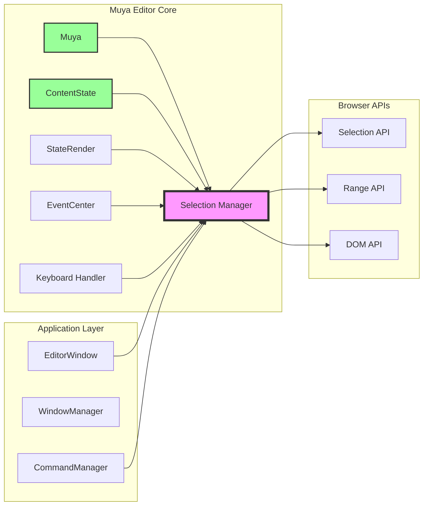
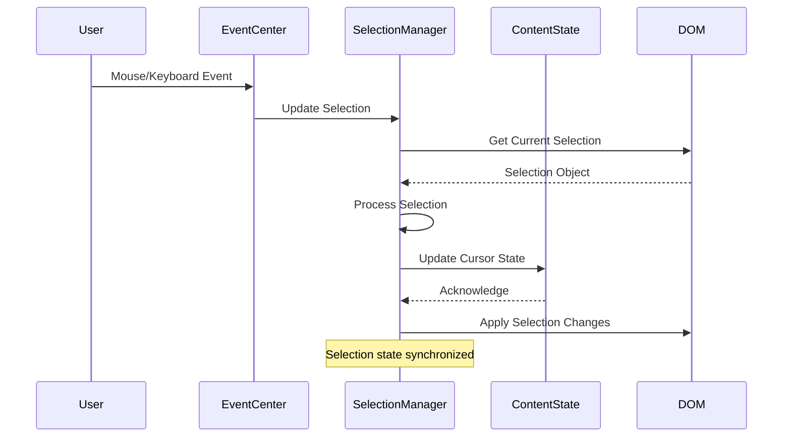
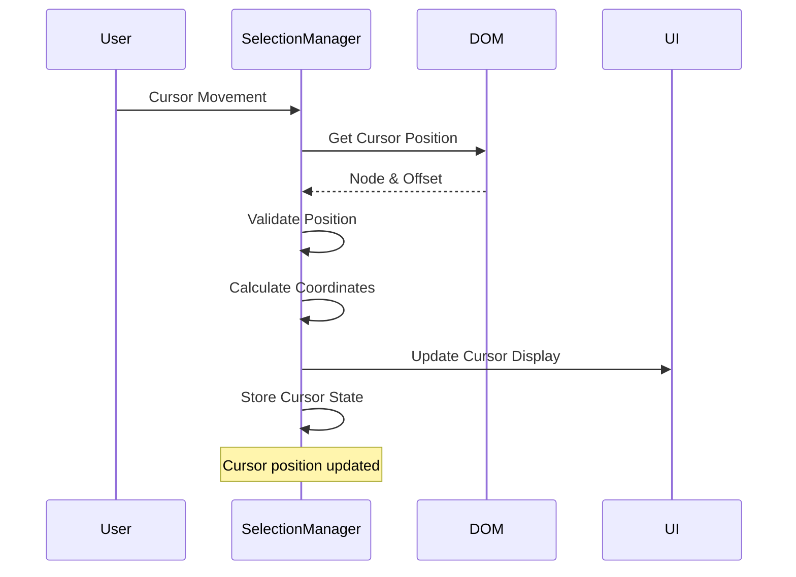

# Selection Manager

## Introduction

The Selection Manager is a critical component of the Muya Editor Core that handles text selection, cursor positioning, and range management within the editor. It provides a comprehensive API for managing user selections, cursor states, and text range operations in a contenteditable environment. The module is adapted from the medium-editor project and customized for specialized use within the Muya markdown editor.

## Overview

The Selection Manager serves as the central hub for all selection-related operations in the editor, providing functionality for:

- **Selection Management**: Creating, modifying, and restoring text selections
- **Cursor Positioning**: Managing cursor placement and movement within the document
- **Range Operations**: Handling DOM ranges and their manipulation
- **Coordinate Tracking**: Getting cursor coordinates for UI positioning
- **Selection State**: Importing and exporting selection states for persistence

## Architecture

### Component Structure

```mermaid
graph TB
    subgraph "Selection Manager"
        SM[Selection Class]
        
        subgraph "Core Methods"
            IM[importSelection]
            GS[getSelectionHtml]
            GC[getCaretOffsets]
            SC[selectRange]
            CR[getCursorRange]
            SR[setCursorRange]
            MC[moveCursor]
            CC[getCursorCoords]
        end
        
        subgraph "Helper Methods"
            FM[findMatchingSelectionParent]
            SN[selectNode]
            CS[clearSelection]
            SS[getSelectionStart]
            SE[getSelectionEnd]
            VC[isValidCursorNode]
        end
        
        subgraph "DOM Utilities"
            CU[Cursor]
            DU[DOM Utilities]
        end
    end
    
    subgraph "External Dependencies"
        DOC[Document Object]
        SEL[Selection API]
        RNG[Range API]
    end
    
    SM --> CU
    SM --> DU
    SM --> DOC
    SM --> SEL
    SM --> RNG
    
    IM --> GC
    SR --> SC
    CR --> VC
    
    style SM fill:#f9f,stroke:#333,stroke-width:4px
    style IM fill:#bbf,stroke:#333,stroke-width:2px
    style GC fill:#bbf,stroke:#333,stroke-width:2px
    style CR fill:#bbf,stroke:#333,stroke-width:2px
```



### System Integration



## Core Functionality

### Selection State Management

The Selection Manager provides sophisticated selection state management through the `importSelection` method, which can restore complex selection states including:

- **Text Selections**: Standard text range selections
- **Image Selections**: Special handling for inline images
- **Empty Block Handling**: Managing selections in empty paragraphs
- **Anchor Tag Handling**: Special positioning around links

### Cursor Positioning System

The cursor positioning system provides precise control over cursor placement:

- **Coordinate-based Positioning**: `getCursorCoords()` returns screen coordinates
- **Offset-based Positioning**: `getCaretOffsets()` provides text offsets
- **Paragraph-relative Positioning**: Cursor positions relative to paragraph boundaries
- **Line-based Positioning**: `getCursorYOffset()` for vertical positioning

### Range Operations

Comprehensive range manipulation capabilities:

- **Range Creation**: Creating DOM ranges from various inputs
- **Range Selection**: Selecting and highlighting ranges
- **Range Import/Export**: Serializing and deserializing range states
- **Range Validation**: Ensuring ranges are valid and safe to use

## Data Flow

### Selection State Flow



### Cursor Positioning Flow



## Key Methods

### Selection Management

- **`importSelection(selectionState, root, favorLaterSelectionAnchor)`**: Restores a selection state within the given root element
- **`getSelectionHtml()`**: Returns the HTML content of the current selection
- **`selectRange(range)`**: Applies a DOM range as the current selection
- **`clearSelection(moveCursorToStart)`**: Clears the current selection and collapses the cursor

### Cursor Operations

- **`getCursorRange()`**: Returns the current cursor position as a Cursor object
- **`setCursorRange(cursorRange)`**: Sets the cursor position from a Cursor object
- **`moveCursor(node, offset)`**: Moves cursor to specific node and offset
- **`getCaretOffsets(element, range)`**: Gets character offsets within an element

### Position Tracking

- **`getCursorCoords()`**: Returns screen coordinates of the cursor
- **`getCursorYOffset(paragraph)`**: Returns line offset information within a paragraph
- **`getSelectionStart()`**: Returns the starting node of the selection
- **`getSelectionEnd()`**: Returns the ending node of the selection

## Dependencies

### Internal Dependencies

- **[Cursor](Cursor.md)**: Cursor data structure for representing cursor states
- **[DOM Utilities](DOM-Utilities.md)**: Helper functions for DOM manipulation and traversal

### External Dependencies

- **Document Object**: Browser document object for selection API access
- **Selection API**: Browser's Selection API for range management
- **Range API**: Browser's Range API for creating and manipulating ranges

## Integration Points

### ContentState Integration

The Selection Manager works closely with [ContentState](ContentState.md) to maintain cursor state consistency:

- Cursor positions are stored in ContentState
- Selection changes trigger ContentState updates
- ContentState changes may require selection restoration

### EventCenter Integration

Integration with [EventCenter](EventCenter.md) for handling user interactions:

- Mouse events trigger selection updates
- Keyboard events may modify cursor position
- Selection changes dispatch events to other components

### StateRender Integration

Coordination with [StateRender](StateRender.md) for visual updates:

- Selection changes may require re-rendering
- Cursor positioning affects UI component placement
- Visual feedback based on selection state

## Error Handling

### Validation

- **Node Validation**: `isValidCursorNode()` ensures cursor nodes are within valid editor boundaries
- **Range Validation**: Selection ranges are validated before application
- **Boundary Checks**: Cursor positions are checked against content boundaries

### Recovery

- **Invalid Selection Handling**: Graceful handling of invalid selection states
- **Fallback Positioning**: Default cursor positioning when normal positioning fails
- **State Restoration**: Ability to recover from corrupted selection states

## Performance Considerations

### Optimization Strategies

- **Efficient DOM Traversal**: Optimized algorithms for finding selection boundaries
- **Minimal Reflows**: Batch DOM operations to minimize layout recalculations
- **Caching**: Strategic caching of selection states and calculations

### Memory Management

- **Range Cleanup**: Proper cleanup of temporary ranges
- **Event Listener Management**: Efficient management of selection change listeners
- **State Cleanup**: Proper disposal of selection states when no longer needed

## Usage Examples

### Basic Selection

```javascript
// Get current cursor position
const cursorRange = selectionManager.getCursorRange()

// Set cursor to specific position
selectionManager.moveCursor(targetNode, offset)

// Get cursor coordinates for UI positioning
const coords = selectionManager.getCursorCoords()
```

### Selection State Management

```javascript
// Export current selection state
const selectionState = selectionManager.getCursorRange()

// Restore selection state after content changes
selectionManager.importSelection(selectionState, rootElement)

// Clear selection and move cursor
selectionManager.clearSelection(true) // Move to start
```

### Advanced Positioning

```javascript
// Get caret offsets within an element
const offsets = selectionManager.getCaretOffsets(element)

// Get line-based positioning information
const lineInfo = selectionManager.getCursorYOffset(paragraph)

// Handle special cases (images, empty blocks)
const adjustedRange = selectionManager.importSelection(state, root, true)
```

## Related Documentation

- [Muya Editor Core](Muya-Editor-Core.md) - Main editor architecture
- [ContentState](ContentState.md) - Content state management
- [EventCenter](EventCenter.md) - Event handling system
- [StateRender](StateRender.md) - Rendering system
- [Cursor](Cursor.md) - Cursor data structure
- [DOM Utilities](DOM-Utilities.md) - DOM manipulation helpers