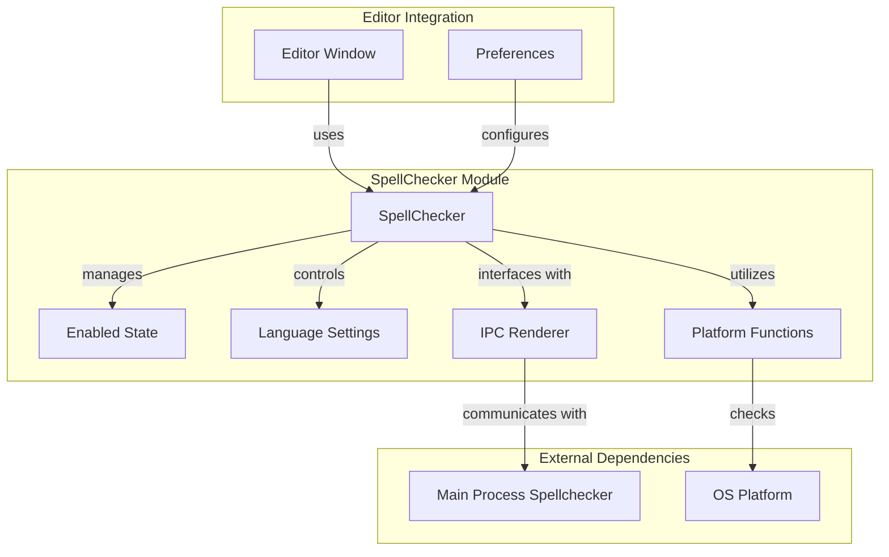
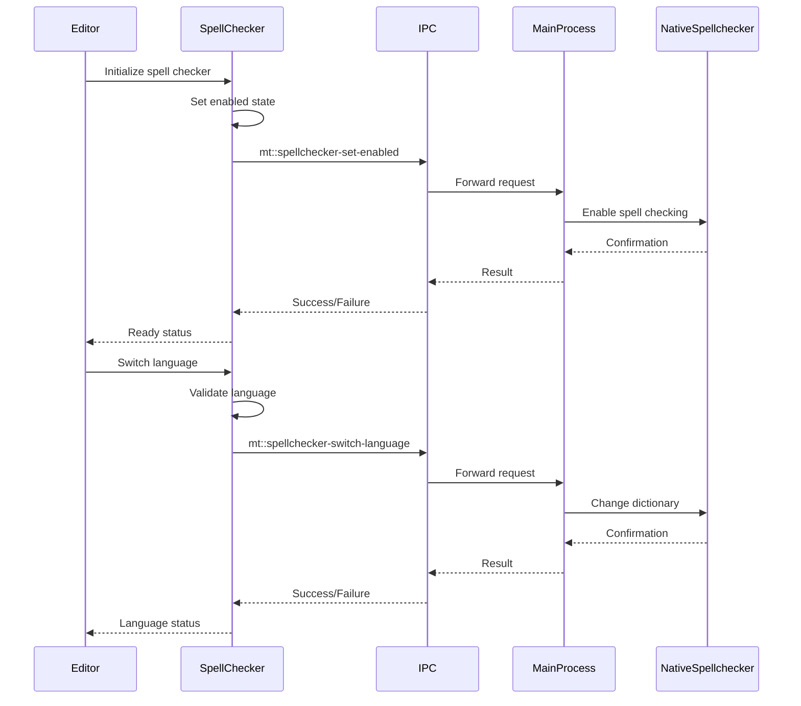

# SpellChecker Module Documentation

## Introduction

The SpellChecker module provides real-time spell checking functionality for the Muya editor. It serves as a high-level API wrapper around Chromium's built-in spell checker, offering cross-platform spell checking capabilities with language-specific dictionary support. The module integrates seamlessly with the editor's text processing pipeline to provide inline spelling error detection and correction suggestions.

## Core Functionality

The SpellChecker module is responsible for:
- **Spell Checking Management**: Enabling/disabling spell checking functionality
- **Language Management**: Switching between different language dictionaries
- **Cross-Platform Support**: Handling platform-specific spell checking behaviors (Windows/Linux vs macOS)
- **Dictionary Services**: Providing available dictionary languages for selection
- **Error Handling**: Managing spell checker availability and fallback mechanisms

## Architecture

### Component Overview



### Key Components

#### SpellChecker Class
The main class that encapsulates all spell checking functionality:
- **State Management**: Tracks enabled/disabled status and provider availability
- **Language Control**: Manages current spell checking language
- **Platform Abstraction**: Handles OS-specific spell checking behaviors
- **IPC Communication**: Interfaces with the main process for native spell checker operations

### Data Flow



## Platform-Specific Behavior

### macOS
- Uses the native macOS spell checker
- Automatic language detection (no manual language switching required)
- Simplified API calls without language parameters

### Windows/Linux
- Uses Chromium's built-in spell checker
- Requires explicit language selection
- Supports multiple available dictionaries

## Integration Points

### Editor Window Integration
The SpellChecker module integrates with the [Editor Window](EditorWindow.md) to provide real-time spell checking within the Muya editor component. The editor uses the SpellChecker to validate text content and provide spelling suggestions.

### Preferences Integration
The module works with the [User Preferences](UserPreferences.md) system to persist spell checking settings, including enabled state and selected language preferences.

### Command Management
Spell checking operations can be triggered through the [Command Management](CommandManagement.md) system, allowing users to toggle spell checking and switch languages via menu commands or keyboard shortcuts.

## API Reference

### Constructor
```javascript
new SpellChecker(enabled, lang)
```
- `enabled`: Boolean indicating initial enabled state
- `lang`: Language code for spell checking

### Key Methods

#### `activateSpellchecker(lang)`
Enables spell checking with the specified language. Handles platform-specific initialization and fallback mechanisms.

#### `deactivateSpellchecker()`
Disables the native spell checker and marks the provider as unavailable.

#### `switchLanguage(lang)`
Switches to a different language dictionary. Platform-aware implementation.

#### `getAvailableDictionaries()`
Returns available dictionary languages (empty array on macOS due to automatic detection).

### Properties

#### `isEnabled`
Computed property indicating whether spell checking is both enabled and available.

#### `lang`
Getter/setter for the current spell checking language.

## Error Handling

The module implements comprehensive error handling:
- **Provider Availability**: Tracks whether the native spell checker is accessible
- **Language Validation**: Ensures non-empty language strings on non-macOS platforms
- **Graceful Degradation**: Disables spell checking if initialization fails
- **Exception Propagation**: Throws exceptions for invalid operations while maintaining system stability

## Process Communication

The SpellChecker module uses IPC communication with the main process for native spell checker operations:

- `mt::spellchecker-set-enabled`: Enable/disable spell checking
- `mt::spellchecker-switch-language`: Change spell checking language
- `mt::spellchecker-get-available-dictionaries`: Retrieve available dictionaries

## Usage Examples

### Basic Initialization
```javascript
const spellChecker = new SpellChecker(true, 'en-US')
await spellChecker.activateSpellchecker('en-US')
```

### Language Switching
```javascript
try {
  await spellChecker.switchLanguage('fr-FR')
} catch (error) {
  console.error('Failed to switch language:', error)
}
```

### Dictionary Retrieval
```javascript
const dictionaries = await SpellChecker.getAvailableDictionaries()
console.log('Available dictionaries:', dictionaries)
```

## Dependencies

### Internal Dependencies
- **Platform Utilities**: Uses `isOsx` utility for platform detection
- **IPC Renderer**: Electron's IPC communication channel

### External Dependencies
- **Electron IPC**: For main process communication
- **Native Spell Checker**: Chromium's built-in spell checking engine

## Related Documentation
- [Editor Window](EditorWindow.md) - Text editor integration
- [User Preferences](UserPreferences.md) - Settings persistence
- [Command Management](CommandManagement.md) - Command interface
- [Main Process Services](MainProcessServices.md) - Main process spell checker implementation