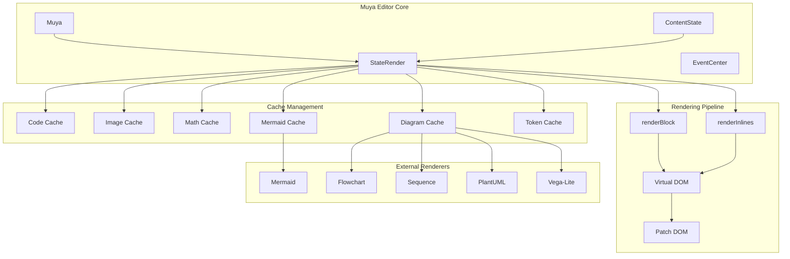
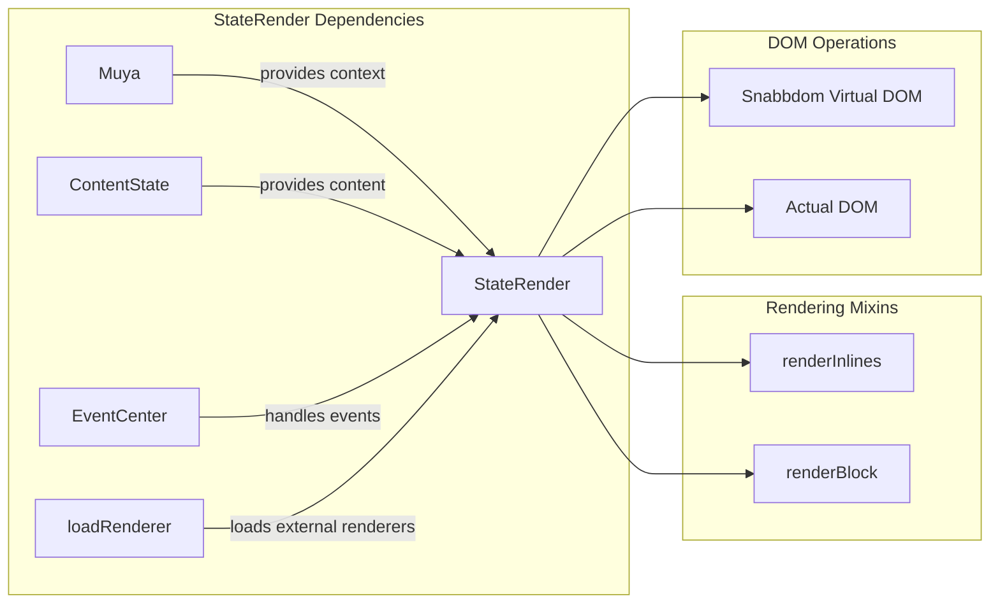
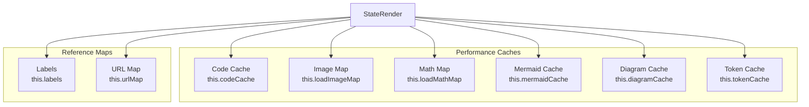
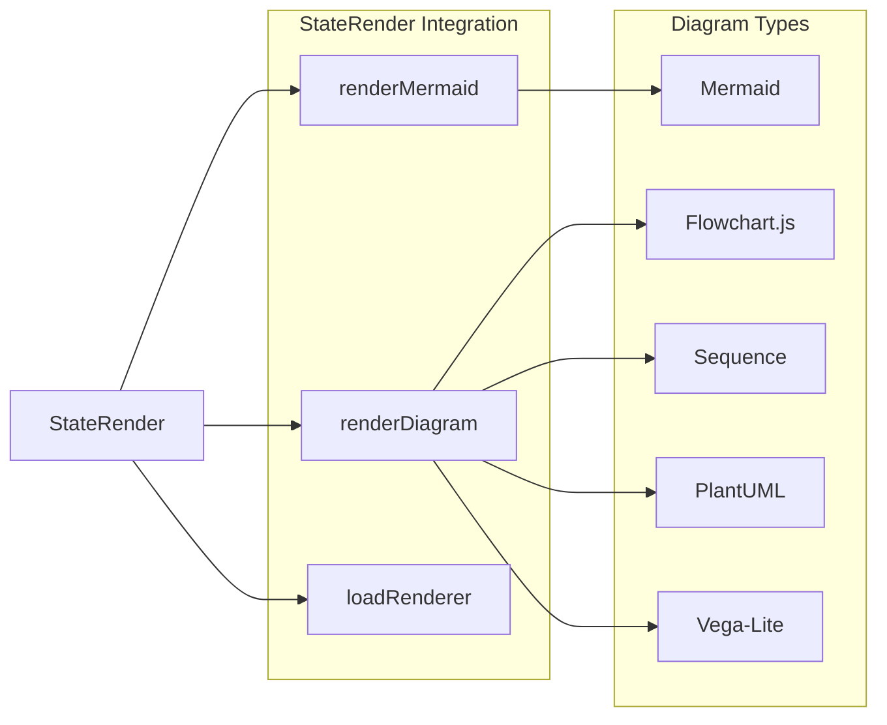
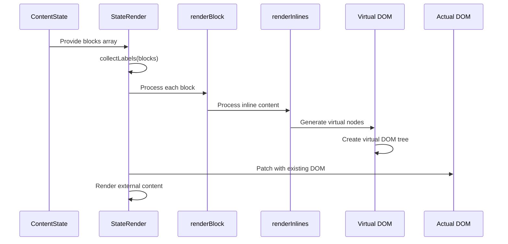
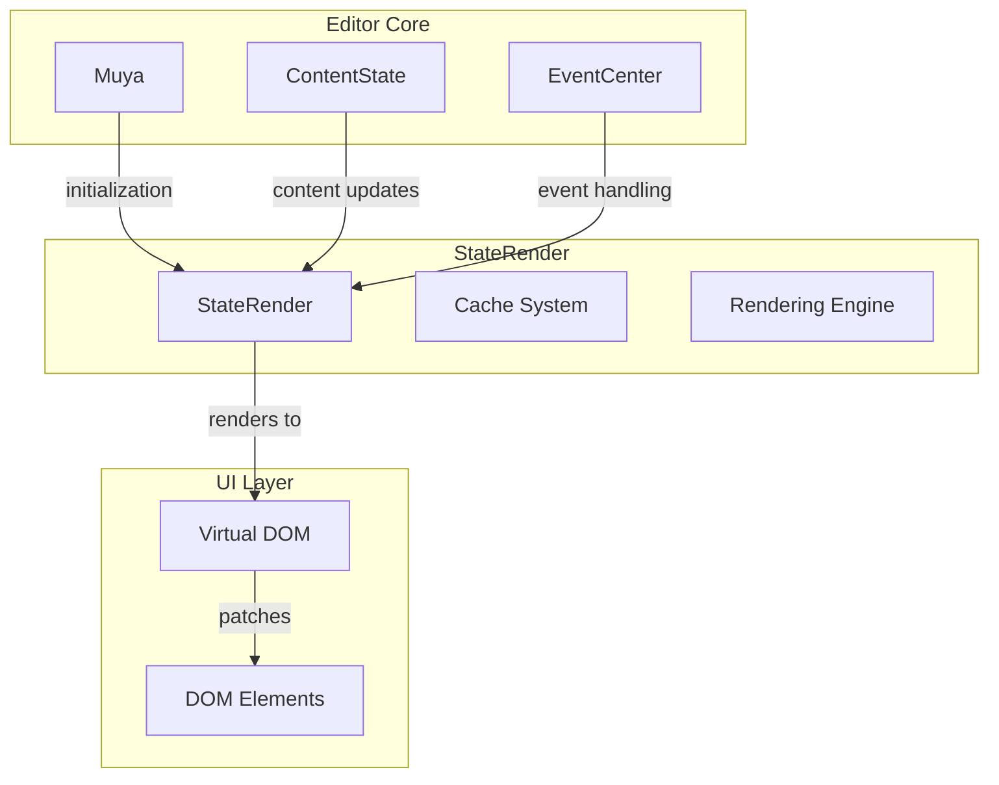

# StateRender Module Documentation

## Introduction

The StateRender module is a core component of the Muya Editor system, responsible for rendering the visual representation of the editor's content state. It serves as the bridge between the abstract content state and the actual DOM representation, handling the complex task of converting markdown content into interactive HTML elements while maintaining performance through efficient virtual DOM patching.

## Overview

StateRender operates as the rendering engine within the Muya Editor Core, working closely with ContentState to transform the internal representation of documents into a visual format that users can interact with. The module implements sophisticated caching mechanisms and selective rendering strategies to ensure optimal performance, especially when dealing with large documents or frequent updates.

## Architecture

### Core Architecture Diagram

### Component Relationships

## Core Functionality

### Primary Responsibilities

1. **Content Rendering**: Converts the internal block-based content structure into visual HTML representation
2. **Virtual DOM Management**: Utilizes Snabbdom for efficient DOM updates through virtual DOM diffing and patching
3. **Caching System**: Implements multiple caching layers for performance optimization
4. **External Renderer Integration**: Coordinates with external libraries for rendering complex content like diagrams and mathematical expressions
5. **Selective Rendering**: Provides partial and single-block rendering capabilities for optimal performance

### Rendering Strategies

The StateRender module implements three distinct rendering strategies to handle different scenarios:

#### 1. Full Render (`render` method)
- Renders the entire document content
- Used for initial rendering or major content changes
- Creates a complete virtual DOM tree and patches the entire editor container

#### 2. Partial Render (`partialRender` method)
- Renders only a specific range of blocks
- Optimized for localized content changes
- Minimizes DOM manipulation by targeting specific block ranges

#### 3. Single Block Render (`singleRender` method)
- Renders a single block independently
- Used for focused updates when only one block changes
- Provides the most granular level of rendering control

## Cache Management System

### Cache Types

The StateRender module maintains several specialized caches to optimize performance:

### Cache Purposes

- **Code Cache**: Stores processed code blocks for quick retrieval
- **Image Map**: Manages image loading states and caching
- **Math Map**: Caches mathematical expression rendering results
- **Mermaid Cache**: Stores Mermaid diagram rendering data
- **Diagram Cache**: Caches various diagram types (flowchart, sequence, plantuml, vega-lite)
- **Token Cache**: Stores parsed token information
- **Labels**: Maintains link reference definitions for quick lookup
- **URL Map**: Maps URLs to their resolved states

## External Renderer Integration

### Supported External Libraries

StateRender integrates with multiple external rendering libraries to support rich content:

### Renderer Loading Strategy

The module uses a dynamic loading strategy through the `loadRenderer` utility function, which loads external libraries on-demand. This approach minimizes initial bundle size and improves application startup performance.

## Content Processing Pipeline

### Block Processing Flow

### Label Collection Process

The `collectLabels` method processes the entire block structure to extract link reference definitions, storing them in the labels map for quick access during rendering. This ensures that reference-style links can be properly resolved throughout the document.

## Performance Optimizations

### Virtual DOM Efficiency

StateRender leverages Snabbdom's virtual DOM implementation to minimize actual DOM manipulations. The patching algorithm compares the new virtual DOM tree with the existing one and applies only the necessary changes, significantly improving rendering performance.

### Selective Rendering

The module provides granular control over what gets rendered:

- **Range-based updates**: Only render blocks within a specific key range
- **Cursor-aware rendering**: Handle cursor position conflicts intelligently
- **Block-level isolation**: Render individual blocks without affecting others

### Cache Invalidation

The `invalidateImageCache` method provides a mechanism to refresh image loading states, ensuring that images are reloaded when necessary while maintaining cache efficiency for unchanged content.

## Integration with Muya Editor System

### Dependency Relationships

### Event Coordination

StateRender works closely with the EventCenter to handle user interactions and content updates. The event system ensures that rendering operations are coordinated with user actions and content state changes.

## Error Handling and Validation

### External Renderer Error Management

The module implements robust error handling for external renderers:

- **Mermaid Error Handling**: Catches parsing errors and displays user-friendly error messages
- **Diagram Error Handling**: Validates diagram code before rendering and provides meaningful error feedback
- **Sanitization**: Uses DOMPurify configuration to ensure rendered content is safe

### Content Validation

StateRender includes validation mechanisms to ensure that rendered content meets security and quality standards, particularly when dealing with user-generated content and external libraries.

## Configuration and Customization

### Theme Integration

The module supports theme customization for external renderers:

- **Mermaid Themes**: Configurable through `muya.options.mermaidTheme`
- **Sequence Themes**: Customizable via `muya.options.sequenceTheme`
- **Vega Themes**: Supports theme configuration through `muya.options.vegaTheme`

### CSS Class Management

StateRender manages CSS classes dynamically based on content state and user interactions:

- **Active State**: Applies `AG_ACTIVE` class to currently active blocks
- **Selection State**: Manages `AG_SELECTED` class for selected blocks
- **Conflict Resolution**: Uses `AG_GRAY` and `AG_HIDE` classes for cursor conflict handling
- **Highlight States**: Applies `AG_HIGHLIGHT` and `AG_SELECTION` classes for visual feedback

## Performance Considerations

### Memory Management

The module implements several strategies for efficient memory usage:

- **Cache Clearing**: Regularly clears caches after rendering operations to prevent memory leaks
- **Map-based Storage**: Uses Map objects for efficient key-based lookups
- **Lazy Loading**: Loads external renderers only when needed

### Rendering Optimization

- **Minimal DOM Updates**: Uses virtual DOM diffing to apply only necessary changes
- **Batch Operations**: Groups rendering operations to minimize reflows and repaints
- **Selective Updates**: Renders only changed content rather than entire documents

## Future Considerations

### Scalability Improvements

The current architecture supports future enhancements such as:

- **Web Worker Integration**: Offloading heavy rendering operations to background threads
- **Progressive Rendering**: Implementing viewport-based rendering for large documents
- **Advanced Caching**: Implementing more sophisticated cache invalidation strategies

### Extensibility

The modular design allows for easy extension with:

- **New External Renderers**: Adding support for additional diagram types
- **Custom Block Types**: Extending rendering capabilities for specialized content
- **Plugin Architecture**: Supporting third-party rendering plugins

## Related Documentation

- [ContentState Module](ContentState.md) - The content state management system that StateRender visualizes
- [Muya Editor Core](Muya.md) - The main editor framework that StateRender is part of
- [EventCenter](EventCenter.md) - The event system that coordinates with StateRender
- [BaseFloat UI Components](BaseFloat.md) - UI components that may be rendered by StateRender

## Conclusion

StateRender serves as the critical rendering engine within the Muya Editor system, providing efficient, flexible, and extensible content visualization capabilities. Its sophisticated caching system, multiple rendering strategies, and seamless integration with external renderers make it well-suited for handling complex markdown documents while maintaining excellent performance characteristics.