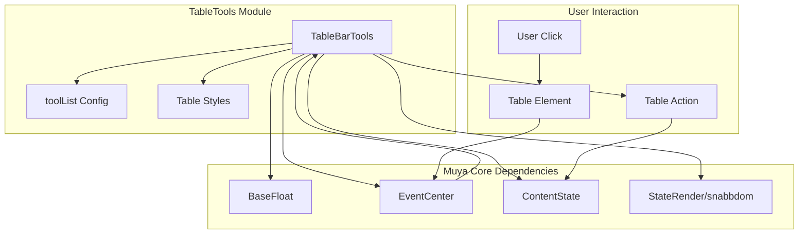
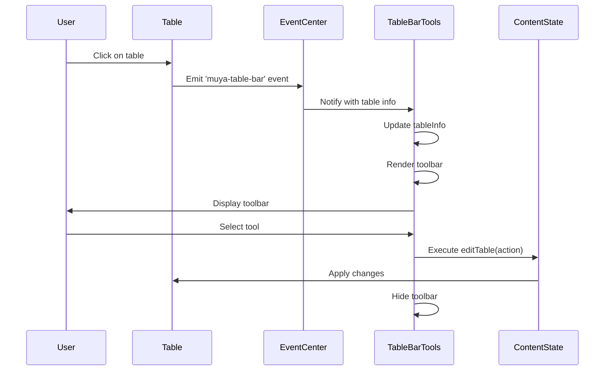
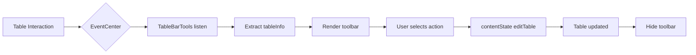

# TableTools Module Documentation

## Introduction

The TableTools module provides a floating toolbar interface for table manipulation within the Muya editor. It offers contextual tools and actions that appear when users interact with tables, enabling efficient table editing operations such as adding/removing rows and columns, aligning content, and other table-specific formatting options.

## Architecture Overview

The TableTools module is built as a specialized floating UI component that extends the BaseFloat class, integrating seamlessly with the Muya editor's event system and content state management.

## Core Components

### TableBarTools Class

The `TableBarTools` class is the main component that extends `BaseFloat` to provide table-specific functionality.

**Key Properties:**
- `pluginName`: 'tableBarTools' - Identifier for the plugin system
- `tableInfo`: Stores current table context and configuration
- `oldVnode`: Previous virtual DOM state for efficient updates
- `tableBarContainer`: DOM container for the toolbar UI

**Constructor Parameters:**
- `muya`: Reference to the Muya editor instance
- `options`: Configuration options for positioning and behavior

## Component Interactions

## Data Flow

## Configuration and Tools

The module uses a configuration object (`toolList`) that defines available tools based on the table bar type. Tools are rendered as list items with click handlers that trigger corresponding table editing actions.

**Tool Configuration Structure:**
- Each tool has a `label` (display text) and `action` (operation identifier)
- Tools are grouped by `barType` for contextual display
- Actions are passed to `contentState.editTable()` for execution

## Event Handling

The module subscribes to the 'muya-table-bar' event which provides:
- `reference`: DOM reference for positioning the floating toolbar
- `tableInfo`: Contains table context and available actions

When a tool is selected, the module:
1. Prevents default event behavior
2. Stops event propagation
3. Calls `contentState.editTable()` with the selected action
4. Hides the toolbar

## Styling and Positioning

The toolbar uses CSS classes for styling and is positioned using floating UI principles:
- Default placement: 'right-start'
- Offset: '0, 5' pixels
- No arrow indicator
- Custom CSS class: 'ag-table-bar-tools'

## Integration Points

### Dependencies
- [BaseFloat](BaseFloat.md): Provides floating UI functionality
- [EventCenter](EventCenter.md): Handles event subscription and notification
- [ContentState](ContentState.md): Manages table editing operations
- [StateRender](StateRender.md): Virtual DOM rendering using snabbdom

### Related Modules
- [Muya Editor Core](MuyaEditorCore.md): Core editor functionality
- [Muya Editor UI](MuyaEditorUI.md): UI component ecosystem
- [Editor Window](EditorWindow.md): Window management integration

## Usage Patterns

The TableTools module operates in a contextual manner:

1. **Activation**: Triggered by table interactions within the editor
2. **Context Awareness**: Displays relevant tools based on table state
3. **Immediate Feedback**: Applies changes instantly through ContentState
4. **Auto-hide**: Automatically hides after action completion

## Performance Considerations

- Uses virtual DOM (snabbdom) for efficient UI updates
- Implements proper event cleanup through BaseFloat
- Minimal DOM manipulation through patch-based rendering
- Event delegation for tool selection handling

## Error Handling

The module includes basic error prevention through:
- Event propagation stopping to prevent unwanted side effects
- Default action prevention for tool selection
- Proper cleanup when hiding the toolbar

## Future Enhancements

Potential improvements could include:
- Keyboard navigation support for accessibility
- Customizable tool configurations
- Extended table formatting options
- Multi-table selection capabilities
- Undo/redo integration with History module