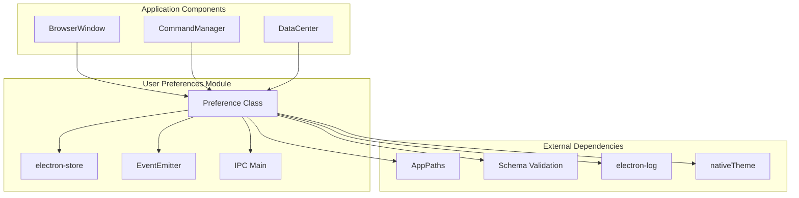
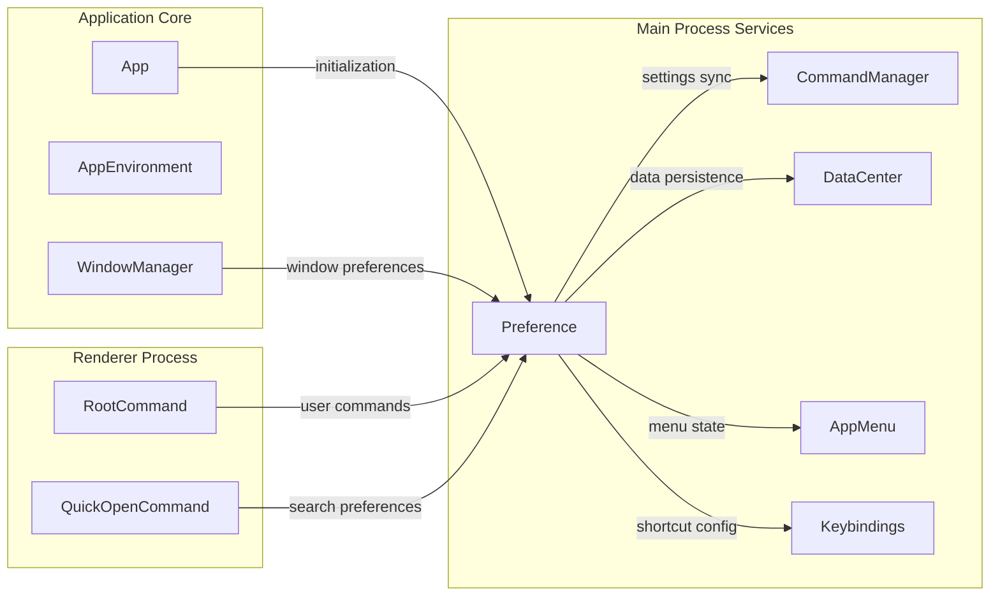
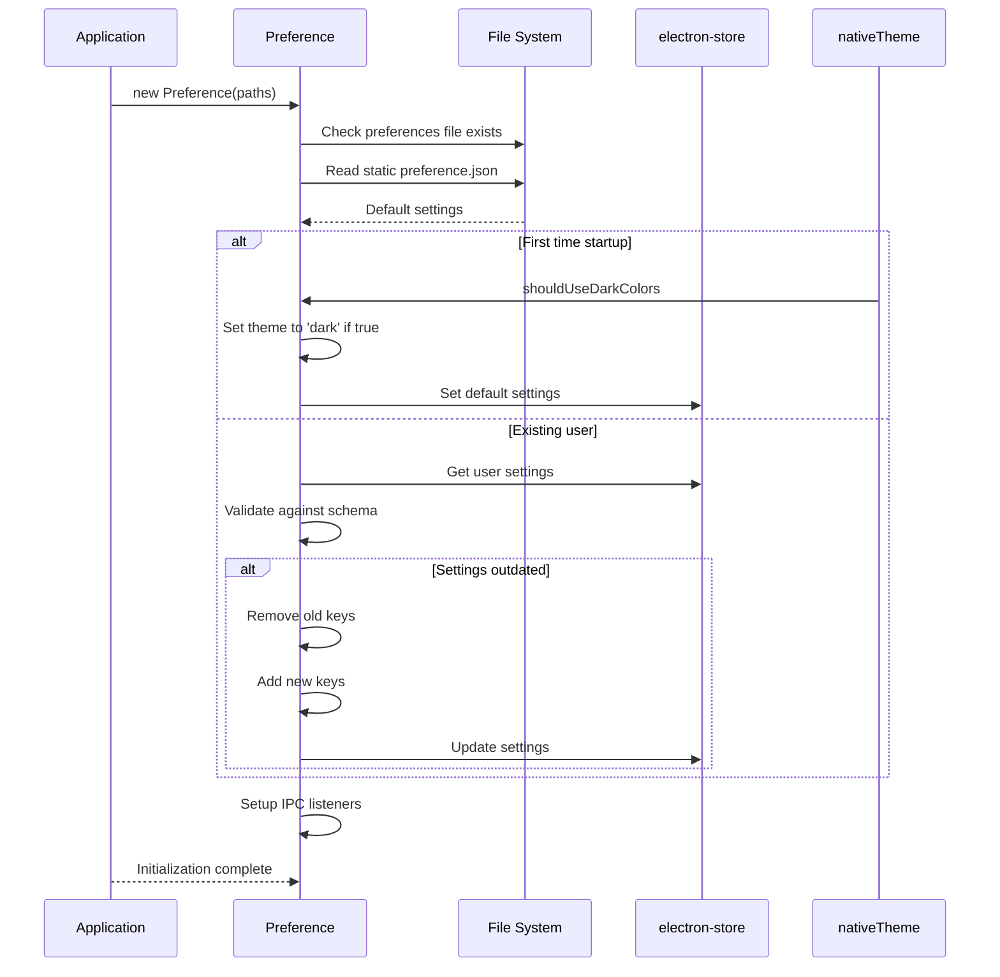
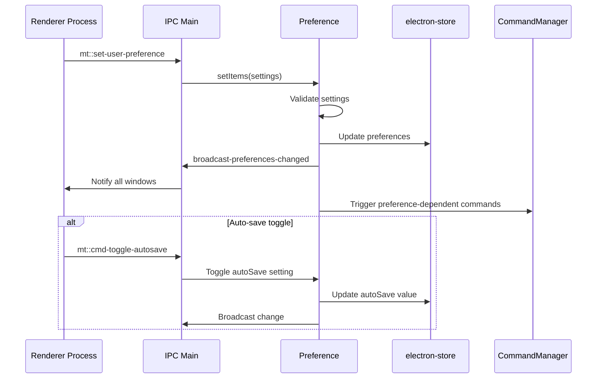
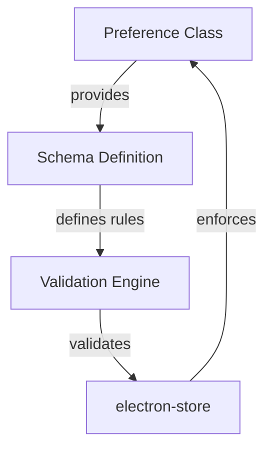

# User Preferences Module Documentation

## Introduction

The User Preferences module is a core component of the application's main process services layer, responsible for managing user-specific settings and configuration throughout the application. It provides a centralized system for storing, retrieving, and synchronizing user preferences across different parts of the application, ensuring a consistent and personalized user experience.

The module handles preference persistence, validation, and real-time updates, serving as the single source of truth for all user-configurable settings in the application.

## Architecture Overview

### Core Architecture



### Component Relationships



## Core Components

### Preference Class

The `Preference` class is the main component of the User Preferences module, extending EventEmitter to provide reactive preference management capabilities.

#### Key Responsibilities:
- **Preference Storage**: Manages persistent storage of user settings using electron-store
- **Schema Validation**: Ensures all preferences conform to predefined schema
- **Default Management**: Handles default settings and automatic theme detection
- **Real-time Updates**: Provides IPC communication for preference changes
- **Settings Synchronization**: Maintains consistency between stored and runtime preferences

#### Constructor Parameters:
- `paths` (AppPaths): Provides access to application paths including preferences directory

#### Key Methods:

| Method | Description | Parameters | Returns |
|--------|-------------|------------|---------|
| `getAll()` | Retrieves all user preferences | None | Object containing all settings |
| `getItem(key)` | Gets specific preference value | `key` (string) | Value of the preference |
| `setItem(key, value)` | Sets individual preference | `key` (string), `value` (any) | Store result |
| `setItems(settings)` | Batch update preferences | `settings` (Object) | None |
| `getPreferredEol()` | Gets preferred end-of-line character | None | 'lf' or 'crlf' |

## Data Flow

### Preference Initialization Flow



### Preference Update Flow



## Schema and Validation

The module uses a schema-based validation system to ensure data integrity and type safety for all preferences. The schema is imported from `./schema` and used to validate:

- Data types for each preference
- Required vs optional fields
- Default values
- Valid value ranges

### Schema Integration



## IPC Communication

The module establishes several IPC channels for bidirectional communication between the main and renderer processes:

### Incoming Channels:
- `mt::ask-for-user-preference`: Request current preferences
- `mt::set-user-preference`: Update preferences
- `mt::cmd-toggle-autosave`: Toggle auto-save setting
- `set-user-preference`: Direct preference update

### Outgoing Channels:
- `mt::user-preference`: Broadcast current preferences
- `broadcast-preferences-changed`: Notify preference changes

## Integration with Other Modules

### Window Management Integration

The User Preferences module integrates with the [Window Management](Window%20Management.md) module to:
- Store window-specific preferences (size, position, state)
- Apply theme preferences to window appearance
- Synchronize preferences across multiple windows

### Command Management Integration

Through the [Command Management](Command%20Management.md) module, preferences influence:
- Command availability and behavior
- Keyboard shortcut configurations
- Auto-save and auto-format settings

### Data Management Integration

The [Data Management](Data%20Management.md) module coordinates with preferences for:
- File encoding preferences
- End-of-line character settings
- Export format configurations

## Platform-Specific Behavior

### End-of-Line Handling

The module implements platform-aware end-of-line character selection:

```javascript
// Preference logic for EOL characters
if (endOfLine === 'lf') {
    return 'lf'
}
return endOfLine === 'crlf' || isWindows ? 'crlf' : 'lf'
```

This ensures:
- Windows systems default to CRLF when not explicitly set
- Unix/Linux systems default to LF
- User preference takes precedence when explicitly set

### Theme Detection

On first application startup, the module automatically detects the system's dark mode preference:

```javascript
if (nativeTheme.shouldUseDarkColors) {
    defaultSettings.theme = 'dark'
}
```

## Error Handling

The module implements comprehensive error handling for:

- **File System Errors**: Graceful handling of missing preference files
- **JSON Parsing Errors**: Fallback behavior for corrupted preference files
- **Schema Validation Errors**: Prevention of invalid preference values
- **IPC Communication Errors**: Robust message handling

## Performance Considerations

### Storage Optimization

- Uses `electron-store` for efficient key-value storage
- Implements selective updates to minimize I/O operations
- Caches preferences in memory for fast access

### Synchronization Strategy

- Broadcasts changes to all windows simultaneously
- Implements debouncing for rapid preference changes
- Uses efficient key comparison for updates

## Future Enhancements

### Planned Features

- **Export/Import**: JSON-based preference backup and restore (methods stubbed)
- **Profile Management**: Multiple user preference profiles
- **Real-time Sync**: Cloud synchronization of preferences
- **Advanced Validation**: Custom validation rules per preference

## Usage Examples

### Basic Preference Access

```javascript
// Get a specific preference
const theme = preference.getItem('theme')

// Update a preference
preference.setItem('fontSize', 14)

// Batch update preferences
preference.setItems({
    theme: 'dark',
    fontSize: 16,
    autoSave: true
})
```

### Preference Initialization

```javascript
import Preference from './src/main/preferences'
import AppPaths from './src/main/app/paths'

const paths = new AppPaths()
const preference = new Preference(paths)

// Access all preferences
const allPrefs = preference.getAll()
```

## Conclusion

The User Preferences module serves as a critical foundation for user customization and application behavior. Its robust architecture ensures reliable preference management while maintaining flexibility for future enhancements. The module's integration with other core services creates a cohesive user experience that adapts to individual preferences and system configurations.