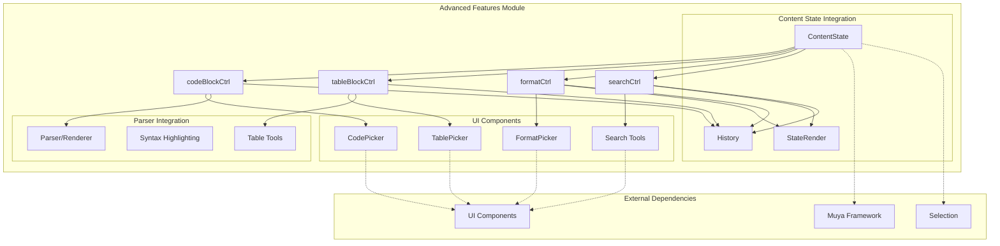
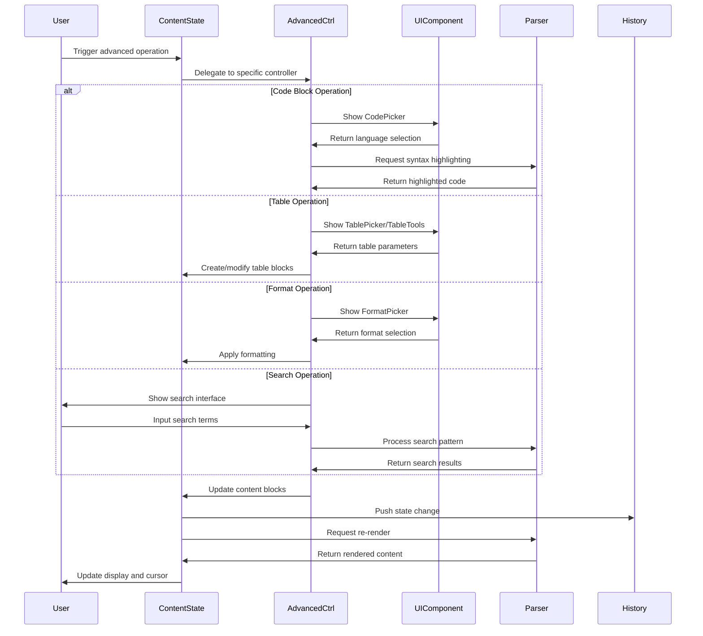
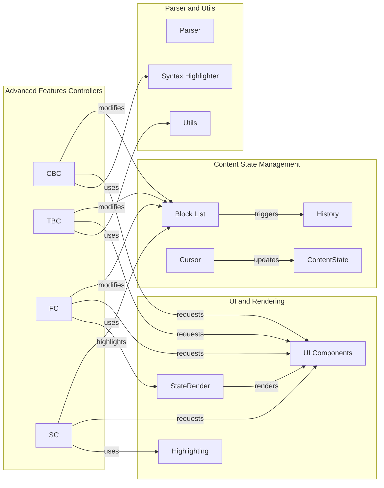
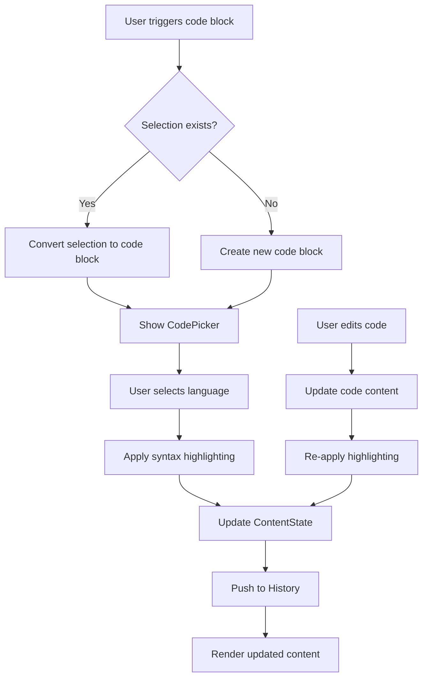
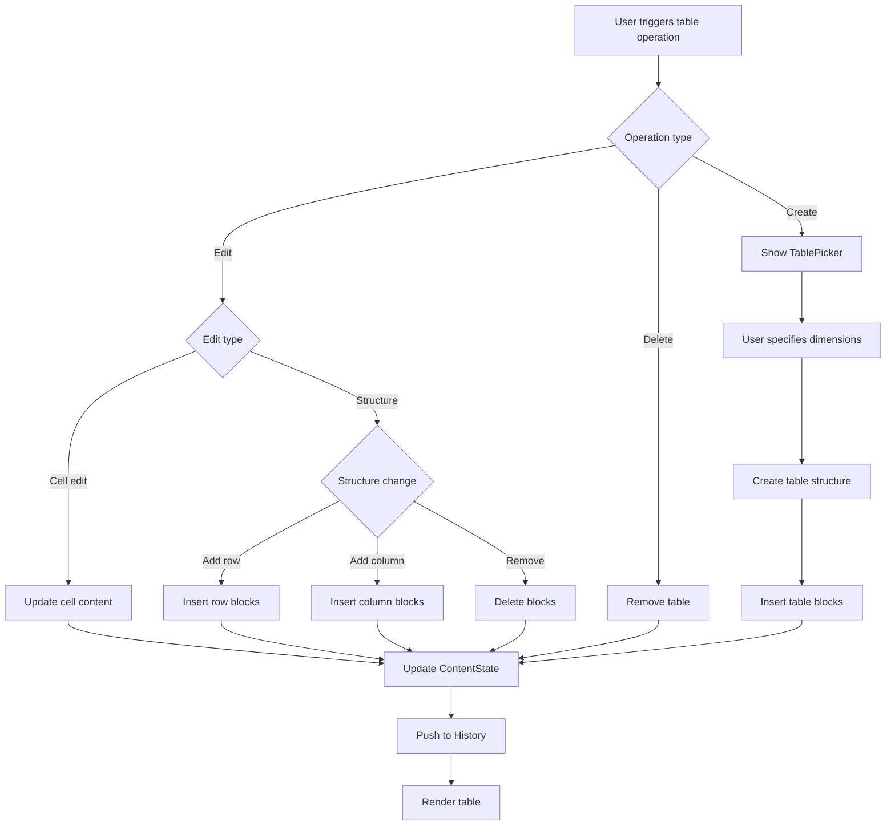
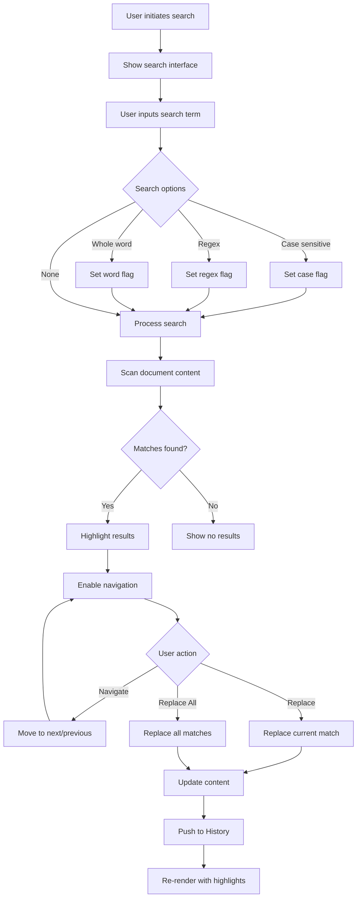

# Advanced Features Module Documentation

## Overview

The `advanced_features` module is a specialized component within the Muya content system that provides sophisticated editing capabilities for markdown documents. It handles complex content structures including code blocks, tables, text formatting, and search operations. This module serves as the bridge between basic text manipulation and advanced document editing features, enabling users to create rich, structured markdown content with professional formatting options.

## Architecture



## Core Components

### Code Block Control (`codeBlockCtrl`)

Manages the creation, editing, and rendering of code blocks within markdown documents. Provides syntax highlighting, language selection, and code formatting capabilities.

**Key Responsibilities:**
- Code block creation and deletion
- Language mode detection and switching
- Syntax highlighting integration
- Code block indentation and formatting
- Multi-language code support
- Code block selection and navigation

**Integration Points:**
- Works with [CodePicker UI](muya_ui_components.md) for language selection
- Integrates with parser for syntax highlighting
- Coordinates with [ContentState](muya_content.md) for block management

### Table Block Control (`tableBlockCtrl`)

Handles all table-related operations including creation, cell editing, structure modification, and formatting. Provides comprehensive table manipulation capabilities with support for complex table structures.

**Key Responsibilities:**
- Table creation and initialization
- Cell content editing and formatting
- Row and column insertion/deletion
- Table structure navigation
- Cell selection and multi-cell operations
- Table alignment and styling
- Import/export table data

**Integration Points:**
- Utilizes [TablePicker UI](muya_ui_components.md) for table creation
- Integrates with [TableBarTools](muya_ui_components.md) for toolbar operations
- Coordinates with [ContentState](muya_content.md) for block structure management

### Format Control (`formatCtrl`)

Manages text formatting operations including inline styles, block-level formatting, and complex formatting combinations. Provides a unified interface for all formatting-related operations.

**Key Responsibilities:**
- Inline text formatting (bold, italic, code)
- Block-level formatting (headings, quotes, lists)
- Format toggling and combination handling
- Format consistency validation
- Rich text formatting support
- Format preview and application

**Integration Points:**
- Works with [FormatPicker UI](muya_ui_components.md) for format selection
- Integrates with [StateRender](muya_parser.md) for formatting application
- Coordinates with [ContentState](muya_content.md) for content updates

### Search Control (`searchCtrl`)

Provides comprehensive search and replace functionality within documents. Supports both simple text search and advanced pattern matching with replace operations.

**Key Responsibilities:**
- Text search and pattern matching
- Search result highlighting
- Find and replace operations
- Search scope configuration
- Case sensitivity and regex support
- Search result navigation
- Multi-file search coordination

**Integration Points:**
- Integrates with [StateRender](muya_parser.md) for result highlighting
- Coordinates with [ContentState](muya_content.md) for content modification
- Works with UI components for search interface

## Data Flow Architecture



## Component Interactions



## Advanced Features Integration

### Code Block Workflow



### Table Manipulation Workflow



### Search and Replace Process



## Key Features and Capabilities

### Code Block Features
- **Multi-language Support**: Automatic language detection and manual selection
- **Syntax Highlighting**: Integration with highlighting libraries for code presentation
- **Code Formatting**: Automatic indentation and code structure maintenance
- **Copy/Paste Support**: Preserves code formatting during clipboard operations
- **Line Numbers**: Optional line numbering for code blocks
- **Code Execution**: Integration with code execution environments (configurable)

### Table Features
- **Flexible Structure**: Support for complex table structures with merged cells
- **Cell Navigation**: Keyboard and mouse navigation within tables
- **Drag Operations**: Row and column reordering through drag-and-drop
- **Formatting Options**: Cell alignment, styling, and content formatting
- **Import/Export**: CSV and other format support for table data
- **Responsive Design**: Tables adapt to different screen sizes

### Formatting Features
- **Inline Styles**: Bold, italic, code, strikethrough, and more
- **Block Formats**: Headings, quotes, lists, and custom block types
- **Format Combinations**: Support for overlapping and nested formats
- **Live Preview**: Real-time formatting preview during selection
- **Format Persistence**: Maintains formatting during editing operations
- **Custom Styles**: Support for user-defined formatting styles

### Search Features
- **Pattern Matching**: Regular expression support for advanced searches
- **Incremental Search**: Real-time search results as user types
- **Search History**: Maintains history of recent searches
- **Replace Preview**: Preview changes before applying replacements
- **Multi-file Search**: Search across multiple documents (with integration)
- **Search Scopes**: Limit search to specific sections or block types

## Integration with Other Modules

### Content State Integration
The advanced features module integrates deeply with the [ContentState](muya_content.md) system:
- **Block Management**: All operations modify the block structure through ContentState
- **History Tracking**: Every operation is recorded in the history system
- **Cursor Management**: Maintains cursor position and selection state
- **Content Validation**: Ensures content integrity after modifications

### UI Components Integration
Works closely with [UI components](muya_ui_components.md) for user interaction:
- **Picker Components**: CodePicker, TablePicker, FormatPicker for selection interfaces
- **Toolbar Integration**: TableBarTools for table manipulation toolbar
- **Tooltip Support**: Contextual help and information display
- **Quick Insert**: Integration with QuickInsert for rapid content creation

### Parser and Rendering Integration
Coordinates with [parser and rendering](muya_parser.md) systems:
- **Syntax Highlighting**: Code blocks use the parser for language-specific highlighting
- **Content Rendering**: All modifications trigger appropriate re-rendering
- **Search Highlighting**: Search results are rendered with visual highlights
- **Format Application**: Formatting changes are processed through the rendering pipeline

### Selection and Cursor Integration
Integrates with [selection utilities](muya_selection.md):
- **Range Selection**: Maintains selection state during operations
- **Cursor Positioning**: Updates cursor position after modifications
- **Multi-cursor Support**: Handles multiple cursor scenarios
- **Selection Preservation**: Preserves selection during undo/redo operations

## Performance Optimization

### Rendering Optimization
- **Partial Rendering**: Only affected blocks are re-rendered after operations
- **Token Caching**: Rendered tokens are cached to avoid redundant processing
- **Lazy Loading**: UI components are loaded on-demand
- **Virtual Scrolling**: Large tables and code blocks use virtual scrolling

### Memory Management
- **History Compression**: History states are optimized for memory usage
- **Object Pooling**: Reuses objects where possible to reduce garbage collection
- **Event Debouncing**: Rapid operations are batched to reduce processing
- **Cleanup Operations**: Proper cleanup of event listeners and references

### Search Optimization
- **Index Building**: Search indices are built incrementally
- **Result Caching**: Search results are cached for repeated queries
- **Incremental Updates**: Search indices are updated incrementally
- **Background Processing**: Large searches are processed in background

## Error Handling and Validation

### Content Validation
- **Structure Validation**: Ensures table and code block structures are valid
- **Format Consistency**: Validates formatting combinations and nesting
- **Content Sanitization**: Sanitizes user input to prevent XSS attacks
- **Boundary Checking**: Ensures operations stay within document boundaries

### Error Recovery
- **Graceful Degradation**: Falls back to simpler operations on complex failures
- **State Rollback**: Rolls back to previous state on critical errors
- **User Notification**: Provides clear error messages to users
- **Logging**: Comprehensive error logging for debugging

### Input Validation
- **Language Validation**: Validates programming language selections
- **Table Structure**: Ensures table modifications maintain valid structure
- **Format Compatibility**: Checks formatting compatibility across block types
- **Search Pattern**: Validates regular expression patterns

## Usage Patterns

### Code Block Creation
```javascript
// Create a new code block
contentState.codeBlockCtrl.createCodeBlock(language, codeContent)

// Convert selection to code block
contentState.codeBlockCtrl.convertToCodeBlock(selection, language)

// Update code block language
contentState.codeBlockCtrl.updateLanguage(blockKey, newLanguage)
```

### Table Operations
```javascript
// Create a new table
contentState.tableBlockCtrl.createTable(rows, columns)

// Insert row at position
contentState.tableBlockCtrl.insertRow(tableKey, rowIndex)

// Update cell content
contentState.tableBlockCtrl.updateCell(tableKey, row, column, content)

// Delete table
contentState.tableBlockCtrl.deleteTable(tableKey)
```

### Format Application
```javascript
// Apply inline format
contentState.formatCtrl.applyFormat(selection, 'bold')

// Toggle format
contentState.formatCtrl.toggleFormat(selection, 'italic')

// Apply block format
contentState.formatCtrl.applyBlockFormat(blockKey, 'heading', level)
```

### Search Operations
```javascript
// Perform search
contentState.searchCtrl.search(searchTerm, options)

// Replace operation
contentState.searchCtrl.replace(searchTerm, replaceTerm, options)

// Navigate results
contentState.searchCtrl.navigateToResult(resultIndex)
```

## Dependencies

- [Muya Content](muya_content.md): Core content state management
- [Muya UI Components](muya_ui_components.md): User interface elements
- [Muya Parser](muya_parser.md): Content parsing and rendering
- [Muya Selection](muya_selection.md): Cursor and selection management
- [Muya Events](muya_events.md): Event handling and coordination

## Future Enhancements

### Planned Features
- **Advanced Code Features**: Code folding, line wrapping, diff view
- **Enhanced Tables**: Formula support, data validation, chart integration
- **Rich Formatting**: Color support, custom fonts, advanced layouts
- **Search Improvements**: Fuzzy search, semantic search, search and replace preview
- **Collaboration Features**: Real-time collaborative editing, conflict resolution
- **Plugin System**: Extensible architecture for custom advanced features

### Performance Improvements
- **Web Workers**: Offload heavy operations to background threads
- **IndexedDB**: Client-side caching for large documents
- **Streaming**: Support for streaming large code blocks and tables
- **Compression**: Efficient storage of history and search indices
- **GPU Acceleration**: Hardware acceleration for rendering large tables