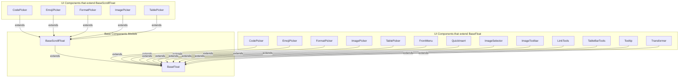
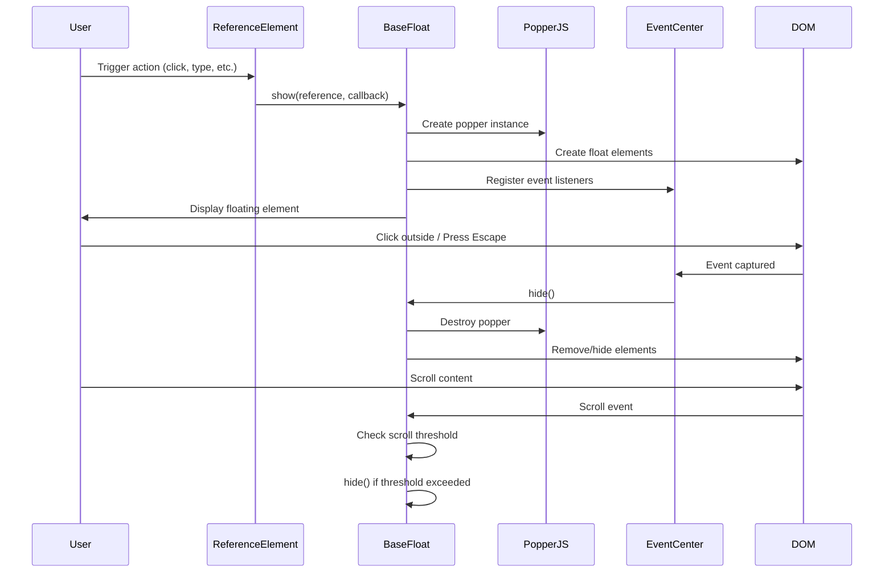
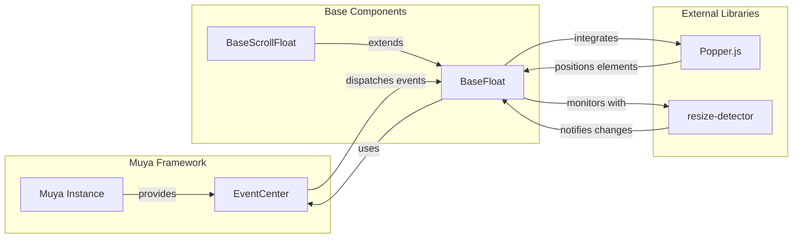

# Base Components Module Documentation

## Introduction

The base_components module provides the foundational UI infrastructure for the Muya editor framework. It contains two core abstract classes - `BaseFloat` and `BaseScrollFloat` - that serve as the building blocks for all floating UI elements in the editor. These components handle positioning, event management, and lifecycle of popup elements like pickers, menus, and tooltips.

## Architecture Overview

The base_components module sits at the foundation of the Muya UI system, providing essential floating element functionality that other UI components inherit from and extend.



## Core Components

### BaseFloat

`BaseFloat` is the foundational class for all floating UI elements in Muya. It provides:

- **Positioning**: Uses Popper.js for intelligent popup positioning
- **Event Management**: Handles click-outside-to-close, escape key, and scroll events
- **Lifecycle Management**: Controls show/hide/destroy states
- **Resize Detection**: Monitors content size changes and updates positioning

#### Key Features

1. **Smart Positioning**: Integrates with Popper.js to automatically position floating elements relative to reference elements
2. **Event Handling**: Comprehensive event management including:
   - Click outside detection to close floating elements
   - Escape key handling for dismissal
   - Scroll detection with threshold-based hiding
   - Event propagation prevention within the float container
3. **Resize Monitoring**: Uses element-resize-detector to track content size changes and update the float dimensions accordingly
4. **Arrow Support**: Optional arrow element for visual connection to reference elements

#### Constructor Options

```javascript
{
  placement: 'bottom-start',    // Popper.js placement
  modifiers: {                  // Popper.js modifiers
    offset: {
      offset: '0, 12'           // Offset from reference element
    }
  },
  showArrow: true               // Whether to show arrow element
}
```

### BaseScrollFloat

`BaseScrollFloat` extends `BaseFloat` to add keyboard navigation and scrollable content support for floating elements that contain lists or selectable items.

#### Additional Features

1. **Keyboard Navigation**: Arrow keys and Tab for item navigation, Enter for selection
2. **Scroll Management**: Automatic scrolling to keep active items visible
3. **Item Selection**: Built-in item selection mechanism with callback support
4. **Reference Tracking**: Enhanced reference handling for both DOM elements and object references

#### Navigation Behavior

- **ArrowUp**: Navigate to previous item
- **ArrowDown/Tab**: Navigate to next item  
- **Enter**: Select current active item and close

## Data Flow



## Component Interactions



## Event System Integration

The base components integrate deeply with Muya's event system through the EventCenter:

1. **Event Registration**: All DOM events are registered through the EventCenter for centralized management
2. **Custom Events**: Dispatches `muya-float` events when float elements are shown/hidden
3. **Event Cleanup**: Automatic cleanup of event listeners when components are destroyed

## Usage Patterns

### Creating a Simple Float Component

```javascript
class MyFloat extends BaseFloat {
  constructor(muya, options) {
    super(muya, 'my-float', options)
    // Custom initialization
  }
  
  // Override methods as needed
  show(reference, callback) {
    // Custom show logic
    super.show(reference, callback)
  }
}
```

### Creating a Scrollable Float Component

```javascript
class MyScrollFloat extends BaseScrollFloat {
  constructor(muya, options) {
    super(muya, 'my-scroll-float', options)
    this.renderArray = [] // Items to display
  }
  
  render() {
    // Render items in scrollElement
    // Update this.activeItem
  }
  
  getItemElement(item) {
    // Return DOM element for item
  }
}
```

## Dependencies

### Internal Dependencies

- [muya_framework](muya_framework.md): Provides the Muya instance and EventCenter
- [muya_events](muya_events.md): Event system for DOM event management

### External Dependencies

- **Popper.js**: For intelligent positioning of floating elements
- **element-resize-detector**: For monitoring content size changes

## Best Practices

1. **Always call super methods**: When overriding lifecycle methods, ensure proper parent class behavior
2. **Event cleanup**: The base classes handle most cleanup, but custom event listeners should be removed in `destroy()`
3. **Reference handling**: Use appropriate reference types (DOM elements vs objects) for your use case
4. **Scroll thresholds**: The 50px scroll threshold prevents accidental hiding during normal scrolling
5. **Callback management**: Store and properly invoke callbacks for user interactions

## Extension Points

The base components provide several extension points for customization:

1. **Lifecycle Methods**: `init()`, `show()`, `hide()`, `destroy()`
2. **Event Handlers**: Custom keydown, click, and scroll handlers
3. **Rendering**: Override rendering logic in scrollable components
4. **Positioning**: Customize Popper.js options for specific positioning needs

## Related Documentation

- [muya_ui_components](muya_ui_components.md) - UI components that extend base components
- [muya_framework](muya_framework.md) - Core Muya framework providing EventCenter
- [muya_events](muya_events.md) - Event system used by base components