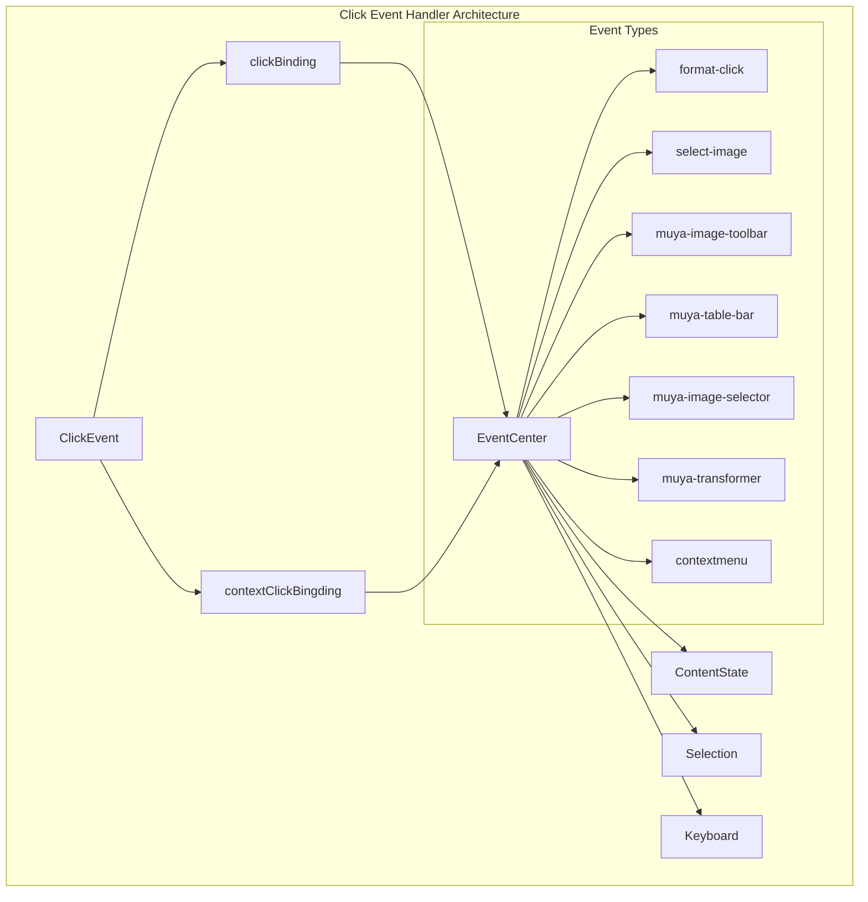
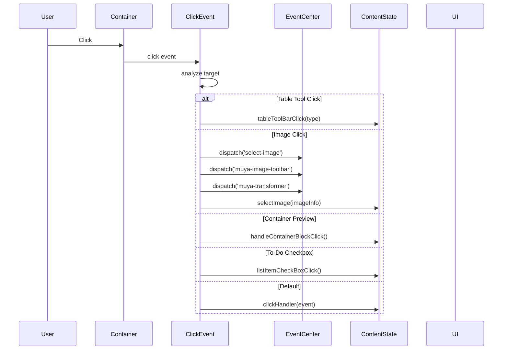
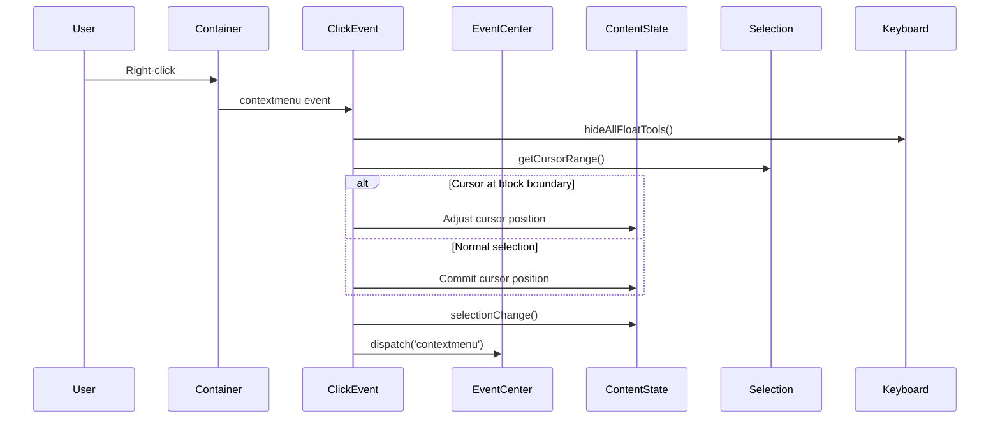
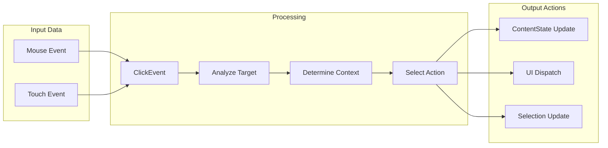

# Click Event Handler Module

## Introduction

The click_event_handler module is a critical component of the Muya framework that manages all mouse click interactions within the editor. It serves as the primary interface between user mouse actions and the editor's content manipulation system, handling everything from simple text selection to complex interactions with images, tables, and specialized content blocks.

## Architecture Overview

The ClickEvent class acts as a centralized event processor that intercepts and handles all click events within the Muya editor container. It works in conjunction with the EventCenter to dispatch appropriate actions based on the type and context of user clicks.



## Core Components

### ClickEvent Class

The `ClickEvent` class is the main component of this module, responsible for:

- **Event Binding**: Attaches click and context menu event listeners to the editor container
- **Event Processing**: Analyzes click targets and determines appropriate actions
- **State Management**: Updates content state and cursor positions based on interactions
- **UI Coordination**: Triggers UI components like toolbars, selectors, and transformers

#### Constructor
```javascript
constructor(muya) {
  this.muya = muya
  this.clickBinding()
  this.contextClickBingding()
}
```

## Event Handling Flow

### Click Event Processing



### Context Menu Processing



## Specialized Click Handlers

### Image Interactions

The module handles various image-related clicks:

1. **Image Selection**: Clicking on images triggers selection and toolbar display
2. **Image Deletion**: Clicking delete icons removes images from content
3. **Failed Image Handling**: Clicking on failed/empty images opens the image selector
4. **Image Transform**: Enables image resizing and positioning

### Table Interactions

- **Toolbar Clicks**: Handles clicks on table formatting tools
- **Drag Bar Clicks**: Manages table column/row resizing

### Content Block Interactions

- **Container Blocks**: Handles clicks on special content containers (HTML blocks, previews)
- **To-Do Lists**: Manages checkbox state changes
- **Code Blocks**: Handles copy functionality for code blocks

### Navigation Elements

- **Footnote Backlinks**: Smooth scrolling to footnote references
- **Math/Ruby Elements**: Selection and editing of mathematical and ruby text

## Dependencies

The ClickEvent module relies on several key dependencies:

### Internal Dependencies
- **[muya_framework](muya_framework.md)**: Core Muya framework instance
- **[muya_content](muya_content.md)**: Content state management
- **[muya_selection](muya_selection.md)**: Cursor and selection handling
- **[muya_events](muya_events.md)**: Event center for dispatching actions

### Utility Dependencies
- **DOM Manipulation**: `operateClassName` for CSS class management
- **Image Processing**: `getImageInfo` for extracting image metadata
- **Configuration**: `CLASS_OR_ID` constants for element identification

## Data Flow



## Integration Points

### Event Center Integration

The module dispatches various events to the EventCenter:

- `format-click`: For format-related clicks (images, links)
- `select-image`: When images are selected
- `muya-image-toolbar`: To display image editing toolbar
- `muya-table-bar`: For table manipulation
- `muya-image-selector`: To open image selection dialog
- `muya-transformer`: For image transformation tools
- `contextmenu`: For right-click context menus

### Content State Integration

Updates ContentState for:
- Image selection and deletion
- Table interactions
- Container block handling
- To-do list state changes
- General click processing

## Error Handling

The module includes several defensive programming practices:

1. **Null Checks**: Verifies cursor positions and DOM elements exist
2. **Event Prevention**: Prevents default browser behavior when necessary
3. **Boundary Handling**: Manages cursor positioning at content boundaries
4. **Graceful Degradation**: Continues operation even if some UI elements fail

## Performance Considerations

- **Event Delegation**: Uses container-level event listeners for efficiency
- **Early Returns**: Exits quickly for irrelevant clicks
- **DOM Queries**: Minimizes DOM traversal with targeted selectors
- **State Updates**: Batches related state changes together

## Extension Points

The module can be extended to handle new click types by:

1. Adding new target detection logic in `clickBinding()`
2. Implementing corresponding ContentState methods
3. Dispatching new event types through EventCenter
4. Adding UI components for new interaction types

## Usage Examples

### Basic Click Handling
```javascript
const clickEvent = new ClickEvent(muyaInstance)
// Automatically binds to container and handles all clicks
```

### Custom Click Processing
The module automatically processes clicks, but custom behavior can be added by listening to dispatched events:

```javascript
muya.eventCenter.subscribe('select-image', (imageInfo) => {
  // Custom image selection handling
})
```

## Related Documentation

- [muya_events](muya_events.md) - Event system overview and EventCenter
- [muya_content](muya_content.md) - Content state management
- [muya_selection](muya_selection.md) - Selection and cursor handling
- [muya_ui_components](muya_ui_components.md) - UI components triggered by clicks