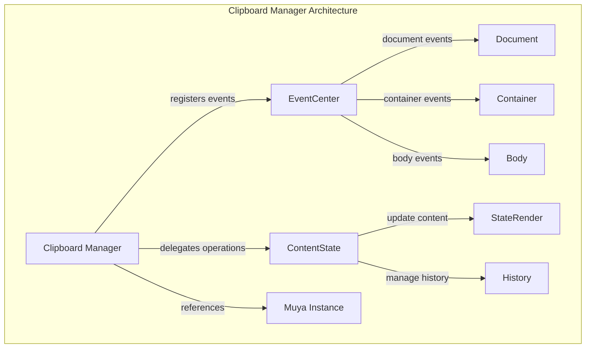
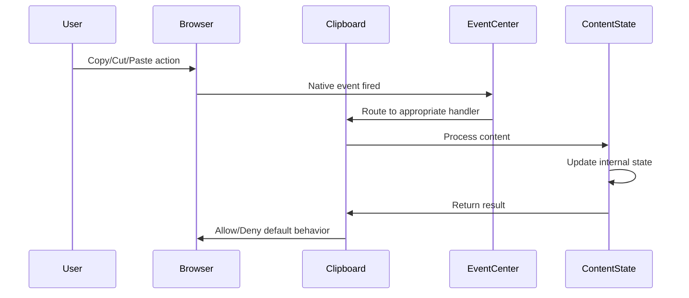
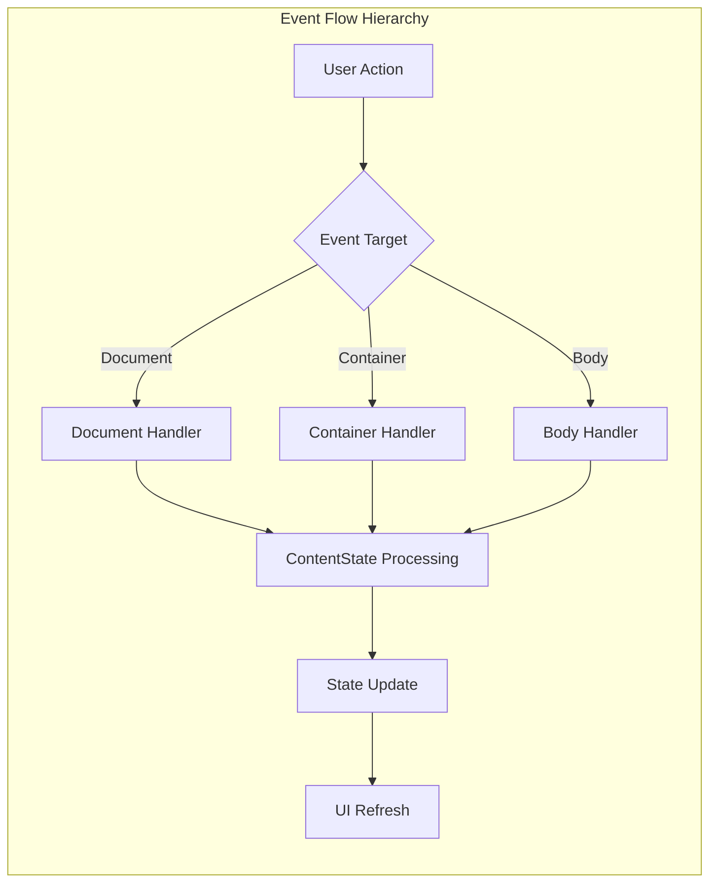
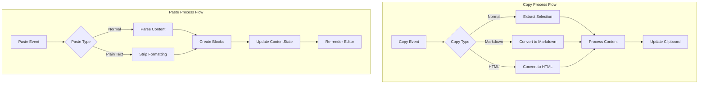
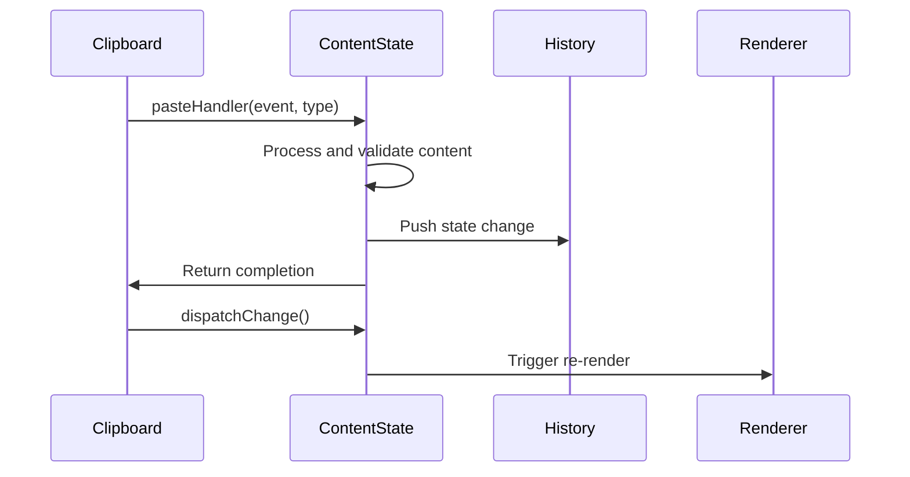

# Clipboard Manager Module

## Introduction

The Clipboard Manager module is a core component of the Muya framework that handles all clipboard-related operations within the markdown editor. It provides a centralized system for managing copy, cut, and paste operations with support for different content formats including plain text, markdown, and HTML. The module ensures seamless integration between user clipboard interactions and the editor's content state management.

## Architecture Overview

The Clipboard Manager operates as an event-driven system that intercepts and processes clipboard events at multiple levels within the application. It serves as a bridge between native browser clipboard APIs and the editor's internal content representation.



## Core Components

### Clipboard Class

The `Clipboard` class is the main component that orchestrates all clipboard operations. It maintains internal state for copy/paste types and coordinates between event handlers and content state management.

**Key Properties:**
- `_copyType`: Controls the format of copied content ('normal', 'copyAsMarkdown', 'copyAsHtml')
- `_pasteType`: Controls paste behavior ('normal', 'pasteAsPlainText')
- `_copyInfo`: Stores additional information about copied blocks
- `muya`: Reference to the main Muya editor instance

**Event Registration Pattern:**


## Event Handling System

The Clipboard Manager implements a multi-level event handling strategy to capture clipboard operations at different scopes:

### Document-Level Events
- **paste**: Handles paste operations occurring outside the editor container
- **copy/cut**: Manages copy/cut operations at the document level

### Container-Level Events
- **paste**: Primary paste handler for editor content
- **copy/cut**: Direct manipulation of editor content

### Body-Level Events
- **copy/cut**: Fallback handlers for edge cases



## Content Processing Pipeline

### Copy Operations

The copy process involves several steps to ensure content is properly formatted for external applications:

1. **Event Capture**: Clipboard manager intercepts the copy event
2. **Content Extraction**: ContentState extracts the selected content
3. **Format Processing**: Content is converted based on `_copyType`
4. **Clipboard Population**: Processed content is placed in system clipboard

### Paste Operations

Paste operations reverse the process, converting external content into the editor's internal format:

1. **Clipboard Access**: Retrieve content from system clipboard
2. **Content Analysis**: Determine content type and structure
3. **Format Conversion**: Convert to editor's internal block structure
4. **State Integration**: Merge new content with existing document



## Integration with Content State

The Clipboard Manager relies heavily on the ContentState system for all content manipulation operations. Key integration points include:

### ContentState Methods Used
- `docPasteHandler()`: Handles document-level paste operations
- `docCopyHandler()`: Processes document-level copy operations
- `docCutHandler()`: Manages document-level cut operations
- `copyHandler()`: Handles container-level copy with format options
- `cutHandler()`: Processes container-level cut operations
- `pasteHandler()`: Manages container-level paste with format options

### State Synchronization

After any clipboard operation that modifies content, the system ensures proper state synchronization:



## Advanced Features

### Copy as Markdown

The system can export selected content as pure markdown text, useful for sharing content with other markdown editors or applications.

### Copy as HTML

Converts selected markdown content to HTML format, enabling seamless integration with HTML-based applications.

### Paste as Plain Text

Strips all formatting from pasted content, ensuring clean text insertion without unwanted styling or structure.

### Block-Level Copy

Supports copying entire blocks (tables, code blocks, mathematical expressions) with their associated metadata and structure intact.

## Error Handling and Edge Cases

### Deprecated API Usage

The current implementation uses `document.execCommand()` which is deprecated. The system includes TODO comments indicating future migration to modern Clipboard API.

### Cross-Browser Compatibility

The event handling system is designed to work across different browsers and handles variations in clipboard API implementations.

### Content Validation

All pasted content is validated and sanitized before integration into the document structure to prevent corruption of the editor state.

## Dependencies

The Clipboard Manager module depends on several other system components:

- **[EventCenter](event_center.md)**: Provides event registration and management infrastructure
- **[ContentState](content_state.md)**: Handles all content manipulation and state management
- **[Muya Framework](muya_framework.md)**: Provides the core editor instance and configuration

## Usage Patterns

### Basic Copy/Paste
```javascript
// Copy operation is handled automatically through user interaction
// Paste operation is handled automatically through user interaction
```

### Programmatic Copy
```javascript
// Copy as markdown
clipboard.copyAsMarkdown()

// Copy as HTML
clipboard.copyAsHtml()

// Copy specific block
clipboard.copy('copyBlock', blockKey)
```

### Programmatic Paste
```javascript
// Paste as plain text
clipboard.pasteAsPlainText()
```

## Performance Considerations

### Event Delegation

The system uses event delegation to minimize the number of event listeners attached to the DOM, improving performance especially in large documents.

### Efficient Content Processing

Content processing is optimized to handle large selections and complex document structures without blocking the UI.

### Memory Management

Event listeners are properly managed and cleaned up to prevent memory leaks, especially important in long-running editor sessions.

## Future Enhancements

### Modern Clipboard API

Migration from `document.execCommand()` to the modern Clipboard API will provide better security, reliability, and feature support.

### Enhanced Format Support

Potential addition of more export formats such as JSON, LaTeX, or custom formats based on user needs.

### Clipboard History

Implementation of a clipboard history feature to allow users to access previously copied content.

### Cross-Application Integration

Enhanced support for copying content to and from other applications while preserving formatting and structure.