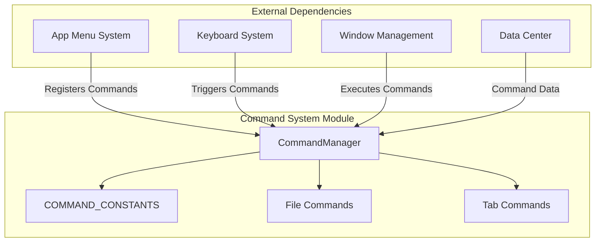
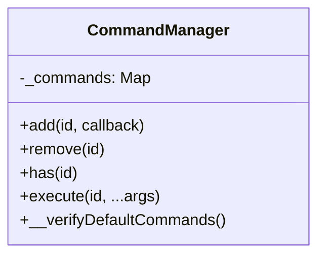
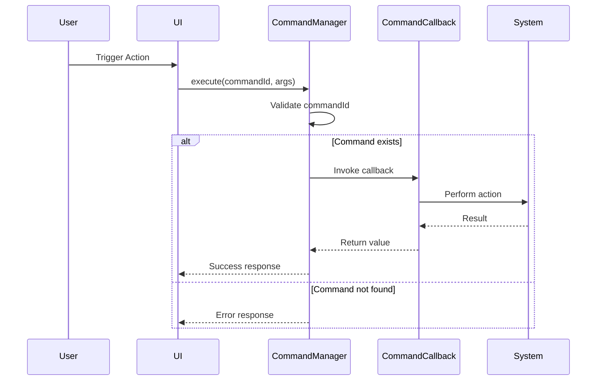
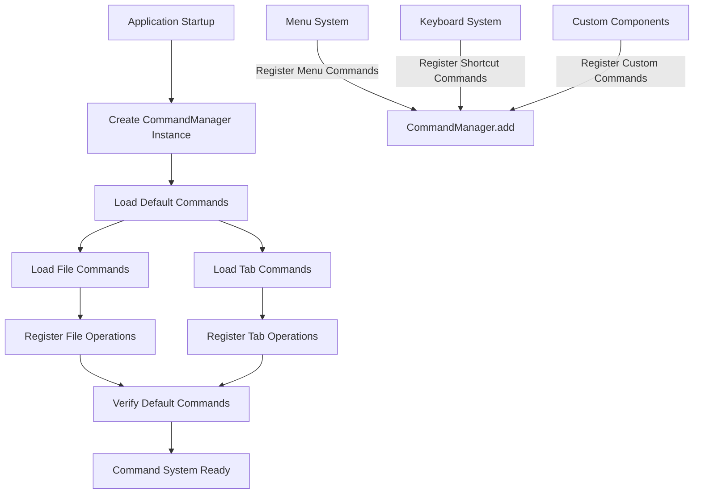

# Command System Module Documentation

## Introduction

The Command System module serves as the central command execution framework for the application, providing a unified interface for registering, managing, and executing commands throughout the system. It acts as the backbone for user actions, menu operations, keyboard shortcuts, and programmatic functionality, ensuring consistent command handling across all application components.

## Architecture Overview

The Command System follows a centralized command pattern where all application commands are registered and executed through a single CommandManager instance. This design promotes consistency, maintainability, and centralized error handling for all user-initiated actions.



## Core Components

### CommandManager

The `CommandManager` class is the central component that manages all application commands. It provides a singleton instance that maintains a registry of command callbacks and handles command execution.

**Key Responsibilities:**
- Command registration and validation
- Command execution with error handling
- Duplicate command prevention
- Default command verification

**Core Methods:**
- `add(id, callback)`: Registers a new command with a unique identifier
- `remove(id)`: Removes a command from the registry
- `has(id)`: Checks if a command exists
- `execute(id, ...args)`: Executes a command with provided arguments



### Command Constants

The module imports `COMMAND_CONSTANTS` from the common commands module, providing a centralized definition of all available command identifiers. This ensures type safety and prevents command ID conflicts across the application.

### Command Categories

The system organizes commands into logical categories:

1. **File Commands**: Handle file operations (open, save, close, etc.)
2. **Tab Commands**: Manage tab-related operations (new tab, close tab, switch tab, etc.)

## Data Flow



## Integration with Other Modules

### Menu System Integration
The [menu_system](menu_system.md) module registers menu items as commands, allowing menu actions to be executed through the CommandManager. This creates a unified interface where both menu clicks and keyboard shortcuts trigger the same command logic.

### Keyboard System Integration
The [keyboard_system](keyboard_system.md) module maps keyboard shortcuts to command IDs. When a keyboard shortcut is pressed, the keyboard system calls `CommandManager.execute()` with the appropriate command ID, ensuring consistent behavior across different input methods.

### Window Management Integration
The [window_management](window_management.md) module uses commands to control window operations such as opening new windows, closing windows, and switching between window types. Commands provide a consistent API for window manipulation.

### Data Management Integration
The [data_management](data_management.md) module may trigger commands for data-related operations, such as saving files, loading content, or refreshing data views. Commands ensure these operations are performed consistently regardless of the trigger source.

## Command Registration Process



## Error Handling

The CommandManager implements robust error handling:

1. **Duplicate Command Prevention**: Throws an error if attempting to register a command with an existing ID
2. **Missing Command Detection**: Throws an error if attempting to execute a non-existent command
3. **Debug Verification**: Provides a verification method to ensure all expected default commands are registered

## Usage Examples

### Registering a Command
```javascript
import { CommandManager } from './main/commands'

CommandManager.add('custom:my-command', (arg1, arg2) => {
  // Command implementation
  return result
})
```

### Executing a Command
```javascript
import { CommandManager } from './main/commands'

try {
  const result = CommandManager.execute('custom:my-command', 'arg1', 'arg2')
} catch (error) {
  console.error('Command execution failed:', error.message)
}
```

### Checking Command Availability
```javascript
import { CommandManager } from './main/commands'

if (CommandManager.has('custom:my-command')) {
  // Command is available
}
```

## Extensibility

The Command System is designed for extensibility:

1. **Custom Commands**: Any module can register custom commands using the `add()` method
2. **Command Categories**: New command categories can be added by creating additional loader functions
3. **Dynamic Registration**: Commands can be registered at runtime based on application state
4. **Command Overriding**: While not recommended, the system allows for command replacement by removing and re-adding commands

## Performance Considerations

- **Singleton Pattern**: Uses a single shared instance to avoid memory overhead
- **Map-based Storage**: Utilizes JavaScript Map for O(1) command lookup performance
- **Lazy Loading**: Command categories are loaded only when needed
- **Memory Management**: Commands can be removed when no longer needed to free resources

## Security Considerations

- **Command Validation**: All commands must be explicitly registered before execution
- **No Dynamic Execution**: Commands are pre-defined callbacks, not dynamic code execution
- **Access Control**: Higher-level modules can implement permission checks before calling commands
- **Error Isolation**: Command execution errors are contained and don't crash the application

## Testing Strategy

The Command System supports comprehensive testing:

1. **Unit Testing**: Individual commands can be tested in isolation
2. **Integration Testing**: Command interactions with other modules can be verified
3. **Mock Commands**: Test doubles can be registered for dependency isolation
4. **Command Verification**: The verification method helps ensure all expected commands are available

This modular design ensures the Command System remains maintainable, testable, and scalable as the application grows in complexity.