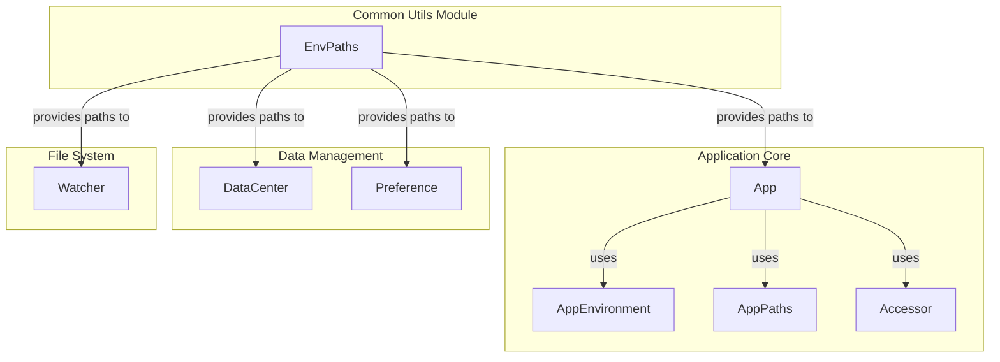
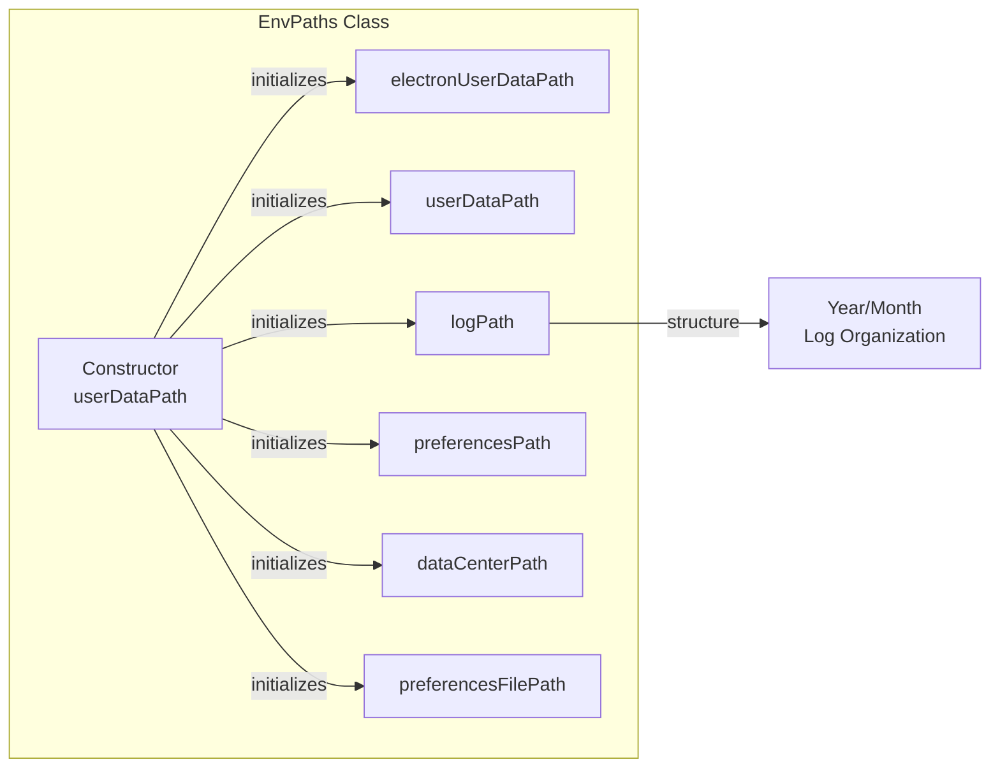
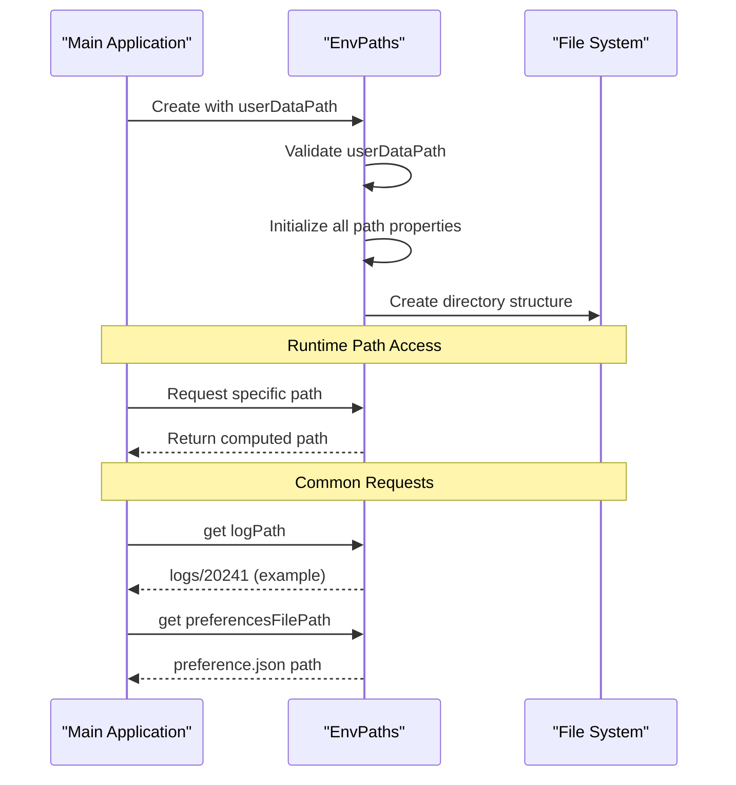
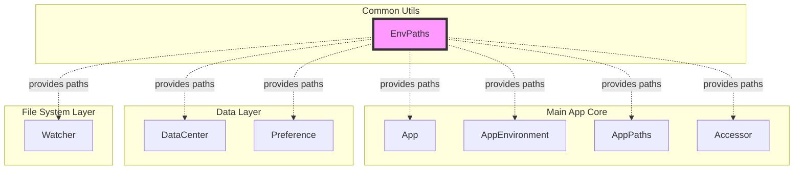

# Common Utils Module Documentation

## Introduction

The `common_utils` module provides essential utility functions and path management services for the application. At its core, it manages environment paths and directory structures that are fundamental to the application's data storage, logging, and configuration management. This module serves as a centralized location for path resolution and environment setup, ensuring consistent file system operations across the entire application.

## Architecture Overview

The common_utils module is built around a single core component that provides path management capabilities:

### Core Component
- **EnvPaths**: A class that manages all application-specific directory paths including user data, logs, preferences, and data center paths



## Component Details

### EnvPaths Class

The `EnvPaths` class is the cornerstone of the common_utils module, providing a centralized path management system. It creates and manages all necessary directory paths for the application's operation.

#### Key Features
- **Centralized Path Management**: Consolidates all application paths in a single location
- **Automatic Directory Structure**: Creates organized directory hierarchies for different data types
- **Date-based Logging**: Automatically organizes log files by year and month
- **Validation**: Ensures required paths are provided and valid

#### Constructor Parameters
- `userDataPath` (string): The base user data path where all application data will be stored

#### Properties
- `electronUserDataPath`: Path for Electron-specific user data
- `userDataPath`: Base path for all user data
- `logPath`: Organized log path with year/month structure
- `preferencesPath`: Path for user preferences
- `dataCenterPath`: Path for data center operations
- `preferencesFilePath`: Full path to the preferences JSON file



## Data Flow

The EnvPaths component follows a simple initialization and access pattern:



## Integration with Other Modules

The common_utils module serves as a foundational service that other modules depend on for path resolution:

### Main Application Core
- **App**: Uses EnvPaths for determining where to store application data
- **AppEnvironment**: References paths for environment-specific configurations
- **AppPaths**: Integrates with EnvPaths for comprehensive path management
- **Accessor**: Uses paths for data access operations

### Data Management
- **DataCenter**: Relies on EnvPaths for data storage locations
- **Preference**: Uses EnvPaths to locate the preferences file

### File System
- **Watcher**: Monitors directories whose paths are provided by EnvPaths



## Usage Patterns

### Initialization
The EnvPaths class is typically instantiated during application startup with the user data path provided by the Electron framework:

```javascript
// Example usage pattern
const userDataPath = app.getPath('userData');
const envPaths = new EnvPaths(userDataPath);
```

### Path Access
Once initialized, other components can access specific paths as needed:

```javascript
// Accessing different paths
const logPath = envPaths.logPath;
const preferencesPath = envPaths.preferencesFilePath;
const dataCenterPath = envPaths.dataCenterPath;
```

## Error Handling

The EnvPaths class implements basic validation:
- Throws an error if `userDataPath` is not provided during construction
- Ensures all paths are properly constructed using Node.js path utilities

## Future Considerations

The code includes commented sections indicating planned features:
- Global storage path management
- Session path management
- Enhanced preferences path organization

These features are marked with TODO comments and may be implemented in future versions.

## Dependencies

The EnvPaths class has minimal external dependencies:
- **Node.js path module**: Used for cross-platform path construction
- **Date object**: Used for organizing log files by date

This minimal dependency footprint makes the common_utils module highly reliable and easy to maintain.

## Related Documentation

For more information about how the common_utils module integrates with other parts of the system, see:

- [main_app_core.md](main_app_core.md) - Main application architecture and core components
- [data_management.md](data_management.md) - Data center operations and preference management
- [file_system.md](file_system.md) - File system watching and monitoring capabilities

The common_utils module provides the foundational path management that enables these higher-level modules to function correctly and consistently across different operating systems and user environments.