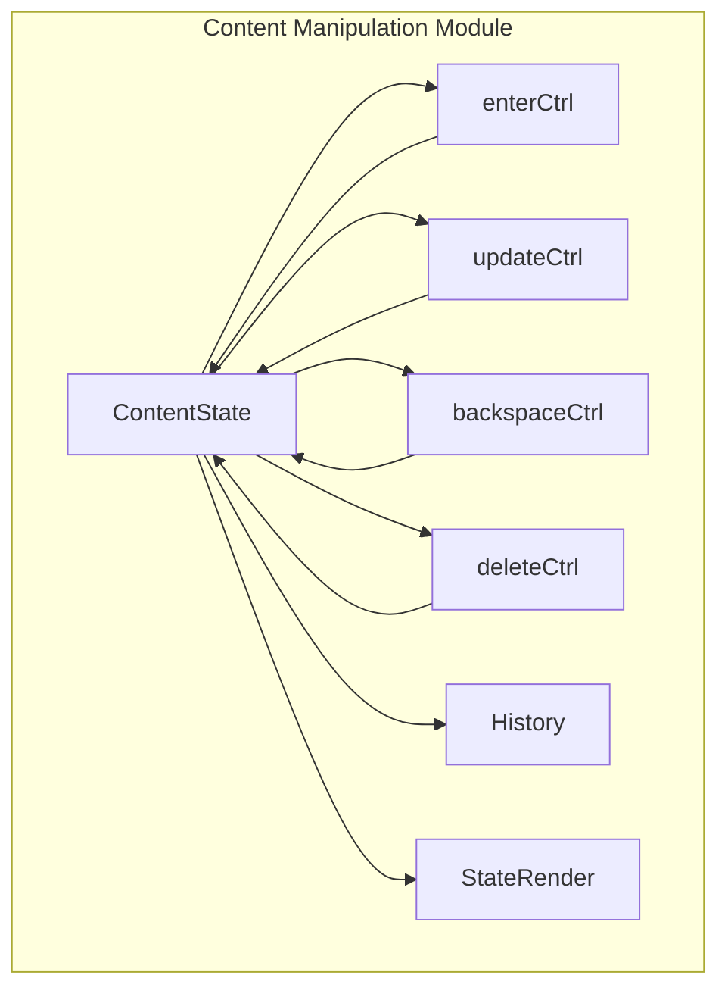
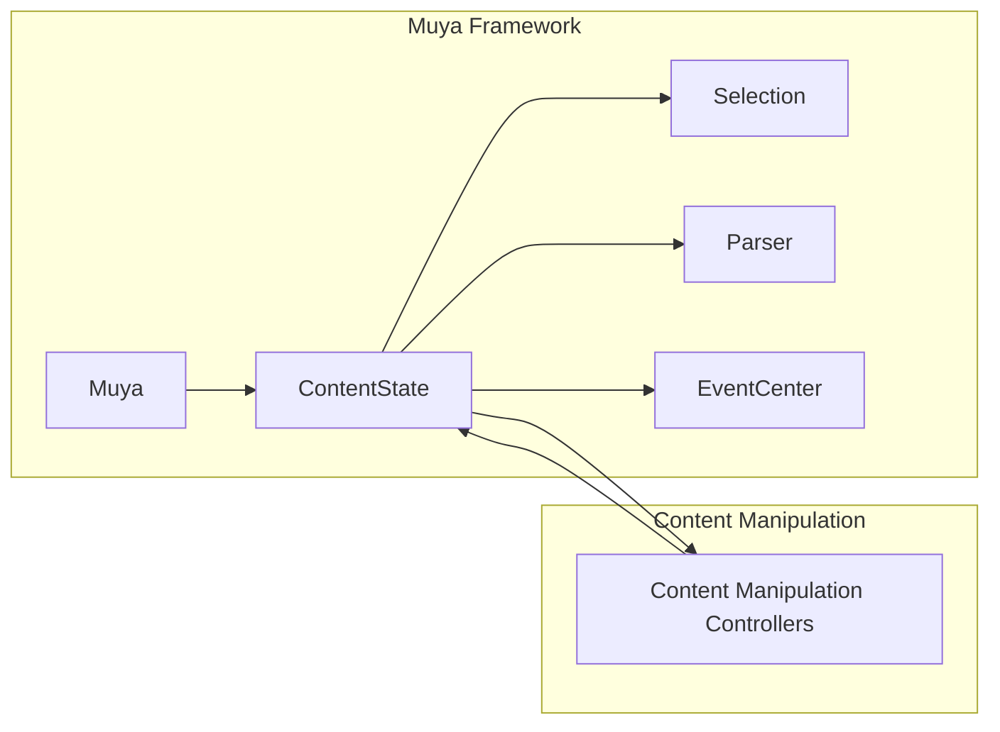
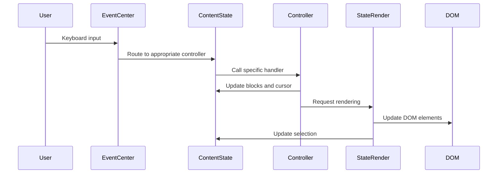
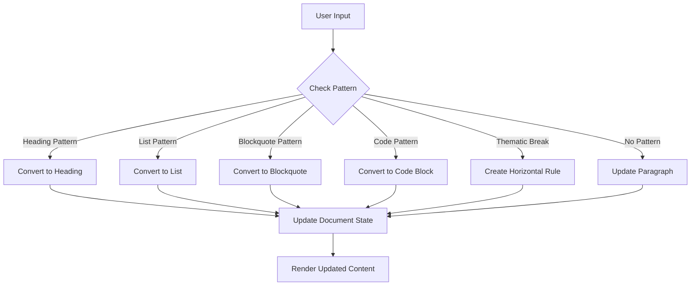
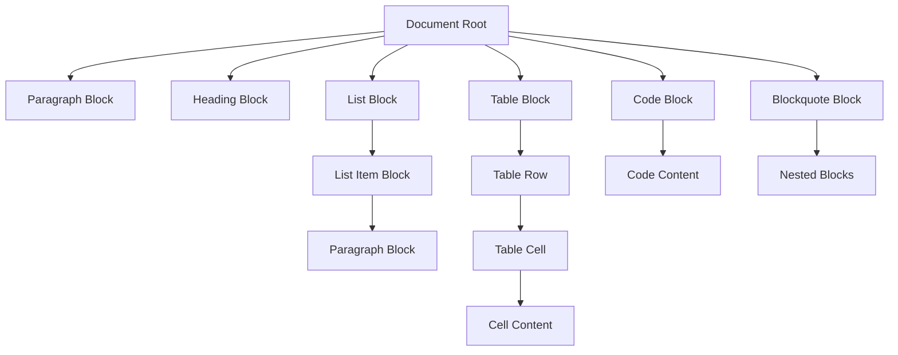
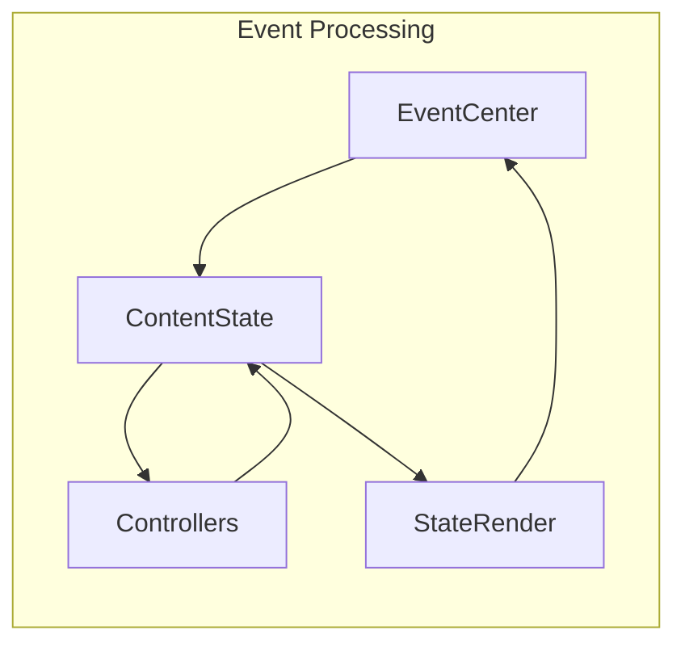

# Content Manipulation Module

## Introduction

The content_manipulation module is a core component of the Muya framework that handles all text editing operations, content transformations, and document structure modifications. It provides the fundamental functionality for manipulating markdown content through a block-based architecture, enabling rich text editing capabilities while maintaining markdown compatibility.

## Purpose and Core Functionality

The module serves as the central hub for content operations, providing:

- **Text Input Processing**: Real-time parsing and transformation of user input
- **Block Management**: Creation, modification, and deletion of document blocks
- **Content Updates**: Dynamic content type conversions (paragraphs to headings, lists, etc.)
- **Keyboard Event Handling**: Processing of Enter, Backspace, Delete, and other key events
- **Document Structure Maintenance**: Preservation of document hierarchy and relationships
- **History Management**: Undo/redo functionality with intelligent state tracking

## Architecture Overview

### Component Structure



### Integration with Muya Framework



## Core Components

### ContentState Class

The `ContentState` class is the central orchestrator that manages the document state and coordinates all content manipulation operations. It maintains:

- **Block Hierarchy**: Tree structure of document blocks (paragraphs, headings, lists, etc.)
- **Cursor Position**: Current text selection and caret location
- **Render State**: Information about what needs to be re-rendered
- **History Stack**: Undo/redo state management
- **Selection State**: Selected images, table cells, and other elements

Key properties:
- `blocks`: Array of top-level document blocks
- `cursor`: Current cursor position and selection
- `history`: History manager for undo/redo functionality
- `renderRange`: Range of blocks that need re-rendering
- `selectedImage`: Currently selected image information
- `selectedTableCells`: Selected table cells information

### Content Manipulation Controllers

#### 1. Enter Controller (`enterCtrl`)

Handles Enter key events and manages block creation and splitting:

- **Block Splitting**: Splits paragraphs, headings, and list items at cursor position
- **List Management**: Creates new list items and handles list nesting
- **Table Operations**: Manages row creation and cell navigation in tables
- **Code Block Handling**: Handles line breaks within code blocks with auto-indentation
- **Soft/Hard Line Breaks**: Manages Shift+Enter for manual line breaks

Key methods:
- `enterHandler()`: Main entry point for Enter key processing
- `chopBlockByCursor()`: Splits blocks at cursor position
- `enterInEmptyParagraph()`: Handles Enter in empty paragraphs
- `createRow()`: Creates table rows
- `createBlockLi()`: Creates list item blocks

#### 2. Update Controller (`updateCtrl`)

Manages real-time content updates and block type conversions:

- **Inline Updates**: Converts text to headings, lists, blockquotes, etc.
- **Pattern Recognition**: Detects markdown patterns and applies transformations
- **Block Type Conversion**: Changes paragraph types based on content
- **List Management**: Handles bullet lists, ordered lists, and task lists
- **Header Conversion**: Supports both ATX and Setext header styles

Key methods:
- `checkInlineUpdate()`: Main update detection and processing
- `updateList()`: Converts text to list items
- `updateAtxHeader()`: Creates ATX-style headers
- `updateSetextHeader()`: Creates Setext-style headers
- `updateThematicBreak()`: Creates horizontal rules
- `updateTaskListItem()`: Converts to task list items

#### 3. Backspace Controller (`backspaceCtrl`)

Handles Backspace key events and content deletion:

- **Character Deletion**: Removes characters and handles selection deletion
- **Block Merging**: Merges blocks when backspacing at block boundaries
- **List Item Conversion**: Converts list items to regular paragraphs
- **Blockquote Handling**: Manages backspacing within blockquotes
- **Table Cell Operations**: Handles deletion within table cells
- **Image Deletion**: Manages deletion of selected images

Key methods:
- `backspaceHandler()`: Main backspace processing
- `checkBackspaceCase()`: Determines the type of backspace operation needed
- `docBackspaceHandler()`: Handles document-level backspace operations

#### 4. Delete Controller (`deleteCtrl`)

Handles Delete key events and forward deletion:

- **Forward Deletion**: Removes content after cursor position
- **Block Merging**: Merges blocks when deleting at block boundaries
- **Selection Handling**: Manages deletion of selected content
- **Special Cases**: Handles deletion in code blocks and headers

Key methods:
- `deleteHandler()`: Main delete processing
- `docDeleteHandler()`: Handles document-level delete operations

### History Management

The History class provides undo/redo functionality:

- **State Snapshots**: Captures complete document state at key moments
- **Intelligent Timing**: Uses pending states to optimize history recording
- **Cursor Preservation**: Maintains cursor position during undo/redo
- **Memory Management**: Limits history depth to prevent memory issues

Key methods:
- `push()`: Records a new state snapshot
- `undo()`: Reverts to previous state
- `redo()`: Restores next state
- `pushPending()`: Records pending state for later commitment

## Data Flow and Processing

### Input Processing Flow



### Content Update Decision Tree



## Block System Architecture

### Block Types and Hierarchy

The module uses a hierarchical block system where each block can contain child blocks:



### Block Relationships

Each block maintains relationships with other blocks:
- **Parent-Child**: Hierarchical structure
- **Sibling**: Previous and next blocks at the same level
- **Container**: Blocks that contain other blocks (lists, tables, etc.)

## Integration with Other Modules

### Dependencies

The content_manipulation module integrates with several other system components:

- **[muya_selection](muya_selection.md)**: Manages text selection and cursor positioning
- **[muya_parser](muya_parser.md)**: Provides text parsing and tokenization services
- **[muya_events](muya_events.md)**: Handles event routing and processing
- **[muya_content](muya_content.md)**: Provides the ContentState foundation and history management

### Event Flow



## Key Features and Capabilities

### Real-time Content Transformation

The module provides instant feedback as users type, automatically converting text patterns into appropriate markdown structures:

- **Heading Creation**: `#` followed by space creates headings
- **List Generation**: `-`, `*`, or `1.` creates list items
- **Blockquote Formation**: `>` creates blockquote blocks
- **Code Block Detection**: Indentation or triple backticks create code blocks

### Intelligent Block Management

- **Context-Aware Operations**: Different behavior based on current block type and context
- **Automatic Block Creation**: Creates appropriate blocks for different content types
- **Block Merging and Splitting**: Handles complex block operations seamlessly
- **Nested Structure Support**: Manages nested lists, code blocks, and other structures

### Selection and Cursor Management

- **Multi-block Selection**: Handles selections spanning multiple blocks
- **Cursor Preservation**: Maintains cursor position during transformations
- **Selection State Tracking**: Tracks selected images, table cells, and other elements

## Error Handling and Edge Cases

### Common Issues Addressed

1. **Empty Block Handling**: Special logic for empty paragraphs and blocks
2. **Boundary Conditions**: Careful handling of cursor at block boundaries
3. **Nested Structure Edge Cases**: Complex scenarios with deeply nested content
4. **Selection Edge Cases**: Handling of partial selections and multi-block selections
5. **History Consistency**: Ensuring undo/redo works correctly with complex operations

### Validation and Safety

- **Block Validation**: Ensures block structure integrity
- **Cursor Validation**: Validates cursor positions before operations
- **State Consistency**: Maintains document state consistency
- **Memory Management**: Prevents memory leaks with proper cleanup

## Performance Considerations

### Optimization Strategies

1. **Partial Rendering**: Only re-renders affected blocks
2. **Caching**: Uses token caching for parsing operations
3. **Lazy Evaluation**: Defers expensive operations when possible
4. **Batch Operations**: Groups related operations for efficiency

### Memory Management

- **History Limiting**: Limits undo history to prevent memory bloat
- **Cleanup Operations**: Proper cleanup of event listeners and references
- **State Pruning**: Removes unnecessary state information

## Usage Examples

### Basic Text Input

```javascript
// User types "# Heading"
contentState.updateCtrl.checkInlineUpdate(block)
// Block is automatically converted to heading type
```

### List Creation

```javascript
// User types "- List item"
contentState.updateCtrl.updateList(block, 'bullet', '- ')
// Block is converted to list item within unordered list
```

### Enter Key Handling

```javascript
// User presses Enter in a paragraph
contentState.enterCtrl.enterHandler(event)
// Paragraph is split at cursor position
```

## Future Enhancements

### Planned Improvements

1. **Advanced Content Recognition**: Enhanced pattern detection for complex structures
2. **Performance Optimization**: Further optimization of rendering and parsing
3. **Plugin Architecture**: Extensible content manipulation plugins
4. **Collaborative Editing**: Support for real-time collaborative editing
5. **Advanced History**: More sophisticated undo/redo with operation grouping

### Potential Extensions

- **Custom Block Types**: Support for user-defined block types
- **Content Validation**: Real-time content validation and linting
- **Advanced Formatting**: Support for more complex formatting options
- **Import/Export Enhancements**: Better support for various markdown flavors

## Conclusion

The content_manipulation module is the heart of the Muya editor's text processing capabilities. Through its sophisticated block-based architecture and comprehensive set of controllers, it provides a seamless editing experience while maintaining the integrity and structure of markdown documents. The module's design enables real-time content transformation, intelligent block management, and robust error handling, making it suitable for complex document editing scenarios.