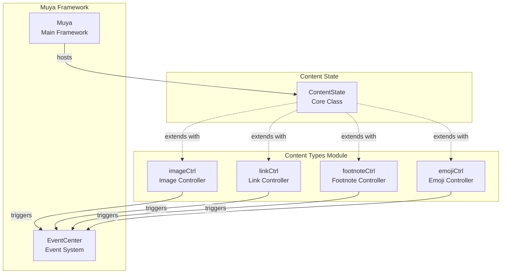
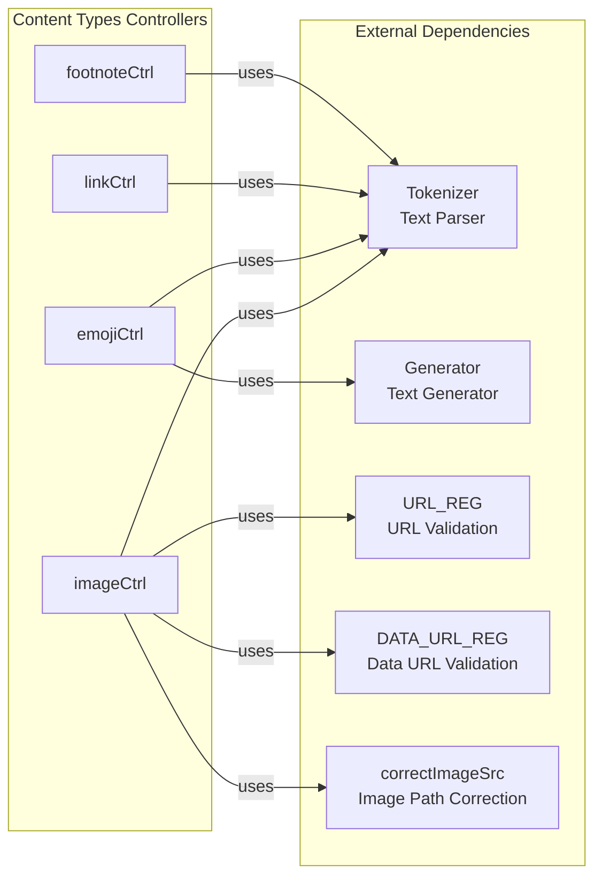
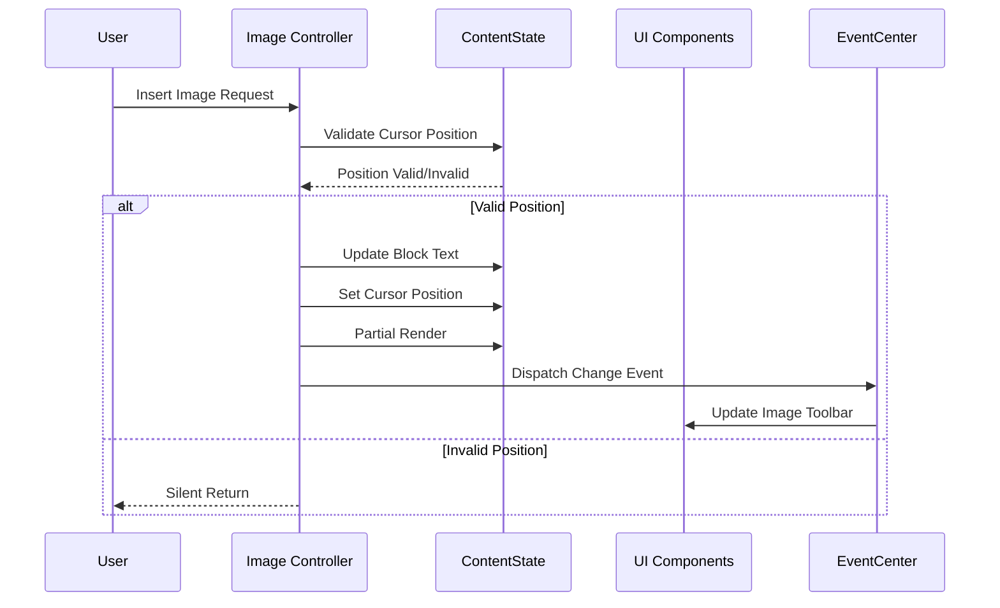
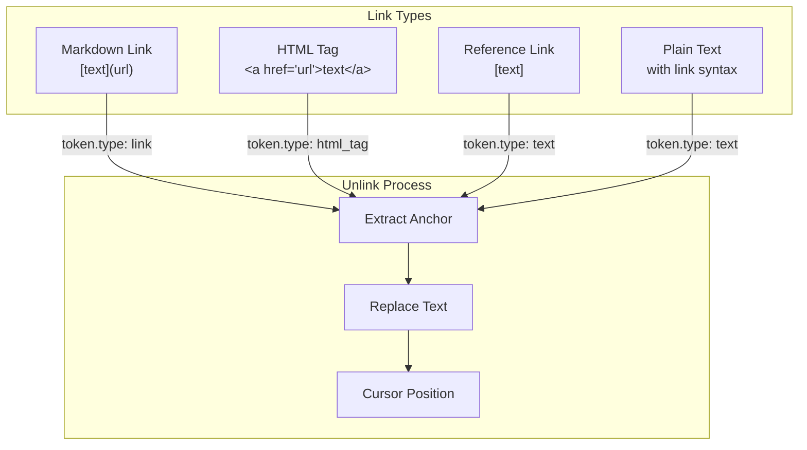
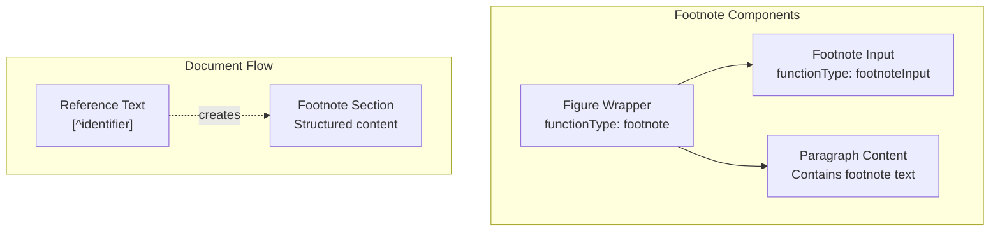
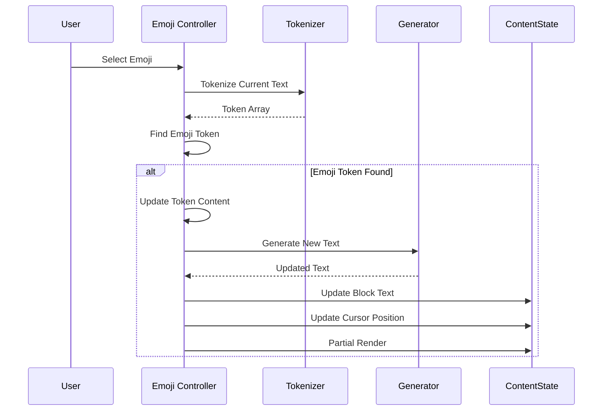
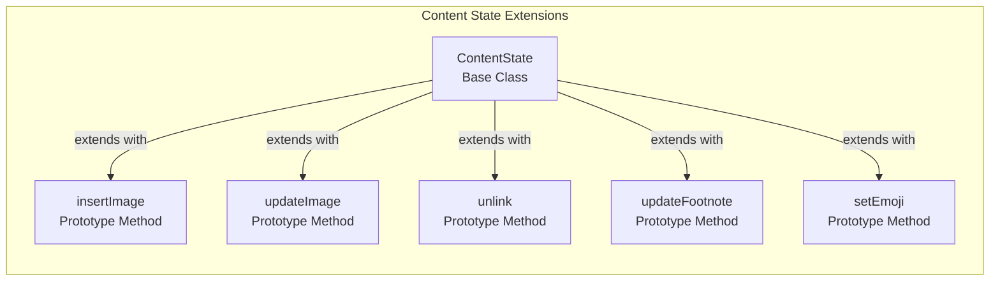
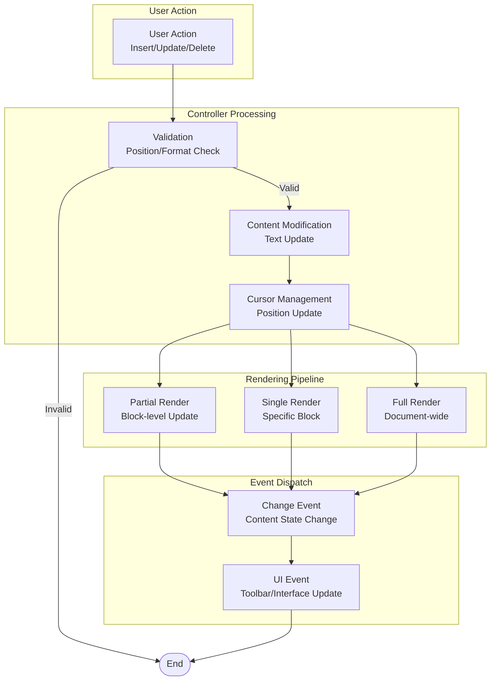

# Content Types Module Documentation

## Introduction

The content_types module is a specialized component within the Muya framework that handles the management and manipulation of rich content elements in a markdown editor. This module provides core functionality for handling images, links, footnotes, and emojis within the document content state. It serves as the bridge between user interactions and the underlying content representation, enabling rich text editing capabilities while maintaining the markdown format integrity.

## Module Architecture

### Core Components Overview

The content_types module consists of four primary controllers, each responsible for managing specific types of rich content:



### Component Dependencies



## Detailed Component Documentation

### Image Controller (imageCtrl)

The Image Controller provides comprehensive image management capabilities within the markdown editor:

#### Core Functions

- **Image Insertion**: Handles the insertion of inline images at cursor position with proper URL encoding and alt text generation
- **Image Updates**: Manages real-time updates to image attributes (alignment, source, title)
- **Image Replacement**: Enables replacement of existing images while preserving document structure
- **Image Deletion**: Provides safe removal of images with proper cursor positioning and UI cleanup
- **Image Selection**: Manages image selection state and triggers appropriate UI responses

#### Data Flow



#### URL Handling Strategy

The controller implements sophisticated URL handling:
- **Regular URLs**: Encoded using `encodeURI()` for proper web compatibility
- **Data URLs**: Preserved as-is to maintain embedded image data
- **Local Paths**: Spaces encoded and hash characters properly escaped
- **Alt Text Generation**: Automatically extracted from filename if not provided

### Link Controller (linkCtrl)

The Link Controller manages hyperlink operations within the document:

#### Core Functionality

- **Link Removal (Unlink)**: Converts links back to plain text while preserving the anchor content
- **Multi-format Support**: Handles different link types including markdown links, HTML tags, and reference links
- **Text Extraction**: Intelligently extracts anchor text from various link formats
- **Cursor Management**: Properly positions cursor after unlink operations

#### Link Type Handling



### Footnote Controller (footnoteCtrl)

The Footnote Controller manages academic-style footnotes within documents:

#### Key Features

- **Footnote Creation**: Generates new footnote sections with proper identifier formatting
- **Footnote Updates**: Converts regular text blocks into structured footnote sections
- **Document Structure**: Creates proper hierarchical structure with footnote input and content blocks
- **Navigation**: Automatically scrolls to newly created footnotes for user convenience

#### Footnote Structure



### Emoji Controller (emojiCtrl)

The Emoji Controller provides emoji insertion and management capabilities:

#### Functionality

- **Emoji Token Detection**: Identifies emoji tokens within the text using tokenizer
- **Emoji Replacement**: Replaces emoji shortcuts with actual emoji characters
- **Cursor Adjustment**: Properly positions cursor after emoji replacement
- **Text Generation**: Regenerates text with proper emoji syntax

#### Emoji Processing Flow



## Integration with Muya Framework

### Content State Integration

All controllers extend the ContentState prototype, providing seamless integration with the core content management system:



### Event System Integration

The module integrates with Muya's event system for UI coordination:

- **Image Toolbar Events**: `muya-image-toolbar` for showing/hiding image editing tools
- **Transformer Events**: `muya-transformer` for image selection and manipulation UI
- **Change Events**: `dispatchChange()` for notifying the system of content modifications

### UI Component Dependencies

The content_types module works closely with various UI components:

- **[Image Toolbar](imageToolbar.md)**: Provides image editing interface
- **[Link Tools](linkTools.md)**: Manages hyperlink editing
- **[Emoji Picker](emojiPicker.md)**: Enables emoji selection
- **[Transformer](transformer.md)**: Handles image transformation UI

## Data Flow Architecture

### Content Modification Pipeline



### Error Handling Strategy

The module implements defensive programming practices:

- **Position Validation**: Checks cursor position before content modification
- **Block Type Validation**: Ensures content can be inserted in specific block types
- **Token Validation**: Verifies token existence and type before operations
- **Graceful Degradation**: Silent returns on invalid operations to prevent crashes

## Usage Patterns

### Image Operations

```javascript
// Insert image at cursor position
contentState.insertImage({
  alt: 'Description',
  src: 'path/to/image.png',
  title: 'Image Title'
});

// Update existing image
contentState.updateImage(imageInfo, 'align', 'center');

// Delete image
contentState.deleteImage(imageInfo);
```

### Link Operations

```javascript
// Convert link to text
contentState.unlink(linkInfo);
```

### Footnote Operations

```javascript
// Create new footnote
contentState.createFootnote('reference-id');

// Update footnote from text
contentState.updateFootnote(block, line);
```

### Emoji Operations

```javascript
// Set emoji at cursor position
contentState.setEmoji(emojiItem);
```

## Performance Considerations

### Rendering Optimization

- **Partial Rendering**: Updates only affected blocks to minimize DOM manipulation
- **Single Rendering**: Targets specific blocks for isolated updates
- **Cursor Preservation**: Maintains cursor position across operations

### Memory Management

- **Prototype Extension**: Efficient method addition without class duplication
- **Event Cleanup**: Proper event dispatching to prevent memory leaks
- **Reference Management**: Careful handling of DOM references and cleanup

## Security Considerations

### URL Handling

- **Encoding Strategy**: Proper URL encoding to prevent injection attacks
- **Data URL Preservation**: Safe handling of embedded content
- **Local Path Sanitization**: Proper escaping of special characters

### Content Validation

- **Block Type Restrictions**: Prevents content insertion in sensitive areas (code blocks)
- **Token Type Verification**: Ensures operations are performed on valid content
- **Range Validation**: Validates text ranges before modification

## Future Enhancements

### Potential Extensions

- **Media Controller**: Support for video and audio content
- **Table Controller**: Enhanced table manipulation capabilities
- **Math Controller**: LaTeX/math equation support
- **Code Controller**: Enhanced code block management

### Integration Improvements

- **Plugin Architecture**: Extensible content type system
- **Custom Controllers**: User-defined content type handlers
- **Performance Monitoring**: Operation timing and optimization metrics
- **Accessibility**: Enhanced screen reader and keyboard navigation support

## Related Documentation

- **[Muya Framework](muya_framework.md)**: Core framework documentation
- **[Muya Content](muya_content.md)**: Content state management
- **[Muya UI Components](muya_ui_components.md)**: UI component system
- **[Content Manipulation](content_manipulation.md)**: Text editing operations
- **[Document Structure](document_structure.md)**: Document organization