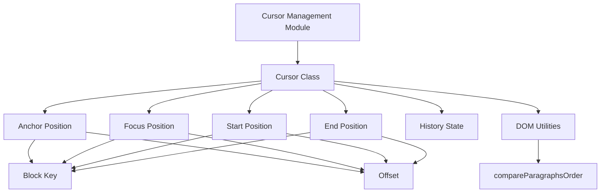
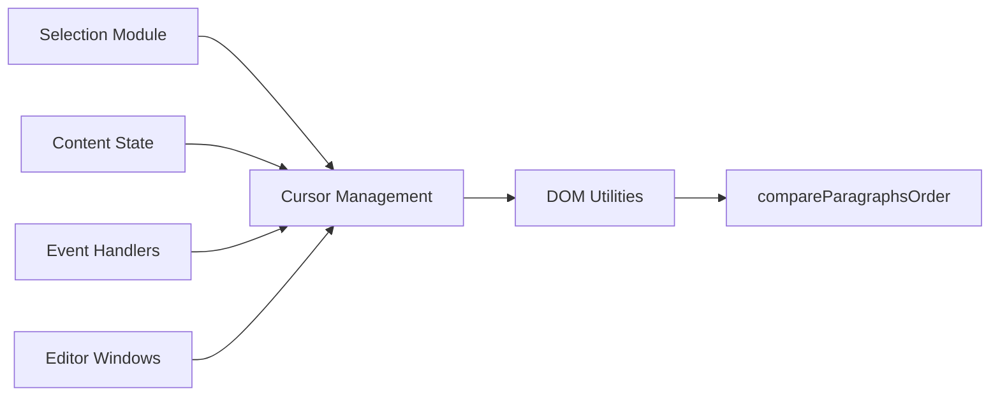
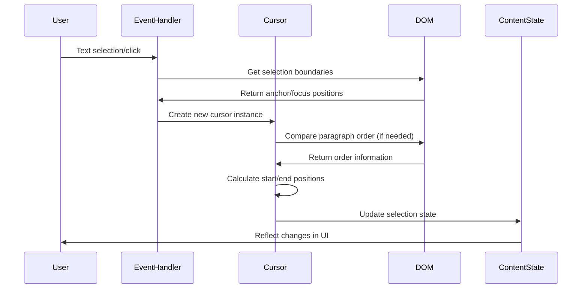
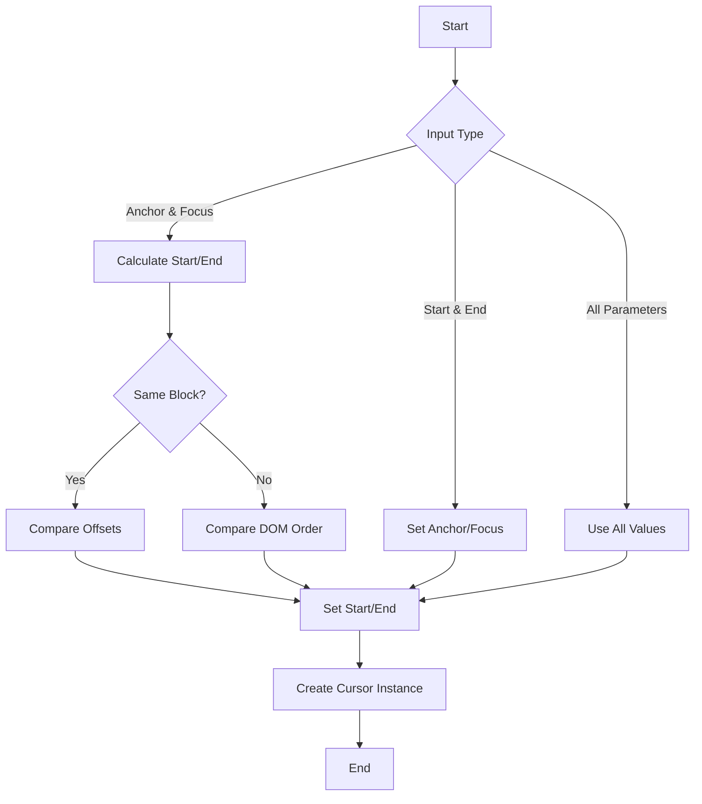
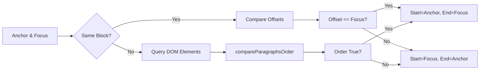

# Cursor Management Module

## Introduction

The cursor_management module is a core component of the Muya editor framework that handles text cursor positioning and selection state management. It provides the foundational `Cursor` class that represents text selection ranges and cursor positions within the editor's content state.

## Core Functionality

The module's primary responsibility is to manage text cursor and selection states within the Muya editor. It handles the complex logic of determining selection direction, ordering selection boundaries, and maintaining consistent cursor state across different document structures.

## Architecture

### Component Structure



### Dependencies



## Core Components

### Cursor Class

The `Cursor` class is the central component of this module, providing a unified interface for managing text selection and cursor positioning within the editor.

#### Constructor Parameters

- `anchor`: The starting point of the selection (block key + offset)
- `focus`: The ending point of the selection (block key + offset)
- `start`: The beginning of the selection range
- `end`: The end of the selection range
- `noHistory`: Flag to indicate if this cursor change should be recorded in history

#### Key Features

1. **Flexible Initialization**: The cursor can be initialized with either anchor/focus pairs or start/end pairs, automatically calculating the missing properties.

2. **Selection Direction Handling**: Automatically determines the correct selection direction based on document order when anchor and focus are in different blocks.

3. **DOM Integration**: Uses DOM utilities to compare paragraph positions and maintain consistent selection ordering.

4. **History Management**: Supports optional history tracking for undo/redo functionality.

## Data Flow



## Integration with Other Modules

### Selection Module
The cursor_management module is a child of the [selection module](selection.md), providing the core cursor functionality that the selection system builds upon.

### Content State
Integrates with the [content state module](muya_content.md) to maintain synchronized cursor positions across the document structure.

### Event System
Works closely with the [event handling system](muya_events.md) to respond to user interactions like clicks, keyboard input, and text selection.

### Editor Windows
Used by [editor windows](window_types.md) to manage cursor state within different window types and maintain consistent behavior across the application.

## Process Flow

### Cursor Creation Process



### Selection Direction Logic



## Usage Examples

### Basic Cursor Creation
```javascript
// Create cursor with anchor and focus
const cursor = new Cursor({
  anchor: { key: 'block-1', offset: 5 },
  focus: { key: 'block-1', offset: 10 }
})
```

### Cross-Block Selection
```javascript
// Create cursor spanning multiple blocks
const cursor = new Cursor({
  anchor: { key: 'block-1', offset: 5 },
  focus: { key: 'block-2', offset: 3 }
})
// Cursor will automatically determine correct order
```

### History-Aware Cursor
```javascript
// Create cursor without recording in history
const cursor = new Cursor({
  start: { key: 'block-1', offset: 0 },
  end: { key: 'block-1', offset: 15 },
  noHistory: true
})
```

## Key Design Decisions

1. **Flexible Constructor**: The Cursor class accepts multiple parameter combinations, making it adaptable to different use cases and integration points.

2. **DOM-Aware Selection**: By integrating with DOM utilities, the cursor system maintains consistency with the actual document structure and user expectations.

3. **Immutable State**: Each cursor instance represents a specific selection state, promoting predictable behavior and easier debugging.

4. **History Integration**: The optional history flag allows for fine-grained control over undo/redo behavior.

## Performance Considerations

- **DOM Queries**: The cursor system minimizes DOM queries by only comparing paragraph order when necessary (different blocks).
- **Object Reuse**: Cursor instances are lightweight and can be efficiently created and destroyed as selection changes.
- **Lazy Evaluation**: Start/end positions are calculated only when needed, reducing unnecessary computations.

## Future Enhancements

Potential areas for expansion include:
- Multi-cursor support for collaborative editing
- Enhanced validation for cursor positions
- Performance optimizations for large documents
- Integration with accessibility features

## Related Documentation

- [Selection Module](selection.md) - Parent module providing selection management
- [Content State](muya_content.md) - Document content and state management
- [Event Handling](muya_events.md) - User interaction handling
- [Editor Windows](window_types.md) - Window management and cursor integration