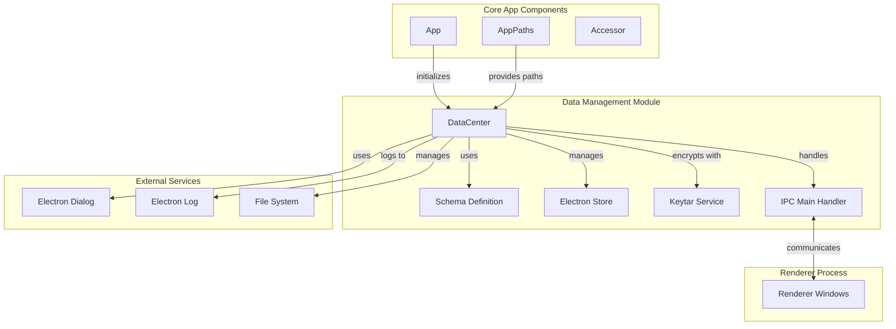
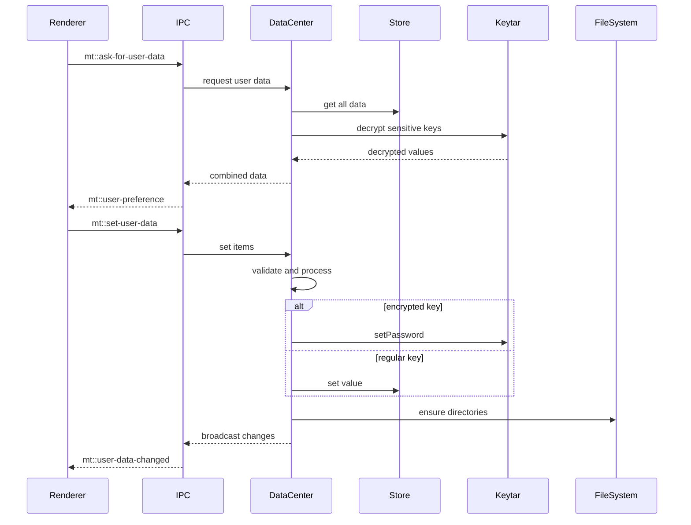
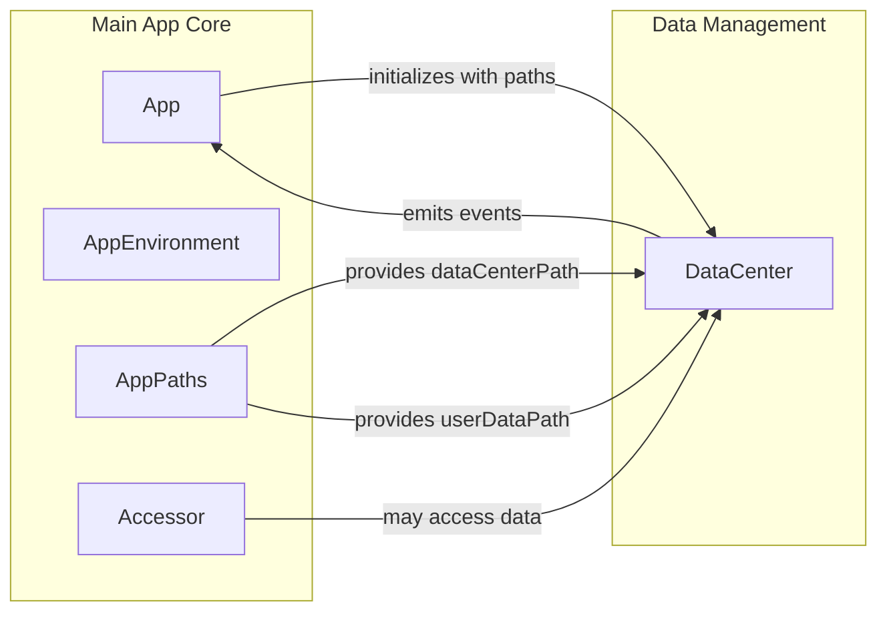
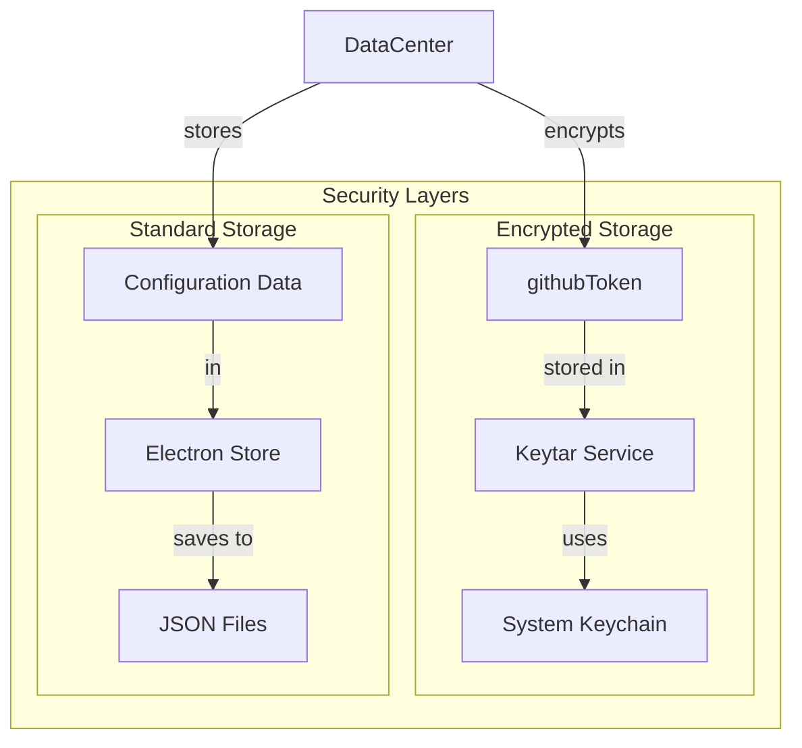

# Data Management Module

## Introduction

The Data Management module serves as the central data persistence and configuration management system for the MarkText application. It provides a unified interface for storing, retrieving, and managing user preferences, image configurations, and application state data. Built on top of Electron's secure storage capabilities, this module ensures data integrity while providing both encrypted and non-encrypted storage options for sensitive and non-sensitive information respectively.

## Architecture Overview

The Data Management module is architected around the `DataCenter` class, which extends Node.js EventEmitter to provide reactive data management capabilities. The module integrates with multiple system components to provide comprehensive data services across the application.



## Core Components

### DataCenter Class

The `DataCenter` class is the primary component responsible for all data management operations. It provides a comprehensive API for data persistence, encryption, and cross-process communication.

**Key Responsibilities:**
- Initialize and manage the electron-store instance
- Handle secure storage of sensitive data using Keytar
- Provide IPC communication between main and renderer processes
- Manage image-related configurations and paths
- Emit events for data changes across the application

**Constructor Parameters:**
- `paths`: Object containing `dataCenterPath` and `userDataPath` for file storage locations

### Data Schema

The module uses a predefined schema to validate and structure stored data:

```json
{
  "imageFolderPath": "string - Local image storage location",
  "screenshotFolderPath": "string - Screenshot capture storage location", 
  "webImages": "array - Web images used in documents",
  "cloudImages": "array - Cloud-uploaded images",
  "currentUploader": "string - Active image uploader service",
  "imageBed": "object - Image hosting configuration"
}
```

## Data Flow Architecture



## Component Interactions

### Integration with Main App Core

The Data Management module integrates closely with the main application core components:



### Cross-Module Dependencies

The Data Management module serves as a foundational service for multiple application modules:

- **Window Management**: Provides user preferences for window configurations
- **File System**: Manages image storage paths and file organization
- **Preferences**: Core data storage backend for preference management
- **Command System**: Provides data for command state and configurations

## Security Implementation

### Encrypted Data Handling

The module implements a dual-layer security approach for sensitive data:



**Encrypted Keys:**
- `githubToken`: GitHub authentication token for image hosting

### Data Validation

All data operations are validated against the predefined schema to ensure data integrity and prevent corruption.

## Event System

The DataCenter emits several events to notify other components of data changes:

- `broadcast-web-image-added`: Emitted when a web image is added
- `broadcast-web-image-removed`: Emitted when a web image is removed  
- `broadcast-user-data-changed`: Emitted when user data is modified

## API Reference

### Core Methods

#### `getAll()`
Retrieves all user data, including decrypted sensitive information.
- **Returns**: Promise resolving to complete user data object
- **Security**: Automatically decrypts sensitive keys using Keytar

#### `getItem(key)`
Retrieves a specific data item by key.
- **Parameters**: `key` - The data key to retrieve
- **Returns**: Promise resolving to the requested value
- **Security**: Automatically handles encrypted vs non-encrypted keys

#### `setItem(key, value)`
Sets a specific data item.
- **Parameters**: 
  - `key` - The data key to set
  - `value` - The value to store
- **Returns**: Promise resolving when complete
- **Side Effects**: Creates directories for path-based values, emits change events

#### `setItems(settings)`
Batch update multiple data items.
- **Parameters**: `settings` - Object containing key/value pairs
- **Returns**: None
- **Behavior**: Calls `setItem` for each key/value pair

#### `addImage(key, url)`
Adds an image to the specified image collection.
- **Parameters**:
  - `key` - Either 'webImages' or 'cloudImages'
  - `url` - The image URL to add
- **Returns**: Result of store operation
- **Behavior**: Updates timestamp for existing images, prevents duplicates

#### `removeImage(type, url)`
Removes an image from the specified collection.
- **Parameters**:
  - `type` - Either 'webImages' or 'cloudImages'
  - `url` - The image URL to remove
- **Returns**: Result of store operation

## Configuration Management

### Default Data Initialization

The module automatically initializes with sensible defaults:

```javascript
const defaultData = {
  imageFolderPath: path.join(userDataPath, 'images'),
  screenshotFolderPath: path.join(userDataPath, 'screenshot'),
  webImages: [],
  cloudImages: [],
  currentUploader: 'none',
  imageBed: {
    github: {
      owner: '',
      repo: '',
      branch: ''
    }
  }
}
```

### Image Management

The module provides comprehensive image management capabilities:

- **Local Images**: Managed through `imageFolderPath` configuration
- **Screenshots**: Organized in dedicated screenshot folder
- **Web Images**: Tracked with timestamps for cache management
- **Cloud Images**: Tracked for cloud storage integration
- **Image Hosting**: Configurable GitHub repository settings

## Error Handling

The module implements robust error handling:

- **Keytar Errors**: Logged but don't crash the application
- **File System Errors**: Handled gracefully with directory creation fallbacks
- **Validation Errors**: Prevented through schema validation
- **IPC Errors**: Managed through Electron's error handling mechanisms

## Performance Considerations

### Storage Optimization
- Uses electron-store for efficient JSON-based storage
- Implements lazy loading for encrypted data
- Minimizes IPC communication through batch operations

### Memory Management
- EventEmitter pattern prevents memory leaks
- Automatic cleanup of temporary data
- Efficient data structure for image collections

## Integration Examples

### Basic Data Access
```javascript
const userData = await dataCenter.getAll()
const imageFolder = userData.imageFolderPath
```

### Secure Data Storage
```javascript
await dataCenter.setItem('githubToken', 'encrypted-token-value')
const token = await dataCenter.getItem('githubToken')
```

### Image Management
```javascript
dataCenter.addImage('webImages', 'https://example.com/image.png')
dataCenter.removeImage('webImages', 'https://example.com/image.png')
```

## Related Documentation

- [Main App Core](main_app_core.md) - Core application initialization and management
- [File System](file_system.md) - File watching and management capabilities
- [Preferences](preferences.md) - User preference management interface
- [Window Management](window_management.md) - Window state and configuration management