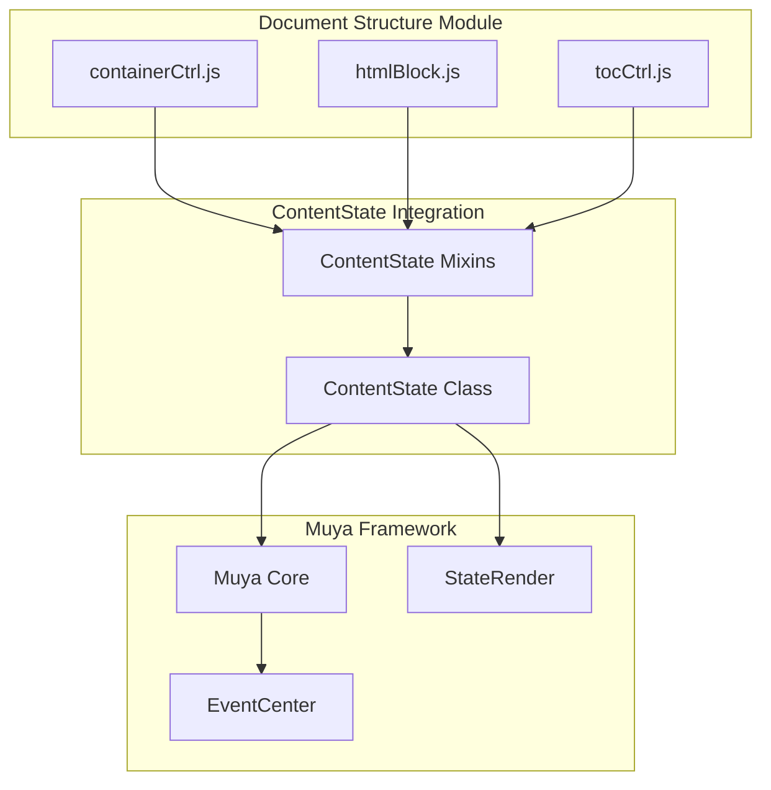
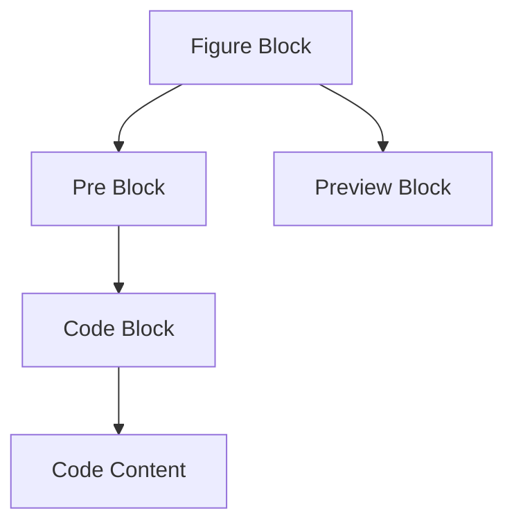
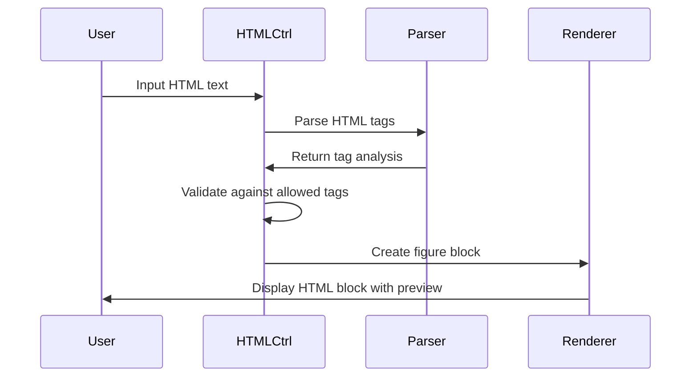
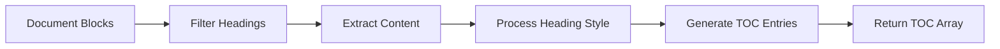
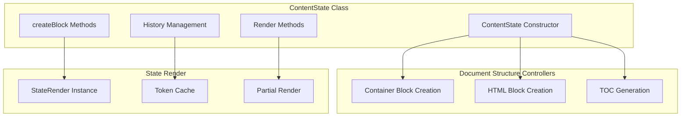
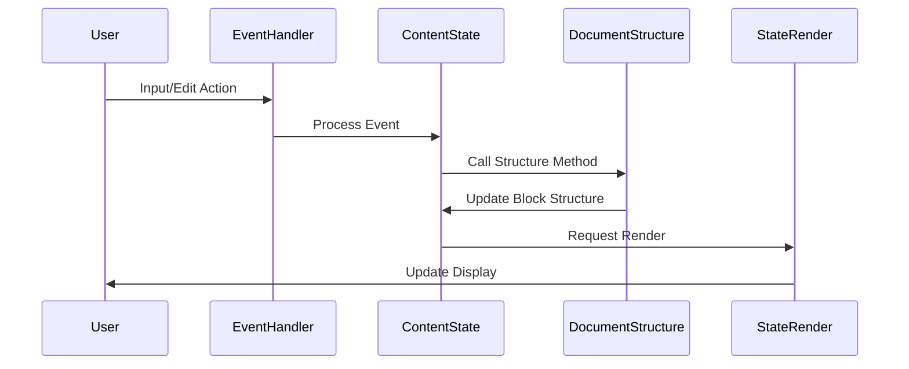
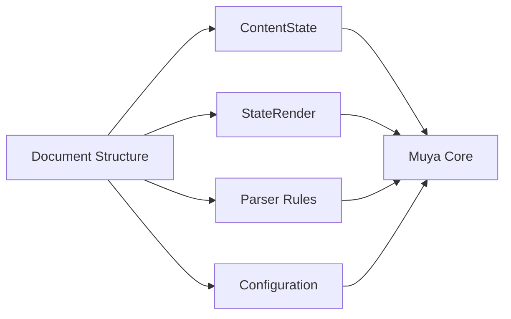
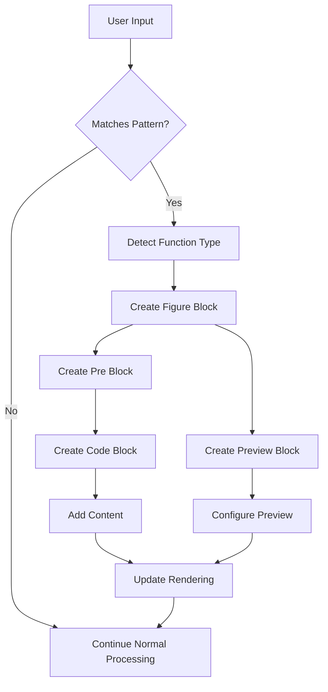
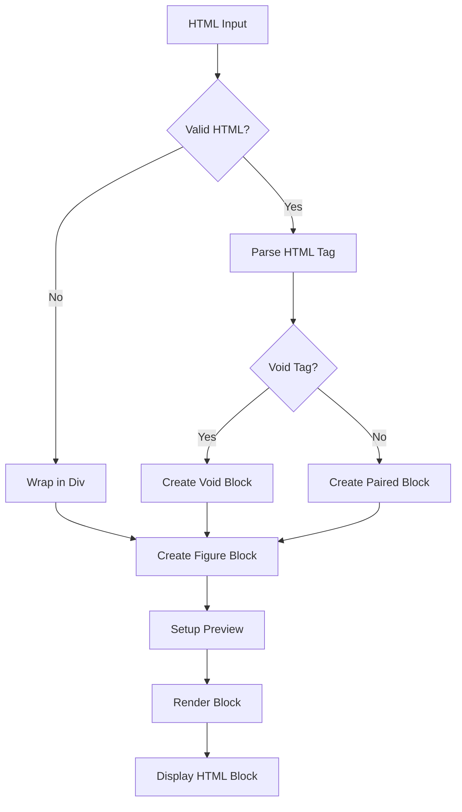
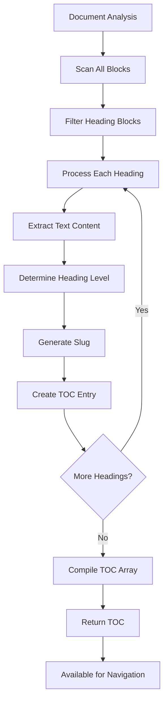

# Document Structure Module

## Introduction

The Document Structure module is a core component of the Muya editor framework that manages the structural organization and specialized content blocks within markdown documents. This module provides essential functionality for handling container blocks, HTML blocks, and table of contents generation, enabling rich content creation and document navigation capabilities.

## Architecture Overview

The Document Structure module operates as part of the Muya content state management system, extending the ContentState class with specialized controllers that handle different types of structural content blocks.



## Core Components

### Container Controller (containerCtrl.js)

The Container Controller manages specialized container blocks that support various content types including mathematical expressions, diagrams, and code blocks with live preview capabilities.

**Key Features:**
- **Multi-format Support**: Handles multiple content types including LaTeX math, flowcharts, mermaid diagrams, sequence diagrams, PlantUML, and Vega-Lite visualizations
- **Live Preview**: Creates dual-pane containers with editable source code and rendered preview
- **GitLab Compatibility**: Supports GitLab-style math block syntax with configurable rendering modes
- **Dynamic Block Creation**: Automatically converts text patterns into container blocks

**Supported Function Types:**
```javascript
const FUNCTION_TYPE_LANG = {
  multiplemath: 'latex',
  flowchart: 'yaml', 
  mermaid: 'yaml',
  sequence: 'yaml',
  plantuml: 'yaml',
  'vega-lite': 'yaml',
  html: 'markup'
}
```

**Block Structure:**


### HTML Block Controller (htmlBlock.js)

The HTML Block Controller manages raw HTML content blocks, providing safe HTML rendering and editing capabilities within markdown documents.

**Key Features:**
- **HTML Validation**: Validates HTML tags against allowed tag lists
- **Void Tag Handling**: Properly handles self-closing HTML tags
- **Content Wrapping**: Automatically wraps loose content in div elements
- **Safe Rendering**: Prevents unsafe HTML injection while preserving functionality

**HTML Block Processing:**


### Table of Contents Controller (tocCtrl.js)

The Table of Contents Controller generates document navigation structures by analyzing heading hierarchies within the document.

**Key Features:**
- **Heading Detection**: Automatically identifies h1-h6 heading elements
- **Hierarchy Analysis**: Maintains proper heading level relationships
- **Content Extraction**: Strips markdown syntax to extract clean heading text
- **Slug Generation**: Creates unique identifiers for navigation purposes

**TOC Generation Process:**


## Data Flow Architecture

### Content State Integration

The Document Structure module integrates with the ContentState class through a mixin pattern, where each controller extends the ContentState prototype with specialized methods.



### Event Processing Flow



## Component Relationships

### Dependencies

The Document Structure module depends on several core Muya components:

- **[ContentState](muya_content.md)**: Base content management system
- **[StateRender](muya_parser.md)**: Rendering engine for content blocks
- **[Parser Rules](muya_parser.md)**: HTML and markdown parsing rules
- **[Configuration](muya_framework.md)**: System-wide configuration settings

### Integration Points



## Process Flows

### Container Block Creation



### HTML Block Processing



### TOC Generation



## API Reference

### Container Controller Methods

#### `createContainerBlock(functionType, value, style)`
Creates a new container block for specialized content types.

**Parameters:**
- `functionType` (string): Type of content (e.g., 'multiplemath', 'flowchart')
- `value` (string): Initial content value
- `style` (string, optional): Rendering style configuration

**Returns:** Figure block object

#### `updateMathBlock(block)`
Converts a regular block into a math container block.

**Parameters:**
- `block` (object): Block to convert

**Returns:** Converted block or false if conversion not possible

### HTML Block Controller Methods

#### `createHtmlBlock(code)`
Creates a new HTML block with the provided code.

**Parameters:**
- `code` (string): HTML code content

**Returns:** HTML figure block object

#### `updateHtmlBlock(block)`
Converts a regular block into an HTML container block.

**Parameters:**
- `block` (object): Block to convert

**Returns:** Converted block or false if conversion not possible

### TOC Controller Methods

#### `getTOC()`
Generates table of contents from document headings.

**Returns:** Array of TOC entry objects containing:
- `content` (string): Heading text
- `lvl` (number): Heading level (1-6)
- `slug` (string): Unique identifier

## Usage Examples

### Creating a Math Block

```javascript
// Create a new math block
const mathBlock = contentState.createContainerBlock('multiplemath', 'E = mc^2')

// Convert existing text to math block
const block = contentState.getBlock(blockKey)
const result = contentState.updateMathBlock(block)
```

### Working with HTML Blocks

```javascript
// Create HTML block
const htmlBlock = contentState.createHtmlBlock('<div>Custom HTML</div>')

// Convert paragraph to HTML block
const paragraph = contentState.getBlock(paragraphKey)
const htmlResult = contentState.updateHtmlBlock(paragraph)
```

### Generating Table of Contents

```javascript
// Get current document TOC
const toc = contentState.getTOC()

// Use TOC for navigation
toc.forEach(entry => {
  console.log(`${'  '.repeat(entry.lvl - 1)}${entry.content}`)
})
```

## Integration with Other Modules

### Content Management Integration

The Document Structure module works closely with the [muya_content](muya_content.md) module to manage the overall document state and content manipulation operations.

### Rendering Integration

Integration with the [muya_parser](muya_parser.md) module ensures proper rendering of specialized content blocks through the StateRender system.

### Event System Integration

The module leverages the [muya_events](muya_events.md) system to handle user interactions with specialized blocks and coordinate updates across the editor.

## Performance Considerations

### Rendering Optimization

- **Partial Rendering**: Only affected blocks are re-rendered when content changes
- **Token Caching**: Render tokens are cached to improve performance
- **Lazy Preview**: Preview rendering is deferred until necessary

### Memory Management

- **Block Recycling**: Block objects are reused when possible
- **History Optimization**: History entries are compressed to reduce memory usage
- **Event Cleanup**: Event listeners are properly cleaned up on block removal

## Error Handling

### Validation Mechanisms

- **HTML Tag Validation**: Only allowed HTML tags are processed
- **Syntax Validation**: Mathematical expressions are validated before rendering
- **Block Type Checking**: Block conversions are validated before execution

### Recovery Strategies

- **Fallback Rendering**: Invalid content falls back to plain text rendering
- **Error Boundaries**: Errors in specialized blocks don't affect the entire document
- **User Feedback**: Clear error messages are provided for invalid operations

## Future Enhancements

### Planned Features

- **Additional Container Types**: Support for more specialized content types
- **Enhanced Preview**: Improved preview capabilities for complex content
- **Collaborative Editing**: Real-time collaboration support for specialized blocks
- **Export Optimization**: Better export handling for specialized content types

### Extensibility

The modular design allows for easy extension with new container types and specialized content handlers without affecting existing functionality.