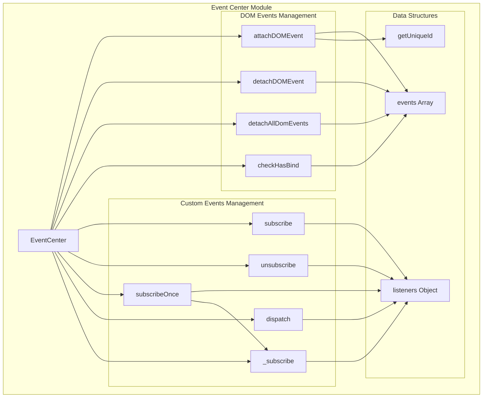
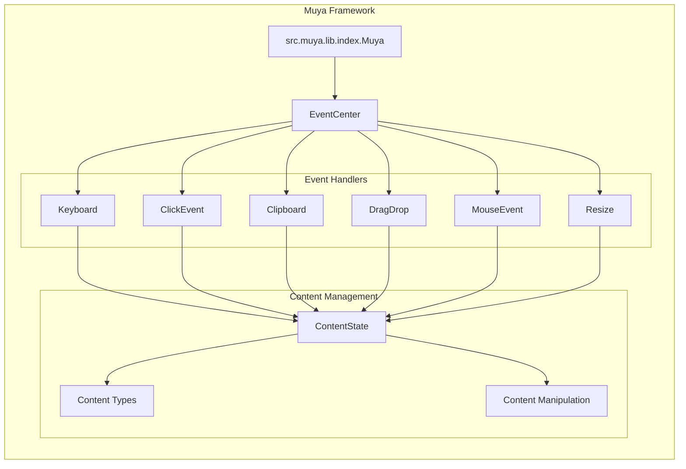
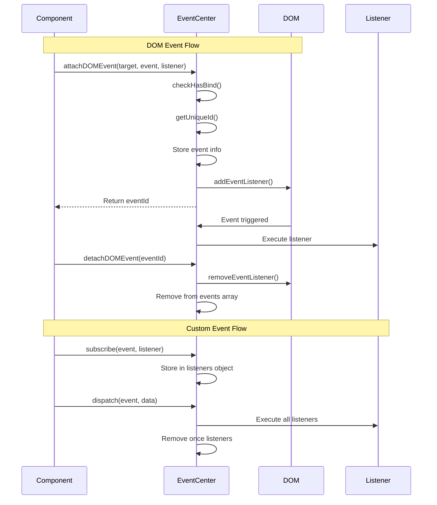
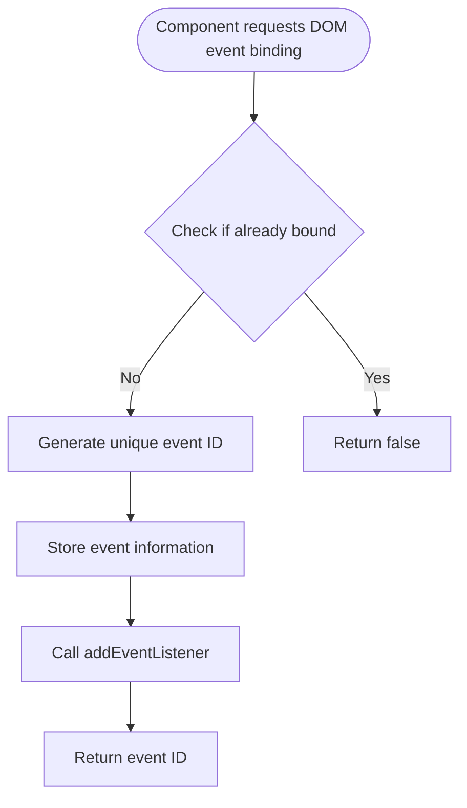
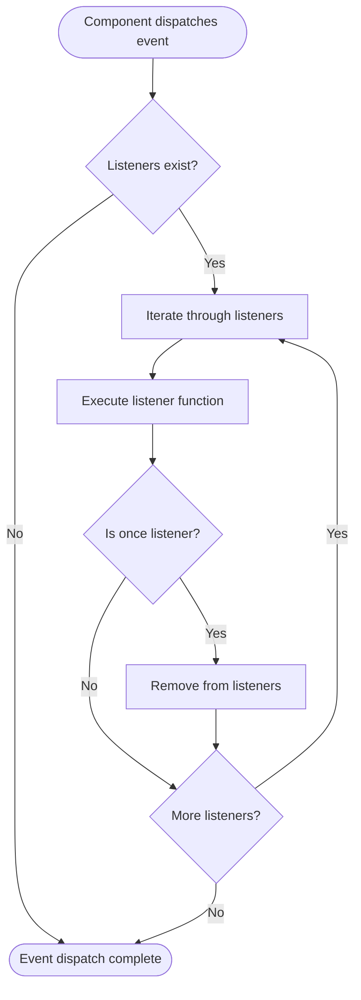

# Event Center Module Documentation

## Introduction

The Event Center module serves as the central event management system within the Muya framework, providing a unified interface for handling both DOM events and custom application events. This module is crucial for maintaining loose coupling between components and enabling efficient event-driven communication throughout the application.

## Core Architecture

### EventCenter Class

The `EventCenter` class is the primary component that manages all event-related operations. It maintains two main data structures:
- `events`: An array tracking DOM event bindings with unique identifiers
- `listeners`: An object storing custom event listeners organized by event name

### Key Responsibilities

1. **DOM Event Management**: Attach, detach, and track DOM event listeners
2. **Custom Event System**: Subscribe, unsubscribe, and dispatch custom application events
3. **Event Lifecycle Management**: Prevent duplicate bindings and manage event cleanup
4. **One-time Event Handling**: Support for single-execution event listeners

## Architecture Diagram



## Component Relationships



## Data Flow Diagram



## Process Flow

### DOM Event Attachment Process



### Custom Event Dispatch Process



## API Reference

### DOM Event Methods

#### `attachDOMEvent(target, event, listener, capture)`
Binds a DOM event listener and returns a unique identifier for later removal.

**Parameters:**
- `target`: DOM element to attach the event to
- `event`: Event name (e.g., 'click', 'keydown')
- `listener`: Event handler function
- `capture`: Boolean indicating capture phase

**Returns:** Unique event ID or `false` if already bound

#### `detachDOMEvent(eventId)`
Removes a DOM event listener using the ID returned by `attachDOMEvent`.

**Parameters:**
- `eventId`: Unique identifier returned by `attachDOMEvent`

#### `detachAllDomEvents()`
Removes all DOM event listeners managed by the EventCenter.

#### `checkHasBind(target, event, listener, capture)`
Checks if a specific DOM event binding already exists.

### Custom Event Methods

#### `subscribe(event, listener)`
Subscribes to a custom event.

**Parameters:**
- `event`: Event name
- `listener`: Callback function

#### `subscribeOnce(event, listener)`
Subscribes to a custom event that will be executed only once.

#### `unsubscribe(event, listener)`
Removes a custom event listener.

#### `dispatch(event, ...data)`
Dispatches a custom event to all subscribed listeners.

**Parameters:**
- `event`: Event name
- `...data`: Variable number of arguments passed to listeners

## Integration with Other Modules

The Event Center module integrates with various components throughout the system:

- **[Keyboard System](keyboard_system.md)**: Manages keyboard event bindings and shortcuts
- **[Click Event Handler](click_event_handler.md)**: Handles mouse click events
- **[Clipboard Manager](clipboard_manager.md)**: Manages copy/cut/paste operations
- **[Muya Framework](muya_framework.md)**: Provides the core event infrastructure
- **[Content Management](muya_content.md)**: Enables event-driven content updates

## Usage Examples

### Basic DOM Event Binding
```javascript
const eventCenter = new EventCenter()
const button = document.querySelector('#myButton')

const eventId = eventCenter.attachDOMEvent(
  button, 
  'click', 
  () => console.log('Button clicked!'),
  false
)

// Later, remove the event
eventCenter.detachDOMEvent(eventId)
```

### Custom Event System
```javascript
const eventCenter = new EventCenter()

// Subscribe to custom event
eventCenter.subscribe('contentChanged', (newContent) => {
  console.log('Content updated:', newContent)
})

// Dispatch event
eventCenter.dispatch('contentChanged', 'New markdown content')
```

### One-time Event Listener
```javascript
// Listen only once
eventCenter.subscribeOnce('appReady', () => {
  console.log('Application is ready!')
})

// This will trigger the listener
eventCenter.dispatch('appReady')

// This won't trigger it again
eventCenter.dispatch('appReady')
```

## Best Practices

1. **Always store event IDs**: Keep the IDs returned by `attachDOMEvent` for proper cleanup
2. **Use `detachAllDomEvents()` on cleanup**: Call this when destroying components
3. **Check for duplicates**: The system prevents duplicate bindings automatically
4. **Memory management**: Unsubscribe from custom events when components are destroyed
5. **Event naming**: Use descriptive names for custom events to avoid conflicts

## Error Handling

The Event Center implements defensive programming practices:
- Returns `false` for duplicate DOM event bindings
- Silently handles missing event IDs in `detachDOMEvent`
- Gracefully handles missing listeners in `unsubscribe`
- Prevents memory leaks through proper cleanup methods

## Performance Considerations

- Event lookups are O(n) for DOM events and O(1) for custom events
- The `checkHasBind` method iterates through all bound events
- Custom event dispatch is efficient with direct object property access
- Memory usage scales with the number of bound events and listeners