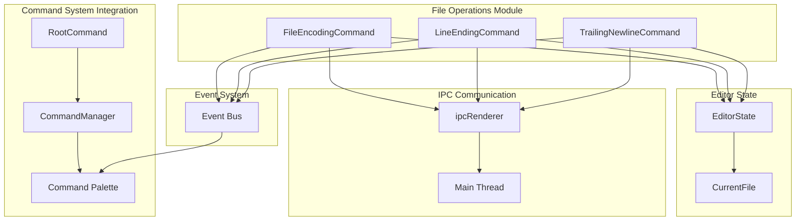
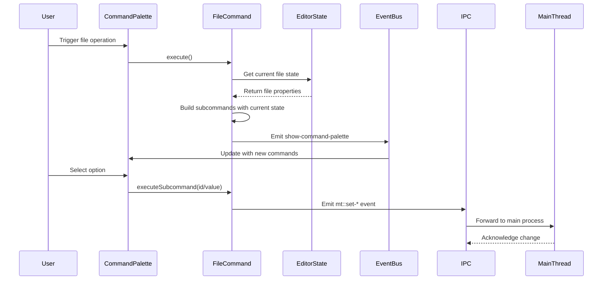

# File Operations Module Documentation

## Overview

The file_operations module is a critical component of the renderer command system that provides file-level manipulation capabilities within the application. This module handles essential file formatting and encoding operations, allowing users to modify file properties such as character encoding, line endings, and trailing newline behavior through an interactive command palette interface.

The module consists of three primary command classes that integrate with the broader command system architecture, providing a unified interface for file manipulation operations. These commands are designed to be discoverable through the application's command palette and provide real-time feedback about the current file's state.

## Architecture

### Component Structure

### Data Flow Architecture

## Core Components

### FileEncodingCommand

The `FileEncodingCommand` class manages file character encoding operations. It provides a comprehensive list of supported encodings and highlights the current encoding of the active file.

**Key Features:**
- Supports all encodings defined in `ENCODING_NAME_MAP`
- Handles UTF-BOM encodings (recognizes but doesn't allow setting)
- Dynamically highlights current encoding in the command palette
- Provides human-readable encoding names

**Command Flow:**
1. Retrieves current file encoding from editor state
2. Builds subcommand list with current encoding highlighted
3. Presents options through command palette
4. Emits `mt::set-file-encoding` event when encoding changes

**Dependencies:**
- `common/encoding` for encoding name mapping
- `ipcRenderer` for main process communication
- Editor state for current file information

### LineEndingCommand

The `LineEndingCommand` class handles line ending format conversions between CRLF (Carriage Return + Line Feed) and LF (Line Feed) formats.

**Key Features:**
- Supports CRLF and LF line ending formats
- Provides descriptive labels for each format
- Highlights current line ending format
- Simple binary choice interface

**Command Flow:**
1. Checks current file's line ending property
2. Updates subcommand descriptions to show current state
3. Emits `mt::set-line-ending` event on selection

**Dependencies:**
- Editor state for current file line ending information
- Standard IPC communication pattern

### TrailingNewlineCommand

The `TrailingNewlineCommand` class manages trailing newline behavior with three distinct modes: trim all trailing newlines, ensure single newline, or disable processing.

**Key Features:**
- Three-mode operation: trim, ensure single, or disabled
- Handles edge cases in trimTrailingNewline values
- Provides clear descriptions for each mode
- Maintains consistent command pattern

**Command Flow:**
1. Retrieves current trimTrailingNewline setting
2. Maps setting to appropriate index (with fallback)
3. Updates descriptions to show current mode
4. Emits `mt::set-final-newline` event on change

**Dependencies:**
- Editor state for current file newline settings
- Standard IPC communication infrastructure

## Integration Points

### Command System Integration

All file operation commands follow the standard command interface pattern established by the [RootCommand](renderer_commands.md) class. They implement the required methods:

- `run()`: Prepares command state and builds subcommand list
- `execute()`: Triggers command palette display
- `executeSubcommand()`: Handles user selection and applies changes
- `unload()`: Cleans up command state

### Editor State Dependency

The module depends on the editor state management system to access current file properties. Each command receives an `editorState` reference during construction and accesses the `currentFile` object to determine existing file properties.

### Event System Integration

Commands utilize the application's event bus system to trigger command palette updates. The standard pattern involves:
1. Small delay to ensure smooth UI transitions
2. Event emission to show updated command palette
3. User interaction through the palette interface

### IPC Communication Pattern

All file operations follow a consistent IPC communication pattern:
- Commands emit `mt::*` events through `ipcRenderer`
- Main process handles the actual file operations
- No direct file system access from renderer process
- Asynchronous operation with immediate UI feedback

## Usage Patterns

### Command Discovery

Users discover file operations through the command palette by typing relevant keywords:
- "encoding" for FileEncodingCommand
- "line ending" for LineEndingCommand  
- "trailing newline" for TrailingNewlineCommand

### State Management

Commands maintain minimal state:
- Subcommand list built dynamically during execution
- Current selection index based on file properties
- No persistent state between executions

### Error Handling

The module implements defensive programming practices:
- Graceful handling of missing current file
- Fallback values for undefined properties
- Validation of encoding selections (BOM handling)

## Dependencies

### Internal Dependencies

- **Command System**: Inherits interface patterns from [RootCommand](renderer_commands.md)
- **Event Bus**: Utilizes application-wide event system for UI updates
- **Editor State**: Accesses current file properties and state

### External Dependencies

- **Electron IPC**: Communication with main process for file operations
- **Common Encoding**: Shared encoding utilities and mappings
- **Utility Functions**: Common delay and helper functions

## Extension Points

### Adding New File Operations

New file operation commands can be added by following the established pattern:
1. Create command class with standard interface methods
2. Access editor state for current file properties
3. Build appropriate subcommand list
4. Emit correct IPC event for main process handling
5. Register with command system

### Customizing Command Behavior

Commands can be extended to support:
- Additional file properties
- Custom validation logic
- Specialized UI interactions
- Integration with other subsystems

## Performance Considerations

### Command Execution

Commands are designed for minimal overhead:
- Lazy loading of subcommand lists
- Efficient state checking
- Minimal memory footprint
- Quick execution paths

### UI Responsiveness

The module maintains UI responsiveness through:
- Asynchronous operation patterns
- Small delays to prevent UI blocking
- Efficient event handling
- Minimal DOM manipulation

## Security Considerations

### IPC Security

All file operations are routed through the main process, providing:
- Centralized security validation
- Controlled file system access
- Audit trail capabilities
- Protection against malicious operations

### Input Validation

Commands implement input validation:
- Encoding selection validation
- Value range checking
- Type safety enforcement
- Sanitization of user inputs

This module provides a robust, extensible foundation for file-level operations within the application, maintaining consistency with the broader command system while providing specialized functionality for file manipulation tasks.