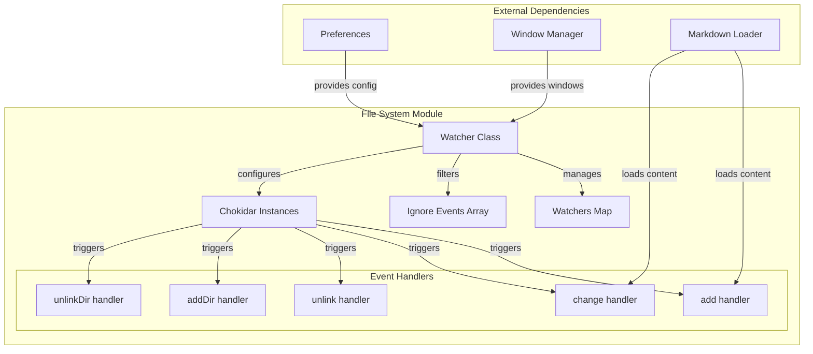
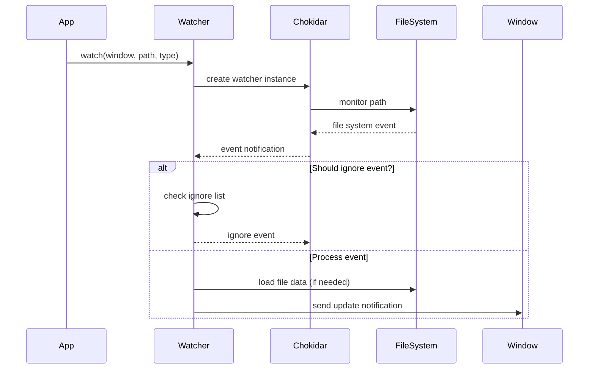
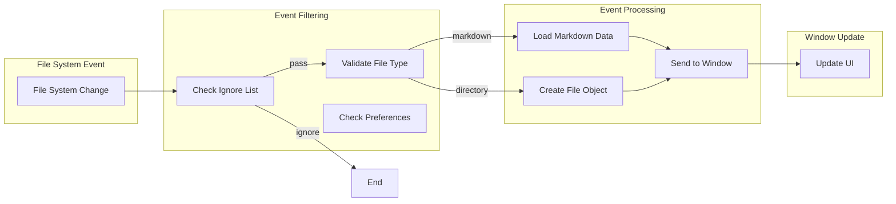
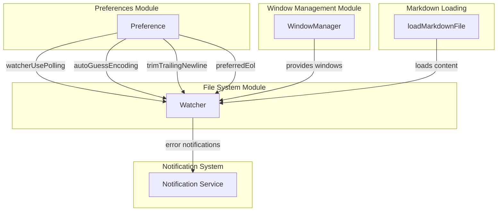

# File System Module Documentation

## Introduction

The file_system module is a critical component of the MarkText application responsible for monitoring file system changes and keeping the application synchronized with external file modifications. It provides real-time file watching capabilities that enable the editor to detect when files are created, modified, deleted, or moved in the file system, ensuring that the application's state remains consistent with the underlying file system.

## Architecture Overview

The file_system module is built around a centralized `Watcher` class that leverages the `chokidar` library to monitor file system events. The architecture is designed to handle multiple windows and file paths simultaneously while providing intelligent filtering and event management.

## Core Components

### Watcher Class

The `Watcher` class is the central component that manages all file system monitoring operations. It provides a unified interface for watching files and directories while handling complex scenarios like file renames, permission errors, and platform-specific behaviors.

**Key Responsibilities:**
- Manage multiple file watchers across different windows
- Filter file system events based on preferences and file types
- Handle platform-specific file system behaviors
- Coordinate with the markdown file loader for content updates
- Manage event ignore lists to prevent self-triggered events

**Constructor Parameters:**
- `preferences`: A Preference instance that provides configuration settings

## Data Flow

## Event Processing

The module processes five primary file system events:

### File Events
- **add**: New file created in watched location
- **change**: Existing file modified
- **unlink**: File deleted from watched location

### Directory Events
- **addDir**: New directory created
- **unlinkDir**: Directory deleted

## Configuration and Filtering

### File Type Filtering
The watcher only monitors files with markdown extensions and directories. All other file types are ignored during the watching process.

### Path Filtering
The following paths are automatically excluded from monitoring:
- Hidden files and directories (starting with `.`)
- `node_modules` directories
- `.asar` files

### Platform-Specific Behavior
- **macOS**: Uses polling by default for better reliability
- **Linux**: Special handling for atomic rename operations
- **Windows**: Standard chokidar behavior

## Integration with Other Modules

## Error Handling

The module implements comprehensive error handling for various scenarios:

### File I/O Errors
- Catches and reports file loading errors
- Notifies users of watcher I/O errors through the notification system
- Continues operation even when individual files fail to load

### System Resource Errors
- Detects `ENOSPC` errors (too many file descriptors)
- Notifies users when system limits are reached
- Gracefully degrades functionality

### Platform-Specific Issues
- Handles Linux atomic rename operations
- Manages macOS polling requirements
- Addresses cross-platform file system differences

## Performance Considerations

### Stability Threshold
- Uses a 1000ms stability threshold to prevent premature event processing
- Implements 150ms polling intervals for write-finish detection
- Reduces false positives from temporary file operations

### Event Debouncing
- Maintains an ignore list to prevent processing self-triggered events
- Implements time-based filtering to avoid duplicate notifications
- Uses file modification time comparisons for cloud drive synchronization

### Resource Management
- Properly cleans up watcher instances when windows are closed
- Implements disposal patterns to prevent memory leaks
- Manages timer resources for rename operations

## API Reference

### watch(window, watchPath, type)
Creates a new file system watcher for the specified path.

**Parameters:**
- `window`: The browser window to send notifications to
- `watchPath`: The file or directory path to watch
- `type`: Either 'file' or 'dir' to specify the watch type

**Returns:** A function to unwatch and clean up the watcher

### unwatch(window, watchPath, type)
Removes a specific watcher.

### unwatchByWindowId(windowId)
Removes all watchers associated with a specific window.

### ignoreChangedEvent(windowId, pathname, duration)
Temporarily ignores change events for a specific file and window.

## Future Improvements

The code includes TODO comments indicating planned improvements:
- Refactoring markdown data loading (GH#1035)
- Removing markdown data from watcher responses (GH#1034)
- Improving macOS rename handling
- Optimizing cloud drive synchronization

## Dependencies

- **chokidar**: File system watcher library
- **electron-log**: Logging functionality
- **common/filesystem**: File system utilities
- **common/filesystem/paths**: Path validation utilities
- **src/main/filesystem/markdown**: Markdown file loading
- **src/main/utils**: Utility functions (getUniqueId)

This module serves as the bridge between the file system and the application's user interface, ensuring that users always see the most current state of their files while maintaining performance and reliability across different operating systems.